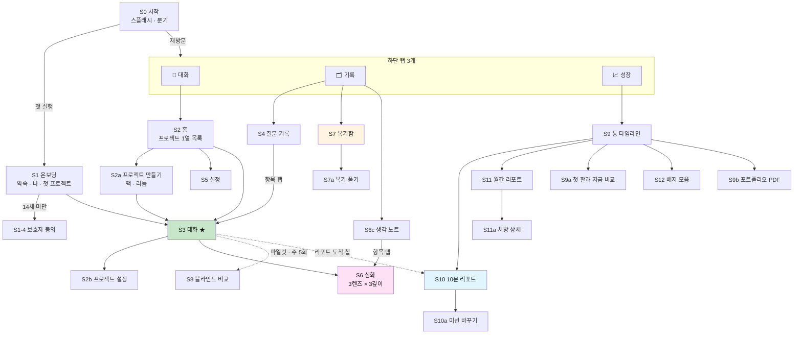
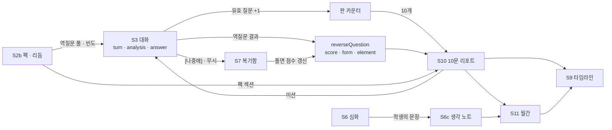

# 🗺 사이트맵 v3 — 앱 화면 지도

> **한 문장**: 설계서 v3의 모든 기능이 **앱의 어느 화면, 어느 경로, 어느 단계**에 놓이는지를 한 장에 모은다.
>
> **기준 문서**: [설계서 v3 — 열고, 좁히고, 되묻는다](AI_역질문_설계서_v3_열고_좁히고_되묻는다.md) · [M0 설계서 — 화면 흐름과 시스템 프롬프트](AI_역질문_M0_화면흐름_시스템프롬프트.md)
> **짝 문서**: [화면 설계서 v3 (앱)](AI_역질문_화면설계서_v3_앱.md) — 이 지도의 각 화면을 와이어프레임·상태·규칙까지 푼다
> **화면 ID 규칙**: M0 설계서의 `S0~S8`을 **그대로 잇는다.** 같은 ID는 같은 화면이다. v3에서 늘어난 화면은 `S6 · S7 · S9~S14 · T1~T3`.
> **대상 플랫폼**: 모바일 앱(iOS · Android) 우선 · 태블릿 2단 · 교사 화면만 웹 우선

---

## 0. 출시 단계 표기

이 문서의 모든 화면에는 **언제 들어오는지**가 붙는다. v3 로드맵(§15)과 M0 설계서의 이름을 맞춘다.

| 표기 | v3 로드맵 | 들어오는 것 | 탭 구성 |
|---|---|---|---|
| **M0** | A0 + A1 | 최선의 답 · 가정 · 역할 배지 · 칩 · 🔎 돌아보기 · 기록 · 블라인드 비교 | `대화` `기록` |
| **M1** | A2 + A3 | 2문 1역 · 역질문 F1~F3 · 힌트 3단 · 복기함 · 🗺 생각 지도 · 📄 10문 리포트 · 📈 타임라인 | `대화` `기록` **`성장`** |
| **M2** | A4 | 🔭 심화 3렌즈 · 생각 노트 · 평가 팩 4종 · [찾아줘] | 변동 없음 |
| **M3** | A5 | 📘 월간 리포트 · 공부 처방 · 교실 모드 · 교사 화면 · F4 그리기 | 변동 없음 (교사는 별도 웹) |
| **C** | C | AI 활용 기록서 · 에이전트 설계서 초안 | 변동 없음 |

> **탭은 끝까지 셋이다.** 기능이 늘어도 탭을 늘리지 않는다 — 새 기능은 기존 탭 안의 세그먼트나 대화 화면 안의 펼침으로 들어간다.

---

## 1. 전체 지도



---

## 2. 트리로 본 사이트맵

`[시트]` = 바텀시트 · `[펼침]` = 화면 안에서 펼쳐지는 카드 · `[전체]` = 전체 화면 · 괄호는 출시 단계

```text
askback
│
├─ S0  시작 (스플래시 · 세션 확인 · 분기)                                   (M0)
│
├─ S1  온보딩                                                              (M0)
│   ├─ S1-1  약속                          [전체]
│   ├─ S1-2  나 (이름 · 학년 · 관심사)        [전체]
│   ├─ S1-3  첫 프로젝트                     [전체]
│   ├─ S1-4  보호자 동의 (14세 미만 분기)      [전체] + 보호자용 웹 링크
│   └─ S1-5  로그인 · 파일럿 코드             [전체]   ← 방식은 열린 결정 (§9)
│
├─ 💬 탭 1 · 대화
│   ├─ S2   홈 — 프로젝트 1열 목록                                          (M0)
│   │   ├─ S2a  프로젝트 만들기               [전체]   M0: 이름·설명 → M2: + 평가 팩 · 리듬
│   │   └─ S5   설정                         [전체]   (홈 오른쪽 위 ⚙️)
│   │       ├─ S5-1  내 데이터 (내려받기 · 프로젝트별 삭제 · 전체 삭제)        (M0)
│   │       ├─ S5-2  대화 방식 (답만 모드 ⚡ · 말투 · 기본 리듬)               (M0 / 리듬은 M1)
│   │       ├─ S5-3  알림 (리포트 · 월간 · 조용한 시간)                       (M1)
│   │       ├─ S5-4  계정 (로그아웃 · 계정 삭제 · 보호자 동의 상태)            (M0)
│   │       ├─ S5-5  파일럿 참여 (블라인드 비교 on/off)                      (M0)
│   │       ├─ S5-6  교실 참여 (학급 코드 입력 · 공유 범위)                   (M3)
│   │       └─ S5-7  정보 (약속 다시 보기 · 약관 · 오픈소스 · 버전)            (M0)
│   │
│   └─ S3   대화 ★ 중심 화면                                               (M0)
│       ├─ S3a  🔎 내 질문 돌아보기             [펼침]                        (M0)
│       ├─ S3b  칩 → 입력창 초안               [입력창]                      (M0)
│       ├─ S3c  역할 배지 설명                  [시트]                        (M0)
│       ├─ S3d  역질문 말풍선 (F1 고르기 · F2 빈칸 · F3 한두 문장)             (M1)
│       │   ├─ S3d-4  F4 그리기 · 설명         [전체]                        (M3)
│       │   ├─ S3e   힌트 3단 (힌트 → 예시 → AI의 생각)  [펼침]              (M1)
│       │   ├─ S3f   코치 피드백 말풍선                                      (M1)
│       │   └─ S3f-1 "왜 🟡야?"                [시트]                        (M1)
│       ├─ S3g  🗺 생각 지도 (🟩🟨🟥)           [펼침] → 크게 보기 [전체]       (M1)
│       ├─ S3h  마디 점 ●○ · 판 막대 7/10       [상시 표시]                   (M1)
│       ├─ S3i  리포트 도착 칩 → S10            [상단 칩]                     (M1)
│       ├─ S3j  리듬 완화 제안 (2:1 / 3:1 / 4:1) [인라인 카드]                (M1)
│       ├─ S3k  🙋 나한테 물어봐                 [입력창 옆 메뉴]              (M1)
│       ├─ S3m  ⋯ 메뉴 (프로젝트 설정 · 답만 모드 · 기록 보기)  [시트]          (M0)
│       ├─ S3n  첨부 (사진 · 카메라 · 코드 붙여넣기)  [시트]                   (M0)
│       ├─ S3p  개인정보 경고                    [입력창 위 띠]                (M0)
│       ├─ S2b  프로젝트 설정 (팩 · 리듬 · 답만 · 보관)  [전체]                (M0 / 팩은 M2)
│       ├─ S6   🔭 심화                                                     (M2)
│       │   ├─ S6    렌즈 고르기 (철학 · 심리학 · 사회학)  [펼침]
│       │   ├─ S6a   심화 대화 (L1 → L2 → L3)            [전체 · 별도 스레드]
│       │   └─ S6b   확장 질문 (프로젝트로 돌려놓기)       [S6a 안]
│       ├─ S13  🤝 [찾아줘] 이웃 후보                     [시트]              (M2)
│       └─ S8   블라인드 비교                             [전체]              (M0 · 파일럿 전용)
│
├─ 🗂 탭 2 · 기록        상단 세그먼트:  질문 │ 복기함 │ 생각 노트
│   ├─ S4   질문 기록 — 1열 · 한 질문이 한 줄                                 (M0)
│   │   └─ 항목 탭 → S3 의 그 턴 위치로 · 길게 누름 → [이 질문 지우기]
│   ├─ S7   복기함 — 적립된 역질문 · 🟡⚪ 칸                                  (M1)
│   │   └─ S7a  복기 풀기 (역질문 1개 + 그때의 마디 다시 보기)  [전체]
│   └─ S6c  생각 노트 — 심화에서 나온 내 문장                                 (M2)
│       └─ 항목 탭 → S6a 의 그 대화로
│
├─ 📈 탭 3 · 성장                                                          (M1)
│   ├─ S9   통 타임라인 — 1열 · 한 판이 한 줄
│   │   ├─ S9a  첫 판과 지금 비교               [시트]
│   │   ├─ S9b  포트폴리오 PDF 내보내기          [시트] → OS 공유
│   │   └─ S12  배지 모음                      [전체]
│   ├─ S10  📄 10문 리포트 (1화면 7칸)          [전체]
│   │   ├─ S10a 미션 바꾸기                    [시트]
│   │   ├─ S10b 3줄 요약판 (3판 연속 미열람 시 S3 대화창 안에)  [인라인 카드]
│   │   └─ 팩 섹션 (팩을 켠 프로젝트만)                                       (M2)
│   ├─ S11  📘 월간 리포트 (8장 세로 스크롤)     [전체]                       (M3)
│   │   ├─ S11a 공부 처방 상세                  [시트]
│   │   └─ S11b 다음 달 목표 편집               [인라인 편집]
│   └─ S14  AI 활용 기록서 · 에이전트 설계서 초안  [전체] → 내보내기            (C)
│
├─ 시스템 화면 (어느 탭에도 속하지 않음)
│   ├─ X1  오프라인 띠 · 재시도
│   ├─ X2  권한 요청 (알림 · 카메라 · 사진) — 필요한 순간에만
│   ├─ X3  강제 업데이트 · 점검 안내
│   └─ X4  신고 · 의견 보내기 (AI 답 신고 포함)
│
└─ 🏫 교사 (웹 우선 · 별도 진입)                                            (M3)
    ├─ T1  학급 홈 (학급 코드 · 학생 목록)
    ├─ T2  과제 설정 (리듬 1:1~4:1 · 팩 지정 · 커스텀 팩 · F4 허용)
    └─ T3  교사 요약 (학생이 공유를 고른 요약본만)
```

---

## 3. 화면 목록표

| ID | 화면 | 종류 | 단계 | 들어오는 길 | v3 근거 |
|---|---|---|---|---|---|
| S0 | 시작 | 전체 | M0 | 앱 실행 | — |
| S1 | 온보딩 (1~5) | 전체 | M0 | 첫 실행 | M0 §2 |
| S2 | 홈 | 탭 루트 | M0 | 대화 탭 · 재방문 | M0 §2 |
| S2a | 프로젝트 만들기 | 전체 | M0 → M2 | S2 [+ 새 프로젝트] | §5.4 |
| S2b | 프로젝트 설정 | 전체 | M0 → M2 | S3 ⋯ | §13 |
| S3 | 대화 | 전체 (탭바 숨김) | M0 | S2 · S4 · 알림 | §13 |
| S3a | 🔎 내 질문 돌아보기 | 펼침 | M0 | 답 아래 ▸ | M0 §2 |
| S3b | 칩 초안 | 입력창 | M0 | 답 아래 칩 | §6.1 |
| S3c | 역할 배지 설명 | 시트 | M0 | 배지 · ⓘ | §2.3 |
| S3d | 역질문 (F1~F3) | 말풍선 | M1 | 마디의 2번째 답 뒤 | §3 · §4.2 |
| S3d-4 | F4 그리기 · 설명 | 전체 | M3 | 이정표 · 교실 · 학생 요청 | §4.2 |
| S3e | 힌트 3단 | 펼침 | M1 | "잘 모르겠어" · [힌트 줘] | §4.2 |
| S3f | 코치 피드백 | 말풍선 | M1 | 역질문 답 뒤 | §4.5 |
| S3g | 🗺 생각 지도 | 펼침 → 전체 | M1 | 답 아래 ▸ | §13 · v2 §4.1 |
| S3h | 마디 점 · 판 막대 | 상시 | M1 | — | §13 |
| S3i | 리포트 도착 칩 | 상단 칩 | M1 | 10번째 유효 질문 뒤 | §7.4 |
| S3j | 리듬 완화 제안 | 인라인 | M1 | [나중에] 3연속 | §3.3 |
| S3k | 🙋 나한테 물어봐 | 버튼 | M1 | 입력창 ＋ 메뉴 | §3.3 |
| S6 · S6a · S6b | 🔭 심화 | 펼침 → 전체 | M2 | 답 아래 [🔭 심화] | §5.1~5.3 |
| S6c | 생각 노트 | 탭 세그먼트 | M2 | 기록 탭 | §5.3 |
| S7 · S7a | 복기함 | 탭 세그먼트 → 전체 | M1 | 기록 탭 · "아까 못 물어본 것 하나" | §13 |
| S8 | 블라인드 비교 | 전체 | M0 (파일럿) | 무작위 턴 뒤 | M0 §2 |
| S9 · S9a · S9b | 통 타임라인 | 탭 루트 | M1 | 성장 탭 | §7.6 |
| S10 · S10a · S10b | 10문 리포트 | 전체 | M1 | S3i · S9 · 알림 | §7.2~7.4 |
| S11 · S11a · S11b | 월간 리포트 | 전체 | M3 | S9 구분선 · 알림 | §7.5 |
| S12 | 배지 모음 | 전체 | M1 | S9 오른쪽 위 | §13 |
| S13 | [찾아줘] 이웃 후보 | 시트 | M2 | 협력 팩 C1 역질문 | §5.4 |
| S14 | AI 활용 기록서 | 전체 | C | S9 · S2b | §5.4 |
| T1~T3 | 교사 | 웹 | M3 | 교사 계정 | §3.3 · §5.4 |

---

## 4. 경로와 딥링크

앱 내부 경로 · 웹(Next.js) 경로 · 딥링크를 **같은 모양**으로 둔다. 알림·공유 링크·웹 폴백이 한 규칙으로 풀린다.

| 화면 | 경로 | 비고 |
|---|---|---|
| S0 | `/` | 세션에 따라 `/onboarding/1` 또는 `/home` |
| S1 | `/onboarding/[1-5]` | 중간 이탈 후 재실행 → 멈춘 장부터 |
| S1-4 (보호자) | `/consent/guardian/[token]` | **웹 전용.** 보호자는 앱이 없어도 된다 |
| S2 | `/home` | |
| S2a | `/projects/new` | |
| S3 | `/p/[projectId]` | `?turn=[turnId]` → 그 턴으로 스크롤 · `?draft=` 는 쓰지 않는다 (질문 원문을 URL에 싣지 않는다) |
| S2b | `/p/[projectId]/settings` | |
| S6a | `/p/[projectId]/deep/[threadId]` | |
| S8 | `/p/[projectId]/compare/[turnId]` | 파일럿 플래그가 없으면 S3으로 |
| S4 | `/records` | `?project=[projectId]` |
| S7 · S7a | `/records/review` · `/records/review/[rqId]` | |
| S6c | `/records/notes` | |
| S9 | `/growth` | |
| S9a | `/growth/compare` | |
| S10 | `/growth/windows/[index]` | index = 몇 번째 판 |
| S11 | `/growth/monthly/[yyyy-mm]` | |
| S12 | `/growth/badges` | |
| S14 | `/growth/ai-usage/[projectId]` | |
| S5 | `/settings` · `/settings/[data\|chat\|notifications\|account\|pilot\|class\|about]` | |
| T1~T3 | `/teacher` · `/teacher/classes/[classId]` · `/teacher/classes/[classId]/assignments/[id]` | 웹 |

```text
딥링크 규칙
  · 커스텀 스킴   askback://p/prj_smartpot?turn=t_0921_068
  · 유니버설 링크  https://{도메인}/growth/windows/7   → 앱이 있으면 앱, 없으면 웹
  · 로그인 전에 딥링크로 들어오면 → 로그인 뒤 그 화면으로 복귀한다 (목적지를 잃지 않는다)
  · 남의 데이터를 가리키는 링크는 S2로 보낸다. 오류 화면을 띄우지 않는다.
  · URL에는 ID만 싣는다. 질문 원문 · 이름 · 학교는 절대 싣지 않는다.
```

---

## 5. 내비게이션 규칙

| 규칙 | 내용 |
|---|---|
| **탭** | `💬 대화` `🗂 기록` `📈 성장`. 탭마다 스택을 따로 기억한다 — 기록 탭에 다녀와도 대화는 보던 자리 그대로 |
| **S3에서는 탭바를 숨긴다** | 대화는 몰입 화면이다. 입력창과 키보드가 아래를 차지한다. `‹` 또는 가장자리 스와이프로 S2에 돌아가면 탭바가 돌아온다 |
| **마지막 프로젝트로 바로** | 24시간 안에 재실행하면 S2를 건너뛰고 마지막 S3으로. (2문 1역 카운터 유지 조건과 같은 24시간 · §3.3) |
| **뒤로 가기** | 시트 → 닫힘 · 펼침 카드 → 접힘 · 전체 화면 → 이전 화면. Android 시스템 뒤로 가기도 같은 순서 |
| **탭 다시 누르기** | 그 탭의 루트로 · 루트에서 한 번 더 누르면 맨 위로 스크롤 |
| **S3으로 돌아가는 길은 언제나 한 번** | 기록의 한 줄, 복기함의 "그때 대화 보기", 리포트의 "이번 판의 질문" — 전부 탭 한 번에 그 턴으로 간다 |
| **끼어들지 않는다** | 리포트·배지·월간은 전부 **칩이나 점**으로만 알린다. 전체 화면 모달로 대화를 가로막는 것은 S8(파일럿)과 X3(강제 업데이트)뿐 |
| **빨간 점** | 성장 탭: 안 읽은 리포트 · 기록 탭: 복기함에 새로 쌓인 것. 숫자는 쓰지 않는다 (밀린 숙제처럼 보이지 않게) |

---

## 6. 알림 → 도착 화면

v3의 "끼어들지 않는다"(§7.4)를 앱 알림의 규칙으로 옮긴다. **푸시는 하루 최대 1개.**

| 알림 | 언제 | 도착 | 기본값 |
|---|---|---|---|
| 📄 "7번째 판 리포트가 도착했어" | 10번째 유효 질문 뒤 **세션이 끝났거나 10분 이상 멈췄을 때만** | S10 | 켜짐 |
| 📘 "9월 월간이 나왔어" | 매월 1일 오후 (조용한 시간 밖) | S11 | 켜짐 |
| 🎯 미션 절반 지점 | 판의 5번째 질문 뒤, 미션을 아직 한 번도 안 했을 때 · **앱 안에서만** | S3 상단 칩 | — |
| 🧺 "아까 못 물어본 것 하나" | 다음 접속 때 · **앱 안에서만** (푸시 아님) | S3 인라인 → S7a | — |
| 🏫 교사 과제 | 교사가 과제를 열었을 때 | S3 (해당 프로젝트) | 교실 참여 시 켜짐 |
| 보호자 동의 완료 | 동의 처리 직후 | S3 | 켜짐 |

```text
알림의 원칙
  · 알림 권한은 온보딩에서 묻지 않는다. 첫 리포트가 도착한 순간에 묻는다 — "다음 리포트가 나오면 알려줄까?"
  · 조용한 시간 기본 22:00~08:00. 수업 시간(평일 09~15시)은 학생이 고르면 추가로 막는다.
  · "오랜만이야, 돌아와" 류의 재방문 유도 알림은 만들지 않는다. 약속 ①과 충돌한다.
  · 알림 문구에 질문 원문·점수·색을 싣지 않는다. 잠금 화면은 남이 본다.
```

---

## 7. 상태에 따라 달라지는 지도

| 상태 | 달라지는 것 |
|---|---|
| **첫 실행** | S0 → S1 → S3(빈 대화 · 예시 질문 3개). S2는 두 번째 실행부터 보인다 |
| **14세 미만 · 동의 전** | S3 체험 3문까지 · 4번째 질문에서 S1-4로 · 기록/성장 탭은 잠금 표시 |
| **프로젝트 없음** | 존재하지 않는 상태. "아직 없어"를 고르면 `자유 질문` 프로젝트가 자동 생성된다 |
| **첫 판 전 (질문 10개 미만)** | 성장 탭: 빈 타임라인 + 판 막대("첫 리포트까지 6개") · S12 배지 모음은 열림 |
| **답만 모드 ⚡** | S3의 배지·칩·카드·역질문·마디 점이 숨겨진다. S7 복기함은 계속 쌓인다 |
| **파일럿 참여** | S8이 주 5회까지 열린다. 미참여면 경로 자체가 없다 |
| **교실 참여** | S2의 프로젝트 카드에 🏫 · S2b의 리듬·팩이 "선생님이 정했어"로 잠김 · S3d-4(F4) 열림 |
| **정서적 대화 감지** (§11) | 그 턴은 배지·칩·역질문·돌아보기 전부 끔 · 필요 시 도움받을 곳 안내 카드 |
| **오프라인** | S4·S7·S9·S10·S11 읽기 가능(캐시) · S3은 입력 보존 + 전송 대기 · X1 띠 |

---

## 8. 화면 간 데이터의 흐름

화면은 따로 있지만 데이터는 한 줄로 흐른다. 어느 화면이 무엇을 **쓰고** 무엇을 **읽는지**.



---

## 9. 앱으로 만들 때 — 사이트맵에 영향을 주는 열린 결정

| # | 결정 | 선택지 | 제안 | 지도에 주는 영향 |
|---|---|---|---|---|
| D1 | **앱 기술** | ① Next.js 웹 + PWA ② 웹을 Capacitor로 감싼 스토어 앱 ③ React Native(Expo) 네이티브 | 파일럿(20~30명)은 ①·②로 빠르게, 스토어 정식 출시 때 ③ 검토. **API(스트리밍)는 어느 쪽이든 Next.js 서버에 둔다** | 경로(§4)를 웹·앱 공통으로 둔 이유 |
| D2 | **로그인** | 파일럿 코드 + 기기 계정 / 소셜(Apple·Google·카카오) / 학교 계정 | M0: 파일럿 코드 + 소셜 1종. Apple 로그인은 iOS에서 소셜을 쓰면 필수 | S1-5의 장 수 |
| D3 | **보호자 동의 수단** | 휴대폰 본인인증 / 이메일 링크 / 학교 일괄 동의서 | 파일럿은 학교 일괄 동의 + 이메일 링크 | S1-4 · `/consent/guardian` |
| D4 | **교사 화면** | 앱 안 / 별도 웹 | 별도 웹 (교사는 PC에서 본다) | T1~T3을 앱 탭에 넣지 않는다 |
| D5 | **태블릿 2단** | 지원 / 미지원 | M1부터 지원 — 왼쪽 대화 · 오른쪽 생각 지도/리포트 | 화면 설계서 §2.6 |
| D6 | **스토어 심사 요건** | — | 계정 삭제를 앱 안에서(S5-4) · AI 답 신고 경로(X4) · 연령 등급 · 개인정보 처리 표기 | S5-4 · X4는 M0부터 있어야 한다 |

---

## 10. 한 장 요약

```text
탭은 셋          💬 대화 (홈 → 대화)  ·  🗂 기록 (질문 · 복기함 · 생각 노트)  ·  📈 성장 (타임라인 → 10문 · 월간)
중심은 하나       S3 대화. 다른 모든 화면은 S3에서 나와서 S3으로 돌아간다.
늘어나는 방식     탭이 아니라 '펼침'으로 — 돌아보기 · 생각 지도 · 역질문 · 심화는 전부 답 아래에 붙는다.
알리는 방식       칩과 점. 가로막지 않는다. 푸시는 하루 하나.
같은 경로         앱 · 웹 · 딥링크가 한 규칙. URL에는 ID만.
```
