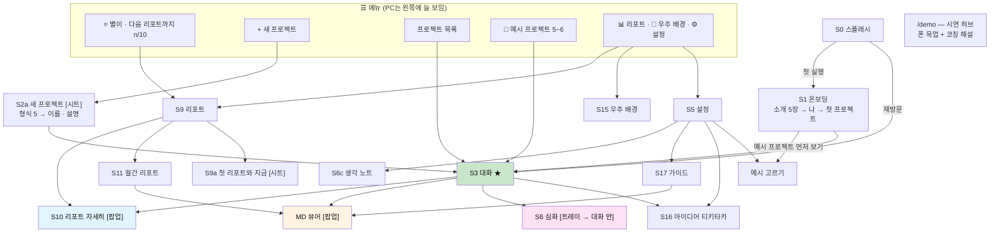
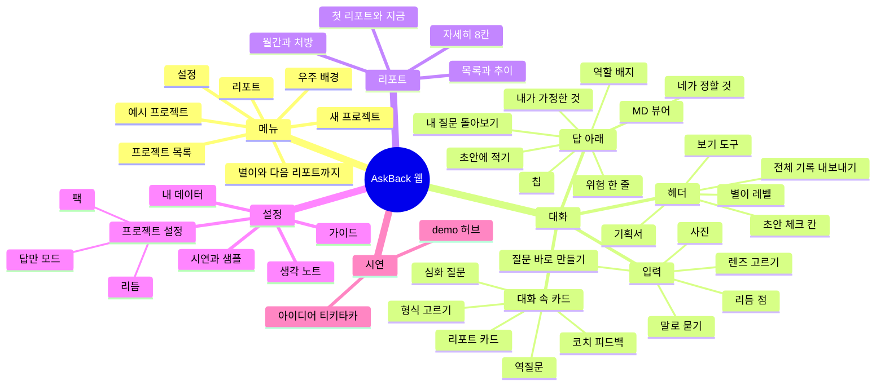
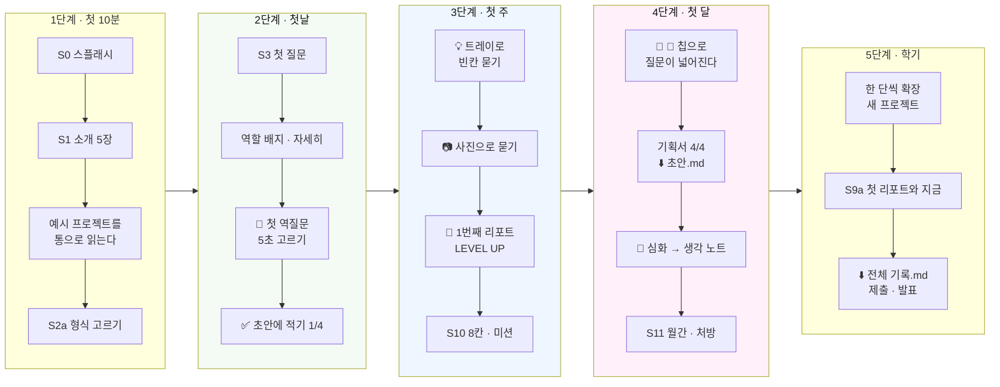
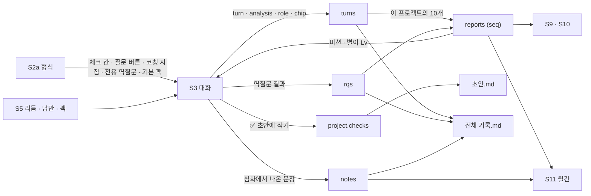

# 🗺 사이트맵 · 주요 기능 v4 — 지금 있는 웹 기준

> **한 문장**: `frontend/`에 실제로 구현된 AskBack 웹(2026-09-21 · `localhost:3000`)의 **화면 · 들어가는 길 · 주요 기능**을 한 장에 모은다.
>
> **기준 문서**: [설계서 v4 — 설계를 묻고, 기획서를 남긴다](AI_역질문_설계서_v4_설계를_묻고_기획서를_남긴다.md) · [사업계획서 v4](AI_역질문_코치_사업계획서_v4.md)
> **이전**: [사이트맵 v3 (앱 · 하단 탭 3개)](AI_역질문_사이트맵_v3.md) · [화면 설계서 v3](AI_역질문_화면설계서_v3_앱.md) — v3는 *계획한 앱*의 지도였고, 이 문서는 *만들어진 웹*의 지도다.
> **먼저 볼 곳**: **핵심 요소 정의 §0.1 · 이렇게 설계한 이유 §0.2** · 기능 마인드맵 §1.1 · **화면 공간 도식(PC · 모바일)** §1.2 · 여정 단계도 §1.3 · 상황별 사용 예시 22가지 §8.4
> **표기**: ✅ 구현됨 · 🟡 일부 · ⬜ 아직 없음(v3 계획) · `[시트]` 아래에서 올라오는 창 · `[팝업]` 보던 화면 위에 뜸 · `[펼침]` 그 자리에서 열림 · `[트레이]` 입력창 위로 솟음

---

## 0. v3 지도에서 달라진 뼈대

| | v3 (계획) | v4 (구현) |
|---|---|---|
| 플랫폼 | 모바일 앱 우선 | **웹 우선** (Next.js). PC(1024px~)는 왼쪽 메뉴 고정 + 오른쪽 상세, 모바일은 ☰ 서랍 |
| 중심 | 하단 탭 3개 — 💬 대화 · 🗂 기록 · 📈 성장 | **프로젝트 목록 + 메뉴 3개** — 📊 리포트 · 🌌 우주 배경 · ⚙️ 설정. 홈이 따로 없고 **대화가 곧 홈** |
| 경로 | `/p/[id]` · `/growth/…` 등 화면마다 URL | URL은 **`/` 와 `/demo` 둘뿐.** 화면 전환은 앱 안의 뷰 상태(`chat · reports · monthly · notes · library · settings · space · idea`) |
| 기록 탭 | 질문 기록 · 복기함 · 생각 노트 | 질문 기록 = 대화 화면의 **☷ 보기 도구**(질문만/되묻기만 · 모두 접기 · 정렬). 생각 노트는 설정 안. 복기함은 역질문 카드의 [지금 답하기] |
| 성장 탭 | 통 타임라인 · 배지 | **📊 리포트** 한 화면 + **별이** 레벨 |
| 저장 | 계정 + 서버 | 이 기기의 **localStorage** (계정 없음) |

### 0.1 핵심 요소 정의 — 이 지도를 읽는 데 필요한 말

> 화면은 바뀌어도 아래 열 가지는 바뀌지 않는다. 새 화면을 그릴 때는 "이 중 무엇을 위한 화면인가"부터 적는다.

| # | 핵심 요소 | 정의 (한 문장) | 단위 · 규칙 | 보이는 곳 | 왜 핵심인가 |
|---|---|---|---|---|---|
| 1 | **프로젝트** | 학생이 실제로 만들고 있는 것 하나. 모든 기록의 주인 | 형식 1개 · 질문 · 역질문 · 리포트 · 기획서가 전부 프로젝트에 매달린다 | 메뉴의 목록 · 헤더 | 교과 문제가 아니라 **자기 프로젝트**를 키우는 도구다. 기록을 프로젝트로 끊어야 "스마트 화분 · 2번째 리포트"처럼 이야기가 이어진다 |
| 2 | **질문(턴)** | 학생의 질문 하나 + 코치의 답 하나 | 유효 질문만 센다(잡담 · 중복 · 정서적 대화 제외). 프로젝트 안에서 Q1부터 | S3 턴 카드 | **평가 대상이 답이 아니라 질문**이다. 다른 튜터와 갈리는 지점 |
| 3 | **질문 유형(개방도)** | 질문의 폭 — 지시 · 좁은 · 열린 · 대안 · 맨 열린 (O1~O5) | 턴마다 1개. 코드 · 에러만 붙이면 판별 불가(NA) | 역할 배지 · 리포트 ② | 같은 AI도 질문의 폭에 따라 다른 답을 한다는 걸 **학생 눈에 보이게** 하는 축 |
| 4 | **AI의 자리(역할)** | 그 질문이 AI를 앉힌 자리 — ⌨️ 받아쓰기 · 👨‍💻 코더 · 🛠 엔지니어 · 🏛 아키텍트 · 📚 백과사전 | 질문 유형과 1:1 | 답 아래 배지 · 목록의 색 띠 | "O3"은 어렵고 "엔지니어 자리에 앉혔어"는 중학생도 안다. **평가가 아니라 거울** |
| 5 | **질문에 실은 것(6요소)** | 질문에 담긴 맥락 — 왜 · 맥락 · 제약 · 기준 · 검증 · 버릴 것 | 턴마다 0~6개 | 자세히 ▾ · 리포트 ④ | "길게 써라"가 아니라 **무엇을 실어라**를 가르친다. 글자 수 분석(리포트 ③)과 짝 |
| 6 | **열린 되묻기** | 모든 답의 끝에 붙는, 학생만 답할 수 있는 질문 하나 | 답 1개당 1개 | 답 본문 끝 🙋 | 답을 **거절하지 않고** 다음 질문을 끌어내는 장치. 티키타카의 고리 |
| 7 | **역질문(2문 1역)** | 질문 2개마다 코치가 되묻는 확인 질문 1개 | 리듬 2/3/4문 1역 · F1 고르기 / F2 빈칸 / F3 한두 문장 · 🟢🟡⚪ | 🧭 카드 · 리듬 점 ●○ | 방금의 알고리즘을 **진짜 아는지** 확인한다. 점수가 아니라 다음에 어떤 모양으로 물을지 정하는 표시 |
| 8 | **리포트** | 한 프로젝트의 질문 10개를 돌아본 한 장 | 이름 "{프로젝트} · N번째 리포트" + 한 줄 제목 · 어디서나 같은 8칸 · 미션 1개 | 대화 속 카드 · S9 목록 · S10 팝업 · .md | 성장을 **예전의 나**와 비교하는 유일한 단위. 형식이 같아야 1번째와 5번째를 나란히 볼 수 있다 |
| 9 | **기획서.md(초안)** | 학생이 내 말로 채운 칸 + 코치가 쌓아 준 설계 | 형식마다 체크 칸 4개 · 턴마다 한 칸씩 쌓임 | 🧩 n/4 · 📝 · MD 뷰어 | **남는 것이 코드가 아니라 설계 문서**다. 바이브 코딩 도구에 붙여넣는 입력이자 대회 기록서의 재료 |
| 10 | **별이(레벨)** | 리포트 1장 = Lv +1 로 자라는 동반자 | 다음 리포트까지 n/10 | 메뉴 카드 · 헤더 · LEVEL UP | 되묻는 도구는 귀찮다. **계속 쓸 이유**를 점수 · 등수 없이 주는 장치 |

**핵심 고리 한 줄** — `질문 → 답(+열린 되묻기) → [2개마다] 역질문 → [10개마다] 리포트 + 미션 → 다음 질문이 달라진다`. 사이트맵의 모든 화면은 이 고리의 어느 한 칸을 위해 있다.

### 0.2 이렇게 설계한 이유 — 결정 · 이유 · 버린 대안

| # | 설계 결정 | 이유 | 버린 대안 | 치르는 값 |
|---|---|---|---|---|
| D1 | **대화가 곧 홈** — 홈 · 대시보드가 없다 | 학생이 여는 목적은 늘 "지금 막힌 걸 묻기"다. 홈을 거치면 한 번 더 누른다. 코칭(배지 · 되묻기 · 리포트 카드)도 전부 대화 안에서 일어난다 | 하단 탭 3개(v3) · 카드형 홈 | 전체 현황을 한눈에 보는 곳이 약하다 → 📊 리포트 목록이 그 역할을 맡는다 |
| D2 | **메뉴는 셋, 나머지는 설정 안** | 중학생에게 메뉴 수 = 부담. 매일 쓰는 것(프로젝트 · 리포트)만 밖에 두고, 가끔 쓰는 것(노트 · 가이드 · 시연)은 접는다 | 기록 · 성장 · 노트 · 가이드를 각각 탭으로 | 생각 노트 · 가이드의 발견성이 낮다 → 심화가 끝나면 코치가 노트 위치를 말해 준다 |
| D3 | **떠나지 않고 연다** (시트 · 팝업 · 펼침 · 트레이) | 리포트를 보고 나면 **보던 질문으로 돌아와야** 다음 질문이 달라진다. 화면을 옮기면 맥락이 끊긴다 | 화면마다 페이지 이동 | URL이 없어 공유 · 새로고침에 약하다(§4) → 계정을 붙일 때 경로를 되살린다 |
| D4 | **답을 먼저, 되묻기는 그 뒤** | 답을 거절하고 질문만 하는 튜터는 학생이 떠난다(Khanmigo 중학교 연구 — 힌트 · 유도 질문을 대부분 거절). 막힌 걸 먼저 풀어 줘야 되묻기를 받아들인다 | 소크라테스식으로 답을 안 주기 | "그냥 답 받는 도구"로만 쓸 위험 → 역할 배지 · 리포트가 그 사실을 거울처럼 보여 준다 |
| D5 | **끼어들지 않는다** — 알약과 카드, 가로막는 건 LEVEL UP 한 번 | 만드는 중인 학생의 흐름이 제일 비싸다. 리포트는 "원할 때 여는 것"이어야 읽는다 | 리포트 도착 시 전체 화면 전환 · 푸시 알림 | 리포트를 안 열고 지나갈 수 있다 → 카드가 위에 붙어 남고(pinned) NEW 표시 |
| D6 | **누르면 보내지 않는다** — 칩 · 트레이는 입력창에 초안만, `___`는 학생이 | 질문을 대신 써 주면 질문 연습이 아니다. 틀은 주되 **내 숫자 · 내 상황**은 학생이 채운다 | 칩을 누르면 바로 전송 | 한 번 더 손이 간다 → 그 한 번이 이 제품의 수업이다 |
| D7 | **리포트는 프로젝트마다 1번째부터, 형식은 어디서나 8칸** | 프로젝트가 다르면 이야기가 다르다. 전체 통산 "7번째"는 아무 뜻이 없다. 형식이 같아야 예전의 나와 나란히 비교된다 | 전체 통산 번호 · 화면마다 다른 요약 | 프로젝트를 자주 바꾸면 10개가 안 차 리포트가 늦다 → n/10을 늘 보여 준다 |
| D8 | **📊 리포트 = 전체 목록(한 줄이 한 장)** | 리포트 화면의 일은 "읽기"가 아니라 **찾기 · 견주기**다. 읽기는 팝업(S10)이 한다. 한 줄에 같은 칸이 같은 순서로 놓여야 세로로 훑으며 비교된다 | 카드마다 내용을 길게 펼친 목록 | 한 줄에 다 못 담는다 → 제목 · 유형 띠 · 열린 질문 · 글자 수 · 돌아보기 · 미션 여섯 칸만 |
| D9 | **지난 것은 접힌다** | 대화가 길어질수록 "내가 뭘 물었나"가 중요하다. 질문 한 줄만 남기면 대화가 곧 **질문 기록**이 된다 | 별도의 질문 기록 화면(v3 기록 탭) | 지난 답을 다시 보려면 펼쳐야 한다 → ☷ 모두 펼치기 |
| D10 | **예시는 통째로 펼쳐서** | 잘 쓰는 모습을 본 적이 없으면 따라 할 수 없다. 클릭 시연은 읽히지 않는다 — 위에서 아래로 읽는 한 편의 이야기가 낫다 | ▶ 한 걸음씩 시연을 기본으로 | 예시를 열면 내 기록 자리를 쓴다 → 확인 창 · 목록에서는 다른 예시의 리포트를 불러오지 않고 보여 준다 |
| D11 | **답에는 코드가 없다 — 남는 건 .md** | 코드는 다른 도구가 더 잘 뽑는다. 이 도구의 값은 **무엇을 왜 그렇게 정했나**에 있다. .md는 어디에나 붙여넣고 제출할 수 있다 | 코드 생성 · 자체 실행 환경 | "코드 짜줘"에 실망할 수 있다 → 명세로 답하고, 코딩 도구에 넣는 법을 안내 |
| D12 | **계정 없이 이 기기에 저장** | 첫 10분 안에 질문을 해 보게 하는 것이 먼저. 미성년자 개인정보 · 보호자 동의 없이 파일럿 전 단계를 돌릴 수 있다 | 가입 후 사용 | 기기를 바꾸면 기록이 없다 · 교사가 볼 수 없다 → ⬇️ 전체 .json / .md 내보내기, W1에서 계정 |
| D13 | **PC는 왼쪽 메뉴 고정, 모바일은 서랍** | 학교 · 집에서는 PC로 만들면서 묻고, 이동 중엔 폰으로 사진을 찍어 묻는다. 같은 화면을 너비만 바꿔 쓴다 | 모바일 앱 우선(v3) | 폰에서 표 · 순서도가 좁다 → 답 폭 860px 제한 · 표 가로 스크롤 |
| D14 | **점수 · 등수가 없다 — 비교 대상은 예전의 나** | 질문은 정답이 없다. 점수를 붙이면 "점수 잘 나오는 질문"을 흉내 낸다. 🟢🟡⚪도 평가가 아니라 다음 질문의 모양을 정하는 표시 | 질문 점수 · 반 평균 · 랭킹 | 동기가 약할 수 있다 → 별이 · 미션 · 첫 리포트와 지금 |

---

## 1. 전체 지도



### 1.1 기능 마인드맵 — 무엇이 어느 화면에 있나



### 1.2 화면 공간 도식 — 대화 화면의 영역

**PC (1024px 이상) — 왼쪽 메뉴 고정 + 오른쪽 무대**

```text
┌──────────────────┬──────────────────────────────────────────────────────────────────┐
│ A  메뉴 (250px)   │ B  헤더 — ☰ · 🌱 프로젝트 이름 [예시] · 🧩 2/4 ▾ · 📝 기획서 · ☷ · ⬇️ · ⭐Lv.2 │
│                  │    └ 아래 가장자리 얇은 선 = 다음 리포트까지 6/10                     │
│  AskBack 로고     ├──────────────────────────────────────────────────────────────────┤
│  ⭐ 별이 Lv · 6/10 │ C  (있을 때만) 🎉 리포트 도착 알약 · ☷ 보기 도구 줄                    │
│  [+ 새 프로젝트]   ├──────────────────────────────────────────────────────────────────┤
│                  │ D  대화 흐름 (가운데 최대 860px · 세로 스크롤)                         │
│  프로젝트 목록     │    ┌ Q3 🙋 내 질문 ……………………………………………… 🛠 ▴ ┐                  │
│   🌱 스마트 화분   │    │  코치의 답 (표 · 순서도) … 🙋 하나만 되물을게            │          │
│   🍱 급식 잔반     │    │  ① 💬 위험 한 줄 · 역할 배지 · 📝 기획서 칸 · 칩        │          │
│                  │    │  ② 🫵 정할 것 2 · 📌 가정 3 · 🔎 O3 열린  [자세히 ▾]    │          │
│  📂 예시 프로젝트   │    │  ③ ✅ 초안에 적기 · 📄 MD 뷰어 · 🔭 심화 · 🙋 나한테      │          │
│   🐢 ♻️ 🐶 🍱 🚸   │    └──────────────────────────────────────────────┘          │
│                  │    🧭 역질문 카드  ·  코치 한마디  ·  📄 리포트 카드  ·  Q1 Q2 (접힘)   │
│ ───────────────  ├──────────────────────────────────────────────────────────────────┤
│  📊 리포트        │ E  트레이 (누를 때만 솟는다) — 💡 질문 바로 만들기 / 🔭 렌즈 3장        │
│  🌌 우주 배경      │ F  입력 — [＋사진] [💡]  ●○ 무엇이든 물어봐 …………… 🎙  [↑]            │
│  ⚙️ 설정          │    └ ___ 빈칸 안내 · 🔭 심화 중 띠 · 첨부 사진 미리보기                │
└──────────────────┴──────────────────────────────────────────────────────────────────┘
        G  겹쳐 뜨는 층 — [시트] 새 프로젝트 · 초안에 적기 · 역할 설명 · 첫 리포트와 지금
                          [팝업] 리포트 자세히 · MD 뷰어 · 예시 고르기 · LEVEL UP
        H  배경 — 우주(별 · 행성 · 별똥별). 설정으로 밝기 · 움직임을 바꾼다
```

**모바일 — 무대만 보이고, 메뉴는 ☰ 서랍**

```text
┌────────────────────────────┐        ┌───────────────┬────────────┐
│ ☰ 🌱 스마트 화분  🧩2/4 📝 ⭐2 │        │ A 메뉴 서랍     │ (어두운 막)  │
│▔▔▔▔▔▔▔ 6/10               │  ☰ →   │  별이 · 새 프로젝트│  누르면 닫힘 │
├────────────────────────────┤        │  프로젝트 · 예시 │            │
│ D 대화 흐름                  │        │  ───────────   │            │
│  Q3 🙋 내 질문 …      🛠 ▴   │        │  📊 🌌 ⚙️      │            │
│  코치의 답 …                 │        └───────────────┴────────────┘
│  역할 배지 · 칩               │
│  [자세히 ▾]  ✅ 📄 🔭 🙋      │        좁은 화면(400px 미만)에서는
│  🧭 역질문 카드               │        ⬇️ 버튼과 'Lv.' · '기획서' 글자를 숨긴다
├────────────────────────────┤
│ E 트레이 (💡 / 🔭)           │
│ F [＋][💡] ●○ 입력 …  🎙 [↑]  │
└────────────────────────────┘
```

| 영역 | 역할 | 공간을 아끼는 규칙 |
|---|---|---|
| **A 메뉴** | 어디로 갈지 — 프로젝트 · 예시 · 메뉴 3개 | 예시 목록은 접을 수 있다 · 바닥 메뉴는 늘 붙어 있다 |
| **B 헤더** | 지금 이 프로젝트의 상태 한 줄 | 체크 칸은 🧩 안에 접혀 있다 · 리포트 진행은 3px 선 하나 |
| **C 알림 줄** | 리포트 도착 · 보기 도구 | 필요할 때만 생긴다 |
| **D 대화 흐름** | 질문 · 답 · 되묻기 · 리포트가 시간순으로 | 지난 턴은 질문 한 줄로 접힌다 · 답 아래는 ①핵심 ②자세히(접힘) ③도구 세 층 |
| **E 트레이** | 다음 질문을 만드는 도구 | 누를 때만 입력창 위로 솟는다 |
| **F 입력** | 글 · 사진 · 말 + 리듬 점 | 입력창은 140px까지만 자란다 |
| **G 겹치는 층** | 자세히 보기 · 적기 · 읽기 | 화면을 떠나지 않는다. 닫으면 보던 자리 |
| **H 배경** | 몰입 · 개인 취향 | 글 읽기에 방해되면 움직임을 끈다 |

### 1.3 사용자 여정 단계도 — 어느 화면을 언제 지나가나



---

## 2. 트리로 본 사이트맵

```text
AskBack  (/)
│
├─ S0   스플래시                                                                  ✅
├─ S1   온보딩                                                                    ✅
│   ├─ 소개 5장   ① 같은 AI인데, 답이 달라져        ② 물으면 바로 답해 줘, 아낌없이
│   │            ③ 이번엔 AI가 너한테 물어          ④ 질문 10개 = 평가 리포트 1장
│   │            ⑤ 열린 질문으로 프로젝트를 키워      (한 번만 보인다)
│   ├─ 나         이름 · 학년 · 관심사
│   ├─ 첫 프로젝트
│   └─ [📂 예시 프로젝트 먼저 보기] → 예시 고르기
│
├─ ☰ 메뉴  (PC: 왼쪽 고정 250px · 모바일: 서랍)                                     ✅
│   ├─ 로고 · "🧑‍🚀 {이름}의 프로젝트"
│   ├─ ⭐ 별이 카드 — Lv · 이름 · 다음 리포트까지 n/10 → S9
│   ├─ + 새 프로젝트 → S2a
│   ├─ 프로젝트 목록 (최근 순) — 이모지 · 이름 · 설명 · 질문 수 · 최근 역할 5개 · `예시` 딱지
│   ├─ 📂 예시 프로젝트 (접기/펼치기) — 누르면 그 예시가 통째로 열린다
│   └─ 바닥 메뉴 — 📊 리포트 · 🌌 우주 배경 · ⚙️ 설정
│
├─ S2a  새 프로젝트                                   [시트]                       ✅
│   ├─ 📐 코드보다 설계 먼저 — 네가 정할 세 가지(기획 · 알고리즘 · 전체 구조)
│   ├─ 🎁 묻기만 해도 한꺼번에 쌓여 — 피드백 · 질문 분석 · 보고서와 기획서
│   ├─ ① 형식 5개 → 고르면 상세(만드는 것 · 설계할 것 · 미루는 것 · 채울 칸 4 · 코치가 되묻는 것)
│   └─ ② 이름 · 한 줄 설명 · 이모지 → "{형식} 초안 시작하기"
│
├─ S3   대화 ★ 중심 화면                                                          ✅
│   ├─ 헤더 (한 줄)
│   │   ├─ ☰ · 프로젝트 이름 · `예시` · ⚡ 답만 · ● Claude(실시간 연결 시)
│   │   ├─ 🧩 형식 n/4 → 초안 체크 칸 [펼침] — ⬜ 누르면 질문 초안 · ✅ 누르면 적은 내용
│   │   ├─ 📝 기획서 → MD 뷰어                        (기획서가 있는 프로젝트 · 지금은 예시)  🟡
│   │   ├─ ☷ 보기 도구 → 전체 │ 질문만 │ 🧭 되묻기 · 모두 접기/펼치기 · 시간순/최신순
│   │   ├─ ⬇️ 전체 기록 .md → MD 뷰어
│   │   ├─ 별이 Lv → S9
│   │   └─ 아래 가장자리 얇은 선 = 다음 리포트까지 n/10
│   ├─ 🎉 리포트 도착 알약 → 리포트 .md                                            ✅
│   ├─ 대화 흐름
│   │   ├─ 코치 첫 인사 (형식 소개 · 채울 칸 · 리듬 안내) / 예시는 🗺 확장 사다리 지도
│   │   ├─ 형식 고르기 카드 (형식이 없을 때 계속 떠 있음)
│   │   ├─ 턴 카드 Q{n} — 내 질문(칩 · 사진 표시 · 역할 이모지) + 코치의 답, 접으면 질문 한 줄
│   │   │   ├─ 답 본문 (스트리밍 · 표 · mermaid) — 끝에 🙋 하나만 되물을게
│   │   │   ├─ ① 💬 위험 한 줄 · 역할 배지 → 역할 설명 [시트] · 📝 기획서에 담은 칸 · 칩(최대 2)
│   │   │   ├─ ② 자세히 [펼침] — 🫵 네가 정할 것 · 📌 내가 가정한 것 · 🔎 내 질문 돌아보기(6요소 칸 · 단계)
│   │   │   └─ ③ 도구 — ✅ 초안에 적기 [시트] · 📄 MD 뷰어 · 🔭 심화 · 🙋 나한테 물어봐
│   │   ├─ 🧭 역질문 카드 — F1 고르기 / F2 빈칸 / F3 한두 문장
│   │   │   ├─ 💡 힌트 줘 → 📎 예시 보여줘 → 🤖 코치는 어떻게 봐?
│   │   │   ├─ 🤷 잘 모르겠어 · 나중에 · ⏭ 넘겼어 · 지금 답하기
│   │   │   └─ 답한 뒤 🟢🟡⚪ + "왜 이 색이야?"
│   │   ├─ 코치 한마디 (피드백 · 리듬 완화 제안 2:1/3:1/4:1 · 무효 질문 응답 · 정서적 대화 안내)
│   │   ├─ 🔭 심화 질문 카드 (깊이 막대 4칸) + [한 단 더 깊이][다른 렌즈로][여기까지]
│   │   ├─ 📄 리포트 카드 (도착한 시각의 자리에 · 8칸 본문 펼침 · .md · 크게 보기 → S10)
│   │   └─ 빈 대화(제품 형식) — 💡 아이디어 티키타카 → S16 · 질문 예 3개(좁게 · 열고 · 대안)
│   ├─ 입력 영역
│   │   ├─ ＋ 사진 (🖼 앨범 · 📷 지금 찍기 · 붙여넣기 · 최대 3장)
│   │   ├─ 💡 질문 바로 만들기 [트레이] — 🔭 심화 · ⬜ 다음 빈칸 묻기 · 형식 전용 3 · 넓히기/좁히기/대안/왜 이렇게? · 🙋 나한테 물어봐 · 🔁 형식 바꾸기
│   │   ├─ 🔭 렌즈 고르기 [트레이] — 🧭 철학 · 🫀 심리학 · 🌍 사회학
│   │   ├─ 리듬 점 ●○ (다음 역질문까지) · 입력창 · 🎙 말로 묻기 · ↑ 보내기
│   │   └─ 심화 중 띠("리듬에 들어가지 않아" · 나가기) · ___ 빈칸 안내
│   └─ LEVEL UP! [팝업] — 별이 진화 · 📄 리포트 보러 가기
│
├─ S9   📊 리포트 — 전체 목록 (찾고 견주는 곳)                                       ✅
│   ├─ 별이 · 지금 프로젝트의 n/10
│   ├─ 📑 전체 리포트 n장 · 프로젝트 n개 · 열린 질문 평균 + (내 리포트 2장 이상) 추이 그래프
│   ├─ 📘 {n}월 월간 → S11 · ↔ 첫 리포트와 지금 → S9a [시트]
│   └─ 🗂 리포트 한눈에 보기 — 프로젝트마다 한 묶음(내 프로젝트 먼저 · 열지 않은 예시도 함께), **한 줄 = 리포트 한 장**
│        번호 · "한 줄 제목" · Q범위 · 날짜 │ 🪑 질문 유형 띠 │ 🌅 열린 질문 n/10 │ 📏 평균 글자 │ 🔁 돌아보기 점 │ 🎯 미션 도장 → S10
│        (모바일은 표 머리 없이 제목 아래 다섯 칸으로 접힌다 · 예시의 리포트는 읽기 전용)
├─ S10  리포트 자세히 (8칸)                           [팝업]                       ✅
│        이름 "{프로젝트} · N번째 리포트" + 한 줄 제목(이 10문을 한 문장으로)
│        ① 한눈에 ② 질문 유형 ③ 질문 길이 ④ 실은 것 ⑤ 되묻기 ⑥ 걸린 곳 ⑦ 베스트 질문 ⑧ 미션
│        "비교 대상은 언제나 예전의 너야" · ↩ 보던 곳으로 돌아가기
├─ S11  📘 월간 리포트 (8장 · 다음 달 목표 편집 · .md)                               ✅
│
├─ S5   ⚙️ 설정                                                                   ✅
│   ├─ 나 — 이름 · 학년 · 관심사 · 유효 질문/역질문/리포트/"잘 모르겠어" 수
│   ├─ 프로젝트 설정 — 되묻는 리듬(2/3/4문 1역) · ⚡ 답만 모드 · 더 돌아볼 주제(팩 4종)
│   ├─ 더 보기 — 📝 생각 노트(S6c) · 📚 가이드(S17) · 🌌 우주 배경(S15)
│   ├─ 시연 · 샘플 — 💡 아이디어 티키타카 · 📂 예시 프로젝트 열기 · 📈 샘플 리포트 7장 채우기
│   └─ 내 데이터 — ⬇️ 초안만 .md · ⬇️ 전체 기록 .md · ⬇️ 전체 .json · 🗑 전부 지우기
├─ S6c  📝 생각 노트 — 렌즈 · 깊이 · 프로젝트 · 날짜 · 내 문장                        ✅
├─ S17  📚 가이드 — 답은 어디까지 하는가 · 질문의 폭 · 2문 1역 · 리포트 읽는 법 → MD 뷰어  ✅
├─ S15  🌌 우주 배경 꾸미기 — 밝기 · 공전/자전 · 별똥별 · 천체 켜고 끄기 · 처음 모습으로   ✅
├─ S16  💡 아이디어 티키타카 — 아이디어 3개 → 7번 주고받기 → 8칸 카드 → 📜 유저 시나리오.md  ✅
│
├─ 공통 팝업
│   ├─ MD 뷰어 — 보기/원문 · 📋 MD 복사 · ⬇️ .md 저장 (답 · 기획서 · 리포트 · 월간 · 가이드 · 전체 기록)  ✅
│   └─ 예시 고르기 — 내 기록이 있으면 "지금 기록이 지워져" 확인                        ✅
│
├─ /demo   시연 허브 — 예시 고르기 · 폰 목업 · 코칭 해설 · { } JSON 보기 · 한꺼번에/▶ 한 걸음씩  ✅
└─ /api/turn   Claude API 한 턴 (answer · rq · feedback · deep) — GET은 연결 여부         ✅

아직 없는 것 (v3 계획에서 이월)                                                     ⬜
   로그인 · 보호자 동의(S1-4/5) · 복기함 모아 보기(S7) · 🗺 생각 지도(S3g) · F4 그리기(S3d-4) ·
   개인정보 경고(S3p) · 미션 바꾸기(S10a) · 배지 모음(S12) · 포트폴리오 PDF(S9b) · [찾아줘](S13) ·
   AI 활용 기록서 양식(S14) · 블라인드 비교(S8) · 알림 · 오프라인 띠 · 교사 화면(T1~T3)
```

---

## 3. 화면 목록표

| ID | 화면 | 종류 | 상태 | 들어오는 길 | 소스 | 설계서 v4 |
|---|---|---|---|---|---|---|
| S0 | 스플래시 | 전체 | ✅ | 실행 | `Splash` | — |
| S1 | 온보딩 | 전체 | ✅ | 첫 실행 | `Onboarding` · `OnboardingScene` · `onboarding.json` | §1 |
| — | ☰ 메뉴 | 고정/서랍 | ✅ | 어디서나 | `Drawer` | — |
| S2a | 새 프로젝트 | 시트 | ✅ | 메뉴 [+ 새 프로젝트] | `ProjectSheet` · `formats.json` | §2 |
| S3 | 대화 | 전체 | ✅ | 메뉴의 프로젝트 · 재방문 | `Chat` · `actions` · `engine` | §3~§6 |
| S3-체크 | 초안 체크 칸 · 초안에 적기 | 펼침 · 시트 | ✅ | 헤더 🧩 · 답 아래 ✅ | `DraftKit` · `draft.ts` | §5 |
| S3d | 역질문 카드 | 카드 | ✅ | 리듬 · 🙋 나한테 물어봐 | `RQCard` · `rq.ts` | §4 |
| S6 | 심화 | 트레이 → 대화 안 | ✅ | 🔭 심화 | `Chat` · `lenses.json` | §8 |
| S6c | 생각 노트 | 전체 | ✅ | 설정 → 더 보기 | `Pages › NotesView` | §8 |
| S9 · S9a | 리포트 · 첫 리포트와 지금 | 전체 · 시트 | ✅ | 메뉴 · 별이 · 헤더 Lv | `ReportsView` | §7.4 |
| S10 | 리포트 자세히 | 팝업 | ✅ | 목록 · 대화 속 카드 · LEVEL UP | `ReportView` · `ReportBody` · `ReportCard` | §7.2 |
| S11 | 월간 리포트 | 전체 | ✅ | S9의 월 버튼 | `MonthlyView` · `report.ts` | §7.4 |
| S5 | 설정 | 전체 | ✅ | 메뉴 | `Pages › Settings` | — |
| S15 | 우주 배경 | 전체 | ✅ | 메뉴 · 설정 | `SpaceStudio` · `Space` | — |
| S16 | 아이디어 티키타카 | 전체 | ✅ | 빈 대화(제품) · 설정 | `IdeaLab` · `ideas.json` | §10.2 |
| S17 | 가이드 | 전체 | ✅ | 설정 → 더 보기 | `Pages › Library` · `public/library` | — |
| — | MD 뷰어 | 팝업 | ✅ | 📄 · 📝 · ⬇️ · 가이드 | `MdViewer` · `Markdown` | §5.2 |
| — | `/demo` | 별도 페이지 | ✅ | URL | `components/demo/*` | §10.1 |

### 3.1 화면마다 — 왜 있나 · 핵심 요소 · 없으면 생기는 일

| ID | 이 화면이 답하는 학생의 질문 | 화면의 핵심 요소 (없으면 안 되는 것) | 이 화면이 없으면 | 잘 되고 있다는 신호 |
|---|---|---|---|---|
| S1 온보딩 | "이게 챗GPT랑 뭐가 달라?" | 소개 5장(답이 달라져 · 되물어 · 10개 = 리포트) · 예시 먼저 보기 | 그냥 챗봇으로 쓰고 되묻기에 놀라 떠난다 | 첫 10분 안에 첫 질문 |
| ☰ 메뉴 | "어디로 가지? 얼마나 왔지?" | 별이 n/10 · 프로젝트 목록 · 바닥 메뉴 3개 | 프로젝트가 섞이고 리포트가 언제 오는지 모른다 | 프로젝트를 2개 이상 오간다 |
| S2a 새 프로젝트 | "뭘 만들 건데, 뭘 정해야 해?" | 형식 5개 · 채울 칸 4개 미리 보기 | 코치가 무엇을 되물을지 기준이 없다 | 형식을 고르고 시작한 비율 |
| **S3 대화 ★** | "지금 막힌 걸 어떻게 풀지?" | 답(+🙋) · 역할 배지 · 칩 · 역질문 카드 · 리듬 점 · 트레이 | — (제품 자체) | 열린 질문(O3+O4) 비율이 리포트마다 오른다 |
| S3-체크 | "그래서 내가 뭘 정했지?" | 체크 칸 4개 · **내 말로** 적는 시트 | 답을 읽고 끝 — 남는 것이 없다 | 🧩 4/4 · 초안.md 내보내기 |
| S3d 역질문 | "나 이거 진짜 아는 거 맞아?" | 고르기/빈칸/한두 문장 · 힌트 3단 · 잘 모르겠어 · 나중에 | 답을 받아 적기만 한다 | 🟢 비율 · F1 → F3으로 옮겨 감 |
| S6 심화 | "이걸 왜 만드는 거지?" | 렌즈 3장 · 깊이 4칸 · 프로젝트로 돌려놓기 | 기능만 늘고 이유가 없다 | 생각 노트에 문장이 쌓인다 |
| **S9 리포트 목록** | "내 리포트가 다 어디 있지? 어느 게 어땠지?" | 프로젝트별 묶음 · **한 줄 = 한 장** · 같은 여섯 칸 · 추이 그래프 | 리포트가 대화 속에 묻혀 다시 못 찾는다 | 지난 리포트를 다시 연다 |
| **S10 리포트 자세히** | "이번 10개는 어땠고, 다음엔 뭘 하지?" | 이름 + 한 줄 제목 · 8칸 고정 · 미션 1개 | 숫자만 보고 행동이 없다 | 다음 리포트에서 미션 ✅ |
| S9a 첫 리포트와 지금 | "나 달라졌어?" | 첫 장과 최신 장을 나란히 | 성장이 안 보여 그만둔다 | 학기 말에 열어 본다 |
| S11 월간 | "이번 달 뭘 공부하면 돼?" | 처방 최대 3개(지식 · 기술 · 습관) · 다음 달 목표 편집 | 리포트가 쌓이기만 하고 방향이 없다 | 목표를 직접 고쳐 쓴다 |
| S5 설정 | "나한테 맞게 바꾸고 싶어" | 리듬 · 답만 모드 · 팩 · 내 데이터 내보내기/지우기 | 되묻기가 귀찮아지면 끌 방법이 없어 떠난다 | 리듬을 바꾸고 계속 쓴다 |
| S16 티키타카 | "뭘 만들지 모르겠어" | 아이디어 3개 → 7번 주고받기 → 8칸 카드 | 첫 프로젝트를 못 정해 시작을 못 한다 | 카드에서 프로젝트를 만든다 |
| S17 가이드 | "이 표시가 무슨 뜻이야?" | 질문의 폭 · 2문 1역 · 리포트 읽는 법 | 배지 · 색 점이 암호가 된다 | — |
| S15 우주 배경 | "내 거 같았으면" | 밝기 · 움직임 끄기 | 글 읽기에 방해돼도 끌 수 없다 | — |
| MD 뷰어 | "이걸 어디다 내지?" | 보기/원문 · 복사 · 저장 | 기획서 · 리포트가 앱 안에 갇힌다 | .md를 복사 · 저장한다 |
| /demo | (교사) "수업에서 어떻게 보여 주지?" | 폰 목업 + 코칭 해설 | 교사가 코칭 의도를 읽을 수 없다 | 교실 시연 |

---

## 4. 경로

| 경로 | 내용 |
|---|---|
| `/` | 앱 전체. 첫 실행이면 스플래시 → 온보딩, 아니면 마지막 프로젝트의 대화 |
| `/demo` | 시연 허브 — 같은 시나리오 JSON을 폰 목업 + 해설로 |
| `/api/turn` | `GET` 연결 여부 · `POST {task, input, context, history, images}` |
| 정적 파일 | `/answers/*.md` 로컬 답 카드 · `/library/*.md` 가이드 · `/scenarios/*.md` 유저 시나리오 |

> 화면마다 URL이 없다 — 새로고침하면 대화로 돌아오고, 링크로 리포트를 공유할 수 없다.
> 계정 · 서버 저장을 붙일 때(설계서 v4 §16 W1) v3의 경로 규칙(`/p/[id]` · URL에는 ID만)을 되살린다.

---

## 5. 내비게이션 규칙 (구현된 것)

| 규칙 | 내용 | 이유 |
|---|---|---|
| **대화가 홈** | 어느 화면이든 `‹` 는 대화로 돌아온다. 프로젝트를 고르면 바로 그 대화 | 여는 목적이 늘 "묻기"다 (D1) |
| **떠나지 않고 연다** | 리포트 자세히 · MD 뷰어 · 새 프로젝트 · 예시 고르기는 전부 보던 화면 위에 뜬다. 닫으면 그 자리 | 리포트를 읽고 **보던 질문으로 돌아와야** 다음 질문이 달라진다 (D3) |
| **끼어들지 않는다** | 리포트는 알약과 카드로만 온다. 가로막는 것은 **LEVEL UP** 한 번뿐이고 "계속 물어볼래"로 닫는다 | 만드는 중의 흐름이 제일 비싸다 (D5) |
| **답보다 먼저 나오는 것은 없다** | 역질문 · 코치 한마디는 답의 스트리밍이 끝난 뒤에만 보인다 | 답을 미루는 튜터는 학생이 떠난다 (D4) |
| **지난 것은 접힌다** | 턴 카드는 마지막 것만 열려 있다. 예시 프로젝트는 전부 펼친 채로 맨 위에서 시작한다 | 접힌 대화가 곧 질문 기록이다 (D9) · 예시는 읽는 글이다 (D10) |
| **누르면 보내지 않는다** | 칩 · 빈칸 · 질문 버튼은 입력창에 초안만 채운다. `___` 는 학생이 채운다 | 질문을 대신 쓰면 연습이 아니다 (D6) |
| **메뉴는 바닥에 붙는다** | 프로젝트 · 예시 목록이 길어도 📊 🌌 ⚙️ 는 가려지지 않는다 | 목록이 길어지는 건 잘 쓰고 있다는 뜻 — 그때 메뉴를 잃으면 안 된다 (D2) |
| **이름은 하나로** | 리포트는 어디서나 "{프로젝트} · N번째 리포트" + 한 줄 제목, 본문은 어디서나 같은 8칸 | 화면마다 이름 · 형식이 다르면 같은 것인 줄 모른다 (D7) |
| **목록은 찾는 곳, 팝업은 읽는 곳** | 📊 리포트는 한 줄에 한 장, 누르면 S10 팝업에 전체 내용 | 한 화면이 두 일을 하면 둘 다 못 한다 (D8) |
| **PC에서 Enter = 전송** | 터치 기기에서는 Enter가 줄바꿈. 한글 조합 중에는 보내지 않는다 | 긴 질문(맥락을 실은 질문)을 쓰기 편해야 한다 |

---

## 6. 상태에 따라 달라지는 지도

| 상태 | 달라지는 것 |
|---|---|
| **첫 실행** | 스플래시 → 소개 5장 → 나 → 첫 프로젝트. 메뉴는 온보딩이 끝난 뒤에 생긴다 |
| **형식 없는 프로젝트** | 대화 안에 형식 고르기 카드 · 헤더에 🧩 없음 · 칩에 설계로 돌아가기 없음 |
| **예시 프로젝트** | `예시` 딱지 · 첫 인사 대신 확장 사다리 지도 · 전부 펼침 · 📝 기획서 버튼 · 메뉴의 예시 목록에서는 빠짐 |
| **⚡ 답만 모드 / 급하다는 신호** | 역질문은 화면에 안 뜨고 적립만 |
| **정서적 대화** | 그 턴은 배지 · 칩 · 역질문 · 카운트 전부 끔 · 1388 안내 |
| **Claude 연결됨** | 헤더 `● Claude` · "🛰 최선의 답을 만드는 중" · 사진을 읽는다 |
| **서버 없이(기본)** | 로컬 답 카드 · "💭 생각하는 중" · 사진은 "읽지 못해"라고 말한다 |
| **리포트 0장** | S9에 빈 상태 + "설정 → 샘플 데이터" 안내 |
| **리포트 2장 이상** | ↔ 첫 리포트와 지금 버튼이 생긴다. 한 달에 2장 미만이면 월간은 '미니' |

---

## 7. 화면 간 데이터의 흐름



---

## 8. 주요 기능 정리

### 8.1 열두 가지 기능

| # | 기능 | 학생이 하는 것 | 도구가 하는 것 | 남는 것 |
|---|---|---|---|---|
| 1 | **다섯 형식 초안** | 📄 🔬 🎬 💻 🤖 중 하나를 고른다 | 질문 버튼 · 채울 칸 4개 · 코칭 지침 · 전용 역질문을 바꾼다 | 형식 · 진행 n/4 |
| 2 | **설계 중심의 답** | 어떤 폭으로든 묻는다 ("코드 짜줘"도 된다) | 규칙 카드 · 상태표 · 순서도 · 비교표로 답한다. 확인하는 법을 붙인다 | 답 .md |
| 3 | **답의 경계** | 🫵 네가 정할 것을 본다 | 정보 · 구현은 끝까지, 판단은 남긴다. 가정을 전부 공개한다 | 내가 정할 것 · AI가 가정한 것 목록 |
| 4 | **역할 배지 · 질문 돌아보기** | 내 질문이 AI를 어디 앉혔는지 본다 | O1~O5 · 6요소 · 단계를 분석한다. 평가가 아니라 거울 | 턴마다 개방도 · 역할 |
| 5 | **🙋 열린 되묻기** | 직접 재 보고, 그 값으로 다음 질문을 시작한다 | 모든 답을 학생만 답할 수 있는 질문 하나로 끝낸다 | 티키타카 |
| 6 | **🧭 2문 1역 역질문** | 5초 고르기 ~ 30초 한두 문장. 모르면 "잘 모르겠어" | 기본 8 + 팩 + 형식 전용에서 하나를 고른다. 억지로 묻지 않는다. 힌트 3단 | 🟢🟡⚪ · 내 답 |
| 7 | **질문 믹스 코칭** | 칩 · 💡 트레이의 초안을 고쳐 보낸다 | 넓히기 · 좁히기 · 대안 · **설계로 돌아가기** · 다음 빈칸 묻기 | 칩 사용 기록 |
| 8 | **초안 체크 칸 → 기획서.md** | 답을 보고 **내 말로** 한 줄 적는다 | 칸을 대신 채우지 않는다. 다음 칸을 안내한다 | 초안.md · 전체 기록.md |
| 9 | **프로젝트 · N번째 리포트** | 10문마다 도착한 리포트를 원할 때 연다 | 8칸(글자 수 분석 포함) · 미션 하나 · 어디서나 같은 형식 | 리포트.md |
| 10 | **월간 · 비교 · 별이** | 한 달을 돌아보고 목표를 고친다 | 공부 처방 최대 3개 · 첫 리포트와 지금 · 리포트 1장 = Lv +1 | 월간.md |
| 11 | **🔭 심화 3렌즈** | 철학 · 심리학 · 사회학 중 고른다 | L1 → L2 → L3 → 프로젝트로 돌려놓기. 리듬에 넣지 않는다 | 생각 노트 |
| 12 | **멀티모달 · 예시 · 티키타카** | 사진 · 말로 묻는다. 예시 6개를 통으로 읽는다 | 사진 3장 · 음성 입력 · 시나리오 JSON · 아이디어 → 유저 시나리오 | — |

### 8.2 한 질문이 지나가는 길

```text
1  형식이 정해진 프로젝트에서 💡 → [⬜ 동작 시나리오 묻기] → 입력창에 초안 → ___ 를 채워 보낸다
2  답(명세) 스트리밍 → 끝에 🙋 하나만 되물을게
3  역할 배지 · 칩 · (자세히) 네가 정할 것 · 가정 · 내 질문 돌아보기
4  두 번째 질문이었다면 → 🧭 역질문 → 답 → 코치 피드백(3문장)
5  ✅ 초안에 적기 → 1/4 → 다음 칸 안내
6  열 번째 질문이었다면 → 리포트 카드 + 알약 + LEVEL UP → 미션 하나
7  ⬇️ 초안.md → 바이브 코딩 도구에 붙여넣는다
```

### 8.3 기능 ↔ 데이터 파일 (고칠 곳)

| 고치고 싶은 것 | 파일 |
|---|---|
| 형식 · 체크 칸 · 질문 버튼 · 형식별 코칭 · 전용 역질문 | `src/data/formats.json` |
| 코치의 답 · 역질문 · 피드백 · 심화 프롬프트 | `src/data/prompts.json` (+ `src/lib/schemas.ts`) |
| 개방도 · 역할 · 6요소 · 단계별 참고 믹스 · 팩 | `src/data/roles.json` |
| 평가 요소(기본 8 · 팩 16)와 F1~F3 템플릿 | `src/data/elements.json` |
| 역질문 선택 점수 | `src/lib/rq.ts` |
| 리포트 이름 · 8칸 · 미션 · 월간 처방 | `src/lib/report.ts` · `components/ReportBody.tsx` · `src/data/missions.json` |
| 예시 프로젝트 | `src/data/scenarios/*.json` + `index.ts` (검사: `scripts/validate_scenario.py --full`) |
| 로컬 답 카드 | `src/data/answers.json` · `public/answers/*.md` |
| 온보딩 · 별이 이름 | `src/data/onboarding.json` |
| 아이디어 티키타카 | `src/data/ideas.json` · `public/scenarios/*.md` |
| 가이드 문서 | `public/library/index.json` · `*.md` |

### 8.4 상황별 사용 예시 — 이럴 때 어디를 누르나

| # | 상황 | 누르는 곳 | 일어나는 일 | 화면 |
|---|---|---|---|---|
| 1 | 뭘 물어야 할지 모르겠다 | 입력창 옆 💡 → [⬜ 동작 시나리오 묻기] | 입력창에 "___를 하는 제품을 만들고 싶어…" 초안. `___` 만 채우면 된다 | S3 트레이 |
| 2 | 아이디어가 한 줄뿐이다 | 설정 → 💡 아이디어 티키타카 | 7번 주고받으며 8칸 카드 → 유저 시나리오.md | S16 |
| 3 | 다른 애들은 어떻게 쓰나 궁금하다 | 메뉴 → 📂 예시 프로젝트 → 🐢 거북목 | 질문 20개 · 역질문 10개 · 리포트 2장 · 기획서가 통째로 펼쳐진다 | S3 (예시) |
| 4 | 회로가 안 돌아간다 | ＋ → 📷 지금 찍기 + "어디부터 의심하면 좋을까?" | (Claude 연결 시) 사진을 보고 답한다 · 서버가 없으면 "사진은 못 읽어"라고 말한다 | S3 입력 |
| 5 | 코드만 계속 받고 있다 | 답 아래 칩 🌅 넓히기 | "코드 전에 설계부터 볼래. 내 규칙은 '___를 재서 → ___이면 → ___'야" 초안 | S3 칩 |
| 6 | 다른 방법도 알고 싶다 | 💡 → [🔀 대안] | "이 방식 말고 다른 방식 2개와, 각각 잃는 걸 알려줘" → 🏛 아키텍트 답 | S3 트레이 |
| 7 | 코치가 뭘 멋대로 정했는지 보고 싶다 | 답 아래 [자세히 ▾] | 🫵 네가 정할 것 · 📌 내가 가정한 것 · 🔎 질문에 실린 6요소 칸 | S3 펼침 |
| 8 | 답을 보고 마음을 정했다 | 답 아래 ✅ 초안에 적기 | 칸을 고르고 **내 말로** 한두 줄 → 🧩 2/4 | 시트 |
| 9 | 역질문이 어렵다 | 💡 힌트 줘 → 📎 예시 → 🤖 코치는 어떻게 봐? · 또는 🤷 잘 모르겠어 | 힌트를 보면 🟡까지. "모르겠어"도 기록되고 탓하지 않는다 | 역질문 카드 |
| 10 | 지금은 급하다 | 역질문의 [나중에] · 설정의 ⚡ 답만 모드 | 역질문이 적립된다. 나중에 그 카드의 [⏭ 지금 답하기] | S3 · S5 |
| 11 | 되묻는 게 너무 잦다 | 설정 → 되묻는 리듬 3문 1역 / 4문 1역 | 입력창의 리듬 점이 ●○○ 으로 바뀐다 | S5 |
| 12 | 코치가 나한테 더 물어봤으면 | 답 아래 🙋 나한테 물어봐 | 리듬과 상관없이 역질문 1개. 물을 게 없으면 "억지로 물을 게 없어" | S3 |
| 13 | 리포트가 왔다 | 🎉 알약 또는 대화 속 📄 카드 → 크게 보기 | 8칸 · 미션 하나. 닫으면 보던 자리 | S10 팝업 |
| 14 | 내가 자랐는지 보고 싶다 | 메뉴 📊 → ↔ 첫 리포트와 지금 | 역할 · 기준 · 열린 질문 수 · 베스트 질문을 나란히 | S9a 시트 |
| 15 | 이번 달을 돌아보고 싶다 | 📊 → 📘 9월 월간 | 8장 · 공부 처방 최대 3개 · 다음 달 목표를 고쳐 쓴다 | S11 |
| 16 | 생각을 더 깊게 해 보고 싶다 | 🔭 심화 → 🫀 심리학 | L1 → L2 → L3 → 프로젝트로 돌려놓기. 내 문장은 생각 노트에 | S3 · S6c |
| 17 | 코딩 도구에 넣을 문서가 필요하다 | 설정 → ⬇️ 초안만 .md → 📋 MD 복사 | 체크 칸 · 내가 정할 것 · AI가 가정한 것 한 장 | MD 뷰어 |
| 18 | 수행평가에 과정을 내야 한다 | 헤더 ⬇️ 전체 기록 .md | 질문 원문 · 질문의 폭 · AI 역할 · 되물은 것과 내 답 · 생각 노트 | MD 뷰어 |
| 19 | 예전 질문만 훑어보고 싶다 | 헤더 ☷ → [질문만] · [모두 접기] | 턴 카드가 질문 한 줄씩으로 접힌다 | S3 보기 도구 |
| 20 | 리포트가 어떻게 생겼는지 미리 보고 싶다 | 설정 → 📈 샘플 리포트 7장 채우기 | 목록 · 추이 그래프 · 월간이 채워진다 | S5 → S9 |
| 21 | 글 읽는데 배경이 어지럽다 | 메뉴 🌌 → 공전 · 자전 끄기 | 전부 제자리에 멈춘다. 이 기기에만 저장 | S15 |
| 22 | 교사가 교실에서 시연한다 | 주소창 `/demo` | 폰 목업 + 코칭 해설 + JSON. 한꺼번에 또는 ▶ 한 걸음씩 | /demo |

---

## 9. 다음에 지도에 들어올 것 (설계서 v4 §16)

| 단계 | 들어오는 화면 | 지도에 주는 영향 |
|---|---|---|
| **W1 파일럿 준비** | 로그인(파일럿 코드) · 보호자 동의 · 개인정보 경고 띠 · 서버 저장 | 화면별 URL(`/p/[id]` · `/reports/[seq]`)을 되살린다 |
| **W2 기획서 엔진** | 📝 기획서가 모든 프로젝트에 · AI 활용 기록서 양식 | 헤더의 📝 가 상시 버튼이 된다 |
| **W3 돌아보기 보강** | 복기함 모아 보기 · 미션 바꾸기 · 🗺 생각 지도 | 메뉴에 🧺 복기함 또는 ☷ 보기 도구의 네 번째 필터 |
| **W4 교실** | 교실 참여(학급 코드) · 교사 웹(T1~T3) · 포트폴리오 PDF | 교사 화면은 별도 진입. 학생 메뉴는 늘리지 않는다 |

---

## 10. 한 장 요약

```text
들어오는 길       /  (앱)  ·  /demo (시연)
중심은 하나       S3 대화. 메뉴에서 프로젝트를 고르면 바로 대화, 어느 화면의 ‹ 도 대화로 돌아온다.
메뉴는 셋         📊 리포트 · 🌌 우주 배경 · ⚙️ 설정 (생각 노트 · 가이드 · 시연은 설정 안)
핵심 고리         질문 → 답(+🙋) → 2개마다 역질문 → 10개마다 리포트 + 미션 → 다음 질문이 달라진다 (§0.1)
설계의 이유       답을 먼저 준다 · 끼어들지 않는다 · 대신 써 주지 않는다 · 점수를 매기지 않는다 (§0.2 D4 · D5 · D6 · D14)
늘어나는 방식     탭이 아니라 펼침 · 시트 · 팝업 · 트레이 — 보던 자리를 떠나지 않는다.
알리는 방식       알약과 카드. 가로막는 건 LEVEL UP 한 번.
남는 것           초안.md · 전체 기록.md · 리포트.md · 월간.md · 생각 노트 · 전체 .json
아직 없는 것      계정 · 서버 저장 · 교사 화면 · 복기함 모아 보기 · 생각 지도 · AI 활용 기록서 양식
```
