# 🧠 역질문 설계서 — 손으로 증명하는 프롬프트

> **한 문장**: AI에게 답을 얻는 순간이 아니라, **그 답을 얻은 내 질문을 해부하는 순간**에 실력이 자란다.
>
> **대상**: 중·고등학생(특히 특성화고 메이커·AI 계열), 프로젝트 기반 수업 교사, 독서·토론 지도자
> **성격**: 리딩클루와 별개로 만드는 **독립 도구**. 프로세스 기반으로 설계한다
> **핵심 장치**: **프롬프트 분석 → 개선 → 염두 복원 → 5렌즈 역질문** → 손으로 그린 순서도 검문(Hand Proof)
> **성장 경로**: 프롬프트 → 대화 → **프로세스** → **에이전트 설계**
> **도구 코드네임**: **RQ 엔진** (Reverse Question Engine)

---

## 0. 왜 이 도구가 필요한가

청소년은 아직 **철학·관점·깊이 있게 보는 시야**가 형성되는 중이다.
그 상태에서 생성형 AI를 쓰면, 문제가 생긴다. AI가 **틀린 답을 줘서**가 아니라, **너무 그럴듯한 답을 줘서**다.

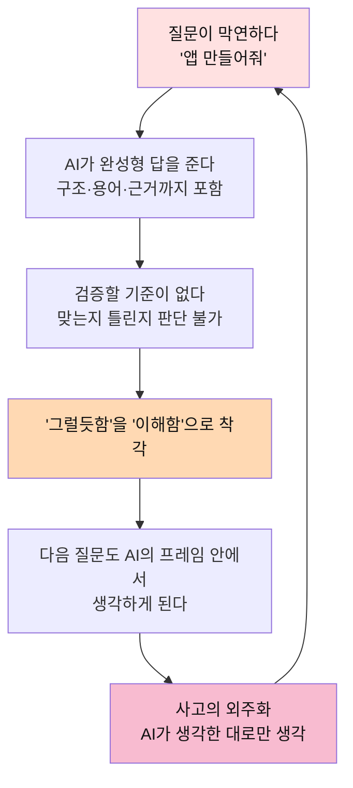

> **의존의 본질**: AI가 답을 대신 준 것이 아니라, **질문의 프레임을 대신 정해준 것**이다.
> 그래서 처방은 "AI를 덜 써라"가 아니라 **"쓴 다음 반드시 자기 프롬프트로 되돌아와라"** 다.

### 이 문서가 뒤집는 3가지 전제

| 흔한 전제 | 무너지는 이유 | 이 설계서의 전환 |
|---|---|---|
| "AI 활용 능력을 가르치자" | 활용은 1주면 배운다. 희소성이 없다 | **AI를 쓴 뒤 자기 사고를 복기하는 능력**을 가르친다 |
| "결과물이 좋으면 잘한 것" | 결과물은 AI가 만든다. 변별력 0 | **질문의 질과 설명 가능성**으로 평가한다 |
| "AI 사용을 금지/허용으로 나눈다" | 이분법은 현실에서 무너진다 | **설명할 수 있는 만큼만 사용 인정**(조건부 허용) |

---

## 1. 근거가 된 현장 — 특성화고의 '화이트보드 검문'

특성화고 메이커·인공지능 계열에서는 이미 이렇게 운영한다고 한다.

> AI로 프로젝트를 만들어 와도 상관없다.
> 대신 **그 자리에서 손으로 순서도를 그리고**, **핵심이 어디인지 짚고**, **무엇을 어떻게 개선했는지** 설명해야 한다.
> 이게 인정되어야 "AI를 썼다"가 인정된다.

이 관행에는 교육적으로 강력한 원리 3개가 들어 있다.

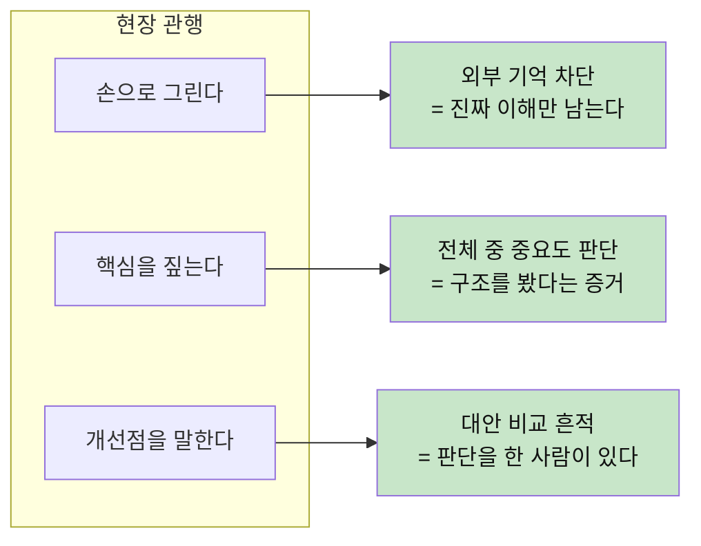

| 검문 항목 | 무엇을 측정하나 | AI가 대신 못 하는 이유 |
|---|---|---|
| **손 순서도 3분** | 구조의 내면화 | 화면을 못 보는 상태에서 나오는 건 이해뿐 |
| **핵심 1지점 지목** | 중요도 판단력 | 전부 중요하다고 답하면 아무것도 모르는 것 |
| **개선한 곳 + 이유** | 대안 비교 경험 | "왜 그 대안을 버렸는가"는 본인만 안다 |
| **실패 예측** | 시스템 감각 | 안 돌아가는 조건을 아는 사람이 진짜 만든 사람 |

> **이 문서의 핵심 착안**: 이 검문을 **사람이 가끔 하는 시험**이 아니라,
> **AI 도구 안에 상시로 내장된 루프**로 만든다.

---

## 2. 설계 원칙 4가지

### 원칙 ① 프롬프트는 대화 기록이 아니라 **학습 자료**다
지금은 대화창을 닫으면 프롬프트가 사라진다. RQ 엔진에서는 프롬프트가 **분석 대상 데이터**로 남는다.
"내가 이번 주에 던진 질문 17개"는 **내 사고의 스캔 사진**이다.

### 원칙 ② AI는 **답을 주는 쪽**이 아니라 **되묻는 쪽**에 배치한다
같은 모델이라도 배치가 다르면 다른 도구다.

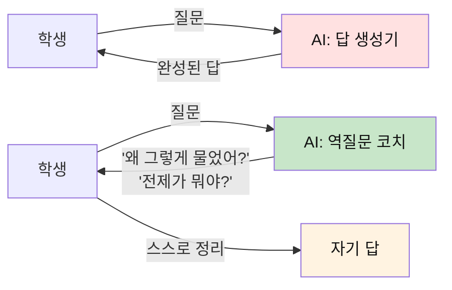

### 원칙 ③ **손이 증명한다** (Hand Proof)
화면·코드·AI를 모두 닫고, 종이와 펜만으로 3분. 여기서 나오는 것만이 내 것이다.

### 원칙 ④ 단위는 프롬프트가 아니라 **프로세스**다
앞으로의 일은 AI와 대화하며 프로세스를 만들어 가는 것이다. 프롬프트 하나를 잘 쓰는 것은 출발점일 뿐이고,
도구는 대화 전체에서 **반복 가능한 절차**를 뽑아낸다. 그 절차를 가진 사람만이 나중에 **에이전트를 설계**할 수 있다(§8, §9).

---

## 3. 전체 루프 — 6단계 성장 사이클

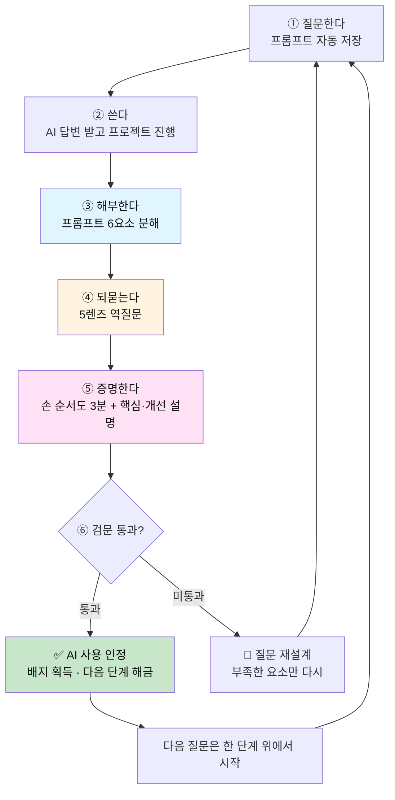

| 단계 | 학생이 하는 일 | AI가 하는 일 | AI가 **하면 안 되는** 일 |
|---|---|---|---|
| ① 질문 | 프롬프트 입력 | 그대로 저장 | 질문을 미리 고쳐주기 |
| ② 사용 | 답을 받아 프로젝트 진행 | 평소처럼 답변 | — |
| ③ 해부·분석 | 6요소 체크 → 직접 개선 → 염두 확인 | 분석 리포트 · 염두 역추정(§5) | 개선안을 **먼저** 보여주기 |
| ④ 역질문 | 답을 직접 작성 | 렌즈별 질문 **제시만** | 그 질문의 답까지 주기 |
| ⑤ 손증명 | 종이에 그리고 촬영 | 대조·간극 지적 | 순서도 대신 그려주기 |
| ⑥ 검문 | 부족분 재도전 | 통과/보류 판정 + 근거 | 그냥 통과시켜 주기 |

---

## 4. 프롬프트 해부학 — 6요소 (왜·맥·제·기·검·버)

모든 프롬프트는 이 6칸으로 분해된다. **빈칸이 곧 사고의 구멍**이다.

| # | 요소 | 질문 | 빈칸일 때 벌어지는 일 |
|---|---|---|---|
| 1 | **왜** (의도) | 나는 왜 지금 이걸 묻는가 | 답을 받아도 쓸 데가 없다 |
| 2 | **맥** (맥락) | AI가 모르는 내 상황을 줬는가 | 일반론만 돌아온다 |
| 3 | **제** (제약) | 조건·한계를 명시했는가 | 현실에서 못 쓰는 답이 온다 |
| 4 | **기** (기준) | '좋은 답'의 기준을 정했는가 | 그럴듯함 = 정답으로 착각 |
| 5 | **검** (검증) | 이 답이 틀렸는지 어떻게 확인하나 | 검증 불가 → 맹신 |
| 6 | **버** (폐기) | 받은 답 중 무엇을 버렸는가 | 통째로 복붙 = 판단 없음 |

### 해부 예시

```text
❌ Lv.1  "아두이노로 스마트 화분 코드 짜줘"
   왜 ⬜  맥 ⬜  제 ⬜  기 ⬜  검 ⬜  버 ⬜   → 0/6  (복붙 대기 상태)

⚠️ Lv.3  "아두이노 우노랑 토양수분센서로 스마트 화분 만드는 중인데,
          물 주는 기준을 어떻게 잡을지 모르겠어. 상추 기준으로 알려줘."
   왜 ✅  맥 ✅  제 ⚠️  기 ⬜  검 ⬜  버 ⬜   → 2.5/6

✅ Lv.5  "아두이노 우노 + 정전용량식 토양수분센서로 상추 화분 자동급수를 만든다.
          제약: 펌프는 5V, 수업시간 2시간 안에 시연, 부품 추가 구매 불가.
          기준: '좋은 답'은 센서값이 흔들려도 펌프가 깜빡이지 않는 것.
          검증: 물을 붓고 5분간 로그를 찍어 펌프 ON 횟수를 세겠다.
          지금 내 가설은 '임계값 1개면 충분하다'인데, 이게 틀리는 조건을 먼저 말해줘."
   왜 ✅  맥 ✅  제 ✅  기 ✅  검 ✅  버 ✅   → 6/6  (AI를 스파링 상대로 씀)
```

> **관찰 포인트**: Lv.5는 답을 요구하지 않는다. **자기 가설이 틀리는 조건**을 요구한다.
> 이것이 "AI가 생각한 대로 생각하기"에서 빠져나오는 결정적 한 수다.

---

## 5. 프롬프트 분석 리포트 — 분석 → 개선 → 염두 복원

**이 도구의 중심 화면.** 프롬프트 하나를 넣으면 세 장의 패널이 차례로 열린다.

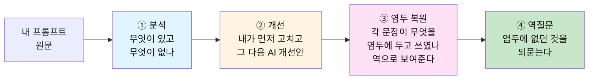

### 5.1 ① 분석 — 4개 층으로 읽는다

| 층 | 무엇을 보나 | 리포트에 나오는 말 |
|---|---|---|
| **구조** | 6요소(왜·맥·제·기·검·버) 충족 여부 | "기준·검증이 비었어. 답이 와도 맞는지 판단할 수 없어." |
| **유형** | 요청형("해줘") · 탐색형("뭐가 있어?") · 검증형("이게 맞아?") · 반증형("이게 틀리는 조건은?") | "이번 주 질문의 82%가 요청형이야." |
| **숨은 가정** | 쓰지 않았지만 전제한 것 | "'임계값은 하나면 된다'를 가정했어. 확인한 적 있어?" |
| **위임 범위** | AI에게 넘긴 것: 정보 / 구현 / **판단** | "⚠️ '뭐가 제일 좋아?' — 판단을 통째로 넘겼어." |

> **유형 분포가 곧 사고 습관이다.** 요청형만 쓰는 학생은 AI의 프레임 안에 산다.
> 반증형이 늘어나는 것이 이 도구가 추적하는 1순위 성장 신호다.

### 5.2 ② 개선 — 순서가 생명이다

```text
1단  내 개선     분석을 보고 학생이 직접 고쳐 쓴다        (AI 개선안은 아직 잠김 🔒)
2단  AI 개선안   같은 프롬프트를 AI가 고친 버전이 열린다   (문장마다 주석 포함)
3단  나란히 비교  내 개선 vs AI 개선 — 차이나는 문장만 하이라이트
```

> AI 개선안을 **먼저** 보여주면 그것도 복붙이 된다. 반드시 내 개선이 먼저다.

### 5.3 ③ 염두 복원 (Intent Map) — 역으로 보여준다

개선된 프롬프트를 **결과**로 주지 않는다. 각 문장이 **무엇을 염두에 두고** 쓰였는지를 역으로 펼쳐 보여준다.
좋은 프롬프트를 베끼게 하는 게 아니라, **좋은 프롬프트를 쓴 사람의 머릿속**을 보여주는 것이다.

```text
개선된 프롬프트                                        ← 무엇을 염두에 두었나
──────────────────────────────────────────────────────────────────────────
"상추 화분 자동급수를 만든다."                          ← [목적]  결과물이 아니라 목표부터 말한다
"아두이노 우노 + 정전용량식 센서."                      ← [맥락]  AI가 모르는 내 장비. 없으면 일반론이 온다
"제약: 5V 펌프 · 2시간 · 추가 구매 불가."               ← [제약]  현실에서 못 쓰는 답을 미리 차단한다
"좋은 답 = 센서가 흔들려도 펌프가 깜빡이지 않는 것."     ← [기준]  그럴듯함과 정답을 가르는 잣대
"5분 로그로 펌프 ON 횟수를 세겠다."                     ← [검증]  답을 믿지 않고 확인할 방법
"내 가설이 틀리는 조건을 먼저 말해줘."                   ← [반증]  판단은 내가 한다. AI는 스파링 상대
```

학생의 **원문**에도 같은 작업을 역방향으로 한다. 도구가 염두를 역추정하고, 학생이 확인한다.

```text
네 원문: "아두이노로 스마트 화분 코드 짜줘"

  도구의 역추정                              학생의 확인
  ─────────────────────────────────────────────────────
  "동작하는 코드가 목표였다"                  [맞다]
  "어떤 센서든 상관없다고 생각했다"            [아니다 — 그냥 안 썼다]
  "'잘 되는 화분'의 기준은 생각한 적 없다"     [몰랐다] ← 💎
```

> **[몰랐다]가 가장 값진 답이다.** 염두에 없었다는 걸 아는 순간이 시야가 넓어지는 순간이고,
> [몰랐다]로 표시된 항목이 그대로 **④ 역질문의 재료**가 된다.

---

## 6. 역질문 엔진 — 5개 렌즈

프롬프트를 해부한 뒤, 도구는 **답을 주지 않고 렌즈별로 되묻는다.**
각 렌즈는 3층 깊이로 파고든다: **L1 표면 → L2 구조 → L3 전제**.

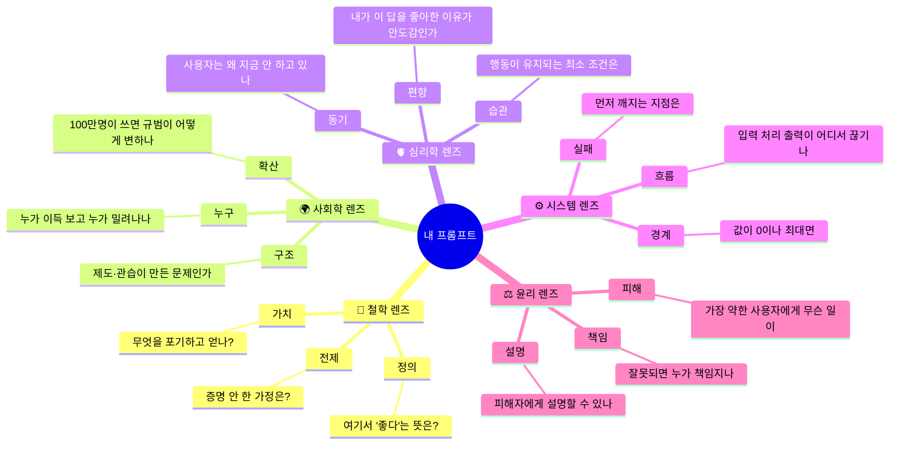

### 렌즈별 실제 질문 카드

| 렌즈 | L1 — 표면 | L2 — 구조 | L3 — 전제 |
|---|---|---|---|
| 🧭 **철학** | "너는 이 문제에서 무엇을 '문제'라고 불렀어?" | "그 정의를 바꾸면 해법이 어떻게 달라져?" | "네가 당연하다고 둔 것 중, 증명한 건 몇 개야?" |
| 🌍 **사회학** | "이걸 누가 쓰게 될까?" | "이 문제는 개인 탓이야, 구조 탓이야? 근거는?" | "이게 널리 퍼지면 사람들의 '정상'이 어떻게 바뀌어?" |
| 🫀 **심리학** | "그 사람은 지금 왜 이 행동을 안 하고 있을까?" | "의지 문제야, 설계 문제야?" | "네가 이 답을 마음에 들어한 게, 맞아서야 편해서야?" |
| ⚙️ **시스템** | "전체 흐름을 3칸으로 말해봐" | "가장 먼저 고장 날 곳은 어디야?" | "이 구조 말고 아예 다른 구조는 왜 안 돼?" |
| ⚖️ **윤리** | "이 기능으로 손해 보는 사람은?" | "그 손해를 줄일 설계가 있어?" | "그 사람 앞에서 이 결정을 설명할 수 있어?" |

### 매 세션 반드시 묻는 고정 4문항 (Core 4)

```text
1. 나는 왜 이 질문을 했는가?            (의도 복원)
2. 이 답에서 내가 새로 배운 것은 무엇인가?  (획득 확인)
3. 이 답에서 내가 버린 것과 그 이유는?     (판단 증거)
4. 지금 떠오른, 더 깊은 질문 하나는?       (다음 사이클 연료)
```

> 4번의 답이 **다음 프롬프트의 초안**이 된다. 루프가 닫히는 지점이다.

---

## 7. 손증명 프로토콜 (Hand Proof) — 도구의 심장

### 진행 방식

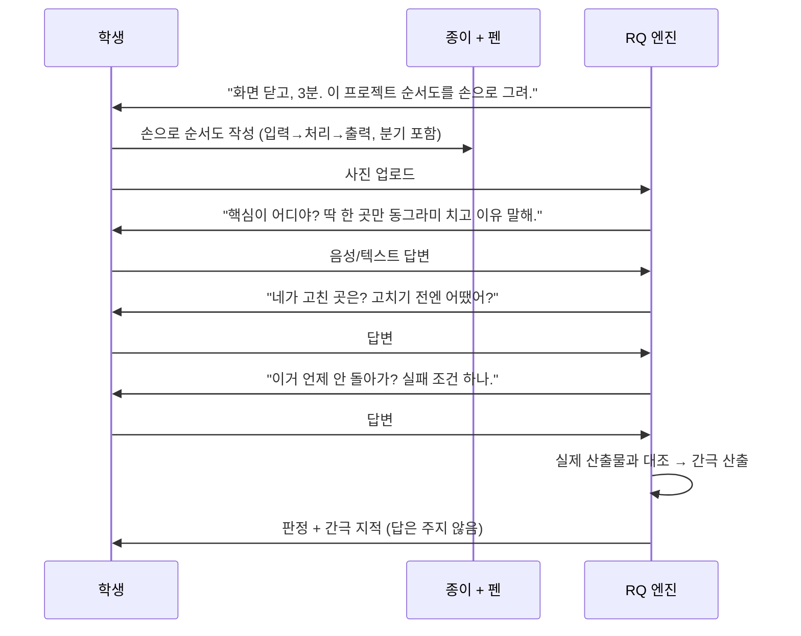

### 채점 루브릭 (각 0~2점, **7점 이상 통과**)

| 항목 | 0점 | 1점 | 2점 |
|---|---|---|---|
| **순서도 정확성** | 그리지 못함 | 흐름은 있으나 분기/예외 누락 | 입력·처리·출력·분기가 실제 동작과 일치 |
| **핵심 지목** | "전부 중요해요" | 한 곳을 짚지만 이유가 약함 | 한 곳 + 없으면 무너지는 이유 설명 |
| **개선 서술** | 없음 / "AI가 해줬어요" | 고친 사실만 말함 | 고치기 전·후와 **버린 대안**까지 설명 |
| **실패 예측** | 모름 | 막연한 오류 언급 | 구체적 입력 조건 + 깨지는 지점 지목 |
| **타인 설명** | 용어를 못 읽음 | 읽지만 뜻은 모름 | 처음 보는 사람에게 1분 설명 가능 |

> **검문 통과 = AI 사용 인정.** 미통과 시 결과물을 버리라는 뜻이 아니라,
> **통과할 때까지 그 부분을 다시 질문하라**는 뜻이다. 벌점이 아니라 재도전 신호다.

### 손으로 그린 것과 실제의 간극 리포트

```text
📄 간극 리포트 — 스마트 화분 v2
  ✅ 일치      : 센서 읽기 → 임계값 비교 → 펌프 제어
  ⚠️ 누락(3)   : 센서 오류값 처리 / 펌프 최대 동작시간 제한 / 부팅 시 초기화
  ❓ 질문      : "센서가 빠지면 값이 0으로 읽혀. 네 순서도에선 그때 펌프가 어떻게 돼?"
  🎯 다음 질문 : 위 질문을 네 언어로 다시 써서 AI에게 물어봐.
```

---

## 8. 대화에서 프로세스로 — 프롬프트 하나가 아니라 흐름이 단위다

앞으로의 일은 **생성형 AI와 대화하면서 프로세스를 만들어 가는 것**이다.
그래서 이 도구의 분석 단위는 프롬프트 한 개에서 끝나지 않는다. **한 프로젝트의 대화 전체**를 프로세스로 추출한다.

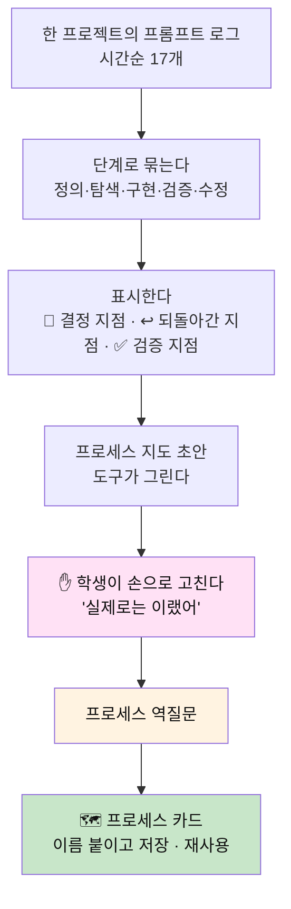

### 프로세스 수준의 역질문

| 관점 | 역질문 | 흔히 드러나는 것 |
|---|---|---|
| **순서** | "왜 이 순서였어? 2번과 3번을 바꾸면?" | 순서에 이유가 없었다 |
| **누락** | "건너뛴 단계는 뭐야?" | 대개 **문제 정의**와 **검증**이 빠져 있다 |
| **회귀** | "어디서 되돌아갔어? 원인이 뭐였어?" | 기준 없이 만들다 되돌아간 패턴 |
| **결정** | "이 분기에서 결정한 건 너야, AI야?" | 중요한 결정을 AI가 하고 있었다 |
| **재사용** | "다음 프로젝트에도 통하는 단계는? 이번만의 단계는?" | 나만의 방법론의 뼈대 |

### 결정 소유권 — 누가 결정했나

프로세스 지도의 모든 결정 노드에 소유자를 표시한다. **🤖가 결정한 노드는 빨갛게** 뜬다.

```text
🗺 프로세스 카드 — "센서 프로젝트 만들기" v2

  1. 문제를 한 줄로 정의한다              🙋 나
  2. '좋은 결과'의 기준을 먼저 정한다      🙋 나
  3. 최소 동작 버전을 만든다              🤖 구현 · 🙋 결정
  4. 깨지는 조건 3개를 요구한다           🙋 질문 → 🤖 반례
  5. 로그로 검증한다                     🙋 나
  6. 손 순서도로 복기한다                 🙋 나

  ↩️ 되돌아간 기록 : 3 → 1  (기준 없이 만들다가 문제를 재정의함)
  ✋ 손증명        : 2회 통과
  🔁 재사용        : 프로젝트 2건에 적용
```

> 프롬프트 분석이 **한 번의 질문**을 복기하는 것이라면, 프로세스 카드는 **일하는 방식**을 복기하는 것이다.
> 학생은 여기서 처음으로 "나는 이렇게 일하는 사람"이라는 자기 방법론을 갖게 된다.

---

## 9. 프로세스에서 에이전트로 — 설계의 사다리

프로세스를 가진 사람만 에이전트를 설계할 수 있다.
에이전트 설계는 새로운 기술이 아니라 **자기 프로세스를 남이(AI가) 수행할 수 있게 명세하는 일**이기 때문이다.

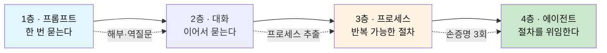

> **위임의 원칙**: **손으로 세 번 돌려본 프로세스만 에이전트에 위임한다.**
> 직접 해보지 않은 절차를 위임하면, 에이전트가 틀려도 알아챌 수 없다.

### 에이전트 설계서 — 프로세스 카드에서 골격이 나온다

| 설계 항목 | 프로세스 카드에서 가져오는 것 | 도구의 역질문 |
|---|---|---|
| **역할** | 카드의 이름과 목적 | "이 에이전트가 **하지 않는** 일은 뭐야?" |
| **입력** | 1단계에서 내가 매번 주던 정보 | "이게 빠지면 에이전트는 어떻게 해야 해?" |
| **단계** | 카드의 단계 목록 | "네가 직접 할 때 무의식적으로 하던 단계는 없어?" |
| **도구** | 각 단계에서 쓴 것(검색·코드 실행·센서 로그) | "이 도구가 실패하면?" |
| **판단 기준** | 2단계의 '좋은 결과' 기준 | "이 기준을 **글로** 쓸 수 있어? 못 쓰면 아직 위임 못 해." |
| **멈춤 조건** | 검증 단계의 통과 조건 | "언제 멈춰? 끝없이 돌면?" |
| **사람 확인 지점** | 🙋 결정 노드 | "이 중 어떤 결정은 끝까지 네가 해야 해? 왜?" |
| **실패 시 행동** | ↩️ 되돌아간 기록 | "에이전트가 틀렸다는 걸 너는 어떻게 알아채?" |

### 위임 가능 판정

```text
🙋 → 🤖 로 넘겨도 되는 판단   : 기준을 글로 쓸 수 있고, 결과를 내가 검증할 수 있는 것
끝까지 🙋 로 남기는 판단      : 문제 정의 · 가치 선택 · 기준 자체를 정하는 일
```

### 에이전트 검문 (Hand Proof — 4층 버전)

```text
□ 에이전트의 동작 순서도를 손으로 그린다 (입력 → 단계 → 멈춤)
□ 사람 확인 지점에 동그라미. 왜 거기서 사람이 필요한가?
□ 에이전트가 조용히 틀리는 경우 하나. 그걸 어떻게 발견하나?
□ 이 에이전트 없이 손으로 하면 몇 단계인가? (직접 해본 적 있나?)
```

> 1층의 검문이 "네 코드를 설명해 봐"였다면, 4층의 검문은 **"네 에이전트가 틀렸을 때를 설명해 봐"** 다.
> 층이 올라가도 원칙은 같다. **설명할 수 있는 만큼만 위임한다.**

---

## 10. AI의 3가지 모드 — 같이 만들고 같이 크는 짝

"함께 프로젝트를 만들며 함께 성장하는 도구"의 핵심은 **AI가 언제 어떤 역할을 하느냐**다.

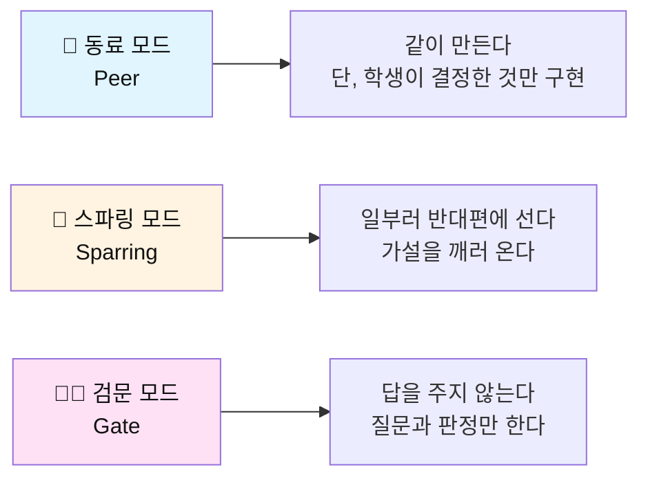

| 모드 | 사용 시점 | 대표 발화 |
|---|---|---|
| 🤝 **동료** | 만드는 중 | "네가 정한 기준이 A니까 그대로 구현할게. B는 네가 버린 거 맞지?" |
| 🥊 **스파링** | 결정 직전 | "그 가설이 틀리는 경우 3가지를 대볼게. 반박해봐." |
| 🧑‍⚖️ **검문** | 제출 직전 | "화면 닫아. 3분 줄게. 손으로 그려." |

### AI 행동 규약 (Guardrails)

```text
✅ 한다
  - 빠진 요소를 지적한다 ("기준이 비어 있어")
  - 렌즈별 질문을 제시한다
  - 학생의 답과 실제 산출물 사이 간극을 짚는다
  - 학생이 버린 대안을 기록해준다

🚫 안 한다
  - 역질문의 답까지 대신 써준다
  - 손 순서도를 대신 그린다
  - "잘했어요"로 넘어간다 (근거 없는 통과 금지)
  - 학생이 정하지 않은 설계 결정을 먼저 한다
```

> **주의**: 역질문마저 AI가 대신 답하면, 의존의 층위만 한 칸 올라간 것이다.
> 그래서 ④단계 답변 입력란에는 **AI 답변 붙여넣기 감지**를 둔다(§17 위험 관리).

---

## 11. 성장 레벨과 배지

### 레벨 — 7단계

```text
Lv.1  🧊 복붙러      질문 1줄 · 받은 답 그대로 사용
Lv.2  🔍 질문자      맥락과 제약을 쓴다
Lv.3  🪓 해부가      기준과 검증을 쓰고, 버린 것을 말한다
Lv.4  ✋ 설계자      손으로 그리고 핵심·실패를 짚는다
Lv.5  🥊 스파링러    자기 가설이 틀리는 조건을 먼저 요구한다
Lv.6  🗺 프로세스 설계자  대화에서 자기 절차를 뽑아 카드로 만들고 재사용한다
Lv.7  🤖 에이전트 설계자  손으로 돌려본 프로세스를 명세해 위임한다
```

### 배지 — 또렷한 한 줄 획득 조건

```text
🧩  전제 사냥꾼      증명 안 된 전제를 스스로 3개 찾아냄
✋  3분 순서도       화면 없이 손 순서도 통과 (첫 통과)
🔥  반증 생존        스파링 모드에서 가설이 살아남음
🪓  폐기 선언        AI 답변 중 버린 부분과 이유를 5회 기록
🔁  3연속 재질문     같은 주제를 3단계 깊이까지 파고듦
🗣  1분 설명가       처음 보는 사람에게 프로젝트 1분 설명 성공
🧭  렌즈 마스터      한 프로젝트에 5개 렌즈를 모두 적용
🕳  구멍 발견자      AI 답변의 오류를 스스로 검증해 잡아냄
💎  몰랐다 선언      염두 복원에서 [몰랐다]를 10회 인정함
🎯  반증형 전환      주간 질문 중 반증형이 30%를 넘음
🗺  첫 프로세스 카드  대화에서 뽑은 절차를 다른 프로젝트에 재사용
🙋  결정 회수        AI가 하던 결정 노드를 내 결정으로 되찾음
🤖  첫 위임          손증명 3회 통과한 프로세스로 에이전트 설계서 작성
```

> 배지는 **결과물**이 아니라 **사고 행위**에만 붙는다.
> "앱을 완성함"에는 배지가 없다. "왜 그 구조를 버렸는지 설명함"에 배지가 있다.

---

## 12. 화면 설계 (요약)

### 12.1 프롬프트 로그 — **1열 목록**, 또렷한 배지

```text
┌──────────────────────────────────────────────────────┐
│ 📅 오늘                                              │
├──────────────────────────────────────────────────────┤
│ 🪓 Lv.3  "상추 급수 임계값 어떻게 잡아?"              │
│          왜✅ 맥✅ 제✅ 기⬜ 검⬜ 버⬜   2.5/6        │
│          [ 해부하기 ]                                │
├──────────────────────────────────────────────────────┤
│ ✋ Lv.4  "센서 튀는 거 막는 방법"          ✅ 검문통과 │
│          왜✅ 맥✅ 제✅ 기✅ 검✅ 버✅   6/6          │
│          🧩 전제 사냥꾼  획득                         │
├──────────────────────────────────────────────────────┤
│ 🧊 Lv.1  "아두이노 코드 짜줘"              ⏳ 해부 대기│
│          0/6 · 오늘 안에 해부하지 않으면 잠김         │
└──────────────────────────────────────────────────────┘
```

| 화면 | 핵심 요소 |
|---|---|
| **프롬프트 로그** | 1열 목록 · 레벨 아이콘 · 6요소 체크칩 · 미해부 항목 상단 고정 |
| **해부실** | 내 프롬프트 원문 + 6칸 입력 · 빈칸만 빨갛게 |
| **분석 리포트** | 분석 4층 → 내 개선(먼저) → AI 개선안 주석 → **염두 복원** [맞다/아니다/몰랐다] |
| **역질문 룸** | 렌즈 5개 탭 · L1→L3 순차 해금 · 답변은 **직접 타이핑만** |
| **손증명 방** | 3분 타이머 · 사진 업로드 · 간극 리포트 |
| **프로세스 지도** | 프로젝트별 대화 흐름 · 결정 노드 소유자(🙋/🤖) · 프로세스 카드 1열 목록 |
| **에이전트 설계실** | 프로세스 카드 → 설계서 8항목 · 손증명 3회 미만이면 잠김 🔒 |
| **성장 지도** | 주차별 레벨 곡선 · 배지 벽 · "이번 주 가장 깊었던 질문" |

### 12.2 주간 리포트 (학생 본인용)

```text
이번 주 질문 17개
  평균 해부 점수  2.1 → 4.3  (+2.2)
  가장 자주 빈 칸  기준(12회) · 검증(11회)
  손증명 통과     3/4
  깊이 도달       L3(전제)까지 2회
  한 줄 평        "제약은 잘 쓰는데, '좋은 답의 기준'을 거의 안 정한다."
```

---

## 13. 데이터 모델 (초안)

```json
{
  "promptLog": {
    "id": "pl_2026_0921_003",
    "studentId": "stu_114",
    "projectId": "prj_smartpot",
    "raw": "상추 화분 자동급수 임계값 어떻게 잡아?",
    "createdAt": "2026-09-21T14:03:00+09:00",
    "anatomy": {
      "why": "임계값 기준을 몰라서",
      "context": "아두이노 우노 + 정전용량 센서, 상추",
      "constraint": "5V 펌프, 2시간 내 시연, 추가 구매 불가",
      "criteria": null,
      "verify": null,
      "discard": null,
      "score": 2.5
    },
    "reverseQuestions": [
      {
        "lens": "system",
        "depth": "L2",
        "question": "센서가 빠지면 값이 0으로 읽혀. 그때 펌프는?",
        "studentAnswer": "계속 켜진다. 최대 동작시간을 둬야 함.",
        "answeredBySelf": true
      }
    ],
    "handProof": {
      "imageUrl": "/uploads/hp_003.jpg",
      "durationSec": 172,
      "rubric": { "flow": 2, "core": 2, "improve": 1, "failure": 2, "explain": 2 },
      "total": 9,
      "passed": true,
      "gaps": ["센서 오류값 처리", "펌프 최대 동작시간", "부팅 초기화"]
    },
    "badgesEarned": ["premise_hunter", "hand_flow_3min"],
    "nextQuestionDraft": "센서 고장을 '값'만으로 구분할 수 있을까?"
  }
}
```

---

## 14. 실전 시나리오 — 중3 민준, 스마트 화분 (90분)

| 시각 | 장면 | 도구의 개입 |
|---|---|---|
| 00:00 | "아두이노로 스마트 화분 코드 짜줘" | 저장만 함. 답변 제공 |
| 00:08 | 코드 복붙, 동작함 | 🔒 **해부 게이트**: "이 프롬프트, 6칸 중 6칸이 비었어" |
| 00:12 | 6칸 채우다 '기준' 칸에서 멈춤 | "'잘 되는 화분'이 뭔지 네 말로 한 줄" |
| 00:18 | "물을 너무 자주 안 주는 것" 작성 | ⚙️ 시스템 렌즈 L1: "전체 흐름을 3칸으로" |
| 00:25 | 흐름 정리 → 🫀 심리 렌즈 L2 | "사람들은 왜 화분에 물을 안 줄까? 까먹어서야, 얼마나 줄지 몰라서야?" |
| 00:31 | "둘 다인데… 사실 얼마나인지 모름" | 🧭 철학 L3: "그럼 네 프로젝트는 '자동화'야 '판단 대행'이야?" |
| 00:40 | 문제 재정의: *자동급수 → 급수 판단 학습* | 프롬프트 초안 자동 생성 제안 (학생이 직접 수정) |
| 00:55 | 🥊 스파링: "임계값 1개면 충분" 가설 공격 | "비 온 날 습도 / 흙 종류 / 센서 위치 — 3개 반례" |
| 01:10 | ✋ **손증명 3분** — 화면 닫고 종이에 | 사진 업로드 → 간극 3개 지적 |
| 01:20 | 실패 조건 답변: "센서 빠지면 0 → 계속 켜짐" | 루브릭 9/10 **통과** |
| 01:28 | 🧩 전제 사냥꾼 · ✋ 3분 순서도 획득 | 다음 질문 초안이 로그 맨 위에 저장됨 |

> **90분 결과물**: 코드 한 벌(AI 생성) + **문제 재정의 1회 · 반례 3개 · 손 순서도 1장 · 다음 질문 1개**(전부 학생 것).
> 포트폴리오에 남는 건 후자다.

---

## 15. 교실 운영 — 주 1사이클

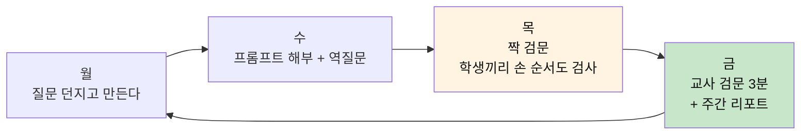

### 교사용 검문 카드 (인쇄용 · 3분)

```text
학생 ______  프로젝트 ______  날짜 ______

□ 1. (종이 주고) 순서도 그려보세요.            ___/2
□ 2. 핵심 한 곳에 동그라미. 왜 거기예요?        ___/2
□ 3. 고친 곳은? 고치기 전엔 어땠어요?           ___/2
□ 4. 이거 언제 안 돌아가요?                    ___/2
□ 5. (옆 학생에게) 1분 설명해 보세요.           ___/2
                                       합계 ___/10
7점 이상 → AI 사용 인정 ✅   /   7점 미만 → 재질문 후 재도전 🔁
교사 메모: _______________________________________
```

> **짝 검문(Peer Gate)이 특히 강력하다.** 친구에게 설명하지 못하면 모르는 것이고,
> 검문하는 쪽도 "무엇을 물어야 하는가"를 연습한다. 한 번에 두 명이 큰다.

---

## 16. 평가 루브릭 — 포트폴리오 기준

| 영역 | 배점 | 증거 |
|---|---|---|
| **질문의 성장** | 30 | 프롬프트 6요소 점수 추이 (첫 주 vs 마지막 주) |
| **역질문 깊이** | 20 | L3(전제)까지 도달한 횟수 · 사용한 렌즈 다양성 |
| **손증명** | 25 | 손 순서도 사진 · 검문 통과 기록 · 간극 축소 |
| **판단의 흔적** | 15 | 버린 대안과 이유 · AI 답변을 반박한 기록 |
| **결과물** | 10 | 동작하는 산출물 (배점이 가장 낮다) |

> **결과물 10점**이 이 루브릭의 선언이다. 만드는 건 AI도 한다. **판단은 사람만 한다.**

---

## 17. 위험과 방어책

| 위험 | 어떻게 무너지나 | 방어 설계 |
|---|---|---|
| **역질문까지 AI에 외주** | 역질문 답변란에 AI 답을 붙여넣음 | 붙여넣기 감지 + 손글씨/음성 답변 옵션 · 손증명은 오프라인 강제 |
| **검문이 벌점이 됨** | 통과 못 하면 창피 → 회피 | 미통과 = "재도전 신호". 점수 아닌 **레벨**로 표기 |
| **형식만 채우기** | 6칸을 기계적으로 채움 | 손증명 간극과 교차 검증 — 칸은 찼는데 설명 못 하면 미통과 |
| **교사 부담** | 전원 3분 검문은 시간이 없음 | 짝 검문 기본, 교사는 주 1회 샘플 검문 |
| **프라이버시** | 프롬프트에 개인정보가 남음 | 로그 본인 소유 · 교사는 **점수와 요약만** 조회 · 원문 공유는 학생 동의 |
| **저연령 부적합** | 초등에겐 6요소가 과함 | 초등은 **3칸(왜·맥·버)** + Core 4만 · 손증명은 그림으로 |

---

## 18. MVP 로드맵

| 단계 | 기간 | 범위 | 성공 기준 |
|---|---|---|---|
| **M0 — 로그** | 2주 | 프롬프트 붙여넣기 저장 + 6요소 수동 해부 | 학생 1명이 2주간 10건 기록 |
| **M0.5 — 분석** | 3주 | 분석 4층 리포트 · 3단 개선 · 염두 복원 | [몰랐다] 응답이 세션당 1회 이상 |
| **M1 — 역질문** | 4주 | 5렌즈 × L1~L3 질문 생성 · Core 4 고정 | 세션당 L2 이상 도달 50% |
| **M2 — 손증명** | 4주 | 3분 타이머 · 사진 업로드 · 간극 리포트 | 검문 통과율 60% 이상 |
| **M3 — 성장** | 3주 | 레벨·배지·주간 리포트 (1열 목록 UI) | 4주 연속 사용 유지 70% |
| **M3.5 — 프로세스** | 4주 | 대화→프로세스 지도 추출 · 결정 소유권 · 프로세스 카드 | 카드 1장을 2개 프로젝트에 재사용 |
| **M4 — 교실** | 4주 | 짝 검문 · 교사 대시보드 · 포트폴리오 내보내기 | 한 학급(20명) 파일럿 1학기 |
| **M5 — 에이전트** | 6주 | 프로세스 카드 → 에이전트 설계서 · 4층 검문 | 학생이 자기 프로세스로 에이전트 1개 설계·설명 |

### 지금 당장 도구 없이 시작하는 법

```text
1. 노트 한 권을 '프롬프트 노트'로 정한다.
2. AI에 물을 때마다 프롬프트를 그대로 베껴 쓴다.
3. 답을 받으면 Core 4를 손으로 쓴다.
   (왜 물었나 / 뭘 배웠나 / 뭘 버렸나 / 더 깊은 질문 하나)
4. 하루 끝에 화면을 닫고, 3분간 오늘 만든 것의 순서도를 손으로 그린다.
5. 그리다 막힌 지점 = 내일의 질문.
```

> 도구는 이 노트를 **자동화·시각화·게임화**한 것일 뿐이다.
> 노트가 안 돌아가면 앱도 안 돌아간다. **종이에서 먼저 검증한다.**

---

## 19. 한 페이지 요약

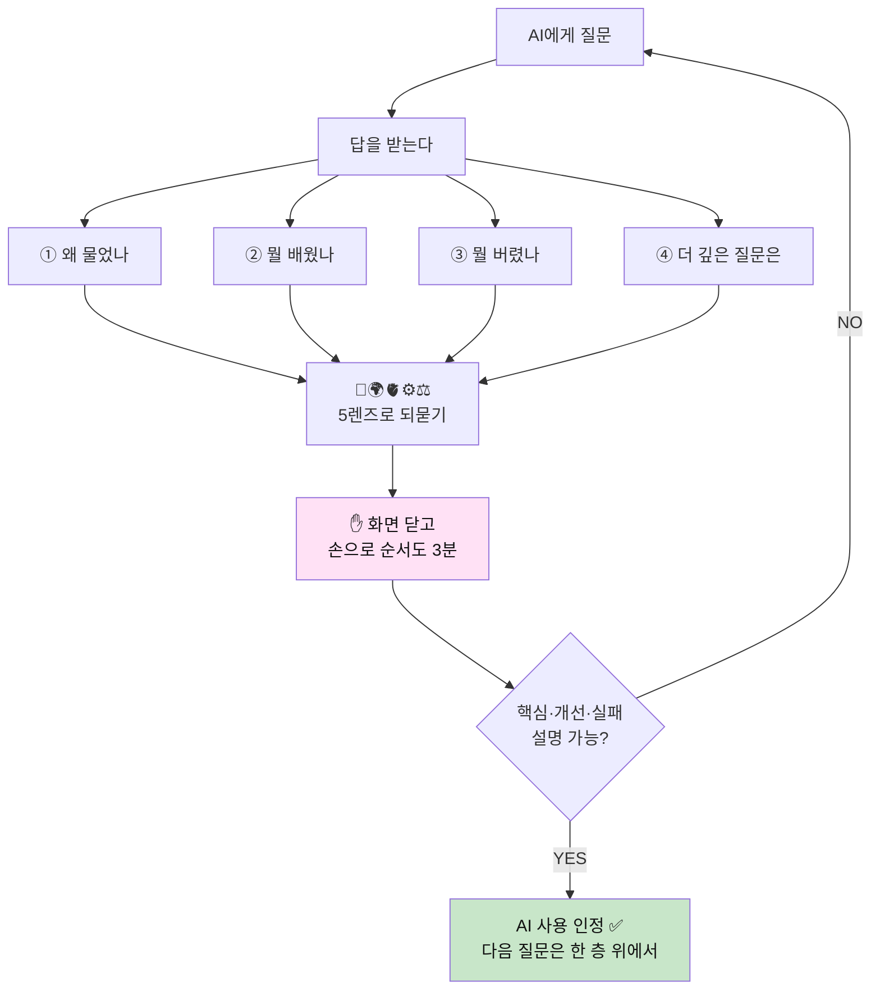

> **최종 원칙 세 줄**
> 1. **설명할 수 있는 만큼만 AI를 쓴다.**
> 2. **답이 아니라 질문을 평가한다.**
> 3. **손이 증명한다.**
> 4. **손으로 돌려본 프로세스만 에이전트에 위임한다.**
