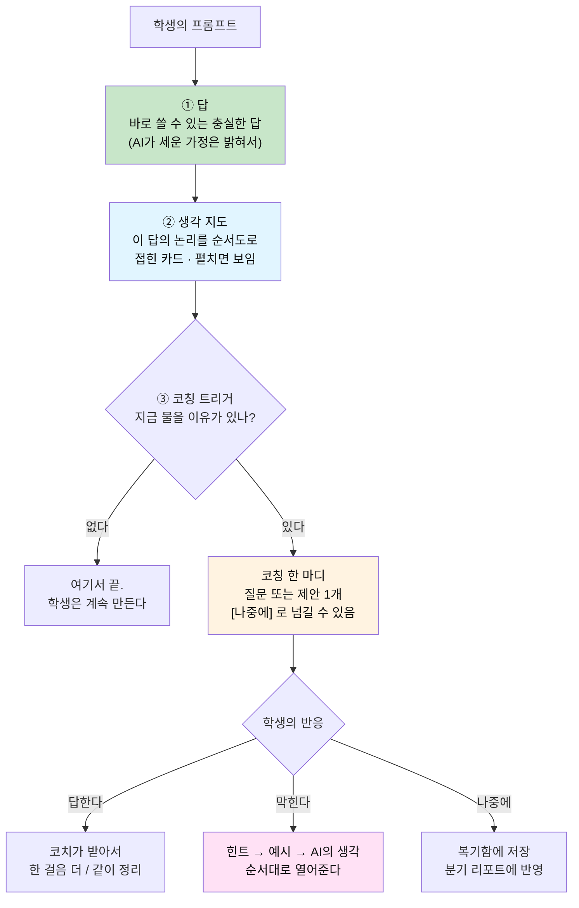
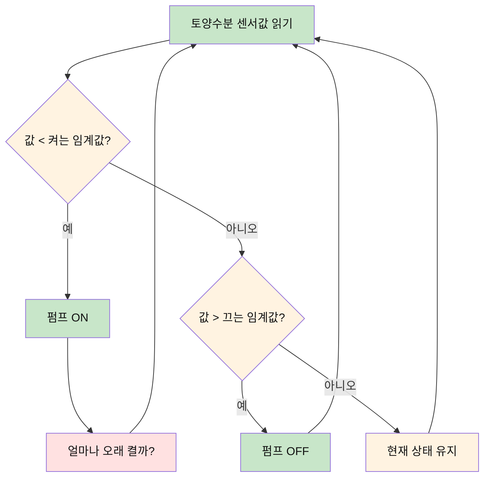
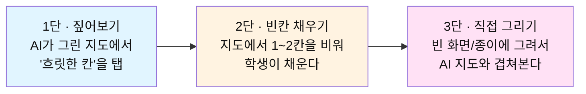
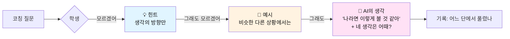
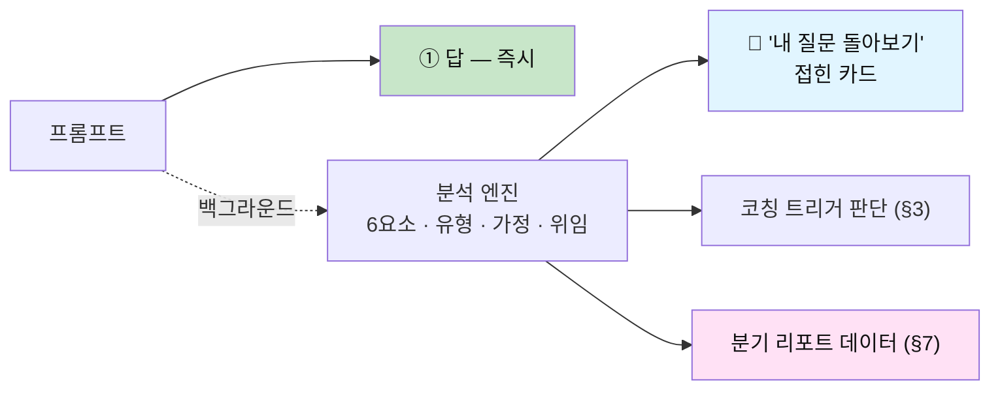
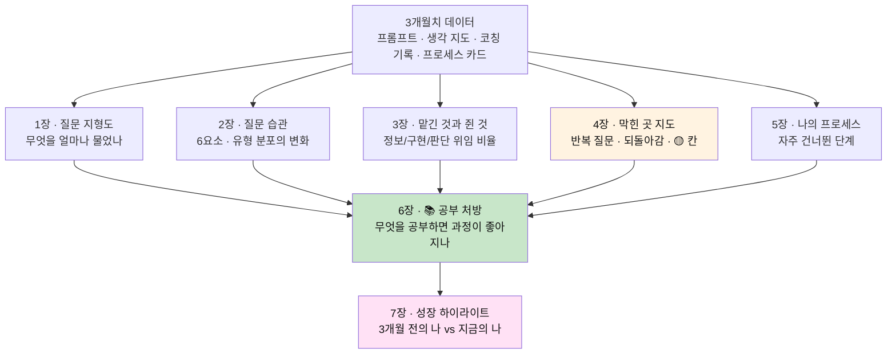
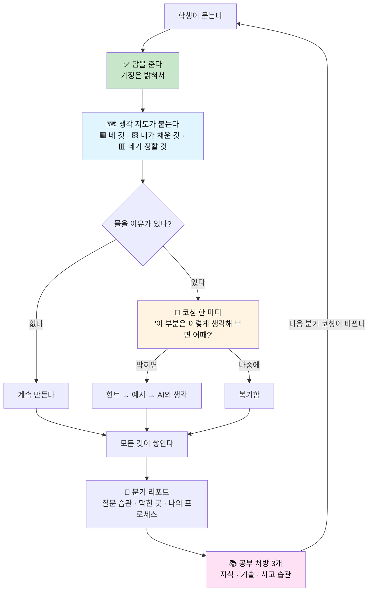

# 🧭 역질문 설계서 v2 — 답하고, 묻고, 코칭한다

> **한 문장**: 좋은 코치는 답을 숨기지 않는다. **답을 주고, 그 답을 학생이 자기 것으로 만들 때까지 옆에서 같이 그려본다.**
>
> **이전 버전**: [v1 — 손으로 증명하는 프롬프트](AI_역질문_설계서_손으로_증명하는_프롬프트.md)
> **성격**: 리딩클루와 별개의 **독립 도구** · 프로세스 기반
> **v2의 네 기둥**: ① **답을 준다** ② **필요할 때 더 깊이 묻는다** ③ **순서도로 이해를 같이 확인하며 코칭한다** ④ **분기마다 내 프롬프트를 분석해 공부 방향을 알려준다**
> **성장 경로**: 프롬프트 → 대화 → 프로세스 → 에이전트 설계 (v1과 동일)

---

## 0. v1에서 무엇이 바뀌는가

v1은 **"AI는 답을 주는 쪽이 아니라 되묻는 쪽"** 이라는 원칙 위에 서 있었다. 검문을 통과해야 AI 사용이 인정됐다.
이 설계에는 약점이 있다. **답을 안 주는 도구는 학생이 안 쓴다.** 옆 탭의 ChatGPT가 바로 답해주기 때문이다.
그리고 역질문만 받는 경험은 코칭이 아니라 **심문**처럼 느껴진다.

| 구분 | v1 — 검문관 | v2 — 코치 |
|---|---|---|
| **답** | 역질문에는 답을 주지 않는다 | **답을 먼저, 충실하게 준다** |
| **역질문** | 매번, 모든 렌즈로 | **필요한 순간에만**, 한 번에 하나 |
| **순서도** | 화면 닫고 3분, 통과/미통과 | **같이 그려보며** 어디가 흐릿한지 찾는다 |
| **말투** | "그려." "설명해 봐." | "이 부분은 이렇게 생각해 보면 어때?" |
| **분석** | 해부를 안 하면 잠김 🔒 | 답 뒤에 **접힌 카드**로 붙는다. 막지 않는다 |
| **막혔을 때** | 다시 질문해 와 | **힌트 → 예시 → AI의 생각** 순으로 열어준다 |
| **리포트** | 주간 점수 | **분기 심층 리포트 + 공부 처방** |
| **손증명** | 상시 게이트 | **이정표 체크인**(선택) · 교실 모드에서만 검문으로 전환 |

> **바뀌지 않는 것**: 프롬프트가 학습 자료라는 것, 6요소 해부, 염두 복원, 5렌즈, 프로세스 카드, 에이전트 사다리.
> **바뀌는 것**: 그 모든 것이 **답을 막는 관문**에서 **답에 덧붙는 코칭**으로 자리를 옮긴다.

---

## 1. 설계 원칙 (v2)

### 원칙 ① 답이 먼저다
학생은 문제를 풀러 왔다. 도구는 먼저 **쓸 수 있는 답**을 준다. 답의 품질이 일반 챗봇보다 떨어지면 나머지는 전부 무의미하다.

### 원칙 ② 묻는 것은 **이유가 있을 때만**
역질문은 비용이다. 흐름을 끊는다. 그래서 **트리거**가 있을 때만, **한 번에 하나만**, **건너뛸 수 있게** 묻는다(§3).

### 원칙 ③ 이해는 **순서도로** 확인한다
"이해했어?"라고 묻지 않는다. 답의 논리를 순서도로 펼쳐놓고 **어느 칸이 흐릿한지**를 같이 찾는다(§4).

### 원칙 ④ 평가하지 않고 **제안한다**
"틀렸어" 대신 "여기는 이렇게 볼 수도 있어". 코치는 판정하지 않고 **다음 한 걸음**을 보여준다(§5).

### 원칙 ⑤ 성장은 **긴 호흡으로** 보여준다
한 번의 프롬프트로는 습관이 안 보인다. **분기(3개월) 단위**로 쌓인 프롬프트를 분석해, 무엇을 더 공부하면 과정이 좋아지는지 알려준다(§7).

---

## 2. 응답의 구조 — 한 번의 답은 3겹이다

v2에서 도구의 모든 응답은 아래 3겹으로 나온다. **①은 항상, ②는 접힌 상태로 항상, ③은 조건부**다.



### 실제 화면 예시

```text
🙋 민준: 아두이노로 상추 화분 자동급수 만들려고 해. 물 주는 기준을 어떻게 잡아?

🤖 ① 답
   토양수분 센서값에 임계값을 두는 게 기본이야. 다만 임계값을 하나만 두면
   경계 근처에서 펌프가 켜졌다 꺼졌다를 반복해. 그래서 보통 두 개를 둬 —
   "이 아래면 켠다(예: 400)" / "이 위면 끈다(예: 550)".  (코드 예시 ▼)

   💬 내가 가정한 것: 정전용량식 센서, 값이 클수록 젖은 상태.
      네 센서가 반대라면 부등호를 뒤집어야 해.

   ▸ 🗺 생각 지도 보기        ▸ 🔎 내 질문 돌아보기

🧭 ③ 코칭 한 마디
   여기서 하나 같이 생각해 보고 싶은 게 있어.
   '잘 되는 화분'이 뭔지 아직 안 정한 것 같은데 —
   물을 자주 조금씩 주는 게 좋은 걸까, 가끔 충분히 주는 게 좋은 걸까?
   이게 정해지면 위 숫자 두 개가 달라져.
                                   [ 생각해 볼게 ]  [ 힌트 줘 ]  [ 나중에 ]
```

> **답을 인질로 잡지 않는다.** ①은 ③에 대답하든 말든 이미 주어졌다.
> 학생이 ③을 받는 이유는 의무가 아니라 **"이게 정해지면 내 숫자가 달라진다"** 는 쓸모 때문이다.

---

## 3. 언제 더 깊이 묻는가 — 코칭 트리거

매번 묻는 코치는 잔소리꾼이다. v2는 **아래 신호가 있을 때만** 역질문을 꺼낸다.

| # | 트리거 | 감지 방법 | 코치가 꺼내는 말 |
|---|---|---|---|
| T1 | **판단을 통째로 넘김** | "뭐가 제일 좋아?" "알아서 해줘" | "후보 셋을 줄게. 그런데 고르는 기준은 네가 정해보면 어때?" |
| T2 | **답에 큰 가정이 들어감** | AI가 답하면서 가정을 2개 이상 세움 | "내가 이렇게 가정하고 답했는데, 네 상황이랑 맞아?" |
| T3 | **같은 곳을 맴돈다** | 비슷한 질문 3회 반복 | "이 부분을 세 번째 묻고 있어. 어디가 걸리는지 같이 그려볼까?" |
| T4 | **되돌아갔다** | 앞 단계 결정을 뒤집는 프롬프트 | "방향을 바꿨네. 무엇 때문에 바꿨는지 한 줄 남겨둘까?" |
| T5 | **이정표 직전** | 제출·시연·발표 언급 | "발표 전에 전체 흐름을 한 번 같이 그려보자." |
| T6 | **복붙 후 오류** | 코드 받아간 직후 에러 메시지만 붙여넣음 | "고쳐줄게. 그 전에, 이 줄이 뭘 하는 줄인지 짐작해 볼래?" |
| T7 | **학생이 부른다** | [더 깊이] 버튼 · "왜?" | 5렌즈 중 맥락에 맞는 하나 |

### 질문 예산 — 코치의 절제

```text
· 한 응답에 코칭 질문은 최대 1개
· 한 세션(약 1시간)에 최대 3개 — T7(학생이 부름)은 예산에 안 들어감
· [나중에]를 두 번 연속 누르면 그 세션은 더 묻지 않는다
· 급할 때: [⚡ 지금은 답만] 모드 — 코칭은 전부 복기함으로 쌓인다
```

> 건너뛴 코칭은 사라지지 않는다. **복기함**에 모였다가, 학생이 여유 있을 때 또는 **분기 리포트**에서 다시 만난다.

---

## 4. 순서도 코칭 — 아는지 모르는지를 그림으로 본다

v1의 순서도는 **시험**이었다. v2의 순서도는 **같이 보는 지도**다.
모든 답에는 그 답의 논리를 펼친 **생각 지도**가 접힌 채 붙어 있다.

### 4.1 생각 지도 — 답의 뼈대를 3색으로



| 색 | 의미 | 코치의 태도 |
|---|---|---|
| 🟩 **네가 말한 것** | 프롬프트에 이미 있던 부분 | 그대로 둔다 |
| 🟨 **내가 채운 것** | AI가 가정하거나 추가한 부분 | "여긴 내가 넣었어. 왜 필요한지 궁금하면 눌러봐." |
| 🟥 **네가 정할 것** | 아직 아무도 결정하지 않은 부분 | "여긴 비어 있어. 같이 정해볼까?" |

> 🟨가 많은 지도 = **AI가 생각한 대로 가고 있는 프로젝트.** 학생이 한눈에 본다.
> 코치는 말하지 않아도 된다. 색이 말한다.

### 4.2 이해 확인 3단 — 받침대를 점점 뺀다



| 단 | 언제 | 학생이 하는 일 | 코치가 하는 일 |
|---|---|---|---|
| **1단 짚어보기** | 평소 (부담 0) | 흐릿한 칸을 누른다 | 그 칸만 **다시, 더 쉽게** 설명해 준다 |
| **2단 빈칸** | T3·T6 트리거 | 빈칸 1~2개를 채운다 | 맞으면 넘어가고, 틀리면 **"왜 그렇게 생각했어?"** 부터 |
| **3단 직접** | T5 이정표 · 교실 모드 | 손/화면으로 전체를 그린다 | 겹쳐 보고 **차이 나는 곳만** 같이 본다 |

### 4.3 칸마다 쌓이는 이해 상태

```text
🟢 설명 가능     빈칸을 채웠거나, 직접 그린 지도에 있었음
🟡 흐릿함        학생이 '흐릿하다'고 짚었거나, 빈칸을 틀림
⚪ 아직 안 봄     답은 받았지만 지도를 펼친 적 없음
```

이 상태가 개념별로 누적되어 **이해 지도**가 되고, 분기 리포트의 "공부 처방"(§7)의 핵심 재료가 된다.

### 4.4 차이를 말하는 방식 — 검문 vs 코칭

```text
❌ v1 검문   "누락 3건: 센서 오류값 처리 / 최대 동작시간 / 초기화. 미통과."

✅ v2 코칭   "흐름의 뼈대는 정확해 — 읽고, 비교하고, 펌프 제어. 👍
             내 지도엔 있는데 네 그림엔 없는 칸이 하나 있어: '센서가 빠졌을 때'.
             센서가 빠지면 값이 0으로 읽히거든. 그러면 네 그림에선 펌프가 어떻게 될까?
             (답은 바로 알려줄 수도 있어. 먼저 짐작해 볼래?)"
```

---

## 5. 코치의 말투와 '막혔을 때' 규칙

### 5.1 문장 바꾸기

| 상황 | 🚫 검문관 | ✅ 코치 |
|---|---|---|
| 기준이 없을 때 | "기준이 비어 있어." | "'잘 됐다'를 뭘로 알 수 있을지 같이 정해보면 어때?" |
| 판단을 넘겼을 때 | "판단을 통째로 넘겼어." | "후보는 내가 줄게. 고르는 건 네가 해보자 — 뭐가 제일 중요해?" |
| 이해 확인 | "설명해 봐." | "이 부분, 네 말로 하면 어떻게 돼? 틀려도 괜찮아." |
| 틀렸을 때 | "틀렸어. 다시." | "그렇게 생각한 이유가 있을 것 같아. 어디서 그렇게 봤어?" |
| 관점 제안 | "윤리 렌즈: 피해자는 누구인가?" | "이걸 쓰는 사람 중에 곤란해질 사람은 없을까? 나는 한 명 떠오르는데." |
| 잘했을 때 | "통과." | "방금 그 질문, 지난달의 너라면 안 했을 질문이야." |

### 5.2 막혔을 때 — 3단으로 열어준다

v1은 역질문의 답을 끝까지 주지 않았다. v2는 **단계적으로 연다.**



> **AI의 생각을 들은 것은 실패가 아니다.** 기록만 남긴다 — "스스로 / 힌트 / 예시 / AI 생각" 중 어디서 풀렸는지.
> 3개월 뒤 같은 유형의 질문이 **한 단 앞에서** 풀리면, 그게 성장이다.

### 5.3 5렌즈는 '관점 제안'으로

v1의 5렌즈(철학·사회학·심리학·시스템·윤리)와 L1→L3 깊이는 그대로 쓴다. 달라지는 건 **꺼내는 방식**이다.

```text
· 한 번에 렌즈 하나. 지금 대화 맥락에 가장 가까운 것만.
· 질문만 던지지 않는다. "나는 이렇게 보이는데, 너는?" — 코치도 자기 패를 깐다.
· L3(전제)까지 가는 건 학생이 [더 깊이]를 누를 때.
```

| 렌즈 | 코치의 제안형 문장 |
|---|---|
| 🧭 철학 | "'자동 급수'가 목표라고 했는데, 혹시 진짜 목표는 '식물을 안 죽이는 것' 아닐까? 그 둘은 좀 달라 보여." |
| 🌍 사회학 | "이걸 학교 전체 화분에 단다면, 물 주던 당번 친구들은 어떻게 될까?" |
| 🫀 심리학 | "사람들이 물을 안 주는 게 까먹어서일까, 얼마나 줄지 몰라서일까? 나는 후자 같기도 해." |
| ⚙️ 시스템 | "이 흐름에서 제일 먼저 고장 날 것 같은 칸은 어디야? 나는 센서 쪽이 걱정돼." |
| ⚖️ 윤리 | "이게 잘못 동작했을 때 제일 곤란해지는 사람은 누굴까?" |

---

## 6. 프롬프트 분석 — 답 뒤에 조용히 붙는다

v1 §4·§5의 **6요소 해부(왜·맥·제·기·검·버) · 분석 4층(구조·유형·숨은 가정·위임 범위) · 염두 복원**은 그대로 유지한다.
달라지는 건 **위치와 강제성**이다.



### '내 질문 돌아보기' 카드 (펼쳤을 때)

```text
🔎 방금 네 질문
   "아두이노로 상추 화분 자동급수 만들려고 해. 물 주는 기준을 어떻게 잡아?"

   있었던 것   왜 ✅   맥 ✅(아두이노·상추)
   없었던 것   제 ⬜   기 ⬜   검 ⬜
   질문 유형   탐색형

   💬 그래서 내 답이 이렇게 됐어
      · 센서 종류를 몰라서 → 정전용량식이라고 가정했어
      · '좋은 결과'의 기준이 없어서 → 일반적인 숫자(400/550)를 예로 들었어
      👉 이 두 가지를 알려주면 네 화분에 딱 맞는 답으로 바꿔줄 수 있어.

   ✏️ 이렇게 물었다면?  [ 내가 먼저 고쳐볼게 ]  [ 고친 버전 보기 ]
```

> **핵심 전환**: 빈칸은 **학생의 결점**으로 제시되지 않는다. **"그래서 내 답이 덜 맞춤형이 됐어"** 로 제시된다.
> 프롬프트를 잘 쓰는 이유가 점수가 아니라 **더 좋은 답을 받기 위해서**라는 걸 학생이 몸으로 안다.

- **개선**: v1의 "내 개선 먼저 → AI 개선안" 순서를 권장하되, **[고친 버전 보기]를 막지 않는다.** 대신 고친 버전에는 항상 **염두 주석**(각 문장이 무엇을 염두에 두었나)이 붙는다.
- **염두 복원**: [맞다/아니다/몰랐다] 확인은 복기함과 분기 리포트에서 몰아서 해도 된다.

---

## 7. 분기 리포트 — 내 프롬프트가 말해주는 '다음에 공부할 것'

**v2의 간판 기능.** 3개월치 프롬프트·생각 지도·코칭 기록을 통째로 분석해,
"잘했다/못했다"가 아니라 **"어느 부분을 더 공부하면 네 과정이 더 좋아지는가"** 를 알려준다.

### 7.1 리포트의 주기

| 주기 | 분량 | 목적 |
|---|---|---|
| **주간 한 줄** | 3줄 | 가볍게. "이번 주 가장 좋았던 질문" 1개 + 한 줄 코멘트 |
| **월간 스냅샷** | 1쪽 | 질문 유형 분포 · 자주 빈 칸 · 흐릿한 개념 Top 3 |
| **분기 심층 리포트** | 5~6쪽 | 아래 7개 장 · 공부 처방 · 다음 분기 목표 |

### 7.2 분기 리포트의 7개 장



| 장 | 무엇을 분석하나 | 학생이 얻는 것 |
|---|---|---|
| **1. 질문 지형도** | 주제별 프롬프트 수 · 프로젝트별 흐름 | "나는 3개월간 이런 것에 시간을 썼구나" |
| **2. 질문 습관** | 6요소 충족률 추이 · 요청/탐색/검증/반증형 비율 변화 | 자주 비는 칸 · 늘어난 질문 유형 |
| **3. 맡긴 것과 쥔 것** | 위임 범위(정보/구현/**판단**) 비율 · 생각 지도의 🟨 비중 | 내가 결정한 프로젝트였나, AI가 결정한 프로젝트였나 |
| **4. 막힌 곳 지도** | 같은 개념 반복 질문 · 에러 붙여넣기 패턴 · 🟡 칸 누적 · 힌트 단계 | **모르는데 모르는 줄 몰랐던 것**의 목록 |
| **5. 나의 프로세스** | 프로세스 카드들의 공통 패턴 · 건너뛴 단계 · 되돌아간 원인 | 내 일하는 방식의 강점과 구멍 |
| **6. 공부 처방** | 4·5장을 원인별로 분류 → 구체적 학습 행동 | **다음 분기에 공부할 것 3가지** |
| **7. 성장 하이라이트** | 가장 좋았던 질문 Top 3 · 같은 유형 질문의 전/후 비교 | 자라고 있다는 증거 |

### 7.3 공부 처방 — 구멍을 3종류로 나눈다

막힌 이유가 다르면 공부할 것도 다르다. 리포트는 막힌 곳을 **원인별로** 나눠 처방한다.

| 구멍의 종류 | 데이터에서 보이는 신호 | 처방의 형태 |
|---|---|---|
| 📚 **지식 구멍** — 개념을 모른다 | 같은 개념을 말만 바꿔 3회 이상 질문 · 해당 칸이 계속 🟡 | **개념 학습**: "'변수의 범위'를 30분만 따로 공부하면 디버깅 질문이 절반으로 줄 거야" + 자료·연습 문제 |
| 🛠 **기술 구멍** — 방법을 모른다 | 에러 메시지만 붙여넣기 · 검증(검) 칸이 늘 비어 있음 | **기술 연습**: "에러 메시지 읽는 법 — 다음엔 붙여넣기 전에 첫 줄을 네 말로 옮겨보자" |
| 🧭 **사고 습관 구멍** — 묻는 방식의 문제 | 기준(기) 칸 상습 공백 · 판단 위임 비율 높음 · 문제 정의 단계 건너뜀 | **습관 훈련**: "새 프로젝트 첫 질문 전에 '잘 됐다는 걸 뭘로 알지?'를 한 줄 쓰기" |

### 7.4 분기 리포트 예시 (발췌)

```text
📘 민준의 2026년 3분기 리포트  (7.1 ~ 9.30 · 프롬프트 214개 · 프로젝트 3개)

━━ 2장 · 질문 습관 ━━━━━━━━━━━━━━━━━━━━━━━━━━━━━━━━━━━━━━━
  질문 유형     요청형 71% → 48%   탐색형 22% → 29%   검증형 6% → 15%   반증형 1% → 8%
  6요소 충족    평균 2.1칸 → 3.8칸
  잘 쓰는 칸    맥락(91%) · 제약(74%)
  자주 빈 칸    기준(18%) · 검증(23%)

━━ 3장 · 맡긴 것과 쥔 것 ━━━━━━━━━━━━━━━━━━━━━━━━━━━━━━━━━━━
  판단 위임      34% → 19%   ("뭐가 좋아?" 형 질문이 줄었어)
  생각 지도 🟨   스마트화분 62% → 미세먼지 알리미 41%   ← 네가 정한 칸이 늘고 있어

━━ 4장 · 막힌 곳 지도 ━━━━━━━━━━━━━━━━━━━━━━━━━━━━━━━━━━━━━
  🔁 반복 질문   "millis()와 delay()" 관련 9회  ·  "배열 인덱스 오류" 6회
  🟡 흐릿한 칸   타이머/비동기 처리(7칸) · 센서 보정(4칸)
  📋 에러만 붙여넣기  23회 — 그중 17회가 같은 종류(자료형 불일치)

━━ 6장 · 📚 공부 처방 ━━━━━━━━━━━━━━━━━━━━━━━━━━━━━━━━━━━━━
  ① 📚 지식   '시간을 다루는 법(delay vs millis)'
       네 막힘의 약 30%가 여기서 나왔어. 프로젝트 3개 모두에서 반복됐고.
       → 40분짜리 개념 학습 1회 + LED 2개를 서로 다른 주기로 깜빡이는 연습 1개
       → 이걸 잡으면: 다음 프로젝트에서 "왜 멈춰?"류 질문이 크게 줄 거야.

  ② 🛠 기술   '에러 메시지 첫 줄 읽기'
       에러를 그대로 붙여넣은 23회 중 17회가 같은 종류였어.
       → 다음 분기 규칙: 붙여넣기 전에 첫 줄을 네 말로 한 줄 옮겨 적기.
       → 내가 도울게: 에러를 받으면 고쳐주기 전에 "첫 줄이 뭐라는 것 같아?"부터 물을게.

  ③ 🧭 습관   '기준 먼저 정하기'
       기준 칸이 18%만 채워졌어. 그래서 세 프로젝트 모두 중간에 방향을 한 번씩 되돌렸어.
       → 새 프로젝트 첫 질문에 "잘 됐다는 건 ___로 알 수 있다" 한 줄 넣기.

━━ 7장 · 성장 하이라이트 ━━━━━━━━━━━━━━━━━━━━━━━━━━━━━━━━━━━
  7월 3일의 너    "아두이노로 스마트 화분 코드 짜줘"
  9월 24일의 너   "미세먼지 센서값이 튀는데, 이동평균 5개로 잡았어. 이 방법이
                   안 통하는 상황이 있다면 먼저 알려줘. 확인은 선풍기로 해볼 거야."
  💬 석 달 전엔 답을 달라고 했고, 지금은 네 방법의 약점을 찾아달라고 해. 큰 차이야.

  다음 분기 목표 (네가 고쳐도 돼)
   □ 기준 칸 충족률 18% → 50%
   □ 'millis' 개념 🟡 → 🟢
   □ 프로세스 카드 1장을 새 프로젝트에 재사용
```

### 7.5 리포트의 원칙

```text
· 비교 대상은 언제나 '3개월 전의 나'. 다른 학생과 비교하지 않는다.
· 처방은 최대 3개. 더 많으면 아무것도 안 한다.
· 모든 처방에 근거 데이터("네 막힘의 30%")와 기대 효과("이걸 잡으면 ~")를 붙인다.
· 처방마다 "내가 도울게" — 다음 분기에 코치가 그 부분을 어떻게 도울지 약속한다.
· 목표는 학생이 수정·삭제할 수 있다. 리포트는 통지표가 아니라 작전 회의다.
· 교사·학부모 공유는 학생이 고른 요약본만.
```

> **처방 → 코칭의 순환**: 분기 처방은 다음 분기의 **코칭 트리거 설정**을 바꾼다.
> "기준 먼저 정하기"가 처방됐다면, 다음 분기엔 새 프로젝트 첫 질문에서 T1보다 **기준 코칭이 우선** 발동한다.

---

## 8. 프로세스와 에이전트 — v1을 잇되 코칭 방식으로

v1 §8(대화→프로세스 카드), §9(프로세스→에이전트 설계)는 그대로 가져온다. 코칭 방식만 맞춘다.

| v1 | v2 |
|---|---|
| 프로세스 지도를 도구가 그리고, 학생이 손으로 고친다 | 동일 + 코치가 **"여기서 방향을 바꿨더라. 잘 바꾼 것 같아 — 왜 바꿨는지 남겨둘까?"** 처럼 짚어준다 |
| 🤖 결정 노드는 빨갛게 경고 | 🟨로 표시하고 **"이 결정은 내가 했어. 다음엔 네가 해볼래?"** 제안 |
| 에이전트 설계는 손증명 3회 통과 시 해금 | 잠그지 않는다. 대신 **설계서의 각 항목에서 코치가 같이 채워준다** — 직접 해본 적 없는 단계엔 "이건 아직 손으로 안 해봤네. 한 번 해보고 위임하면 틀렸을 때 알아채기 쉬워." |
| 분기 리포트 없음 | **5장 '나의 프로세스'** 가 프로세스 카드들의 공통 패턴을 분석해 에이전트 설계 준비도를 알려준다 |

```text
📎 분기 리포트 5장 발췌 — 에이전트 준비도
   네 프로세스 카드 3장에서 공통으로 반복된 단계: 정의 → 최소 버전 → 반례 요구 → 로그 검증
   이 4단계는 이제 네 '방법'이야. 이 중 '로그 검증'은 기준을 글로 쓸 수 있으니 위임 후보야.
   '정의'는 매번 네가 직접 하는 게 좋아 보여 — 세 번 다 여기서 프로젝트 방향이 정해졌거든.
```

---

## 9. 모드 — 혼자 쓸 때와 교실에서 쓸 때

| 모드 | 기본값 | 순서도 | 손증명 |
|---|---|---|---|
| 🧑‍💻 **개인 모드** | 답 + 코칭(§2~§5) | 1단·2단 위주 | 이정표에서 **권유**만 |
| ⚡ **답만 모드** | 답만. 코칭은 복기함으로 | — | — |
| 🏫 **교실 모드** | 교사가 켠다 | 3단(직접 그리기) 포함 | v1의 **검문 카드·짝 검문** 사용 가능 (특성화고 방식) |

> 특성화고의 "손으로 그리고 설명해야 AI 사용 인정"은 **교실 모드의 선택 기능**으로 남긴다.
> 도구의 기본 성격은 코치다. 검문은 교사가 수업 설계상 필요할 때 켜는 것이다.

---

## 10. AI 행동 규약 (v2)

```text
✅ 한다
  - 질문에 먼저, 충실하게 답한다
  - 답하면서 세운 가정을 밝힌다 ("내가 가정한 것")
  - 모든 답에 생각 지도를 붙인다 (접힌 상태)
  - 물을 이유가 있을 때만, 한 번에 하나만 묻는다
  - 막히면 힌트 → 예시 → 내 생각 순으로 연다
  - 코치도 자기 생각을 말한다 ("나는 이렇게 보이는데, 너는?")
  - 성장은 '예전의 너'와 비교해서 말한다

🚫 안 한다
  - 답을 인질로 잡는다 (코칭에 답해야 답을 주는 것)
  - 매 응답마다 묻는다
  - 판정하는 말투 ("틀렸어", "미통과", "비어 있어")
  - 분석·해부를 강제하거나 기능을 잠근다
  - 다른 학생과 비교한다
  - 빈말 칭찬 ("잘했어요!") — 칭찬엔 항상 무엇이 좋았는지가 붙는다
```

---

## 11. 실전 시나리오 — 중3 민준, 같은 90분을 v2로

| 시각 | 민준 | 도구 (v2) |
|---|---|---|
| 00:00 | "아두이노로 스마트 화분 코드 짜줘" | **① 답**: 동작하는 코드 + "내가 가정한 것: 센서 종류, 핀 번호" · 생각 지도 접힘 · 코칭 없음(첫 질문엔 안 묻는다) |
| 00:08 | 업로드, 동작함. "오 된다" | — |
| 00:15 | "근데 펌프가 계속 켜졌다 꺼졌다 해" | **① 답**: 임계값 2개(히스테리시스) 설명 + 수정 코드 · **③ 코칭(T2)**: "숫자 두 개를 내가 임의로 넣었어. '잘 되는 화분'이 뭔지 정하면 같이 맞춰볼 수 있어." |
| 00:18 | [힌트 줘] | 💡 "상추는 흙이 계속 축축한 걸 좋아할까, 말랐다 젖었다 하는 걸 좋아할까?" |
| 00:24 | "찾아보니까 계속 축축한 게 좋대" → 기준 한 줄 작성 | "그럼 끄는 값을 좀 높이자." 수정 · 🟥 칸 하나가 🟩로 |
| 00:40 | 에러 메시지만 붙여넣음 (3번째) | **① 답**: 고친 코드 · **③ 코칭(T6)**: "고쳤어. 혹시 에러 첫 줄이 뭐라고 하는 것 같았어? 짐작만 해봐." |
| 00:42 | "뭔가 타입이 안 맞는다?" | "정확해. int에 글자를 넣으려 했던 거야. 다음엔 그 줄부터 보면 네가 먼저 찾을 수 있어." |
| 01:05 | "내일 발표야" | **③ 코칭(T5)**: "발표 전에 전체 흐름을 같이 그려볼까? 2칸만 비워둘게." (2단 빈칸) |
| 01:12 | 빈칸 2개 중 1개 틀림 | "여기는 '펌프 OFF'가 아니라 '현재 상태 유지'야. 왜 그런지는 아까 그 깜빡임 문제랑 같아 — 기억나?" → 🟡 기록 |
| 01:20 | [더 깊이] 누름 (T7) | 🌍 "이걸 학교 화분 전체에 달면, 물 당번 친구들은 뭘 하게 될까? 나는 좀 궁금해." |
| 01:28 | 발표 슬라이드에 "자동화가 없애는 것" 한 장 추가 | 복기함: 건너뛴 코칭 1건 저장 · 분기 리포트에 반영 |

> **v1과의 차이**: 민준은 한 번도 막히지 않았다. 답은 항상 즉시 나왔다.
> 그런데도 90분 뒤 민준에게는 **기준 한 줄 · 에러 읽기 경험 · 🟡 칸 1개(다음에 공부할 것) · 새 관점 1개**가 남았다.

---

## 12. 화면 설계 (요약)

| 화면 | 핵심 요소 |
|---|---|
| **대화** | 3겹 응답(답 / ▸생각 지도 / ▸내 질문 돌아보기) · 코칭 한 마디는 답 아래 구분된 말풍선 · [생각해 볼게][힌트 줘][나중에] |
| **생각 지도** | 🟩🟨🟥 3색 순서도 · 칸 탭 → 다시 설명 · 빈칸 모드 · 직접 그리기 겹쳐보기 |
| **복기함** | **1열 목록** · 건너뛴 코칭 · [몰랐다] 확인 대기 · 🟡 칸 — 여유 있을 때 하나씩 |
| **이해 지도** | 개념별 🟢🟡⚪ · 분기별 변화 |
| **프로세스 지도** | v1과 동일 + 코치 코멘트 |
| **분기 리포트** | 7개 장 스크롤 · 처방 3개는 또렷한 카드 · 목표 편집 · 공유용 요약 내보내기 |
| **성장 지도** | 레벨·배지(v1 §11 유지) · 배지 조건에 코칭 행동 추가 |

### 추가 배지 (v2)

```text
🗺  지도 탐험가      생각 지도를 20번 펼쳐봄
🟢  흐릿함 졸업      🟡 칸 5개를 🟢로 바꿈
💡  힌트 없이        지난 분기엔 힌트가 필요했던 유형을 스스로 풂
📚  처방 완료        분기 처방 1개를 끝까지 실행
🙋  내가 정할게      🟥 칸을 AI보다 먼저 채움 (10회)
```

---

## 13. 데이터 모델 — v1에 추가되는 것

```json
{
  "turn": {
    "id": "t_2026_0921_014",
    "promptLogId": "pl_2026_0921_003",
    "answer": { "text": "…", "assumptions": ["정전용량식 센서", "값이 클수록 젖음"] },
    "thinkingMap": {
      "nodes": [
        { "id": "n1", "label": "센서값 읽기", "owner": "student", "understanding": "green" },
        { "id": "n2", "label": "켜는 임계값 비교", "owner": "ai_assumed", "understanding": "yellow" },
        { "id": "n7", "label": "펌프 가동 시간", "owner": "undecided", "understanding": "none" }
      ],
      "opened": true,
      "checkMode": "fill_blank"
    },
    "coaching": {
      "trigger": "T2_big_assumption",
      "lens": null,
      "message": "'잘 되는 화분'이 뭔지 정하면 같이 맞춰볼 수 있어.",
      "studentAction": "hint",
      "resolvedAt": "hint",
      "deferred": false
    }
  },
  "quarterlyReport": {
    "studentId": "stu_114",
    "period": "2026-Q3",
    "promptCount": 214,
    "typeShift": { "request": [0.71, 0.48], "refute": [0.01, 0.08] },
    "delegation": { "judgment": [0.34, 0.19] },
    "stuckMap": [
      { "concept": "millis vs delay", "repeatCount": 9, "yellowNodes": 7, "gapType": "knowledge" }
    ],
    "prescriptions": [
      {
        "gapType": "knowledge",
        "title": "시간을 다루는 법",
        "evidence": "막힘의 약 30%",
        "action": "40분 개념 학습 + 연습 1개",
        "coachPromise": "관련 질문이 오면 생각 지도의 타이머 칸을 먼저 펼쳐 보여줄게",
        "status": "open"
      }
    ],
    "goals": [{ "text": "기준 칸 충족률 50%", "editableByStudent": true }]
  }
}
```

---

## 14. 성공 지표

| 지표 | 목표 | 의미 |
|---|---|---|
| **답 만족도** | 일반 챗봇과 동등 이상 | 이게 무너지면 아무도 안 쓴다 |
| **코칭 응답률** | [나중에] 비율 50% 미만 | 코칭이 잔소리가 아니라는 증거 |
| **생각 지도 열람률** | 응답의 30% 이상 | 학생이 답의 구조를 궁금해한다 |
| **반증형 질문 비율** | 분기마다 상승 | v1부터 이어지는 1순위 성장 신호 |
| **힌트 단계 전진** | 같은 유형이 한 단 앞에서 풀림 | 실제로 실력이 자란다 |
| **처방 실행률** | 분기 처방 3개 중 1개 이상 완료 | 리포트가 읽히고 행동으로 이어진다 |
| **🟨 비중 감소** | 프로젝트가 거듭될수록 하락 | AI가 아니라 학생이 결정하는 프로젝트 |

---

## 15. 위험과 방어책 (v2에서 달라지는 것)

| 위험 | 어떻게 무너지나 | 방어 설계 |
|---|---|---|
| **답만 받고 코칭은 전부 건너뜀** | [나중에]만 누름 | 막지 않는다. 대신 코칭의 **쓸모**를 키운다 — "이걸 정하면 답이 더 맞춤형이 돼" · 복기함과 분기 리포트가 두 번째 기회 |
| **코칭이 잔소리가 됨** | 너무 자주, 너무 뻔하게 | 질문 예산(§3) · 트리거 기반 · 응답률이 떨어지면 빈도 자동 축소 |
| **AI의 생각이 새 정답이 됨** | 3단에서 AI 생각을 듣고 그대로 받아씀 | AI 생각은 항상 "나라면 ~. 너는?"으로 끝남 · 어느 단에서 풀렸는지 기록 → 리포트 |
| **분기 리포트가 통지표가 됨** | 점수·등수로 읽힘 | 타인 비교 없음 · 처방 3개 제한 · 목표는 학생이 편집 · 공유는 학생 선택 |
| **처방이 틀림** | 데이터 오독으로 엉뚱한 공부를 권함 | 모든 처방에 근거 데이터 표시 · 학생이 "이건 아니야"로 기각 가능 → 기각도 학습 데이터 |
| **생각 지도가 틀림** | AI가 그린 순서도 자체에 오류 | 지도는 "내가 이해한 흐름"으로 제시 · 학생이 칸을 고칠 수 있고, 고치면 🟩 |
| **프라이버시** | 3개월치 프롬프트 축적 | 본인 소유 · 분석은 개인 단위 · 교사는 요약만 · 삭제권 |

---

## 16. MVP 로드맵 (v2)

| 단계 | 기간 | 범위 | 성공 기준 |
|---|---|---|---|
| **M0 — 답 + 로그** | 3주 | 충실한 답 · "내가 가정한 것" · 프롬프트 저장 · 백그라운드 6요소 분석 | 학생이 일반 챗봇 대신 이걸 연다 |
| **M1 — 생각 지도** | 4주 | 답마다 3색 순서도 · 1단 짚어보기 · 칸별 이해 상태 | 지도 열람률 30% |
| **M2 — 코칭** | 4주 | 트리거 T1~T7 · 질문 예산 · 힌트 3단 · 복기함 | [나중에] 50% 미만 |
| **M3 — 월간 스냅샷** | 3주 | 유형 분포 · 자주 빈 칸 · 🟡 Top 3 | 열람 후 다음 주 해당 칸 충족률 상승 |
| **M4 — 분기 리포트** | 5주 | 7개 장 · 구멍 3분류 · 처방 3개 · 목표 편집 | 처방 실행률 33% 이상 |
| **M5 — 순서도 2·3단** | 4주 | 빈칸 채우기 · 직접 그리기 겹쳐보기 | 🟡→🟢 전환 관측 |
| **M6 — 프로세스·교실** | 6주 | 프로세스 카드 · 교실 모드(검문 카드·짝 검문) · 교사 요약 | 한 학급 1학기 파일럿 |
| **M7 — 에이전트** | 6주 | 에이전트 설계 코칭 · 준비도 리포트 | 자기 프로세스로 에이전트 1개 설계 |

> **첫 분기 리포트는 3개월 뒤에야 나온다.** 그래서 M0부터 로그를 쌓고, M3 월간 스냅샷으로 먼저 가치를 보여준다.
> 파일럿 학생에게는 **기존 챗봇 대화 기록 가져오기**로 첫 리포트를 앞당길 수 있다.

---

## 17. 한 페이지 요약



> **v2 원칙 다섯 줄**
> 1. **답이 먼저다.** 답을 인질로 잡지 않는다.
> 2. **묻는 것은 이유가 있을 때만, 한 번에 하나.**
> 3. **이해는 순서도로 같이 확인한다.** 시험이 아니라 지도다.
> 4. **판정하지 않고 제안한다.** "이렇게 생각해 보면 어때?"
> 5. **분기마다 돌아본다.** 무엇을 더 공부하면 과정이 좋아지는지, 프롬프트가 말해준다.
