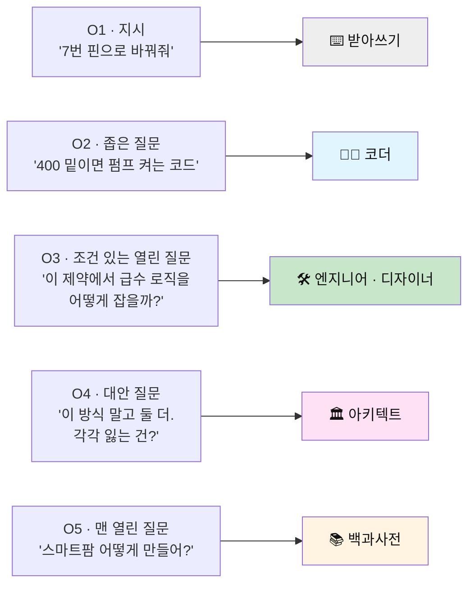
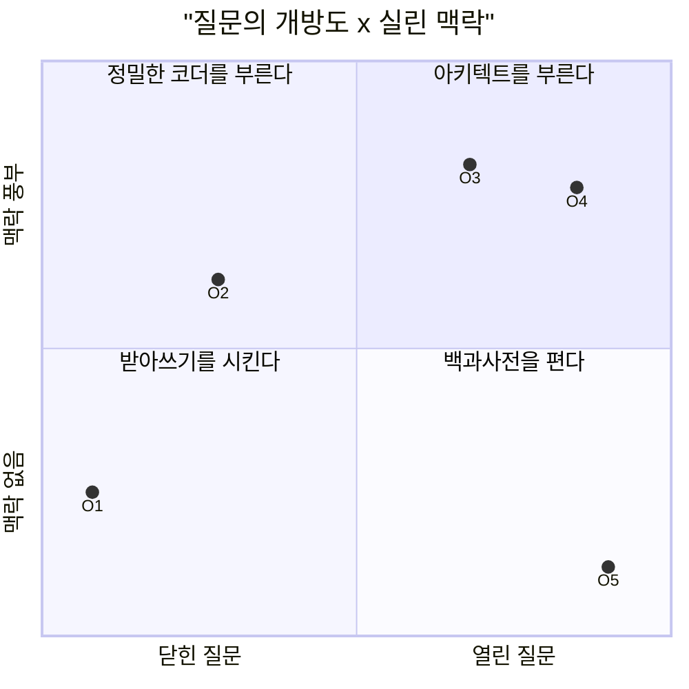
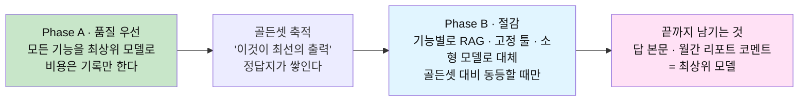
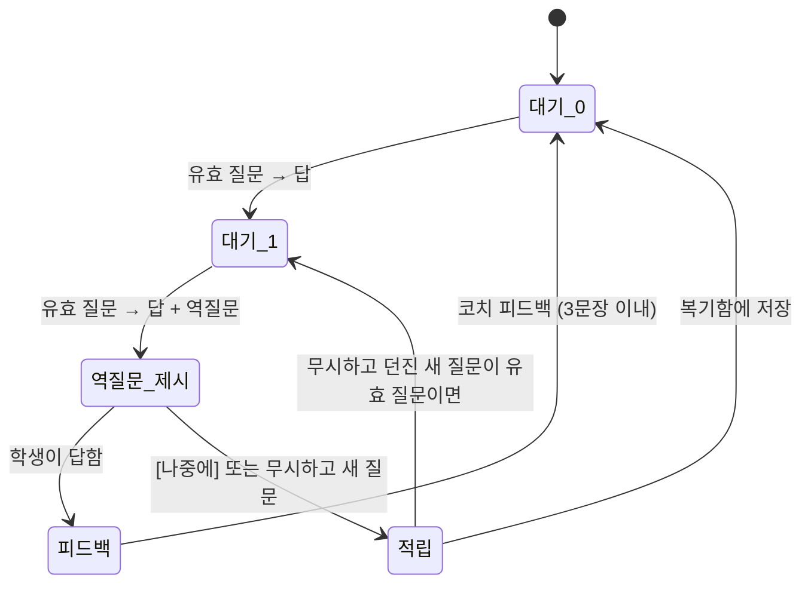
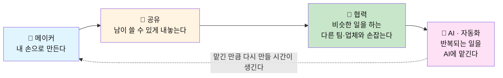
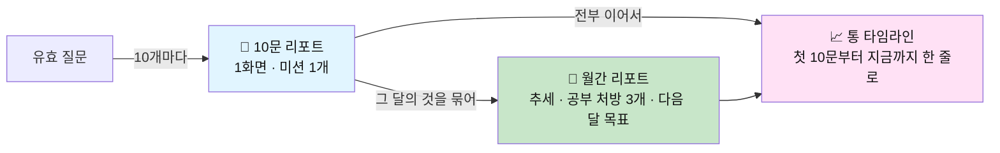
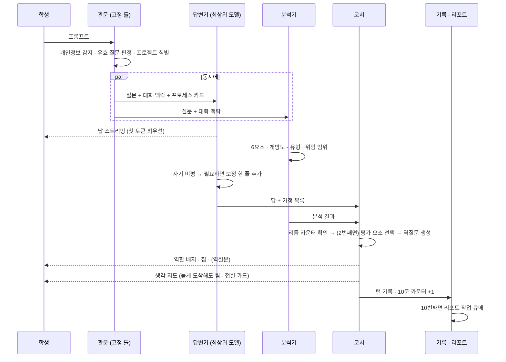
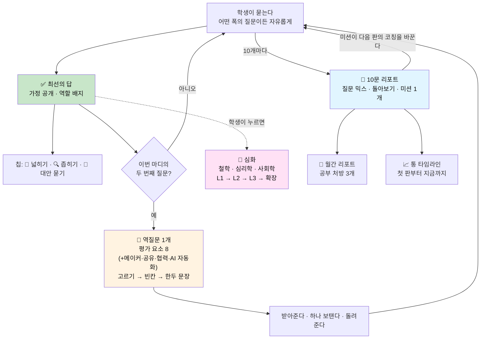

# 🔭 역질문 설계서 v3 — 열고, 좁히고, 되묻는다

> **한 문장**: AI는 함께 대화하는 존재이자 코칭하는 존재다. **질문의 폭이 AI의 역할을 정한다** —
> 좁게만 물으면 AI는 코더에 머물고, 열고 대안을 물으면 디자이너·아키텍트가 된다. v3는 그 **섞는 법**을 코칭한다.
>
> **이전 버전**: [v2 — 답하고, 묻고, 코칭한다](AI_역질문_설계서_v2_답하고_묻고_코칭한다.md) · [v1 — 손으로 증명하는 프롬프트](AI_역질문_설계서_손으로_증명하는_프롬프트.md) · [사업계획서](AI_역질문_코치_사업계획서.md)
> **v3의 다섯 기둥**
> - ① **최선의 답 먼저** — 비용은 나중에. 품질을 확보한 뒤 RAG·고정 툴로 절감한다
> - ② **2문 1역 리듬** — 질문 2번마다 역질문 1번. 역질문은 **정해진 평가 요소**(순서도·핵심 요소 등)를 묻는다
> - ③ **심화는 클릭** — 철학·심리학·사회학 3렌즈 확장 질문 + **선택형 평가 툴 4종**(메이커·공유·협력·AI 자동화)
> - ④ **10문 리포트 + 월간 리포트** — 3개월은 너무 늦다. 질문 10개마다 돌아보고, 성장은 **통으로** 본다
> - ⑤ **질문 믹스 코칭** — 열린 질문·좁은 질문·대안 질문을 섞어 답의 수준을 끌어올린다
>
> **이 문서의 태도**: 악마는 디테일에 있다. 규칙·예외·스키마·프롬프트 골격까지 적는다.

---

## 0. v2에서 무엇이 바뀌는가

| 구분 | v2 | v3 | 바꾼 이유 |
|---|---|---|---|
| **답의 품질 전략** | "일반 챗봇과 동등 이상" | **비용 무시, 최선의 답**. 절감은 품질 확보 후 2단계에서 | 답이 최고가 아니면 도구를 쓸 이유가 없다 |
| **역질문 타이밍** | 트리거(T1~T7)가 있을 때만 | **2문 1역 고정 리듬**. 트리거는 '무엇을 물을지'에만 쓴다 | 예측 가능한 리듬이 습관을 만든다. 트리거만으로는 너무 드물거나 들쭉날쭉하다 |
| **역질문 내용** | 상황에 맞는 코칭 한 마디 | **평가 요소 8개** 중 하나를 묻는다 (순서도·핵심·이유·대안·실패·기준·검증·개선) | 묻는 것이 정해져야 쌓이고, 쌓여야 리포트가 된다 |
| **심화 질문** | 5렌즈를 코치가 골라 제안 | **[🔭 심화] 클릭** → 철학·심리학·사회학 3렌즈. 학생이 고른다 | 심화는 밀어넣는 게 아니라 당겨 쓰는 것 |
| **평가 툴** | 없음 | **선택형 팩 4종**: 🔧 메이커 · 📣 공유 · 🤝 협력(다른 팀·업체와) · 🤖 AI(자동화) | 프로젝트 성격과 단계에 따라 봐야 할 것이 다르다 |
| **리포트 주기** | 주간 한 줄 · 월간 · **분기 심층** | **10문 리포트** · **월간 리포트** · **통 타임라인** | 늦은 평가는 의미가 없다. 자주 보고, 길게 이어 본다 |
| **질문의 폭** | 다루지 않음 | **개방도 O1~O5** 분석 + 줌인/줌아웃/대안 칩 | 질문의 폭이 AI의 역할과 답의 수준을 결정한다 |

> **유지되는 것**: 답이 먼저 · 가정 공개 · 3색 생각 지도 · 6요소 해부(왜·맥·제·기·검·버) · 코치 말투 · 힌트 3단 · 프로세스 카드 → 에이전트 사다리 · 학생이 데이터의 주인.

---

## 1. 핵심 철학 — 질문의 폭이 AI의 역할을 정한다

### 1.1 같은 AI, 다른 역할

AI는 질문이 허락한 만큼만 생각한다.



| 단계 | 질문의 모양 | AI가 하게 되는 일 | 얻는 것 | 잃는 것 |
|---|---|---|---|---|
| **O1 지시** | 무엇을 어떻게 바꿀지 다 정해서 시킨다 | 시킨 대로 친다 | 속도 | AI의 판단 전부 |
| **O2 좁은 질문** | 설계는 내가 끝냈고 구현만 묻는다 | 내 설계를 코드로 옮긴다 | 정확한 구현 | **내 설계가 틀렸어도 그대로 만든다** |
| **O3 조건 있는 열린 질문** | 목표·제약·기준을 주고 방법을 묻는다 | 상황에 맞는 접근을 설계한다 | 맞춤형 설계 + 이유 | — (스위트 스팟) |
| **O4 대안 질문** | 다른 길과 그 대가를 묻는다 | 구조를 비교하고 트레이드오프를 말한다 | 선택지와 판단 근거 | 시간 (구현 중엔 과하다) |
| **O5 맨 열린 질문** | 맥락 없이 크게 묻는다 | 누구에게나 맞는 일반론 | 개요 | **나에게 맞는 답** |

> **핵심**: 너무 좁으면 AI는 **코더**밖에 못 된다. 너무 열면 AI는 **평이한 답**밖에 못 한다.
> 좋은 답은 **O3와 O4를 중심에 두고, 필요할 때 O2로 좁히는** 사람에게 온다.

### 1.2 개방도만으로는 부족하다 — 개방도 × 맥락

열린 질문이 좋은 답을 받으려면 **맥락**이 실려 있어야 한다.



- **2사분면(닫힘+맥락)** 은 나쁜 게 아니다. 구현 단계에서는 가장 효율적이다.
- 문제는 **한 사분면에만 머무는 것**이다. 특히 3사분면(O1)과 4사분면(O5)만 오가는 패턴.

### 1.3 같은 주제, 다섯 가지 질문, 다섯 가지 답

| | 학생의 질문 | AI의 답 (요약) | 역할 |
|---|---|---|---|
| O1 | "pumpPin을 7번으로 바꿔줘" | 한 줄 수정 | ⌨️ |
| O2 | "토양센서 값이 400 밑이면 펌프 켜는 코드 짜줘" | 코드 20줄. 시킨 대로. (경계에서 펌프가 깜빡이는 문제는 말하지 않을 수도 있다) | 👨‍💻 |
| O3 | "상추 화분 자동급수. 우노 + 정전용량 센서 + 5V 펌프, 2시간 안에 시연. **펌프가 깜빡이지 않는 게 기준.** 급수 로직을 어떻게 잡으면 좋을까?" | 임계값 2개(히스테리시스) 제안 + 이유 + 코드 + 5분 로그 검증법 | 🛠 |
| O4 | "임계값 방식 **말고** 급수를 판단하는 다른 방식 2가지와, 각각 **잃는 것**은? 내 제약에선 뭐가 맞아?" | 임계값 / 타이머 / 변화율 비교표 + "2시간 시연이면 임계값 2개, 장기 운용이면 변화율" | 🏛 |
| O5 | "스마트팜 어떻게 만들어?" | 센서·제어·통신·전원 개요. 어디에나 있는 답 | 📚 |

### 1.4 질문 믹스 — 단계마다 잘 통하는 배합이 다르다

```text
                 O1   O2   O3   O4   O5
  탐색 · 정의     ·    10   50   30   10     ← 열고, 대안을 본다
  설계           ·    20   40   40    ·     ← 구조를 비교한다
  구현          10    60   25    5    ·     ← 좁혀서 빨리 만든다
  검증 · 개선     ·    30   30   40    ·     ← 다시 열어서 깨본다
```

> 이 표는 **규칙이 아니라 참고선**이다. 도구는 학생의 믹스를 고치지 않는다.
> 10문 리포트에서 **"네 믹스"와 "이 단계에서 흔히 잘 통하는 믹스"를 나란히** 보여줄 뿐이다.

### 1.5 자유가 먼저다

```text
· 어떤 폭의 질문이든 막지 않는다. 도구는 질문을 고쳐 쓰라고 요구하지 않는다.
· O1에도, O5에도 먼저 최선의 답을 준다.
· 그 뒤에 '다음 질문'의 선택지를 넓혀줄 뿐이다 (§6 칩).
```

---

## 2. 답변 엔진 — 최선의 답 먼저, 절감은 그다음

### 2.1 두 단계 전략



> **순서가 핵심이다.** 처음부터 싸게 만들면 "무엇이 최선인지"를 모르는 채로 최적화하게 된다.
> Phase A의 출력이 곧 Phase B의 **채점 기준**이다.

### 2.2 Phase A — 최선의 답을 만드는 절차

| 단계 | 하는 일 | 디테일 |
|---|---|---|
| ① 질문 읽기 | 개방도·6요소·프로젝트 맥락(이전 대화, 프로세스 카드) 로드 | 맥락은 **학생이 말한 것만**. 추측으로 채우지 않는다 |
| ② 초안 | 최상위 모델 + 확장 사고로 답 초안 | 코드·계산은 **실행해서 검증**(샌드박스), 사실은 필요 시 검색 |
| ③ 자기 비평 | 별도 패스로 초안을 공격: 틀린 곳, 빠진 예외, 학생 수준에 안 맞는 설명 | 비평 결과는 로그로 남긴다 (골든셋 재료) |
| ④ 최종 | 비평 반영 + **답의 구조**(§2.3)로 정리 | 첫 토큰 지연이 길어지면 ③을 스트리밍 뒤 보정 패스로 돌린다 |
| ⑤ 부가물 | 가정 추출 · 생각 지도 · 칩 · (리듬이 맞으면) 역질문 | 전부 **답 뒤에**, 비동기. 답을 늦추지 않는다 |

### 2.3 답의 구조 — 개방도에 따라 달라진다

| 질문 | 답에 반드시 들어가는 것 |
|---|---|
| **O1 · O2** | 요청한 결과물 → **내가 가정한 것** → (설계에 위험이 보이면) **"그대로 만들었어. 다만 한 가지 — …"** 한 줄 |
| **O3** | 결론 먼저 → 이유 → 결과물 → 내가 가정한 것 → **확인하는 법** → 고려했지만 고르지 않은 대안 1개 |
| **O4** | 비교표(방식 · 얻는 것 · 잃는 것 · 맞는 상황) → **네 제약에서의 추천과 이유** → 추천이 틀리는 조건 |
| **O5** | 개요(짧게) → **"이 질문엔 누구에게나 같은 답밖에 못 해"** → 좁히는 질문 3개(고르면 바로 이어서 답) |

**역할 배지** — 모든 답의 끝에 한 줄로 붙는다.

```text
   이번 답에서 나는  👨‍💻 코더  로 일했어.   (네가 설계를 다 정해줬거든)
   이번 답에서 나는  🏛 아키텍트  로 일했어.  (다른 길과 대가를 물어봐서)
```

> 배지는 평가가 아니라 **거울**이다. 학생은 자기 질문이 AI를 어떤 자리에 앉혔는지 매번 본다.
> 프로젝트 성격에 따라 이름은 바뀐다 — 글쓰기라면 받아쓰기 / 대필 / 편집자 / 기획 파트너 / 백과사전.

### 2.4 Phase B — 무엇을, 무엇으로, 언제 바꾸나

| 기능 | Phase A (최선) | Phase B (절감) | 교체 조건 |
|---|---|---|---|
| **답 본문** | 최상위 모델 + 자기 비평 + 실행 검증 | **유지**. 단 반복 질문은 시맨틱 캐시, 개념 설명은 검수된 **개념 카드 RAG**를 근거로 주입 | 교체 안 함 |
| **6요소 · 개방도 · 유형 분류** | 최상위 모델 | 소형 분류 모델 + 신호 규칙(§6.2) | 골든셋 일치율 92% 이상 |
| **가정 추출** | 최상위 모델 | 답 생성 시 구조화 출력으로 동시 생성 | 누락률 5% 미만 |
| **생각 지도** | 최상위 모델이 순서도 생성 | 코드는 **AST 정적 분석**으로 뼈대 생성 → 모델은 라벨만 | 칸 일치율 90% 이상 |
| **역질문 생성** | 최상위 모델이 매번 새로 씀 | **질문 은행 RAG** (평가요소 × 도메인 × 형태 × 난이도) → 모델은 맥락에 맞게 빈칸만 채움 | 블라인드 선호도 45% 이상 |
| **역질문 채점 (0~3)** | 최상위 모델 | 루브릭 예시 few-shot + 중형 모델 | 채점 일치(±0) 85% 이상 |
| **심화 렌즈 질문** | 최상위 모델 | 렌즈별 질문 은행 RAG + 맥락 치환 | 블라인드 선호도 45% 이상 |
| **10문 리포트** | 최상위 모델이 전체 작성 | 수치는 **SQL 집계 + 템플릿**, 모델은 코멘트 2문장과 미션 1개만 | 학생 유용도 평가 동등 |
| **월간 리포트** | 최상위 모델 | 수치 집계는 고정, **처방과 코멘트는 최상위 모델 유지** | 처방은 교체 안 함 |
| **개인정보 감지** | 모델 | 정규식 + 사전 (처음부터 고정 툴) | — |

```text
절감의 원칙
  · 기능별 턴당 비용을 Phase A 첫날부터 기록한다. 줄일 곳은 데이터가 정한다.
  · 골든셋은 턴 500개가 쌓이면 시작한다. 교체 후에도 주 1회 표본 50개를 재평가한다.
  · 품질이 기준 아래로 떨어지면 즉시 Phase A 방식으로 되돌린다 (기능별 스위치).
  · 학생이 보는 '답'은 마지막까지 아끼지 않는다.
```

---

## 3. 2문 1역 리듬 — 질문 두 번, 역질문 한 번

### 3.1 규칙

```text
학생의 '유효 질문' 2개가 쌓이면, 두 번째 답의 끝에 역질문 1개가 붙는다.
역질문의 대상은 방금 지나간 2개의 질문과 답 — 이것을 한 '마디'라고 부른다.
```



### 3.2 '유효 질문'의 정의 — 무엇을 세고 무엇을 안 세나

| 센다 ✅ | 안 센다 🚫 |
|---|---|
| 새로운 정보·결과물을 요구하는 프롬프트 | 인사, "ㅇㅇ", "고마워", "오 된다" |
| 에러 메시지 붙여넣기 (그 자체가 질문이다) | **역질문에 대한 답**과 그 뒤의 힌트 요청 |
| 한 메시지에 질문이 여러 개 → **1개**로 센다 | [다시 생성], 같은 문장 재전송 (직전과 유사도 0.9 이상) |
| 칩(§6)을 눌러 보낸 질문 | [🔭 심화]로 시작된 대화 (별도 흐름) |
| 이미지·코드만 붙여넣기 (개방도는 '판별 불가'로 기록) | 도구 사용법 질문 ("리포트 어디서 봐?") |
| | 정서적·개인적 대화 (§11) |

### 3.3 타이밍의 디테일

| 상황 | 처리 |
|---|---|
| 두 번째 답이 매우 길다 (코드 100줄 이상) | 역질문은 답 끝이 아니라 **접힌 말풍선**으로. 학생이 답을 다 본 뒤 펼친다 |
| 역질문을 보는 중 새 질문을 던졌다 | 역질문은 '미응답'으로 복기함에. 새 질문은 새 마디의 1번 |
| 마디 중간에 세션이 끊겼다 | 같은 프로젝트로 **24시간 안에** 돌아오면 카운터 유지, 아니면 0으로 |
| 마디 중간에 프로젝트가 바뀌었다 | 마디를 끊고 0부터. 섞인 마디로는 묻지 않는다 |
| 급하다는 신호 ("10분 뒤 발표", "빨리") | 역질문은 **적립**. 세션 끝 또는 다음 접속 때 "아까 못 물어본 것 하나" |
| [⚡ 답만] 모드 | 전부 적립. 10문 리포트의 평가 요소 칸은 "데이터 부족" |
| [나중에] 3회 연속 | 코치가 한 번 묻는다: "요즘 바쁜 것 같아. 3문 1역으로 늦출까?" → 학생이 고른다 (2:1 / 3:1 / 4:1) |
| 학생이 더 원한다 | [🙋 나한테 물어봐] 버튼 — 리듬과 무관하게 역질문 1개. 카운터는 그대로 |
| 교실 모드 | 교사가 과제별로 1:1 ~ 4:1 설정 |

### 3.4 v2의 트리거는 어디로 갔나

**'언제' 묻는가는 리듬이 정한다. '무엇을' 묻는가에 트리거가 쓰인다.**

| v2 트리거 | v3에서 가중되는 평가 요소 |
|---|---|
| T1 판단을 통째로 넘김 | E6 기준 |
| T2 답에 큰 가정이 들어감 | E3 이유 |
| T3 같은 곳을 맴돈다 | E1 흐름 (생각 지도 빈칸) |
| T4 되돌아갔다 | E8 개선 |
| T5 이정표 직전 | E1 흐름 → E2 핵심 (형태 F4까지 허용) |
| T6 복붙 후 오류 | E7 검증 |

---

## 4. 평가 요소 — 역질문은 이것을 묻는다

### 4.1 기본 8요소

특성화고 검문(순서도 · 핵심 · 개선)에서 출발해, 프로젝트 전반을 덮도록 넓혔다.

| # | 요소 | 묻는 것 | 대표 역질문 | 이걸 알면 |
|---|---|---|---|---|
| **E1** | 🗺 **흐름** | 입력→처리→출력, 분기 | "방금 만든 걸 3칸 순서도로 말하면? (생각 지도 빈칸 2개)" | 구조를 안다 |
| **E2** | 🎯 **핵심 요소** | 없으면 무너지는 한 곳 | "이 중에 딱 하나만 남긴다면 뭐야? 왜?" | 중요도를 판단한다 |
| **E3** | 💬 **이유** | 왜 이 방식인가 | "내가 임계값을 두 개로 하자고 했잖아. 왜 그랬을 것 같아?" | AI의 선택을 자기 말로 옮긴다 |
| **E4** | 🔀 **대안** | 다른 길과 그 대가 | "이 방법 말고 떠오르는 다른 방법 하나만. 엉성해도 돼." | 선택지를 본다 |
| **E5** | 💥 **실패 조건** | 언제 안 되나 | "이게 안 돌아가는 상황을 하나 상상해 볼래?" | 시스템 감각 |
| **E6** | 📏 **기준** | 잘 됐다는 걸 뭘로 아나 | "'잘 되는 화분'을 한 줄로 정하면?" | 판단의 잣대를 쥔다 |
| **E7** | 🔬 **검증** | 어떻게 확인하나 | "이 코드가 맞는지 어떻게 확인해 볼 거야?" | 답을 믿지 않고 확인한다 |
| **E8** | 🔧 **개선** | 무엇을 고쳤고 전엔 어땠나 | "아까 버전이랑 지금 버전, 뭐가 달라졌어?" | 변화를 설명한다 |

### 4.2 역질문의 형태 — 부담을 4단으로

| 형태 | 모양 | 걸리는 시간 | 언제 |
|---|---|---|---|
| **F1 고르기** | 보기 3개 + "잘 모르겠어" | 5초 | 그 요소를 처음 묻거나, 최근 점수가 0~1 |
| **F2 빈칸** | 생각 지도의 1~2칸 또는 문장의 빈칸 | 15초 | 최근 점수 1~2 |
| **F3 한두 문장** | 자기 말로 짧게 | 30초 | 최근 점수 2~3 |
| **F4 그리기 · 설명** | 손/화면으로 순서도, 1분 설명 | 3분 | 이정표(T5) · 교실 모드 · 학생이 원할 때만 |

> **"잘 모르겠어"는 언제나 선택지에 있다.** 누르면 힌트 → 예시 → AI의 생각(v2 §5.2)으로 이어진다.
> 모르는 걸 모른다고 누르는 것도 기록되고, 그것이 월간 처방의 가장 정직한 재료다.

### 4.3 채점 — 0~3, 학생에게는 색으로만

| 점수 | 기준 | 학생 화면 |
|---|---|---|
| **3** | 자기 말로 정확 + 이유나 조건까지 | 🟢 |
| **2** | 자기 말로 대체로 맞음. 일부 빠짐 | 🟢 |
| **1** | 방향은 있으나 틀림 / AI의 문장을 거의 그대로 반복 / 힌트·AI 생각 후에 풀림 | 🟡 |
| **0** | "잘 모르겠어" · 무응답 · 관련 없는 답 | ⚪ |

```text
· 점수는 학생에게 숫자로 보이지 않는다. 생각 지도의 칸 색(🟢🟡⚪)과 10문 리포트의 막대로만.
· 형태는 점수와 함께 기록된다. F1에서의 🟢과 F3에서의 🟢은 리포트에서 구분된다.
· 채점 근거 한 줄을 로그에 남긴다. 학생이 "왜 🟡야?"를 누르면 그 줄을 코치 말투로 보여준다.
```

### 4.4 무엇을 물을지 고르는 법

```text
후보 = 기본 8요소 + (켜져 있는 평가 팩의 요소)

각 후보 e 에 대해
  점수[e] = 0.4 × 관련성(e, 이번 마디)        직전 2문답으로 물을 수 있는가  (0~1)
          + 0.3 × 약함(e)                     최근 10문 리포트 3개의 평균이 낮을수록 ↑
          + 0.2 × 오래됨(e)                   마지막으로 물은 뒤 지난 마디 수
          + 0.1 × 트리거 가중(e)              §3.4 매핑
  이번 10문 창에서 이미 물었다면  점수[e] × 0.3        같은 10문 안 중복 억제
  관련성(e) < 0.3 이면 후보에서 제외                   억지 질문 금지

가장 높은 e 를 고른다 → 형태는 §4.2 규칙으로 → 생성(§9.3)
팩이 켜져 있으면: 10문 창의 역질문 5개 중 기본 3 · 팩 2 를 목표 비율로
```

> **억지 질문 금지**가 가장 중요한 디테일이다. 마디와 관련 없는 요소를 순번 때문에 묻기 시작하면
> 역질문은 곧바로 설문지가 된다. 물을 게 마땅치 않으면 **그 마디는 건너뛴다**(리듬 카운터만 리셋).

### 4.5 학생이 답한 뒤 — 코치 피드백 규격

```text
① 받아준다      학생의 말을 짧게 되받는다. ("'센서가 빠졌을 때'를 떠올렸구나.")
② 하나 보탠다    맞으면 한 걸음 더, 틀리면 다르게 볼 지점 하나. 절대 두 개 이상 말하지 않는다.
③ 돌려준다      프로젝트로 복귀. ("그럼 최대 가동시간을 넣어볼까? 아니면 하던 거 계속해도 돼.")

· 3문장 이내. 점수·등급을 말하지 않는다. 칭찬에는 무엇이 좋았는지가 붙는다.
· 학생의 답이 프로젝트를 바꿀 만한 것이면 생각 지도의 🟥 칸이 🟩로 바뀐다.
```

---

## 5. 심화 질문 — 클릭해서 여는 3렌즈와 선택형 평가 툴

기본 리듬(§3~§4)은 **만드는 일**에 붙어 있다. 심화는 **생각을 넓히는 일**이다. 밀어넣지 않는다. 학생이 연다.

### 5.1 [🔭 심화] 버튼

모든 답의 아래에 있다. 누르면 세 장의 카드가 펼쳐진다.

```text
┌─ 🔭 심화 질문 ─────────────────────────────────────────┐
│  🧭 철학      이게 정말 풀어야 할 문제일까?                │
│  🫀 심리학    사람은 왜 그렇게 행동할까?                   │
│  🌍 사회학    이게 퍼지면 누구의 무엇이 바뀔까?             │
│                                        (하나를 골라줘)   │
└────────────────────────────────────────────────────────┘
```

### 5.2 3렌즈 × 3깊이

| 렌즈 | 묻는 축 | L1 · 표면 | L2 · 구조 | L3 · 전제 |
|---|---|---|---|---|
| 🧭 **철학** | 정의 · 가치 · 전제 · (윤리) | "여기서 '문제'라고 부른 게 정확히 뭐야?" | "그 정의를 바꾸면 해법이 어떻게 달라져?" | "당연하다고 둔 것 중에 확인한 건 몇 개야?" |
| 🫀 **심리학** | 동기 · 편향 · 습관 · 감정 | "그 사람은 지금 왜 그걸 안 하고 있을까?" | "의지의 문제일까, 설계의 문제일까?" | "네가 이 답을 마음에 들어한 건 맞아서일까, 편해서일까?" |
| 🌍 **사회학** | 누구 · 구조 · 규범 · 확산 | "이걸 쓰게 될 사람과 못 쓰게 될 사람은?" | "이건 개인의 탓일까, 구조의 탓일까? 근거는?" | "이게 널리 퍼지면 사람들의 '정상'이 어떻게 바뀔까?" |

> v1·v2의 5렌즈 중 **시스템 렌즈**는 기본 평가 요소(E1 흐름 · E5 실패)로, **윤리 렌즈**는 철학 렌즈 안으로 들어갔다.
> 심화는 셋으로 줄여 고르기 쉽게 하고, 매일 쓰는 것은 기본 리듬에 넣었다.

### 5.3 심화 대화의 진행 규칙

```text
1. 학생이 렌즈를 고른다 → L1 질문 1개. 코치도 자기 생각 한 줄을 깐다. ("나는 이렇게 보이는데, 너는?")
2. 학생이 답한다 → 코치가 받아주고 [한 단 더 깊이] [다른 렌즈로] [여기까지] 중 고르게 한다.
3. L3까지 가면 '확장 질문'이 열린다 — 이 생각을 프로젝트에 돌려놓는 질문.
      "그러면 네 화분은 '자동 급수기'일까, '물 주는 법을 알려주는 도구'일까?
       후자라면 지금 코드에서 뭐가 달라져야 해?"
4. 심화 대화는 2문 1역 카운터에 들어가지 않는다. 시간도, 개수도 제한 없다.
5. 심화에서 나온 학생의 문장은 '생각 노트'에 모인다 → 월간 리포트 '가장 깊었던 생각'.
```

### 5.4 선택형 평가 툴 — 🔧 메이커 · 📣 공유 · 🤝 협력 · 🤖 AI(자동화)

기본 8요소는 "이해했는가"를 본다. 프로젝트에는 다른 축이 넷 더 있다.
**만들었는가 · 내놓았는가 · 밖과 손잡았는가 · 무엇을 자동화에 맡겼는가.** 학생(또는 교사)이 프로젝트를 시작할 때 고른다.



```text
새 프로젝트 — 무엇을 같이 돌아볼까? (여러 개 선택 · 나중에 바꿀 수 있어)
  ☑ 기본          흐름 · 핵심 · 이유 · 대안 · 실패 · 기준 · 검증 · 개선      (항상 켜짐)
  ☐ 🔧 메이커      내 손으로 만들고, 실패하고, 고쳤는가
  ☐ 📣 공유        남이 따라 할 수 있게 내놓았는가
  ☐ 🤝 협력        비슷한 일을 하는 다른 팀·업체·서비스와 어떻게 손잡을 것인가
  ☐ 🤖 AI·자동화   무엇을 AI에 맡기고, 무엇을 끝까지 내가 쥘 것인가
```

| 팩 | 요소 | 대표 역질문 |
|---|---|---|
| 🔧 **메이커** | **M1 내 손** — 직접 만든 부분 | "이 프로젝트에서 AI 없이 네 손으로 한 건 어디야?" |
| | **M2 시행착오** — 실패의 기록 | "오늘 안 된 것 중에 제일 오래 붙잡은 건 뭐였어?" |
| | **M3 재료와 도구** — 선택의 이유 | "이 센서를 고른 이유가 있어? 다른 후보는 뭐였어?" |
| | **M4 반복 개선** — 버전의 변화 | "v1과 지금, 한 문장으로 뭐가 달라졌어?" |
| 📣 **공유** | **S1 재현 가능성** — 남이 따라 할 수 있나 | "친구가 이걸 똑같이 만들려면 제일 먼저 뭘 알려줘야 해?" |
| | **S2 출처와 기여** — AI·자료 표기 | "여기서 AI가 한 일과 네가 한 일을 한 줄씩 나누면?" |
| | **S3 대상과 가치** — 누구에게 왜 | "이걸 보여주고 싶은 사람이 누구야? 그 사람은 뭘 얻어?" |
| | **S4 피드백 반영** — 들은 말과 바꾼 것 | "누가 뭐라고 했고, 그래서 뭘 바꿨어?" |
| 🤝 **협력** | **C1 이웃 찾기** — 비슷한 일을 하는 팀·업체·서비스 | "너랑 비슷한 걸 이미 하고 있는 팀이나 서비스가 있을까? 찾아본 적 있어?" |
| | **C2 차이와 보완** — 우리만의 것, 서로 채울 것 | "그쪽은 잘하는데 너는 약한 것, 너는 있는데 그쪽엔 없는 것은 뭐야?" |
| | **C3 주고받기** — 협력의 제안 | "그 팀에 같이 하자고 한다면, 너는 뭘 주고 뭘 받을 수 있어?" |
| | **C4 역할과 경계** — 어디까지 같이, 어디부터 따로 | "같이 한다면 어디까지 나누고, 어떤 건 끝까지 너희 것으로 남길 거야?" |
| 🤖 **AI · 자동화** | **A1 자동화 대상** — 반복되는 일 찾기 | "이 프로젝트에서 매번 똑같이 반복하는 일이 뭐야? 그중 맡길 수 있는 건?" |
| | **A2 사람의 몫** — 끝까지 쥘 판단 | "자동으로 돌아가도, 이것만은 네가 직접 봐야 하는 건 뭐야? 왜?" |
| | **A3 위임 명세** — 입력 · 기준 · 멈춤 조건 | "AI한테 이 일을 통째로 맡긴다면, '잘 됐다'와 '이제 멈춰'를 글로 어떻게 써줄 거야?" |
| | **A4 감시와 복구** — 조용히 틀릴 때 | "자동화가 아무 말 없이 틀리고 있으면, 너는 그걸 어떻게 알아챌 수 있을까?" |

```text
네 팩의 성격
  🔧 메이커      시선이 '안'을 본다 — 내 손, 내 실패, 내 개선
  📣 공유        시선이 '받는 사람'을 본다 — 따라 할 수 있는가, 누가 무엇을 했는가
  🤝 협력        시선이 '옆'을 본다 — 혼자 다 만들지 않는다. 비슷한 일을 하는 곳을 찾아 겨루지 않고 손잡는다.
                 (팀 안의 역할 분담은 C4에서 함께 다룬다)
  🤖 AI·자동화   시선이 '앞'을 본다 — 만든 것이 나 없이도 돌아가게 한다. 단, 설명할 수 있는 만큼만 맡긴다.
```

```text
팩을 켜면 달라지는 것
  · 2문 1역의 역질문 풀에 팩 요소가 섞인다 (10문당 역질문 5개 중 2개 목표 · 팩을 여러 개 켜도 합쳐서 2개)
  · 10문 리포트 · 월간 리포트에 팩 섹션이 생긴다
  · 'AI 활용 기록서'에 S2(출처와 기여)와 A2(사람의 몫)의 답이 그대로 들어간다
  · 🤖 팩의 A1~A4 답은 **프로세스 카드 → 에이전트 설계서**(v1 §9)의 초안이 된다
       A1 → 역할과 단계   A2 → 사람 확인 지점   A3 → 판단 기준 · 멈춤 조건   A4 → 실패 시 행동
  · 교실 모드: 교사가 과제별로 팩을 지정하거나, 요소를 직접 써서 커스텀 팩을 만든다
```

**단계에 따라 잘 맞는 팩** — 참고선일 뿐, 고르는 건 학생이다.

| 프로젝트 단계 | 잘 맞는 팩 | 이유 |
|---|---|---|
| 탐색 · 정의 | 🤝 협력 (C1·C2) | 만들기 전에 이미 있는 것부터 본다. 바퀴를 다시 만들지 않는다 |
| 설계 · 구현 | 🔧 메이커 | 손과 시행착오의 시간 |
| 시연 · 제출 | 📣 공유 | 받는 사람의 눈으로 본다 |
| 운영 · 확장 | 🤖 AI·자동화 + 🤝 협력 (C3·C4) | 반복을 맡기고, 밖과 손잡아 키운다 |

> **협력 팩의 디테일**: C1은 학생이 직접 찾아보게 한다. 학생이 [찾아줘]를 누르면 도구가 유사 프로젝트·서비스 후보를 **검색해서** 보여주되,
> "그쪽과 너의 차이"(C2)는 학생이 먼저 쓴다. 비교표를 AI가 먼저 채우면 협력이 아니라 요약이 된다.
> **AI·자동화 팩의 디테일**: A3를 글로 못 쓰면 코치는 "그럼 아직은 네가 직접 하는 게 안전해"라고 말한다 — v1부터 이어진 원칙, **설명할 수 있는 만큼만 위임한다.**

---

## 6. 질문 믹스 코칭 — 열고, 좁히고, 대안을 묻는다

### 6.1 다음 질문 칩 3종

모든 답 아래에, 직전 질문의 개방도에 따라 **최대 2개**가 뜬다. 누르면 **입력창에 초안이 채워진다.** 바로 전송되지 않는다 — 학생이 고쳐서 보낸다.

| 칩 | 언제 뜨나 | 채워지는 초안의 예 |
|---|---|---|
| 🌅 **넓히기** | O1·O2가 3회 이상 이어졌을 때 | "지금 내가 짜고 있는 이 구조 자체가 맞는 방향일까? 내 목표는 ___이고 제약은 ___야." |
| 🔍 **좁히기** | O5일 때 · O3의 답을 받은 직후 | "그중에서 ___ 부분을 내 상황(___)에 맞게 구체적으로 알려줘." |
| 🔀 **대안 묻기** | O3의 답을 받은 직후 · 설계 결정이 있었을 때 | "이 방식 말고 다른 방식 2개와, 각각 잃는 걸 알려줘. 내 제약은 ___야." |

```text
· 초안의 ___ 는 도구가 아는 만큼만 채운다. 모르는 칸은 빈칸으로 둔다 — 학생이 채우는 그 순간이 코칭이다.
· 칩은 제안이다. 무시해도 아무 일도 일어나지 않는다. 칩을 눌러 보낸 질문은 유효 질문으로 센다.
· 같은 종류의 칩을 3번 연속 무시하면 그 세션에서는 그 칩을 띄우지 않는다.
```

### 6.2 개방도 판별 — 신호 규칙

| 신호 | 예 | 가리키는 쪽 |
|---|---|---|
| 식별자·줄·값을 지정 | "pumpPin", "12번째 줄", "400으로" | O1 |
| 결과물의 상세 스펙을 지정 + "짜줘/만들어줘" | "~이면 ~하는 코드" | O2 |
| 출력 형식을 제한 | "코드만", "한 줄로" | O1·O2 쪽으로 −1 |
| 방법·이유를 묻는 말 | "어떻게", "왜", "어떤 방식" | O3 이상 |
| 대안·비교·반증을 묻는 말 | "말고", "다른", "비교", "장단점", "잃는 것", "틀리는 조건" | O4 |
| **맥락량** = 6요소 중 맥·제·기 채움 수 (0~3) | | 열린 신호 + 맥락 0~1 → **O5** · 열린 신호 + 맥락 2~3 → **O3** · 대안 신호 + 맥락 1 이상 → **O4** · 대안 신호 + 맥락 0 → **O5** |
| 코드·이미지·에러만 붙여넣기 | | **판별 불가(N/A)** — 믹스 통계에서 제외 |

> 같은 대화 안의 앞선 맥락은 **맥락량에 포함**한다. 세 턴 전에 제약을 말했다면 지금 질문이 짧아도 O3일 수 있다.
> 이 한 줄이 빠지면 대화를 잘 이어가는 학생일수록 O5로 오판된다.

### 6.3 O5를 받았을 때 — 답하되, 길을 보여준다

```text
🙋 "스마트팜 어떻게 만들어?"

🤖 크게 네 덩어리야 — 재는 것(센서) · 움직이는 것(펌프·조명) · 판단하는 것(보드) · 전원.  (개요 6줄)

   💬 이 질문엔 누구에게 물어도 같은 답밖에 못 해. 아래 중 하나만 알려주면 '네 스마트팜' 얘기를 할 수 있어.
      ① 뭘 키울 거야?     ② 지금 가진 부품은?     ③ 언제까지, 누구한테 보여줄 거야?

   이번 답에서 나는  📚 백과사전  으로 일했어.
```

### 6.4 O2만 이어질 때 — 시킨 대로 하되, 한 줄을 보탠다

```text
🙋 "센서값 400 밑이면 펌프 켜는 코드 짜줘"   (오늘 다섯 번째 O2)

🤖 (요청한 코드)

   💬 그대로 만들었어. 다만 한 가지 — 값이 400 근처에서 흔들리면 펌프가 켜졌다 꺼졌다 할 수 있어.
      이 구조가 맞는지 한 번 넓게 볼래?                                   [ 🌅 넓히기 ]

   이번 답에서 나는  👨‍💻 코더  로 일했어.
```

---

## 7. 리포트 — 10문마다, 달마다, 그리고 통으로

### 7.1 세 겹의 리포트



| 리포트 | 언제 | 분량 | 핵심 질문 |
|---|---|---|---|
| **📄 10문 리포트** | 유효 질문 10개마다 (활발한 학생은 2~3일에 한 번) | 1화면 | "방금 10번, 나는 어떻게 물었나?" |
| **📘 월간 리포트** | 매월 1일 (그 달 10문 리포트 2개 이상일 때. 미만이면 '미니 월간') | 3~4화면 | "이번 달, 무엇을 공부하면 다음 달이 나아지나?" |
| **📈 통 타임라인** | 항상 열려 있음 | 1열 스크롤 | "처음의 나에서 지금의 나까지" |

### 7.2 10문 리포트 — 구성

10문 = 질문 10개 + 역질문 최대 5개. 이 한 묶음을 **한 판**이라고 부른다.

| 칸 | 내용 | 데이터 |
|---|---|---|
| ① **지난 미션** | 지난 판에서 받은 미션의 결과 한 줄 | 미션 추적 |
| ② **질문 믹스** | O1~O5 막대 + AI 역할 분포 + 이 단계의 참고 믹스 | 개방도 분류 |
| ③ **질문에 실은 것** | 6요소 충족 (왜·맥·제·기·검·버) | 6요소 분석 |
| ④ **돌아보기 결과** | 역질문으로 물은 평가 요소별 🟢🟡⚪ + 형태 | 역질문 채점 |
| ⑤ **걸린 곳** | 반복된 개념 · 에러 패턴 (있을 때만) | 반복 탐지 |
| ⑥ **이번 판의 질문** | 10개 중 가장 좋았던 질문 1개와 그 이유 | 모델 선정 |
| ⑦ **다음 판 미션** | **딱 하나.** 다음 10문 동안 해볼 것 | 모델 생성 · 학생이 교체 가능 |

### 7.3 10문 리포트 — 예시

```text
📄 민준의 7번째 판   (질문 61~70 · 9월 19~21일 · 스마트 화분)

① 지난 미션   "10번 중 2번은 '말고 다른 방법은?'으로 물어보기"
              → 3번 해냈어. 그중 한 번은 센서 위치를 바꾸는 계기가 됐고. ✅

② 질문 믹스
     O1 지시     ▇▇         2
     O2 좁은     ▇▇▇▇       4
     O3 열린     ▇          1
     O4 대안     ▇▇▇        3    ← 지난 판 0
     O5 맨 열린  ·          0
   AI의 역할    ⌨️2  👨‍💻4  🛠1  🏛3
   참고 (구현 단계에서 흔히 잘 통하는 믹스)   O2 60% · O3 25% · O4 5%
   💬 구현 중인데도 대안을 세 번 물었어. 지금은 그게 도움이 됐던 것 같아 — 센서 위치가 바뀌었으니까.

③ 질문에 실은 것    왜 8/10 · 맥 9/10 · 제 6/10 · 기 2/10 · 검 3/10 · 버 1/10

④ 돌아보기 결과   (역질문 5개 중 4개 응답)
     🗺 흐름    🟢  빈칸(F2)          💥 실패 조건  🟡  한두 문장(F3) · 힌트 후
     💬 이유    🟢  한두 문장(F3)      📏 기준      ⚪  "잘 모르겠어"
     (나중에 1건 → 복기함)

⑤ 걸린 곳     millis() 관련 질문이 이번 판에도 2번. 지난 세 판 합쳐 7번째야.

⑥ 이번 판의 질문
     "센서를 화분 가장자리에 꽂았는데, 가운데랑 값이 다를까? 다르다면 어느 쪽이 '진짜'야?"
     💬 코드가 아니라 '무엇을 재고 있는가'를 물었어. 이 판에서 유일하게 프로젝트의 방향을 바꾼 질문이야.

⑦ 다음 판 미션   (하나만 · 바꿔도 돼)
     새 기능을 만들기 전에 "잘 됐다는 건 ___로 알 수 있다" 한 줄을 질문에 넣어보기.
     ← '기준'이 세 판 연속으로 가장 비어 있고, 돌아보기에서도 ⚪였어.
```

### 7.4 10문 리포트 — 발행의 디테일

| 상황 | 처리 |
|---|---|
| 10번째 질문의 답 직후 | **끼어들지 않는다.** 화면 위에 "📄 7번째 판 리포트 도착" 칩만. 열람은 학생이 원할 때 |
| 작업 흐름 중 (5분 안에 다음 질문) | 칩 유지. 세션이 끝나거나 10분 이상 멈추면 한 번 알린다 |
| 역질문을 거의 다 건너뜀 (응답 2개 미만) | ④칸은 "돌아보기 데이터가 적어"로 표시. ⑦ 미션은 역질문이 아닌 질문 습관에서 고른다 |
| 10문이 여러 프로젝트에 걸침 | 리포트는 학생 단위 1장. ②③에 프로젝트 태그를 단다 |
| '판별 불가' 질문이 절반 이상 | ②칸 대신 "이번 판은 코드·에러를 주로 붙여넣었어" + 에러 패턴 요약 |
| 미션을 학생이 바꿈 | 그대로 따른다. 바꾼 미션도 똑같이 추적한다 |
| 미션을 두 판 연속 못 함 | 미션을 **더 작게** 쪼갠다 ("10번 중 2번" → "다음 질문 1번만") |
| 첫 판 (비교 대상 없음) | ①칸 없음. ②의 코멘트는 "여기가 출발점이야" |

### 7.5 월간 리포트

그 달의 10문 리포트들을 재료로 쓴다. v2 분기 리포트의 **공부 처방 3종(📚 지식 · 🛠 기술 · 🧭 사고 습관)** 은 월간으로 옮겨온다.

| 장 | 내용 |
|---|---|
| **1. 이번 달의 판들** | 판별 질문 믹스·돌아보기 결과를 나란히 — 한 달의 흐름이 보인다 |
| **2. 질문 믹스의 변화** | O1~O5 비율 추이 · AI 역할 분포 추이 · 칩 사용 |
| **3. 평가 요소 지도** | 8요소(+팩)별 🟢🟡⚪ 누적 · 형태의 전진(F1→F3) |
| **4. 걸린 곳** | 반복 개념 · 에러 패턴 · 힌트 단계 |
| **5. 미션 기록** | 받은 미션과 결과 — 해낸 것, 작게 쪼갠 것, 바꾼 것 |
| **6. 📚 공부 처방** | 최대 3개. 각각 **근거 데이터 · 구체 행동 · 기대 효과 · "내가 도울게"** |
| **7. 가장 깊었던 생각** | 심화 대화(§5)에서 나온 학생의 문장 1~2개 |
| **8. 다음 달 목표** | 학생이 고치고 지울 수 있다 |

```text
📘 9월 월간 — 6장 발췌
   ① 📚 지식   '시간을 다루는 법 (delay vs millis)'
        네 판 연속 '걸린 곳'에 올랐어 (합계 11회). 이번 달 막힘의 약 3분의 1.
        → 40분 개념 학습 1회 + LED 두 개를 다른 주기로 깜빡이는 연습 1개
        → 내가 도울게: 관련 질문이 오면 생각 지도의 타이머 칸부터 펼쳐줄게.

   ② 🧭 습관   '기준 먼저 정하기'
        6요소 중 '기준'이 네 판 평균 1.5/10. 돌아보기에서도 세 번 ⚪.
        → 10월의 첫 미션으로 이미 넣어뒀어.
```

### 7.6 통 타임라인 — 성장을 한 줄로

```text
📈 민준의 타임라인                                   [ 첫 판과 지금 비교 ]

  7판  9/21  ⌨️2 👨‍💻4 🛠1 🏛3   돌아보기 🟢🟢🟡⚪   🎯 미션 ✅   ⭐ "어느 쪽이 '진짜'야?"
  6판  9/18  ⌨️3 👨‍💻6 🛠1 🏛0   돌아보기 🟢🟡🟡⚪   🎯 미션 ➖
  5판  9/15  ⌨️2 👨‍💻7 🛠1 🏛0   돌아보기 🟡🟡⚪     🎯 미션 ✅
  ─── 📘 9월 월간 ─────────────────────────────────────────────
  4판  9/09  ⌨️4 👨‍💻5 📚1       돌아보기 🟡⚪⚪
   …
  1판  8/28  ⌨️5 👨‍💻3 📚2       돌아보기 (없음)       ⭐ "아두이노로 스마트 화분 코드 짜줘"
```

```text
[ 첫 판과 지금 비교 ]를 누르면
   1판의 나    ⌨️ 받아쓰기 50% · 📚 백과사전 20%   기준 0/10   "아두이노로 스마트 화분 코드 짜줘"
   7판의 나    🏛 아키텍트 30% · 👨‍💻 코더 40%      기준 2/10   "어느 쪽이 '진짜'야?"
   💬 한 달 전엔 AI에게 받아쓰게 했고, 지금은 AI와 설계를 의논해.
```

> **1열 · 한 판이 한 줄 · 또렷한 배지.** 위로 스크롤하면 예전의 내가 있다.
> 학기 말에는 타임라인 전체를 **포트폴리오 PDF**로 내보낸다.

---

## 8. 한 턴 안에서 일어나는 일 — 파이프라인



```text
지연 시간의 원칙
  · 답의 첫 토큰보다 먼저 나오는 것은 없다.
  · 역질문은 답 스트리밍이 끝난 뒤 1~2초 안에. 그보다 늦으면 이번 마디는 건너뛴다 (어색한 뒷북 금지).
  · 생각 지도 · 10문 리포트는 비동기. 준비되면 조용히 붙는다.
```

---

## 9. 프롬프트 설계 명세 — 역할별 골격

Phase A에서는 아래 다섯 역할을 모두 최상위 모델이 맡는다. 역할을 나눠두는 이유는 **Phase B에서 하나씩 갈아끼우기 위해서**다.

### 9.1 답변기

```text
역할    너는 청소년과 함께 프로젝트를 만드는 동료이자 코치다. 먼저, 가장 좋은 답을 준다.
입력    질문 · 대화 이력 · 프로세스 카드 · 학생 수준 메모 · 개방도(O1~O5)
규칙    - 개방도에 맞는 답의 구조(§2.3)를 따른다.
        - 학생이 말하지 않은 것을 가정했다면 "내가 가정한 것"에 모두 적는다. 숨은 가정 금지.
        - O1·O2에서 설계의 위험이 보이면 시킨 대로 만든 뒤 한 줄로 알린다. 설계를 몰래 바꾸지 않는다.
        - O5에는 개요를 짧게 주고, 좁히는 질문 3개를 제시한다. 훈계하지 않는다.
        - 코드는 실행해 확인한 것만 "확인했어"라고 말한다.
        - 중3이 읽을 수 있는 문장. 전문 용어는 처음 나올 때 한 번 풀어 쓴다.
출력    { answer_md, assumptions[], alternatives_considered[], verify_how, role_badge, risk_note? }
```

### 9.2 분석기

```text
입력    질문 · 대화 이력
출력    { six: {why,context,constraint,criteria,verify,discard: 0|0.5|1},
          openness: "O1".."O5"|"NA", context_load: 0..3, type: 요청|탐색|검증|반증,
          delegation: 정보|구현|판단, stage: 탐색|설계|구현|검증, signals[] }
규칙    - 앞선 턴에서 준 맥락은 context_load에 포함한다 (§6.2).
        - 확신이 낮으면 "NA". 억지로 분류하지 않는다.
```

### 9.3 역질문 생성기

```text
입력    마디(직전 2문답) · 선택된 평가 요소 · 형태(F1~F4) · 학생의 그 요소 최근 이력 · 생각 지도
규칙    - 마디 안의 구체적인 것(학생의 단어, 방금 나온 숫자·코드)을 반드시 넣는다. 일반 질문 금지.
        - 한 번에 하나만 묻는다. 2문장 이내. 제안형 말투.
        - F1의 보기는 그럴듯한 오답을 포함하되 함정은 만들지 않는다. "잘 모르겠어"를 항상 넣는다.
        - 이 질문에 답하면 학생에게 뭐가 좋은지가 드러나야 한다. ("이게 정해지면 숫자가 달라져.")
출력    { element, form, question, options?[], blank_nodes?[], expected_points[], hint, example, coach_view }
        (hint · example · coach_view 는 막혔을 때 여는 3단. 미리 만들어 둔다.)
```

### 9.4 피드백기 (채점 포함)

```text
입력    역질문 · expected_points · 학생의 답 · 힌트 사용 단계
출력    { score: 0..3, reason_one_line, feedback_md (3문장 이내), map_updates[] }
규칙    - §4.5의 3단(받아준다 · 하나 보탠다 · 돌려준다).
        - 점수·등급을 말하지 않는다. 학생의 표현을 인용한다.
        - AI 답을 그대로 옮긴 흔적(직전 답과 높은 유사도)이면 최대 1점. 지적하지 않고 "네 말로 하면?"을 한 번 권한다.
```

### 9.5 리포트 작성기

```text
10문   입력: 집계된 수치(JSON) + 질문 10개 원문 + 역질문 결과 + 지난 미션
       출력: 코멘트 2개(②,⑥) · 미션 1개(근거 포함) — 수치는 절대 새로 만들지 않는다. 받은 JSON만 인용.
월간   입력: 그 달의 10문 리포트 전부 + 이해 지도 + 생각 노트
       출력: 처방 최대 3개 {구멍 종류, 근거 데이터, 행동, 기대 효과, 코치의 약속} · 다음 달 목표 초안
규칙   - 비교 대상은 언제나 예전의 그 학생. 다른 학생과 비교하지 않는다.
       - 근거 수치가 없는 문장은 쓰지 않는다.
```

---

## 10. 데이터 모델 (v3)

```json
{
  "turn": {
    "id": "t_0921_068",
    "projectId": "prj_smartpot",
    "validQuestion": true,
    "barIndex": 34,
    "positionInBar": 2,
    "windowIndex": 7,
    "analysis": {
      "six": { "why": 1, "context": 1, "constraint": 0.5, "criteria": 0, "verify": 0, "discard": 0 },
      "openness": "O4", "contextLoad": 2, "type": "반증", "delegation": "정보", "stage": "구현"
    },
    "answer": {
      "roleBadge": "architect",
      "assumptions": ["센서는 정전용량식"],
      "alternativesConsidered": ["타이머 방식", "변화율 방식"],
      "cost": { "answer": 412, "critique": 96, "analysis": 38, "map": 120, "rq": 44, "unit": "KRW" }
    },
    "chips": { "shown": ["narrow"], "used": null },
    "reverseQuestion": {
      "element": "E5", "form": "F3", "pack": null,
      "selectionScores": { "E5": 0.71, "E6": 0.64, "E2": 0.4 },
      "studentAction": "answered", "hintStage": "hint", "score": 1,
      "reason": "센서 분리 상황을 떠올렸으나 힌트 이후"
    }
  },
  "windowReport": {
    "index": 7, "turnRange": [61, 70],
    "mix": { "O1": 2, "O2": 4, "O3": 1, "O4": 3, "O5": 0, "NA": 0 },
    "roles": { "typist": 2, "coder": 4, "engineer": 1, "architect": 3 },
    "six": { "why": 8, "context": 9, "constraint": 6, "criteria": 2, "verify": 3, "discard": 1 },
    "elements": [
      { "element": "E1", "form": "F2", "score": 3 },
      { "element": "E6", "form": "F1", "score": 0 }
    ],
    "stuck": [{ "concept": "millis", "countInWindow": 2, "countTotal": 7 }],
    "lastMission": { "text": "10번 중 2번 대안 묻기", "result": "done", "evidenceTurns": [63, 66, 69] },
    "bestQuestionTurn": 66,
    "nextMission": { "text": "기준 한 줄 넣기", "basis": "criteria 3판 연속 최저", "editedByStudent": false }
  },
  "project": {
    "id": "prj_smartpot",
    "packs": ["maker"],
    "rhythm": "2:1"
  }
}
```

> `answer.cost` — **기능별 턴당 비용**을 첫날부터 남긴다. Phase B에서 어디를 먼저 줄일지는 이 필드가 정한다.
> `selectionScores` — 왜 그 평가 요소를 골랐는지 남긴다. 역질문이 어색했다는 피드백이 오면 여기서 원인을 찾는다.

---

## 11. 엣지 케이스 — 악마는 여기 있다

| 상황 | 그냥 두면 | 처리 |
|---|---|---|
| 역질문에 **AI 답을 복붙**해서 답함 | 점수가 부풀고 리포트가 거짓말을 한다 | 직전 답과의 유사도 검사 → 최대 1점 · 지적하지 않고 "네 말로 한 줄만" 1회 권유 |
| 역질문에 **장난으로** 답함 ("몰라ㅋㅋ") | 코치가 진지하게 받아 어색해진다 | 0점 · 가볍게 받고 넘어간다 ("ㅋㅋ 알겠어. 하던 거 하자.") · 연속 3회면 리듬 완화 제안 |
| 역질문에 **너무 잘** 답함 | 계속 쉬운 질문만 받는다 | 그 요소의 형태를 F1→F2→F3로 올린다 · 두 판 연속 🟢이면 질문 빈도를 낮추고 약한 요소로 |
| 계속 **0~1점** | 좌절하고 역질문을 피한다 | 형태를 F1로 · 생각 지도 1단(짚어보기)으로 대체 · 월간 처방에서 다룬다 |
| 한 메시지에 **질문 셋** | 카운터가 꼬인다 | 유효 질문 1개 · 개방도는 가장 열린 것 기준 |
| **같은 질문을 다시** 보냄 | 10문이 허수로 찬다 | 유사도 0.9 이상이면 세지 않는다 · 세 번째면 T3(맴돈다)로 E1 가중 |
| **코드만** 붙여넣음 | 개방도 오판 | 'NA' · 믹스 통계 제외 · 절반 이상이면 리포트 ②칸 대체(§7.4) |
| 대화 앞에서 준 맥락을 **뒤에서 생략** | 잘 이어 묻는 학생이 O5로 찍힌다 | 맥락량에 대화 이력을 포함(§6.2) |
| **구현 단계**인데 O2가 80% | "좁게만 묻는다"고 잘못 코칭한다 | 단계(stage)를 먼저 판정 · 구현 단계에선 넓히기 칩의 문턱을 O2 5회로 높인다 |
| 마디와 **관련 있는 평가 요소가 없음** | 억지 질문 | 그 마디는 건너뛴다(§4.4) |
| 답이 **틀렸다는 걸** 나중에 앎 | 신뢰가 무너진다 | 정정은 즉시, 숨기지 않고 · 그 턴의 역질문 점수는 무효 · 학생이 잡아냈다면 🕳 구멍 발견자 배지 |
| **정서적 · 개인적 고민**을 털어놓음 | 고민 상담에 평가 요소를 묻는다 | 유효 질문에서 제외 · 역질문 · 칩 · 역할 배지 전부 끔 · 필요 시 도움받을 곳 안내 |
| **숙제 통째로** 넘김 ("이 독후감 써줘") | 대필 도구가 된다 | 답은 한다(초안·구조) · 개방도 O1/위임 '판단'으로 기록 · 역질문은 E3·S2 가중 · 교실 모드에선 교사 설정을 따른다 |
| 10문 리포트를 **한 번도 안 엶** | 쌓이기만 한다 | 세 판 연속 미열람이면 리포트를 **3줄 요약**으로 줄여 대화창 안에 보여준다 |
| 협력 팩을 켰는데 **비슷한 팀·서비스를 아직 모름** | C2~C4를 물을 수가 없다 | C1(이웃 찾기)만 묻는다 · [찾아줘]로 후보 검색 · 이웃이 정해지면 C2~C4가 풀에 들어온다 |
| AI·자동화 팩을 켰는데 **아직 돌아가는 게 없음** | 자동화할 대상이 없다 | 관련성 미달로 자동 제외 · 동작하는 버전이 생긴 뒤 A1부터 · 그 전엔 🔧 메이커를 제안 |
| 자동화 팩에서 **"전부 AI한테 맡길래"** | 위임이 아니라 방치가 된다 | 막지 않는다 · A3(기준·멈춤 조건)와 A4(어떻게 알아채나)를 먼저 묻는다 · 글로 못 쓰면 "아직은 직접"을 권한다 |

---

## 12. 실전 시나리오 — 민준의 25분 (7번째 판의 마지막 네 질문)

| 시각 | 민준 | 도구 |
|---|---|---|
| 00:00 | **Q67** "soilPin A0에서 A1로 바꿔줘" | 수정된 줄 · ⌨️ 받아쓰기 · 마디 1/2 |
| 00:03 | **Q68** "센서값 400 밑이면 펌프 3초 켜는 코드" | 코드 · "그대로 만들었어. 다만 3초 동안은 센서를 안 읽어 — delay 때문이야." · 👨‍💻 코더 · 칩 [🌅 넓히기] |
| | | **역질문 (E5 실패 · F3)**: "방금 코드에서, 펌프가 도는 3초 동안 센서가 빠지면 어떻게 될 것 같아?" |
| 00:05 | "음… 계속 도나?" → [힌트 줘] | 💡 "delay(3000) 동안 보드가 다른 일을 할 수 있을까?" |
| 00:06 | "못 하네. 3초는 무조건 도는구나" | "맞아, 3초는 무조건이야. 그래서 보통은 '얼마나 오래'가 아니라 '언제 멈출지'로 짜. 계속 갈래, 이걸 먼저 볼래?" · 🟡 기록 · 카운터 0 |
| 00:08 | [🌅 넓히기] 칩 → 초안 수정 후 전송. **Q69** "지금 구조(읽고 → 비교 → 3초 켜기)가 맞는 방향일까? 목표는 **상추가 안 마르는 것**, 제약은 5V 펌프, 다음 주 시연" | 결론: "구조는 맞고, '3초 고정'만 바꾸자" + 이유 + millis 기반 코드 + 5분 로그 검증법 + 고르지 않은 대안 1개 · 🛠 엔지니어 · 마디 1/2 · 칩 [🔀 대안 묻기] |
| 00:14 | **Q70** "센서를 화분 가장자리에 꽂았는데, 가운데랑 값이 다를까? 다르다면 어느 쪽이 '진짜'야?" | 위치별 차이 설명 + "'진짜'는 뿌리가 있는 깊이야" + 직접 재보는 법 · 🏛 아키텍트 |
| | | **역질문 (E6 기준 · F1)**: "그럼 네 화분에서 '물이 충분하다'는 건 어느 쪽에 가까워? ① 흙 표면이 젖음 ② 뿌리 깊이가 젖음 ③ 잎이 처지지 않음 ④ 잘 모르겠어" |
| 00:15 | ④ 잘 모르겠어 | "괜찮아, 이건 아직 아무도 안 정한 칸이야. 상추는 뿌리가 얕아 — 5cm쯤. 거기서부터 생각해 보면 돼." · ⚪ 기록 · 🟥 칸 유지 |
| 00:16 | | 화면 위 칩: **📄 7번째 판 리포트 도착** |
| 00:18 | [🔭 심화] → 🫀 심리학 | L1: "사람들이 화분에 물을 안 주는 건 까먹어서일까, 얼마나 줘야 할지 몰라서일까? 나는 후자 같기도 한데." |
| 00:21 | "나는 얼마나 줄지 몰라서였어" → [한 단 더] | L2 → 확장: "그럼 네 화분은 '대신 주는 기계'일까, '얼마나 줘야 하는지 알려주는 기계'일까?" → 생각 노트에 저장 |
| 00:25 | 리포트를 연다 | §7.3의 그 리포트. 다음 판 미션: **기준 한 줄 넣기** |

> **25분의 결과**: 답 4개(전부 즉시) · 역질문 2개(하나는 힌트로, 하나는 "모르겠어") · 칩 1회로 O2 → O3 전환 · 심화 1회 · 리포트 1장 · 미션 1개.
> 민준은 막힌 적이 없고, **자기가 '기준'을 세 판째 안 정하고 있다는 사실**을 3개월 뒤가 아니라 **오늘** 안다.

---

## 13. 화면 설계 (요약)

| 화면 | 핵심 요소 |
|---|---|
| **대화** | 답 → 내가 가정한 것 → **역할 배지** → 칩(최대 2) → (마디의 2번째면) 역질문 말풍선 · 하단에 ▸🗺 생각 지도 ▸🔎 내 질문 돌아보기 ▸**🔭 심화** |
| **마디 표시** | 입력창 옆 작은 점 2개 ●○ — 다음 역질문까지 남은 질문. 예측 가능해야 거부감이 없다 |
| **판 표시** | 상단 얇은 막대 7/10 — 다음 리포트까지 |
| **심화** | 3렌즈 카드 → 깊이 표시(L1·L2·L3) → [한 단 더][다른 렌즈][여기까지] → 생각 노트 |
| **프로젝트 설정** | 평가 팩 선택(메이커·공유·협력·AI 자동화) · 리듬(2:1/3:1/4:1) · [⚡ 답만] |
| **10문 리포트** | 1화면 7칸 · 미션 카드는 또렷하게 · [미션 바꾸기] |
| **통 타임라인** | **1열 · 한 판이 한 줄** · 역할 이모지 분포 · 돌아보기 색 · 미션 배지 · 월간 구분선 · [첫 판과 지금 비교] |
| **복기함** | 1열 · 적립된 역질문 · 🟡⚪ 칸 · 여유 있을 때 하나씩 |

### 추가 배지 (v3)

```text
🏛  아키텍트 호출     한 판에서 O4 질문 3회
🌅  한 단 위로        넓히기 칩으로 보낸 질문이 프로젝트의 방향을 바꿈
🎚  믹스 마스터       한 판 안에 O2·O3·O4를 모두 사용
🎯  미션 3연속        세 판 연속 미션 달성
⚪  모른다고 말하기    "잘 모르겠어"를 10회 누름 — 정직이 재료다
🔧📣🤝🤖 팩 완주      켠 팩의 모든 요소에서 🟢
🤝  이웃 발견         협력 팩에서 비슷한 팀·서비스를 직접 찾아 차이를 자기 말로 정리함
🤖  첫 위임 명세      A3를 글로 써냄 — 입력 · 기준 · 멈춤 조건
```

---

## 14. 성공 지표

| 지표 | 목표 | 의미 |
|---|---|---|
| **답 품질** (블라인드 비교) | 범용 챗봇 대비 선호 60% 이상 | Phase A의 존재 이유. 이게 안 되면 전부 무의미 |
| **역질문 응답률** | 65% 이상 · [나중에] 3연속 비율 10% 미만 | 2문 1역이 잔소리가 아니다 |
| **O3+O4 비율** | 판이 거듭될수록 상승 (구현 단계 제외) | 학생이 AI를 코더 이상으로 쓴다 |
| **역할 분포** | 🏛🛠 비중 상승 · ⌨️📚 비중 하락 | 같은 이야기를 학생의 언어로 |
| **칩 → 질문 전환율** | 칩 노출의 20% 이상 | 믹스 코칭이 실제로 쓰인다 |
| **10문 리포트 열람률** | 70% 이상 | 자주 주는 리포트가 읽힌다 |
| **미션 달성률** | 50% 이상 | 너무 쉽지도 어렵지도 않다 |
| **평가 요소 형태 전진** | 같은 요소가 F1 → F3로 | 실제로 자란다 |
| **Phase B 절감률** | 턴당 비용 −60%, 답 품질 지표는 유지 | 절감이 품질을 건드리지 않는다 |

---

## 15. 로드맵

| 단계 | 기간 | 범위 | 통과 기준 |
|---|---|---|---|
| **A0 — 최선의 답** | 4주 | 답변기(초안·비평·실행 검증) · 답의 구조 · 가정 공개 · 기능별 비용 로깅 | 블라인드 선호 60% |
| **A1 — 분석과 배지** | 3주 | 6요소 · 개방도 O1~O5 · 역할 배지 · 칩 3종 | 분류에 대한 학생 납득도 80% |
| **A2 — 2문 1역** | 4주 | 리듬 상태기계 · 평가 8요소 · 형태 F1~F3 · 채점 · 피드백 · 복기함 | 응답률 65% |
| **A3 — 10문 리포트** | 3주 | 7칸 리포트 · 미션 추적 · 통 타임라인 | 열람률 70% |
| **A4 — 심화와 팩** | 4주 | 3렌즈 × 3깊이 · 생각 노트 · 메이커·공유·협력·AI(자동화) 팩 | 심화 사용 학생 30% |
| **A5 — 월간 · 교실** | 5주 | 월간 리포트 · 공부 처방 · 교실 모드(리듬·팩 지정·F4) · 교사 요약 | 한 학급 파일럿 |
| **B1 — 절감 1차** | 4주 | 골든셋 구축 · 분류기 교체 · 리포트 수치 템플릿화 · 시맨틱 캐시 | 비용 −30%, 품질 유지 |
| **B2 — 절감 2차** | 6주 | 질문 은행 RAG · 개념 카드 RAG · AST 생각 지도 | 비용 −60%, 품질 유지 |
| **C — 프로세스 · 에이전트** | 이후 | v1·v2의 프로세스 카드 → 에이전트 설계 코칭 · 🤖 팩의 A1~A4 답을 설계서 초안으로 연결 | — |

> **A 단계 동안은 비용을 묻지 않는다.** 대신 파일럿 인원을 작게(20~30명) 잡아 총액을 통제한다.
> "최선이 무엇인지" 모르는 채로 아끼는 것이 가장 비싼 선택이다.

---

## 16. 한 페이지 요약



> **v3 원칙 여섯 줄**
> 1. **최선의 답이 먼저다.** 아끼는 것은 최선을 알고 난 뒤에 한다.
> 2. **질문의 폭이 AI의 역할을 정한다.** 열고, 좁히고, 대안을 묻는다 — 섞는 것이 기술이다.
> 3. **두 번 묻고, 한 번 돌아본다.** 돌아보는 것은 정해진 평가 요소다.
> 4. **심화는 학생이 연다.** 철학 · 심리학 · 사회학.
> 5. **열 번마다 본다.** 늦은 평가는 평가가 아니다. 그리고 전부를 한 줄로 이어 본다.
> 6. **억지로 묻지 않는다.** 물을 게 없으면 건너뛴다. 디테일이 코치와 잔소리꾼을 가른다.
