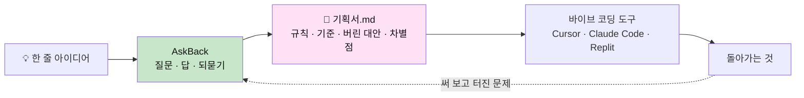
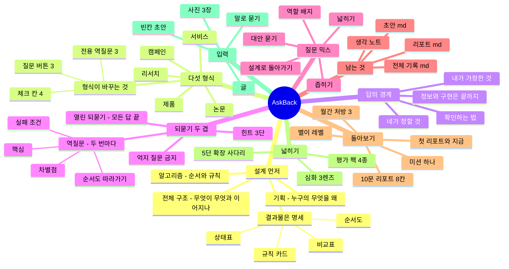
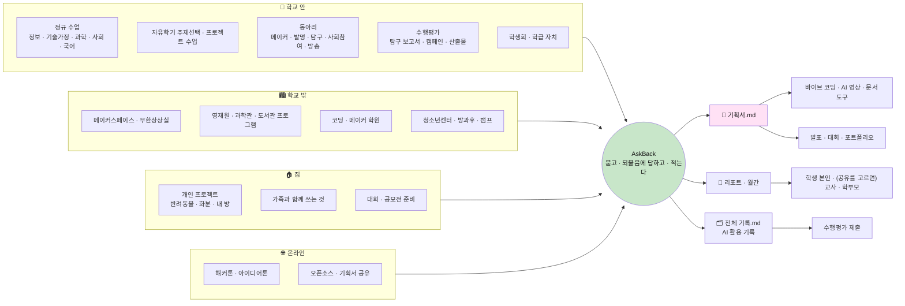
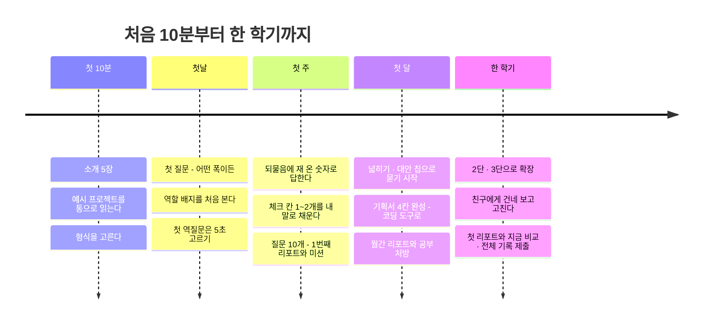
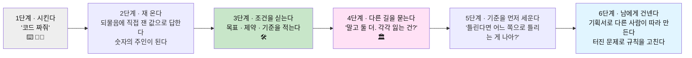
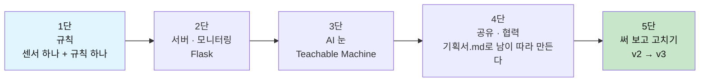
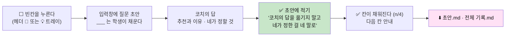
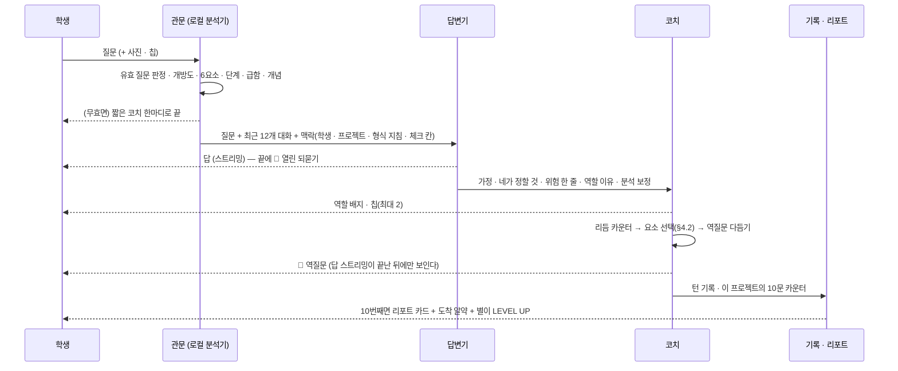
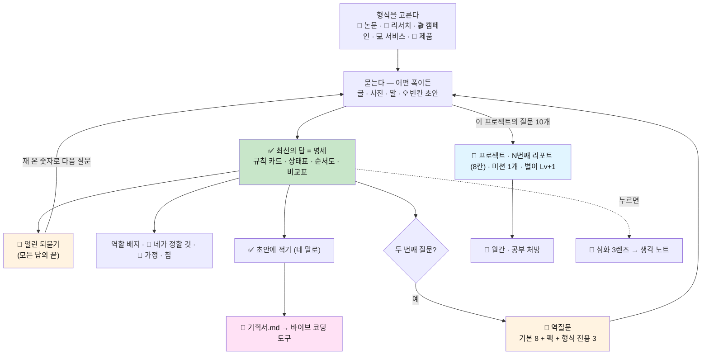

# 📐 역질문 설계서 v4 — 설계를 묻고, 기획서를 남긴다

> **한 문장**: 코드 · 문장 · 영상은 AI가 금방 만든다. AskBack은 **그 앞의 설계(기획 · 알고리즘 · 전체 구조)를 학생이 정하게** 하고,
> 답할 때마다 **열린 질문으로 되묻고**, 그 결과를 **한 장짜리 기획서(.md)** 로 남긴다.
>
> **이전 버전**: [v3 — 열고, 좁히고, 되묻는다](AI_역질문_설계서_v3_열고_좁히고_되묻는다.md) · [v2](AI_역질문_설계서_v2_답하고_묻고_코칭한다.md) · [v1](AI_역질문_설계서_V1_손으로_증명하는_프롬프트.md)
> **짝 문서**: [사이트맵 · 주요 기능 v4](AI_역질문_사이트맵_v4.md) · [사업계획서 v4](AI_역질문_코치_사업계획서_v4.md)
> **먼저 볼 곳**: 왜 필요한가 §1.4 · 마인드맵 §1.5 · **어디서 쓰나(사용 공간 지도)** §1.6 · 단계도 §1.7~1.8 · 형식별 시작 예시 §2.2 · **예시 모음** §10.3
> **기준**: 2026-09-21 `frontend/` 웹 구현(Next.js · `localhost:3000`)을 직접 확인하고 썼다. **이미 만든 것**과 **아직 안 만든 것**을 §14에서 나눈다.
>
> **v4의 여섯 기둥**
> - ① **코드보다 설계 먼저** — 답의 기본 결과물은 코드가 아니라 **명세**(규칙 카드 · 상태표 · 순서도 · 비교표 · 차별점)다
> - ② **다섯 형식** — 📄 논문 · 🔬 리서치 · 🎬 캠페인 · 💻 서비스 · 🤖 제품. 형식이 질문 버튼 · 채울 칸 · 되묻는 것을 바꾼다
> - ③ **두 겹의 되묻기** — 모든 답 끝의 🙋 **열린 되묻기** + 두 번마다 🧭 **역질문**(알고리즘을 *진짜 아는지*)
> - ④ **기획서.md가 남는다** — 체크 칸을 *학생의 말로* 채우고, 초안 · 전체 기록을 .md로 내보낸다
> - ⑤ **작게 시작해서 한 단씩** — 규칙 → 서버 · 모니터링 → AI 눈 → 공유 · 협력 → 써 보고 고치기. 다음 단은 학생의 아쉬움에서 나온다
> - ⑥ **프로젝트 · N번째 리포트** — 질문 10개마다 같은 8칸 리포트. 번호는 프로젝트마다 1부터

---

## 0. v3에서 무엇이 바뀌는가

| 구분 | v3 | v4 | 바꾼 이유 |
|---|---|---|---|
| **답의 기본 결과물** | 최선의 답 = 코드 + 실행 검증 | **명세**(규칙 카드 · 상태표 · mermaid 순서도 · 데이터 한 줄 · 판정 기준 · 비교표). 코드는 요청이 분명할 때만, 20줄 이내 | 요즘 중학생은 코드를 Cursor · Claude Code · Replit으로 뽑는다. 코치의 가치는 **그 도구에 붙여넣을 설계**에 있다 |
| **프로젝트의 틀** | 이름 · 설명 · 평가 팩 | **다섯 형식 중 하나** + 형식별 체크 칸 4개 + 형식 전용 역질문 3개. 팩은 형식에 맞춰 자동으로 켜진다 | 메이커 · 코딩 밖(탐구 · 논문 · 캠페인)으로 넓힌다. "설계"의 뜻이 형식마다 다르다 |
| **되묻기** | 2문 1역 역질문 하나 | **두 겹** — 매 답 끝 🙋 열린 되묻기(단계를 잇는 다리) + 2문 1역 🧭 역질문(이해 확인) | 답 → 되묻기 → 학생이 재 온 숫자 → 다음 답. 대화가 **티키타카**가 된다 |
| **답의 경계** | 가정 공개 | 가정 공개 + **🫵 네가 정할 것(your_call)** — 목표 · 기준 · 선택 · 학생만 잴 수 있는 숫자는 대신 정하지 않는다 | 정보 · 구현은 끝까지 주되 **판단은 학생 몫**이라는 선을 화면에 그린다 |
| **남는 것** | 대화 기록 · 리포트 | + **기획서.md**(초안 체크 칸 · 내가 정할 것 · AI가 가정한 것) · 전체 기록.md · 리포트.md | 산출물이 있어야 수행평가 · 대회 · 바이브 코딩으로 이어진다 |
| **리포트 이름** | "민준의 7번째 판" | **"스마트 화분 · 1번째 리포트"** — 프로젝트마다 1부터, 질문도 Q1~10 · Q11~20 | "판"은 어색하다. 프로젝트가 단위다 |
| **리포트 구성** | 7칸 | **8칸** — 한눈에 · 질문 유형 · **질문 길이(글자 수)** · 실은 것 · 되묻기 · 걸린 곳 · 베스트 질문 · 미션. 대화 카드 · 팝업 · .md가 **같은 8칸** | 화면마다 형식이 다르면 읽는 법을 매번 새로 배워야 한다 |
| **화면 구조** | 모바일 앱 · 하단 탭 3개(대화 · 기록 · 성장) | **웹 우선** · PC는 왼쪽 메뉴 고정 + 오른쪽 대화, 모바일은 ☰ 서랍. 대화가 곧 홈 | 파일럿은 웹으로 빠르게. 탭 대신 프로젝트 목록이 중심 |
| **예시** | 문서 속 시나리오 | **예시 프로젝트 6개**(시나리오 JSON, 질문 16개씩)를 **한꺼번에 펼쳐** 읽는다 + 💡 아이디어 티키타카 3개 | ▶ 클릭 시연보다 통으로 읽는 편이 "무엇이 쌓이는지" 보인다 |
| **입력** | 글 · 코드 붙여넣기 | + **사진 3장**(앨범 · 카메라 · 붙여넣기) · **🎙 말로 묻기** · 💡 질문 바로 만들기 트레이 | 메이커 프로젝트는 회로 · 화분 · 화면을 *보여주며* 묻는다 |
| **동기** | 배지 8종 | **별이**(질문을 먹고 자라는 캐릭터 · 리포트 1장 = Lv +1) · 우주 배경 꾸미기 | 중학생에게는 배지 목록보다 자라는 캐릭터 하나가 또렷하다 |

> **유지되는 것**: 답이 먼저 · 질문의 폭 O1~O5와 역할 배지 · 넓히기/좁히기/대안 칩 · 2문 1역 리듬과 평가 8요소 · F1~F3 형태 · 0~3 채점(학생에겐 색만) · 억지 질문 금지 · 심화 3렌즈 × 3깊이 · 평가 팩 4종 · 10문 리포트 · 월간 리포트와 공부 처방 · 학생이 데이터의 주인.

---

## 1. 핵심 철학 — 코드는 다른 도구가, 설계는 네가

### 1.1 AskBack이 서 있는 자리



> **코드 · 문장 · 영상은 AI가 금방 만든다.** 학생에게 남아야 하는 것은 그 앞의 세 가지다.

| 축 | 뜻 | 학생이 말할 수 있어야 하는 것 |
|---|---|---|
| 🧭 **기획** | 누구의 무엇을 왜 바꾸는지 | "이건 ___의 ___ 문제를 풀어" |
| 🔀 **알고리즘** | 어떤 순서와 규칙으로 돌아가는지 | "___가 들어오면 → ___를 확인해서 → ___한다" |
| 🏗 **전체 구조** | 무엇이 무엇과 어떻게 이어지는지 | 블록 · 화면 · 목차 · 컷이 이어진 그림 한 장 |

### 1.2 묻기만 해도 한꺼번에 쌓인다

새 프로젝트 화면이 학생에게 약속하는 세 가지. 따로 정리할 필요 없이 평소처럼 질문하면 같이 만들어진다.

| 얻는 것 | 내용 |
|---|---|
| 💬 **바로 받는 피드백** | 답과 함께, 설계에서 빈 곳을 코치가 되묻는다 |
| 🔎 **질문(프롬프트) 분석** | 질문이 얼마나 열려 있는지, 목적 · 조건 · 기준이 담겼는지 매번 짚는다 |
| 📄 **보고서와 기획서** | 질문 10개마다 분석 리포트 한 장, 채운 칸은 .md 기획서로 자동 정리된다 |

### 1.3 v3의 철학은 그대로 아래에 깔려 있다

질문의 폭이 AI의 역할을 정한다(O1 ⌨️ 받아쓰기 → O2 👨‍💻 코더 → O3 🛠 엔지니어 → O4 🏛 아키텍트 · O5 📚 백과사전). v4는 여기에 **"무엇에 대해 넓게 묻는가"** 를 더한다 — 코드가 아니라 **설계**에 대해 넓게 묻게 한다.

### 1.4 왜 필요한가 — 여덟 장면

여섯 예시 프로젝트를 쓰면서 되풀이해 나온 장면이다. **문제는 "AI를 쓴다"가 아니라 아래의 빈칸이다.**

| # | 장면 | 지금 일어나는 일 | 비어 있는 것 | AskBack의 장치 |
|---|---|---|---|---|
| 1 | **베낀 숫자** | "400 밑이면" · "30분마다" · "2끼 연속이면" — 첫 질문의 숫자는 예제에서 베꼈거나 그냥 떠올린 것이다. AI는 그 숫자 그대로 만들어 준다 | 숫자의 출처 · 직접 재 본 경험 | 🙋 열린 되묻기 "그 400은 어디서 왔어?" → 학생이 재 온다(320 · 610) |
| 2 | **기능 폭탄** | "잔반 줄이는 앱 만들어줘" → 기능 10개가 쏟아진다. 뭐부터 할지 더 모른다 | 누구의 무엇을 왜 · 첫 버전의 범위 | 형식의 체크 칸 4개 · 전용 역질문 "일부러 안 만들 기능 하나는?" |
| 3 | **돌아가는데 설명을 못 한다** | 코드는 돈다. "센서가 빠지면 어떻게 돼?"에 답이 없다 | 알고리즘(순서와 규칙) · 실패 조건 | 상태표 · 순서도로 답 + 🧭 역질문 "값이 계속 0이면 무슨 일이 벌어져?" |
| 4 | **고장 나면 통째로 다시** | 안 되면 "다시 만들어줘". 어디가 틀렸는지 모른다 | 전체 구조 · 확인하는 법 | 모든 답에 "확인하는 법"(5분 로그 · 처음 보는 사진 30장) · 한 단씩 붙이기 |
| 5 | **확장 = AI 붙이기라는 착각** | 뭐든 AI · 서버부터 붙이려 한다 | "단순한 규칙으로 충분한가"의 판단 | 대안 비교에 '하지 않는다' 한 줄 · "3명 이상이면 확정" 같은 규칙 먼저 |
| 6 | **AI가 대신 정해 버린다** | 목표 · 기준 · 선택까지 AI의 추천을 그대로 받는다 | 학생의 판단 | 🫵 네가 정할 것 · 📌 가정 공개 · 차별점 `___` 은 비워 둔다 |
| 7 | **남는 문서가 없다** | 대화창만 남는다. 수행평가의 "프롬프트 개발 과정"에 쓸 것이 없다 | 자기 말로 쓴 설계 문서 | ✅ 초안에 적기 → 초안.md · 전체 기록.md |
| 8 | **돌아볼 거울이 늦다** | 학기 말 평가로는 질문 습관을 못 고친다. 교사는 30명의 과정을 볼 수 없다 | 자주, 같은 형식으로 오는 피드백 | 질문 10개마다 8칸 리포트 · 미션 하나 · 월간 처방 |

**같은 질문, 세 가지 도구** — "흙 센서값이 400 밑이면 펌프 3초 켜는 코드 짜줘"

| | 일반 챗봇 | 소크라테스형 튜터 | **AskBack** |
|---|---|---|---|
| 첫 반응 | 코드 30줄 | "먼저, 센서값이 무엇을 뜻한다고 생각해?" | 규칙 카드 + 순서도 (바로 준다) |
| 숫자 400 | 그대로 쓴다 | 다루지 않거나 돌려 묻는다 | 그대로 쓰되, 답 끝에 "그 400은 어디서 왔어? 직접 재 본 적 있어?" |
| 숨은 위험 | 말하지 않을 수 있다 | — | 💬 "펌프가 도는 3초 동안은 흙을 안 봐" |
| 학생의 다음 행동 | 복붙 → 되면 끝 | 답답해서 다른 챗봇으로 간다 | 센서를 꽂아 재 본다 → "마른 흙 320, 젖은 흙 610이야. 400은 베낀 숫자였어" |
| 남는 것 | 코드 | 없음 | 기획서 「알고리즘 v1」 · 👨‍💻 코더 배지 · 다음 질문이 O2 → O3로 |

### 1.5 한 장으로 보는 AskBack — 마인드맵



### 1.6 어디서 쓰나 — 사용 공간 지도



| 공간 | 누가 · 언제 | 잘 맞는 형식 | 주로 쓰는 기능 | 남는 것 | 예시 |
|---|---|---|---|---|---|
| **정보 · 기술가정 수업** | 한 학급 · 주 1~2차시 | 🤖 제품 · 💻 서비스 | 체크 칸 · 역질문 · 5단 확장 | 기획서 → 코딩 도구 | *스마트 화분* · *거북목 감시 웹캠* (앱 예시) |
| **과학 수업 · 탐구 대회** | 모둠 · 4~6주 | 📄 논문 · 🔬 리서치 | 전용 역질문(반증 조건 · 비교 기준) · 🔀 대안 칩 | 연구 질문 · 확인 절차 · 목차 | "교실 조명 색이 집중 시간에 주는 영향" *(가상)* |
| **사회 수업 · 사회참여 동아리** | 모둠 · 한 학기 | 🔬 리서치 · 💻 서비스 | 🤝 협력 팩(이웃 찾기) · 심화 🌍 사회학 | 조사 설계 · 제안서 한 장 | *위험 등굣길 지도* · *급식 잔반 예측기* (앱 예시) |
| **국어 · 방송반 · 환경 캠페인** | 개인/모둠 · 2~3주 | 🎬 캠페인 | 전용 역질문(행동 하나 · 컷의 역할) · 📣 공유 팩 | 메시지 한 줄 · 콘티 4컷 | "편의점 비닐봉지 안 받기 30초 영상" *(가상)* |
| **자유학기 주제선택** | 한 반 · 8차시 | 다섯 형식 자유 | 💡 아이디어 티키타카 → 형식 고르기 | 8차시 뒤 기획서 발표 | 설계서 §10 · 사업계획서 §7.2의 8차시 흐름 |
| **수행평가** | 개인 · 1~2주 | 📄 🔬 🎬 | 전체 기록.md · 🫵 내가 정한 것 | AI 활용 기록 | "우리 동네 미세먼지와 등교 시간대" *(가상)* |
| **메이커스페이스 · 학원** | 주말 · 소그룹 | 🤖 💻 | 사진으로 묻기(회로 · 화면) · 확인하는 법 | 기획서 + 만드는 순서 | 바이브 코딩 수업의 **앞 2차시** |
| **집 · 개인 프로젝트** | 혼자 · 아무 때나 | 🤖 💻 | 열린 되묻기(직접 재 오기) · 별이 | 기획서 · 리포트 | *반려동물 이상행동 일지* · *분리배출 사진 판별기* (앱 예시) |
| **대회 · 공모전 준비** | 개인/팀 · 마감 있음 | 전부 | 차별점 `___` 미션 · 전체 순서도 한 장 · ⚡ 답만(급할 때) | 발표용 한 장 · "내가 한 일" 목록 | 예시의 Q16 — "심사위원이 1분 안에 따라올 순서도" |
| **학생회 · 학급 자치** | 임원 · 안건마다 | 🔬 🎬 | 조사의 쓸모 · 쏠림 | 설문 설계 · 결과 한 장 | "체육대회 종목 정하기 설문" *(가상)* |

> *(앱 예시)* 는 `frontend/src/data/scenarios`에 들어 있는 예시 프로젝트, *(가상)* 은 이 문서에서 설명을 위해 만든 예다. 둘 다 실제 학생 데이터가 아니다.

### 1.7 단계도 ① — 학생의 여정



### 1.8 단계도 ② — 질문이 자라는 단계



| 단계 | 예시 (앱의 예시 프로젝트에서) | 이 단계로 미는 장치 |
|---|---|---|
| 1 → 2 | 서연: "30분은 그냥 감이었어. 5분마다 찍어 보니 **20분째부터** 고개가 나가 있었어" | 🙋 열린 되묻기 |
| 2 → 3 | 민준: "목표는 상추가 안 마르는 것, 제약은 5V 펌프에 다음 주 시연이야" | 🌅 넓히기 칩의 `___` 빈칸 · 6요소 칸 |
| 3 → 4 | 서윤: "장난 제보를 막는 방법이 뭐뭐 있어? **각각 뭘 잃어?**" | 🔀 대안 칩 · 리포트의 O4 미션 |
| 4 → 5 | 하린: "자루에 음식 묻은 게 하나 들어가면 통째로 다시 골라야 한대. **틀린다면 일반쓰레기 쪽으로** 틀리는 게 나아" | 역질문 📏 기준 · 🔬 검증 |
| 5 → 6 | 지우: "후배 서연이가 나 없이도 돌릴 수 있게 하려면 뭘 넘겨야 해?" | 📣 공유 · 🤝 협력 팩 · 11번째 질문부터의 '써 보고 고치기' |

---

## 2. 다섯 형식 — 같은 "설계"가 형식마다 다른 뜻이다

프로젝트를 만들 때(또는 대화 첫머리의 형식 고르기 카드에서) 하나를 고른다. 나중에 바꿀 수 있다(적어 둔 칸은 비워진다).

| 형식 | 만드는 초안 | 🧭 기획 | 🔀 알고리즘 | 🏗 전체 구조 | 나중으로 미루는 것 | 자동으로 켜지는 팩 |
|---|---|---|---|---|---|---|
| 📄 **논문** | 연구 질문 한 줄 + 목차 + 자료 수집 계획 | 연구 질문과 범위 | **확인 절차** — 바꾸는 것 → 재는 것 → 비교 기준 | 논증 구조(주장 · 근거 · 반론) | 문장 다듬기 · 참고문헌 형식 | 📣 |
| 🔬 **리서치** | 조사 설계 + 데이터 항목 + 리포트 구성 | 알고 싶은 것과 조사 대상 | **수집 → 정리 → 비교 절차** | 리포트 구성(질문 · 방법 · 결과 · 한계) | 설문지 꾸미기 · 그래프 색 | 📣 |
| 🎬 **캠페인 (AI 영상)** | 메시지 한 줄 + 30초 콘티 + 배포 계획 | 누구의 어떤 행동을 바꿀지 | **30초의 흐름** — 붙잡기 → 공감 → 메시지 → 행동 요청 | 콘티와 배포 구조 | AI 영상 프롬프트 세부 · 편집 효과 | 📣 🤖 |
| 💻 **서비스 (웹 · 앱)** | 핵심 기능 3개 + 화면 흐름 + 만들 범위 | 핵심 사용자 한 명과 그 문제 | **처리 규칙** — 입력 → 조건 → 결과 | 화면 흐름과 데이터 구조 | 코드 한 줄 한 줄 · 디자인 색 · 로그인 | 🔧 🤖 |
| 🤖 **제품 (하드웨어)** | 동작 시나리오 + 부품 목록 + 구조 스케치 | 쓰는 곳과 상황 | **동작 알고리즘** — 입력(센서) → 판단 → 출력 | 블록 구조(보드 · 센서 · 구동부 · 전원) | 코드 문법 · 핀 번호 · 케이스 | 🔧 |

### 2.1 형식이 바꾸는 네 가지

| 바뀌는 것 | 내용 | 데이터 |
|---|---|---|
| **① 체크 칸 4개** | 그 형식의 초안을 이루는 칸. 각 칸에 `done`(채워졌다는 기준)과 `ask`(그 칸을 채우려고 던질 질문 초안, `___` 빈칸 포함) | `formats.json › checks` |
| **② 질문 버튼 3개** | 입력창 위 💡 트레이에 뜨는 형식 전용 질문 초안 (예: 제품 — 🔌 회로 · 전원 / 🐞 안 움직여 / 📐 값 정하기) | `› quick` |
| **③ 코칭 지침 3줄** | Claude에게 가는 형식별 지침 — 답의 중심 · 완성본을 달라고 할 때 · 무엇을 되물을지 | `› coach` |
| **④ 형식 전용 역질문 3개** | 코드 줄이 아니라 그 형식의 설계를 묻는다. 힌트 · 예시 · 코치의 생각 3단이 미리 있다 | `› rq` |

**형식별 체크 칸과 전용 역질문**

| 형식 | 체크 칸 (순서대로) | 전용 역질문 |
|---|---|---|
| 📄 논문 | 연구 질문 · 확인 방법 · 자료 수집 계획 · 목차 | 반증 조건 · 비교 기준 · 논증 구조 |
| 🔬 리서치 | 조사 대상 · 방법 2가지 · 표본 · 표와 그림 | 조사의 쓸모 · 쏠림 · 항목 설계 |
| 🎬 캠페인 | 바꿀 행동 · 메시지 · 콘티 4컷 · 배포 채널 | 행동 하나 · 컷의 역할 · 퍼짐 확인 |
| 💻 서비스 | 핵심 사용자 · 핵심 기능 3개 · 화면 흐름 · 만들 범위 | 처리 규칙 · 기억할 것 · 안 만들 것 |
| 🤖 제품 | 동작 시나리오 · 부품 목록 · 구조 스케치 · 만드는 순서 | 판단 규칙 · 이상할 때 · 블록 구조 |

> **공통 질문 버튼 4개**는 모든 형식에 붙는다: 🌅 넓히기 · 🔍 좁히기 · 🔀 대안 · 💡 왜 이렇게?
> 역할 배지의 이름은 글쓰기 프로젝트(이름 · 설명에 보고서 · 독후감 · 에세이 등)에서는 글쓰기 말로 바뀐다.

### 2.2 형식별 시작 예시 — 첫 질문이 첫 칸이 되기까지

각 형식에서 "첫 칸을 채우는 질문 초안(`___`)"을 학생이 채워 보낸 모습이다. 💻 · 🤖 의 첫 줄은 앱의 예시 프로젝트, 나머지는 **설명을 위한 가상 예시**다.

| 형식 | 프로젝트 | 학생이 `___` 를 채워 보낸 첫 질문 | 코치의 🙋 열린 되묻기 (답은 다 준 뒤) | 채워질 첫 칸 (학생의 말) |
|---|---|---|---|---|
| 📄 논문 | 교실 조명과 집중 *(가상)* | "내 주제는 **교실 조명 색**이야. 확인할 수 있는 연구 질문 한 문장으로 좁히고 싶어. 후보 3개와 확인하기 쉬운 정도를 알려줘" | "'집중했다'는 걸 너는 뭘 보고 알 수 있어? 네 반에서 실제로 잴 수 있는 걸 하나만 떠올려 봐" | 연구 질문 — "주황빛 스탠드를 켜면 수학 문제 10개를 푸는 시간이 줄어들까?" |
| 📄 논문 | 아침밥과 1교시 졸음 *(가상)* | "내 연구 질문은 **아침을 먹은 날 1교시에 덜 조는가**야. 확인 방법 2가지를 비교해줘. 쓸 수 있는 시간은 **3주**야" | "어떤 결과가 나오면 네 예상이 틀린 거야?" | 확인 방법 — "우리 반 12명, 3주 동안 아침 여부와 1교시 졸음 자가 체크" |
| 🔬 리서치 | 학교 앞 횡단보도 대기 시간 *(가상)* | "**등교 시간 신호 대기**를 알아보고 싶어. 누구를 조사해야 쓸모 있는 답이 나올까? 만날 수 있는 사람은 **우리 학년**이야" | "이 결과가 나오면 누가 무엇을 다르게 결정할 수 있어?" | 조사 대상 — "후문으로 등교하는 1학년 · 결과는 학생회 건의에 쓴다" |
| 🔬 리서치 | 체육대회 종목 설문 *(가상)* | "**종목 선호**를 알아보는 설문 문항 5개를 만들어줘. 답을 유도하지 않게 조심할 점도" | "답해 줄 사람과 알고 싶은 사람이 같아? 운동을 싫어하는 애들은 이 설문을 열까?" | 표본 — "반마다 번호 끝자리 3 · 7인 학생" |
| 🎬 캠페인 | 비닐봉지 안 받기 *(가상)* | "**일회용 비닐** 문제를 알리고 싶어. 영상을 본 사람이 딱 하나 바꿀 행동을 뭘로 잡을까? 보는 사람은 **우리 학교 학생**이야" | "네가 마지막으로 편의점에서 봉지를 받은 건 언제야? 그때 왜 받았어?" | 바꿀 행동 — "하교길 편의점에서 '봉지 괜찮아요'라고 말한다" |
| 🎬 캠페인 | 복도 우측통행 *(가상)* | "메시지는 **부딪히기 전에 오른쪽**이야. 30초를 4컷 콘티로 짜줘" | "4컷 중에 하나를 빼야 한다면 어느 컷이야? 그 컷은 무슨 역할이었어?" | 콘티 4컷 — 붙잡기(쾅) → 공감 → 메시지 → 행동 요청 |
| 💻 서비스 | 🍱 급식 잔반 예측기 *(앱 예시)* | "급식 메뉴 보고 맛있다/별로다 투표하는 웹페이지 만들어줘. 버튼 두 개면 돼" | "이 비율을 모아서 결국 뭘 알고 싶은 거야? '맛있었는데도 잔반통이 찬 날'이 있었는지 떠올려 봐" | 핵심 사용자 — "내일 밥을 얼마나 할지 정하는 영양사 선생님" |
| 💻 서비스 | 🚸 위험 등굣길 지도 *(앱 예시)* | "구글 폼으로 우리 동네 위험한 곳 제보받는 거 만들어줘. 칸은 어디인지, 뭐가 위험한지, 사진" | "이 폼을 오늘 당장 채워 달라고 부탁할 수 있는 사람은 몇 명이야? 그 애들이 걷는 길은 어디부터 어디까지야?" | 만들 범위 — "우리 반 28명 · 후문에서 큰길까지 300m" |
| 💻 서비스 | 🐶 반려동물 이상행동 일지 *(앱 예시)* | "밥 · 산책 · 배변을 버튼 3개로 기록하는 앱 만들어줘. 밥을 2끼 연속 남기면 빨간 표시" | "'2끼 연속'은 어디서 왔어? 콩이가 끼니마다 얼마나 먹는지 며칠이라도 적어 본 적 있어?" | 처리 규칙 — "같은 끼니의 최근 7일 평균과 비교한다" |
| 🤖 제품 | 🌱 스마트 화분 *(앱 예시)* | "흙 센서값이 400 밑이면 펌프 3초 켜는 코드 짜줘" | "400이라는 숫자는 어디서 왔어? '마른 값'과 '젖은 값'을 직접 본 적 있어?" | 동작 시나리오 — "흙이 400보다 마르면 550이 될 때까지, 길어도 5초만 물을 준다" |
| 🤖 제품 | 우산 챙김 알리미 *(가상)* | "**비 오는 날 우산 알림**을 하는 제품을 만들고 싶어. '___하면 ___한다' 식으로 정리해줘. 쓰는 곳은 **현관**이야" | "네가 우산을 놓고 나간 날, 현관에서 뭘 보고 있었어? 알림이 어디에 있어야 눈에 들어올까?" | 동작 시나리오 — "오전 강수확률 60% 이상이고 현관문이 열리면 LED가 깜빡인다" |
| 🤖 제품 | 교실 CO₂ 환기 신호등 *(가상)* | "부품은 **CO₂ 센서와 LED 3개**야. 하나씩 확인하며 붙이는 순서를 알려줘" | "'환기해야 한다'의 숫자는 네 교실에서 재 본 거야? 창문을 닫고 한 교시가 지나면 몇이 나와?" | 만드는 순서 — "센서 값 읽기 → 기준 두 개 정하기 → LED → 전원" |

---

## 3. 답변 엔진 — 어디까지, 어떤 모양으로 답하나

### 3.1 답의 경계 — 정보 · 구현은 끝까지, 판단은 네 몫

```text
· 정보와 구현은 끝까지 준다. 가르치려고 일부러 덜 주지 않는다.
  학생이 지금 바로 돌려보고 확인할 수 있는 '한 걸음'이 완성되어야 한다.
· 판단은 학생 몫으로 남긴다 — 목표, '잘 됐다'의 기준, 여러 길 중의 선택,
  학생만 잴 수 있는 숫자, 학생의 생각 · 경험이 들어갈 문장.
  추천과 이유는 말하되 대신 정하지 않고 🫵 네가 정할 것(your_call, 0~3개)에 적는다.
· 프로젝트를 통째로 달라면 → 전체 뼈대(단계 지도) + 첫 걸음의 완성본. 나머지는 확인하고 돌아왔을 때.
· 모든 결과물에는 학생이 자기 손으로 확인하는 법이 붙는다. 확인은 AI가 아니라 학생이 한다.
```

### 3.2 결과물의 형태 — 코드 대신 명세

| 코치가 가장 잘 주어야 하는 것 | 예 (예시 프로젝트 *스마트 화분*) |
|---|---|
| **규칙 카드** (입력 · 판단 · 출력 표) | 입력: 흙 센서값 1초마다 / 판단: 400보다 작으면 '말랐다' / 출력: 펌프 3초 |
| **상태표** | 😴 대기 → 💧 급수 → ⏳ 휴식, 칸마다 '다음 상태로 가는 조건' |
| **순서도** (mermaid, 세로 방향) | 흙 재기 → 400보다 작아? → 펌프 켬 → … |
| **판정 기준** (숫자 · 연속 횟수) | "5분 동안 상태가 바뀐 횟수 3번 이하면 통과" |
| **비교표 + 고르지 않은 대안** | 임계값 / 타이머 / 변화율 · '하지 않는다'도 한 줄 |
| **차별점의 틀** | 비교의 틀은 코치가, 마지막 줄 `___` 은 학생이 |

```text
'코드 짜줘'에도 막지 않고 바로 답한다. 다만 기본 결과물은 명세다.
   첫 문장에서 한 번만 짧게 — "코드 대신 규칙 카드로 줄게. 코딩 도구에 붙여넣으면 코드는 바로 나와."
코드를 주는 때     에러 붙여넣기(NA) · 특정 줄 수정(O1) · 학생이 '코드로 보여줘'라고 다시 요청
                  그때도 알고리즘 설명 뒤에, 핵심 20줄 이내.
센서 · 서버 · AI 모델 · 공공 API도 같다
                  호출 코드가 아니라 "무엇을 보낼까 / 무엇으로 나눌까 / 몇 %부터 · 몇 번 연속이면 알릴까 /
                  조용히 틀리면 어떻게 알아챌까"를 설계해 준다.
답의 끝           기획서.md에 그대로 옮길 수 있는 요약 — 규칙 · 통과 기준 · 버린 대안 · 이 설계가 틀리는 조건.
```

### 3.3 설계가 비었는데 구현부터 물을 때

| 상황 | 처리 |
|---|---|
| 체크 칸이 비어 있는데 구현을 묻는다 | 답은 준다. `risk_note`에 **"이 답은 ___ 칸이 정해졌다고 가정했어"** 한 줄. 훈계하지 않는다 |
| O1 · O2로 학생이 설계를 다 정해서 시켰다 | 설계를 다시 묻지 않는다. 요청대로 주고 맨 위에 '이 결과물이 따르는 순서' 2~4줄만 |
| 구현 단계이거나 O1 · O2 | 칩에 **설계로 돌아가는 질문**이 먼저 뜬다 (§6.1) |

### 3.4 개방도별 답의 구조 (v3 유지)

| 질문 | 답에 반드시 들어가는 것 |
|---|---|
| **O1 · O2** | 요청한 결과물 → (위험이 보이면) "그대로 만들었어. 다만 한 가지 — …" |
| **O3** | 결론 먼저 → 이유 → 결과물 → 확인하는 법 → 고르지 않은 대안 1개 |
| **O4** | 비교표(방식 · 얻는 것 · 잃는 것 · 맞는 상황) → 네 제약에서의 추천 → 추천이 틀리는 조건 |
| **O5** | 개요 6줄 → "이 질문엔 누구에게나 같은 답밖에 못 해" → 좁히는 질문 3개 |
| **NA** | 붙여넣은 코드 · 에러의 원인과 고치는 법 |

**답 아래에 앱이 그리는 것** (답 본문에는 쓰지 않는다)

```text
① 핵심      💬 위험 한 줄 · 역할 배지("이번 답에서 나는 🛠 엔지니어로 일했어") · 📝 기획서에 담긴 칸 · 칩(최대 2)
② 자세히    🫵 네가 정할 것 · 📌 내가 가정한 것 · 🔎 내 질문 돌아보기(개방도 + 6요소 칸 + 단계)  ← 한 줄 요약으로 접힘
③ 도구      ✅ 초안에 적기 · 📄 MD 뷰어 · 🔭 심화 · 🙋 나한테 물어봐
```

### 3.5 확장 — 작게 시작해서 한 단씩



```text
· 다음 단은 코치가 정하지 않는다. 학생이 말한 '지금 아쉬운 것'에서 나온다.
· 한 답에서는 한 단만 다룬다. 지금 단이 돌아가는지 학생이 확인하는 법이 먼저다.
· AI나 서버를 붙이는 것이 곧 확장은 아니다. 평균 · 문턱 · "3명 이상이면 확정" 같은 규칙으로 충분하면 그렇게 말한다.
· 새 단을 붙일 때 앞 단은 혼자서도 돌아가게 둔다 (서버가 죽어도 급수 규칙은 보드 안에서 돈다).
```

---

## 4. 두 겹의 되묻기

### 4.1 🙋 열린 되묻기와 🧭 역질문은 다르다

| | 🙋 **열린 되묻기** | 🧭 **역질문** |
|---|---|---|
| **언제** | **모든 답의 끝** (가로줄 뒤 "🙋 하나만 되물을게 — …") | 유효 질문 **2개마다** 1번 (3:1 · 4:1로 늦출 수 있다) |
| **무엇을** | 학생만 답할 수 있는 것 — 직접 잰 값, 숫자의 출처, 다음 설계 결정, 이 설계가 곤란해지는 상황, 받는 사람 | 방금의 알고리즘을 *진짜 아는지* — 순서도 따라가기 · 핵심 · 차별점 · 실패 조건 · 검증 · 대안 |
| **역할** | **단계를 잇는 다리.** 학생의 다음 질문이 이 되묻기에 답하면서 시작된다 | **이해 확인.** 답이 기획서의 한 줄이 된다 |
| **형태** | 답 본문 안의 한 줄 | 별도 카드 — F1 고르기 · F2 빈칸 · F3 한두 문장 + 힌트 3단 |
| **채점** | 하지 않는다 | 0~3 → 학생에겐 🟢🟡⚪ 만 |
| **안 하면** | 아무 일도 없다. 다른 걸 물어도 탓하지 않는다 | [나중에] → 그 자리에서 [⏭ 넘겼어 · 지금 답하기]로 다시 연다 |
| **안 붙는 때** | 정서적 고민 · (O5는 좁히는 질문 3개가 되묻기를 겸한다) | ⚡ 답만 모드 · 급하다는 신호 → 적립 · 물을 게 마땅치 않으면 건너뜀 |

```text
열린 되묻기의 규칙
  · 예/아니오로 끝나지 않고, 정답이 없고, 학생만 답할 수 있는 것을 묻는다.
  · 방금 답에 나온 구체적인 것(숫자 · 상태 이름 · 표의 한 칸)을 넣는다. "더 궁금한 거 있어?"는 금지.
  · 답을 미끼로 삼지 않는다. 답을 다 준 뒤에 묻는다.
  · 학생이 다음 질문에서 되묻기에 답했다면, 그 답(잰 숫자 · 정한 것)을 새 답의 재료로 반드시 쓴다.
```

> **예시** (*스마트 화분*): Q1 답의 끝 — "400이라는 숫자는 어디서 왔어? 네 흙에서 '마른 값'과 '젖은 값'을 직접 본 적 있어?"
> → Q2의 첫 문장 — "재봤어 — 마른 흙은 320쯤, 물 준 직후는 610쯤 나와. 400은 예제에서 베낀 숫자였어."

### 4.2 2문 1역 — 리듬과 선택 (v3 §3~§4 유지 + 형식 요소)

```text
후보 = 기본 8요소(E1 흐름 · E2 핵심 · E3 이유 · E4 대안 · E5 실패 · E6 기준 · E7 검증 · E8 개선)
     + 켜진 팩의 요소(M · S · C · A 각 4개)
     + 이 프로젝트 형식의 전용 요소 3개                                  ← v4

점수 = 0.4 × 관련성 + 0.3 × 약함 + 0.2 × 오래됨 + 0.1 × 트리거
       같은 10문 안에서 이미 물었으면 × 0.3       관련성 < 0.3 이면 제외 (억지 질문 금지)
       팩 요소      10문에 2개까지 × 1.25, 넘으면 × 0.3
       형식 요소    10문에 3개까지 × 1.3,  넘으면 × 0.6                   ← 설계를 묻는 게 먼저
       형식 요소의 관련성   탐색 · 설계 0.8 / 구현 0.7 / 그 밖 0.5          ← 코드로 달려갈 때도 설계로 한 번 끌어온다
```

| 규칙 | 구현된 처리 |
|---|---|
| 유효 질문에서 빼는 것 | 인사 · 짧은 맞장구 / 직전 질문과 유사도 0.9 이상 / 도구 사용법 질문 / 정서적 고민(→ 1388 안내, 평가 전부 끔) |
| 역질문을 보는 중 새 질문 | 미응답은 [나중에]로. 3연속이면 "되묻는 간격을 좀 늦출까?" → 2:1 / 3:1 / 4:1 |
| 급하다는 신호 · ⚡ 답만 | 역질문은 적립만 |
| 🙋 나한테 물어봐 | 리듬과 무관하게 1개. 물을 게 없으면 "지금은 억지로 물을 게 없어" |
| 형태 | 처음 · 최근 0점 → F1 고르기 → F2 빈칸 → F3 한두 문장. 형식 전용 요소는 F3만 |
| 채점 | 힌트 후 최대 1점 · 직전 답과 표현이 거의 같으면 최대 1점("네 말로 한 줄만") · 장난은 0점으로 가볍게 |
| 피드백 | 받아준다 · **설계 쪽으로** 하나 보탠다 · 돌려준다. 3문장 이내 |
| "왜 🟡야?" | 채점 근거 한 줄을 코치 말투로. "점수가 아니라 다음에 어떤 모양으로 물을지 정하는 표시야" |

---

## 5. 초안 체크 칸과 기획서.md

### 5.1 한 칸이 채워지는 길



```text
· 칸을 대신 채워 주지 않는다. 코치에게 가는 맥락에도 "비어 있는 칸을 학생이 스스로 정하도록 돕는다"가 실린다.
· 채운 칸 · 빈 칸은 매 턴 코치의 맥락에 들어간다 → 답이 초안을 채우는 쪽으로 간다.
· 헤더의 형식 버튼에 진행이 보인다 (예: 🤖 2/4). 네 칸이 다 차면 "🎉 한 장짜리 초안을 내보낼 수 있어".
```

### 5.2 내보내는 .md 세 가지

| 파일 | 담기는 것 |
|---|---|
| **초안.md** | 1. 기초 초안(형식 · 체크 칸 ✅/⬜) · 2. 🫵 내가 정할 것(체크박스) · 📌 AI가 가정한 것 — 맞는지 확인하기 |
| **전체 기록.md** | 위 + 3. 질문과 답(Q번호 · 개방도 · 단계 · AI 역할) · 4. 코치가 되물은 것과 내 답 · 5. 생각 노트 |
| **리포트.md** | 8칸 리포트 한 장 (§7) · 월간 리포트도 .md |

> 모든 .md는 앱 안 **MD 뷰어**(보기/원문 · 📋 복사 · ⬇️ 저장 · 표 · 코드 · mermaid 렌더링)로 연다.
> **전체 기록.md가 곧 'AI 활용 기록서'의 재료다** — 입력한 프롬프트 · 개발 과정 · AI가 한 것 · 내가 정한 것이 한 파일에 있다.

### 5.3 예시 프로젝트의 기획서 (시나리오 JSON)

예시에서는 턴마다 `plan: { section, md }` 가 쌓여 `스마트화분_기획서.md` 같은 문서가 된다. 답 아래 **"기획서에 「2. 알고리즘 v2 — 언제 멈출지」 칸을 담았어 · 열기 ›"** 로 보인다. 역질문에서 학생이 정한 것은 *(민준이 역질문에서 정함)* 으로 들어간다.
실제 프로젝트에서 답이 기획서 칸을 **자동으로** 쌓는 것은 아직 구현 전이다(§14).

---

## 6. 질문 믹스 코칭 (v3 §6 + 설계로 돌아가기)

### 6.1 칩 — 답 아래 최대 2개, 누르면 입력창에 초안

| 순서 | 칩 | 뜨는 조건 | 초안 |
|---|---|---|---|
| 1 | 🌅 **넓히기 (설계로 돌아가기)** ← v4 | 형식이 있고, 구현 단계이거나 O1 · O2 | 형식별 `design.back` — 예(제품): "코드 전에 설계부터 볼래. 내 제품의 규칙은 '___를 재서 → ___이면 → ___를 움직인다'야. 빠진 경우가 있는지 봐줘." |
| 2 | 🌅 넓히기 | O1 · O2가 3회 연속 (구현 단계는 5회) | "지금 내가 짜고 있는 이 구조 자체가 맞는 방향일까? 목표는 {설명}이고 제약은 ___야." |
| 3 | 🔍 좁히기 | O5 또는 O3 | "그중에서 ___ 부분을 내 상황에 맞게 구체적으로 알려줘." |
| 4 | 🔀 대안 묻기 | O3 | "이 방식 말고 다른 방식 2개와, 각각 잃는 걸 알려줘. 내 제약은 ___야." |

### 6.2 💡 질문 바로 만들기 트레이 ← v4

입력창 왼쪽 💡 를 누르면 입력창 위로 솟는다.

```text
[🔭 심화] [⬜ 다음 빈칸 묻기] [형식 전용 3개] [🌅 넓히기] [🔍 좁히기] [🔀 대안] [💡 왜 이렇게?] [🙋 나한테 물어봐] [🔁 형식 바꾸기]
```

```text
· 누르면 전송되지 않는다. 입력창에 초안이 채워지고, ___ 빈칸은 학생이 채운다 — 그 순간이 코칭이다.
· 입력창 아래에 "___ 빈칸을 네 말로 채워서 보내봐" 안내가 뜬다.
· 칩을 눌러 보낸 질문은 내 질문 카드에 "🌅 넓히기 칩"으로 표시되고, 베스트 질문 선정에서 +0.5.
```

---

## 7. 리포트 — 프로젝트 · N번째 리포트

### 7.1 이름과 번호

```text
"{프로젝트 이름} · N번째 리포트"        예) 스마트 화분 · 1번째 리포트
  · 번호는 프로젝트마다 1부터 따로 센다. 질문 번호도 Q1~Q10 · Q11~Q20.
  · 이 프로젝트의 유효 질문이 10개 쌓일 때마다 한 장.
  · 이름 아래에 **한 줄 제목(headline)** 이 붙는다 — 이 10문을 수치에서 뽑은 한 문장.
      예) "방법을 열어 두고 8번 물었다 — 다음은 ‘기준’ 한 줄"   (예시 프로젝트는 시나리오 JSON의 report.headline)
  · 대화 속 카드 · 크게 보기 팝업 · .md 내보내기가 같은 8칸을 같은 순서로 쓴다. 데이터가 없어도 칸을 빼지 않는다.
```

### 7.2 여덟 칸

| 칸 | 내용 | 코멘트의 출처 |
|---|---|---|
| ① **한눈에 보기** | 열린 질문 n/10 · AI를 가장 많이 앉힌 자리 · 평균 길이 · 되묻기 🟢🟡⚪ | — |
| ② **질문 유형** | O1~O5 막대 + AI의 자리 + 이 단계의 참고 비율 | 지난 리포트와 열린 질문 수 비교 |
| ③ **질문 길이** ← v4 | 짧은(40자 미만) · 보통(40~119) · 긴(120자 이상) 별 횟수 · **그때 실은 6요소 평균** · 열린 질문 수 | "길어서 좋은 게 아니라, 목적 · 조건 · 기준을 적다 보니 길어진 거야" |
| ④ **질문에 실은 것** | 왜 · 맥락 · 제약 · 기준 · 검증 · 버릴 것 각 n/10 | — |
| ⑤ **되묻기 돌아보기** | 역질문별 요소 · 색 · 형태 · 힌트 여부 · 나중에 | — |
| ⑥ **걸린 곳** | 같은 개념을 2번 이상 물은 곳 + 누적 횟수 | — |
| ⑦ **베스트 질문** | 개방도 가중(O3 · O4 = 3) + 6요소 합 + 칩 0.5 | "다른 길과 그 대가를 물었어" 등 |
| ⑧ **미션** | 지난 미션 결과(✅ ➖ ◻️) → 다음 미션 **하나** + 근거 | 아래 규칙 |

```text
미션 고르는 순서 (수치에서만 나온다)
  1. 6요소(기준 · 검증 · 제약 · 왜) 중 가장 빈 것이 3/10 이하   → 그 요소 미션
  2. 대안 질문(O4)이 0번                                     → O4 미션
  3. 열린 질문(O3+O4)이 3번 미만                             → O3 미션
  4. 역질문에 답한 게 2번 미만                                → 돌아보기 미션
  5. 그 밖                                                   → '확인하는 습관'
  같은 미션을 연속으로 못 했으면 더 작게 쪼갠다 ("10번 중 2번" → "다음 질문 1번만").
```

### 7.3 리포트가 도착하는 방식

| 곳 | 모습 |
|---|---|
| 대화 흐름 안 | 도착한 시각의 자리에 **리포트 카드**가 한 턴처럼 끼어든다 (.md 열기 · 크게 보기) |
| 대화 위 | "🎉 스마트 화분 · 1번째 리포트 도착 — 보고 싶을 때 열어봐" 알약. 끼어들지 않는다 |
| 별이 | 리포트 1장 = Lv +1. **LEVEL UP!** (질문 씨앗 → 새싹 별 → 되묻는 탐험가 → 질문 마스터 → 우주 개척자) |
| 헤더 | 아래 가장자리 얇은 선 = 다음 리포트까지 n/10 |

### 7.4 📊 리포트 화면 · 📘 월간

| 화면 | 구성 |
|---|---|
| **리포트 목록** | 별이와 n/10 · 모인 리포트 수 · **열린 질문 추이 그래프** · 리포트 카드(🪑 내 질문이 AI를 앉힌 자리 막대 · 🔁 돌아보기 점 · 🏆 베스트 질문 · 미션 도장) · 월 구분선 |
| **↔ 첫 리포트와 지금** | 역할 상위 2개 · 기준 n/10 · 열린 질문 수 · 베스트 질문을 나란히 |
| **📘 월간** (8장) | 이번 달의 리포트 · 질문 믹스 변화 · 평가 요소 지도(F1→F3) · 걸린 곳 · 미션 기록 · **공부 처방(📚 지식 · 🧭 습관 · 🛠 기술, 최대 3)** · 가장 깊었던 생각 · 다음 달 목표(편집) · .md 내보내기. 리포트 2장 미만이면 '미니' |

---

## 8. 심화 — 철학 · 심리학 · 사회학 (v3 §5 유지)

```text
여는 곳     답 아래 [🔭 심화] · 💡 트레이의 [🔭 심화] → 입력창 위 렌즈 3장
진행        L1 표면 → L2 구조 → L3 전제 → 확장(프로젝트로 돌려놓기). 깊이 막대 4칸.
            답한 뒤 [⬇️ 한 단 더 깊이] [🔄 다른 렌즈로] [✋ 여기까지]
규칙        리듬 카운터에 들어가지 않는다("리듬에 들어가지 않아" 표시). 학생의 문장은 📝 생각 노트에 모인다.
            생각 노트 → 월간 리포트 '가장 깊었던 생각' · 전체 기록.md
```

평가 팩 4종(🔧 메이커 · 📣 공유 · 🤝 협력 · 🤖 AI · 자동화)의 요소와 규칙은 v3 §5.4 그대로다. v4에서는 **형식이 기본 팩을 정하고**, 설정의 "더 돌아볼 주제(선택)"에서 학생이 바꾼다.

---

## 9. 멀티모달 입력

| 입력 | 내용 |
|---|---|
| 🖼 **사진** | 앨범 · 📷 지금 찍기 · 붙여넣기(Ctrl/⌘+V). 최대 3장. 긴 변 1024px JPEG로 줄여 저장. Claude API에 이미지 블록으로 전달 |
| 🎙 **말로 묻기** | Web Speech API. 말하면 입력창에 적힌다 — 보내기 전에 고칠 수 있다 |
| **정직의 규칙** | 서버 없이 도는 중이면 "사진 속 내용은 읽지 못해"라고 그대로 말하고, 가정 목록에 "사진 속 내용은 보지 못했어"를 넣는다. 읽은 척하지 않는다 |

---

## 10. 예시 프로젝트와 아이디어 티키타카

### 10.1 예시 프로젝트 — 시나리오 JSON 한 장 = 프로젝트 하나

> ⚠️ 아래는 전부 **예시**다. 화면에서도 `예시` 딱지와 "내 프로젝트가 아니에요 — 시나리오 JSON에서 불러온 예시예요"가 붙는다.

| 예시 | 학생 | 형식 | 확장 사다리 |
|---|---|---|---|
| 🌱 스마트 화분 | 민준 중3 | 🤖 제품 | 센서와 규칙 → 서버와 모니터링 → AI 눈 → 공유와 협력 → 써 보고 고치기 |
| 🐢 거북목 감시 웹캠 | 서연 중2 | 💻 서비스 | 타이머와 규칙 → AI 눈 → 기록과 서버 → 공유와 협력 → 써 보고 고치기 |
| ♻️ 분리배출 사진 판별기 | 하린 중1 | 💻 서비스 | 검색과 규칙표 → AI 눈 → 기록과 서버 → 공유와 협력 → 써 보고 고치기 |
| 🐶 반려동물 이상행동 일지 | 다온 중2 | 💻 서비스 | 기록과 규칙 → 가족 공유와 서버 → AI 눈 · 귀 → 공유와 협력 → 써 보고 고치기 |
| 🍱 급식 잔반 예측기 | 지우 중2 | 💻 서비스 | 투표와 규칙 → 메이커 — 재는 손 → 서버와 공공 데이터 → AI와 공유 → 써 보고 고치기 |
| 🚸 위험 등굣길 지도 | 서윤 중1 | 💻 서비스 | 제보와 규칙 → 재는 손 → 서버와 지도 → AI와 전달 · 협력 → 써 보고 고치기 |

**시나리오 작성 규칙** (`scripts/validate_scenario.py --full` 이 검사한다)

```text
· 코드는 없다 — 규칙 카드 · 상태표 · mermaid flowchart TD · 데이터 한 줄 · 화면 칸 · 판정 기준 · 비교표 · 차별점만.
· 답하고, 되묻는다 — 모든 답은 answer.ask(열린 질문 하나)로 끝난다. 다음 질문은 그 되묻기에 자기 말로 답하며 시작한다.
· 질문 15개 이상(본보기 16개). 짝수 번째 답 뒤마다 역질문 — 순서도 따라가기 · 실패 조건 · 검증 · 핵심 · 차별점.
· 답 10개가 쌓여야 리포트 1장. 11번째부터는 그 리포트의 미션(차별점 ___ 채우기)을 해내는 구간 —
  남에게 건네 보고, 며칠 써 보고, 실제로 터진 문제로 규칙을 고친다(v2 → v3). 마지막 턴은 전체 순서도 한 장.
· 대안 비교에는 '하지 않는다'도 한 줄. 차별점의 마지막 줄 ___ 은 학생이 쓴다.
· 턴마다 plan{section, md}가 쌓여 기획서.md가 된다. O5처럼 내 프로젝트의 답이 아니면 planSkip.
```

같은 JSON을 두 곳에서 쓴다 — 메인 앱(대화 전체가 **한꺼번에** 펼쳐진 프로젝트)과 `/demo`(폰 목업 + 코칭 해설 + JSON 보기, [▶ 한 걸음씩]도 가능).

### 10.2 💡 아이디어 티키타카

한 줄 아이디어가 **7번의 주고받기**로 유저 시나리오가 되는 과정을 보여주는 시연. 코치는 짧게 받고, 하나 보태고, 하나만 되묻는다.

```text
아이디어 카드 8칸    한 줄 아이디어 · 지금은 어떻게 하고 있나 · 누구의 문제인가(한 명) · 언제 · 어디서 쓰나 ·
                   딱 하나의 핵심 기능 · 데이터 · 재료 · 잘 됐다는 기준 · 이번엔 안 할 것
자라는 단계         별먼지 → 아기별 → 행성 → 항성계 → 은하
예시 3개           🕵️ 사진 올리기 전 개인정보 검사기 · 👶 아기 울음 도우미 · 🍓 엄마 가게 딸기 신호등
끝                 📜 유저 시나리오.md 열기
```

### 10.3 예시 모음 — 앱에 들어 있는 여섯 예시에서

> 전부 `frontend/src/data/scenarios/*.json`의 **예시**다(실제 학생 데이터 아님). 새 예시를 쓸 때 본보기로 삼는다.

**① 첫 티키타카 — 시킨 질문이 재 온 질문으로 바뀐다**

| 예시 | Q1 (시킨다 · O2) | 🙋 답 끝의 열린 되묻기 | Q2의 첫머리 (학생이 가져온 것) |
|---|---|---|---|
| 🌱 스마트 화분 | "흙 센서값이 400 밑이면 펌프 3초 켜는 코드 짜줘" | "400이라는 숫자는 어디서 왔어?" | "재봤어 — 마른 흙은 320쯤, 물 준 직후는 610쯤. 400은 예제에서 베낀 숫자였어" |
| 🐢 거북목 감시 웹캠 | "30분마다 '자세 확인!' 알림 뜨는 웹페이지 코드 짜줘" | "30분은 어디서 왔어? 고개가 언제쯤부터 나가는지 직접 본 적 있어?" | "5분마다 자동으로 찍어 봤어. 15분째까지는 괜찮고 20분째부터 고개가 쭉 나가 있었어" |
| ♻️ 분리배출 사진 판별기 | "품목 이름을 누르면 버리는 법이 나오는 웹페이지 코드 짜줘. 페트병 · 컵라면 용기 · 유리병" | "이 세 품목은 어떻게 골랐어? 사람들이 실제로 멈칫하는 물건을 본 적 있어?" | "분리수거장에 40분 서서 세어 봤어 — 멈칫 11번. 컵라면 용기 4, 택배 비닐 3, 깨진 유리컵 2, 아이스팩 2. 페트병은 아무도 안 헷갈렸어" |
| 🐶 반려동물 이상행동 일지 | "밥을 2끼 연속 남기면 빨간 표시 뜨는 코드도 짜줘" | "'2끼 연속'은 어디서 왔어? 며칠이라도 적어 본 적 있어?" | "공책에 적어 봤어. 아침엔 늘 반쯤 남기고 저녁엔 싹 비워. 규칙을 대 보니 틀린 날에 빨간불이 켜져" |
| 🍱 급식 잔반 예측기 | "맛있다/별로다 투표하는 웹페이지 만들어줘. 버튼 두 개면 돼" | "이 비율을 모아서 결국 뭘 알고 싶은 거야?" | "결국 알고 싶은 건 잔반이야. 카레는 다 맛있다고 했는데 잔반통이 거의 찼었어 — 양이 많았거든" |
| 🚸 위험 등굣길 지도 | "구글 폼으로 위험한 곳 제보받는 거 만들어줘" | "오늘 당장 부탁할 수 있는 사람은 몇 명이야? 걷는 길은 어디부터 어디까지야?" | "우리 반 28명, 후문에서 큰길까지 300m. 근데 장난 제보를 막는 방법이 뭐뭐 있어? 각각 뭘 잃어?" (→ O4) |

**② 열린 되묻기의 다섯 가지 모양**

| 모양 | 예시 |
|---|---|
| **숫자의 출처** | "휴식 10분은 내가 어림한 숫자야. 물이 센서까지 스며드는 시간을 네 화분에서는 어떻게 재 볼 수 있을까?" |
| **직접 보고 올 것** | "가족한테 써 보게 할 때, 어디서 손가락이 멈추는지 옆에서 봐 줄래? 멈춘 자리와 걸린 시간을 적어 와 — 거기가 네 다음 질문이야" |
| **이 설계가 곤란해지는 상황** | "알림이 왔는데 네가 수학여행 중이라 3일 동안 아무것도 못 한다고 해 보자. 그 3일 동안 화분은 스스로 뭘 해야 할까?" |
| **받는 사람** | "네 문장의 '누구나'는 진짜로 누구야? 이름을 댈 수 있는 한 명이 기획서를 받고 첫 10분에 뭘 할지 상상해 봐" |
| **정직한 다음 걸음** | "발표에서 '11번이 8번밖에 안 줄었네요?'라는 질문이 나오면 뭐라고 답할 거야? 숨기지 않고 말할 수 있는 다음 한 걸음은 뭐야?" |

**③ 역질문 — 알고리즘을 *진짜 아는지***

| 묻는 것 | 🧭 역질문 | 🙋 학생의 답 (예시) |
|---|---|---|
| 💥 **실패 조건** | "센서 선이 빠져서 값이 계속 0으로 읽히면 네 화분에 어떤 일이 벌어질 것 같아?" | "0이면 계속 마른 줄 알고 물을 계속 주겠네. 그래서 5초에서 끊는 거구나" |
| 🗺 **순서도 따라가기** | "최악의 날을 따라가 보자 — 와이파이가 끊겼고, 물통이 비었고, 두부(상추를 뜯는 고양이)가 왔어. 네 화분은 뭘 할 수 있고 뭘 못 해?" | "펌프 금지는 돼. 그건 보드 안이라 와이파이랑 상관없어. 근데 알림은 서버가 보내는 거라 못 가" |
| 🔬 **검증** | "미리보기에 네 유리컵 사진을 넣었더니 '유리 97%'가 나왔어. 이 97%가 '통과'의 증거가 못 되는 이유는?" | "그 사진은 학습에 넣은 거랑 같은 날 같은 식탁에서 찍은 거라 시험 문제를 미리 본 거야. 처음 보는 30장 중에 '위험하게 틀림'이 몇 장인지만 셀래" |
| 🎯 **핵심** | "'너무 많아요, 하나만 빼요'라고 한다면 — 저울 · 투표 · 공공 API · 수요일 보정 · 화이트보드 자석 중에 뭘 빼? 절대 못 빼는 건?" | "투표를 뺄래. 없어도 예측은 되고 '왜'만 못 말해. 절대 못 빼는 건 저울이야. 실제 무게가 없으면 맞혔는지 알 수가 없어" |
| 🔬 **검증** (규칙 시험) | "'고쳐졌어요 3명' · '60일' · '서로 다른 3명' — 이 세 문이 제대로 도는지 지도를 열기 전에 어떻게 확인할 거야?" | "가짜 제보로 해 볼래. 한 명만 눌렀을 때 빨강 그대로인지, 서로 다른 세 명이 눌러야 초록이 되는지" |
| 🤖 **감시와 복구** (AI · 자동화 팩) | "전송 규칙이 '변할 때만 보내기'야. 서버에 30분째 아무 값도 안 온다면, 그건 어느 쪽일까?" | (F1 고르기) "멀쩡한 건지 죽은 건지 구분이 안 된다"를 고름 → 코치: "그래서 '나 살아 있어' 한 줄을 정해진 간격으로 보내게 해" |

**④ 리포트의 한 줄 제목과 미션**

| 예시 | 1번째 리포트의 한 줄 제목 | 다음 미션 |
|---|---|---|
| 🌱 스마트 화분 | 센서에서 공유까지 — 화분이 네 단을 올랐다 | 비슷한 프로젝트 2개를 **직접 찾아보고** "그쪽은 `___`를 잘하고, 내 건 `___`가 다르다" 한 문장 쓰기 |
| 🐢 거북목 감시 웹캠 | 써 보고 찾은 아쉬움이 다음 단이 됐다 | 자세 교정 앱 · 제품 2개를 직접 써 보고(또는 약관을 읽고) 같은 문장 쓰기 |
| ♻️ 분리배출 사진 판별기 | 틀릴 거면 어느 쪽으로 틀릴까 — 기준을 세운 10문 | 검색형 앱에서 컵라면 용기 · 그물 포장재 · 도자기 컵을 찾아보고 같은 문장 쓰기 |
| 🐶 반려동물 이상행동 일지 | '아픈지'를 '그릇이 비었는지'로 바꾼 10문 | 펫 기록 앱 2개를 3일씩 써 보고 같은 문장 쓰기 |
| 🍱 급식 잔반 예측기 | 선생님께 설명할 수 있는 숫자를 찾아서 | 비슷한 프로젝트 · 제품 2개를 찾아보고 같은 문장 쓰기 |
| 🚸 위험 등굣길 지도 | 느낌 대신 세고 잰 숫자로 답했다 | 안전신문고 · 생활안전지도에 직접 들어가 보고 같은 문장 쓰기 |

**⑤ 11번째 질문부터 — 써 보고, 건네 보고, 고친다**

| 예시 | 남에게 건넸더니 | 그래서 고친 것 |
|---|---|---|
| 🐢 거북목 | 동생이 '잘 모르겠음' 칸이 뭔지 몰라서 거기서 2번 불렀다 | 그림 카드 맨 위에 "거북목도 바른 자세도 아닌 모든 것" 한 줄 → 다음 사람은 0번 |
| ♻️ 분리배출 | 서준이가 제일 먼저 물은 건 '🔴 재질 신고'가 뭐냐는 것 | "재활용 안 되는 걸 재활용이라고 잘못 알려준 경우"라고 풀어 썼다 |
| 🚸 등굣길 | 도윤이가 시험 제보는 12분 만에 넣었는데 **지우는 데서** 막혔다 | 카드에 '어디서 지우는지'를 적었다 · 회색 핀 설명에 '같은 날이라서'를 보탰다 |
| 🌱 화분 | "5초에 120mL, 하루 2번이면 240mL, 2주면 3.4L" | 물통을 5L로 · 발표용 전체 순서도에 '내가 잰 숫자'가 든 상자에 동그라미 |
| 🍱 잔반 | 후배에게 넘기려니 "내 머릿속에만 있는 게 많다" | 일주일 손 떼기 시험 → "너라면 뭘 바꾸고 싶어?"가 다음 단 |

---

## 11. 한 턴의 파이프라인과 엔진



| 엔진 | 언제 | 내용 |
|---|---|---|
| **① Claude API** (`/api/turn`) | `NEXT_PUBLIC_ASKBACK_LIVE=1` + 서버에 자격 증명 | 역할 4개(answer · rq · feedback · deep) 각각 시스템 프롬프트 + JSON 구조화 출력(zod). 기본 모델 `claude-opus-5` · adaptive thinking · effort `medium`(환경변수로 조정) · 시스템 프롬프트 캐시. 헤더에 `● Claude` 표시 |
| **② 로컬 엔진** (기본) | 서버 없이 · 호출 실패 시 | 키워드로 고른 답 카드(`public/answers/*.md`) + 개방도별 폴백 + 개방도별 열린 되묻기 문구. 역질문 · 채점 · 심화도 규칙 기반으로 같은 모양으로 돈다 |

```text
프롬프트 골격 (src/data/prompts.json)
  answer     1 질문 분석 → 2 개방도별 구조 → 2-1 답의 경계 → 2-2 설계 먼저 → 2-3 결과물의 형태
             → 2-4 확장 → 2-5 열린 되묻기 → 3 규칙(가정 공개 · 중3 문장 · mermaid TD · 표 4열 이하 · 정서적 고민)
  rq         마디의 구체적인 것을 넣는다 · 묻는 대상은 설계 · 순서도 따라가기/핵심/차별점 · 답이 기획서의 한 줄이 되게
  feedback   0~3 채점 · 받아준다/설계 쪽으로 하나 보탠다/돌려준다 · 점수를 말하지 않는다
  deep       받아주고 한 줄 보탠다 · 다음 깊이의 질문에 코치도 자기 생각 한 줄을 깐다
```

---

## 12. 데이터 모델 (v4) — v3에서 달라진 필드

```json
{
  "project": {
    "id": "prj_x", "name": "스마트 화분", "desc": "…", "emoji": "🌱",
    "format": "product",
    "checks": { "scenario": "흙이 400보다 마르면 550이 될 때까지, 길어도 5초만 물을 준다" },
    "plan": { "filename": "스마트화분_기획서.md", "md": "…" },
    "packs": ["maker"], "rhythm": 2, "answerOnly": false,
    "counter": 1, "barIndex": 8, "laterStreak": 0
  },
  "message(answer)": {
    "md": "… --- 🙋 하나만 되물을게 — …",
    "role": "engineer", "roleReason": "목표와 제약을 주고 방향을 물어봐서",
    "riskNote": "이 답은 '판단 규칙' 칸이 정해졌다고 가정했어",
    "assumptions": ["센서는 정전용량식"],
    "yourCall": ["휴식 10분이 네 화분에 맞는지"],
    "planNote": "기획서에 「2. 알고리즘 v2」 칸을 담았어",
    "chips": [{ "kind": "widen", "draft": "코드 전에 설계부터 볼래. …" }],
    "source": "claude | local"
  },
  "message(user)": { "text": "…", "chip": "widen", "images": ["data:image/jpeg;base64,…"] },
  "reverseQuestion": { "element": "FH1", "pack": null, "form": "F3", "status": "open | answered | later", "hintStage": 0, "score": 2 },
  "windowReport": {
    "index": 3, "projectId": "prj_x", "seq": 1, "headline": "방법을 열어 두고 8번 물었다 — 다음은 ‘기준’ 한 줄",
    "text": { "avg": 94, "min": 27, "max": 210, "buckets": { "short": { "count": 2, "avgSix": 1.0, "open": 0 }, "mid": {}, "long": {} } },
    "mix": {}, "roles": {}, "six": {}, "elements": [], "stuck": [], "best": {}, "lastMission": {}, "nextMission": {}
  },
  "space": { "mood": "normal", "speed": "normal", "motion": true, "shooting": true, "hidden": [] }
}
```

> 저장소는 **이 기기의 localStorage**(`askback:v1:*`, 테이블 하나 = 키 하나)다. 설정에서 전체 .json 내려받기 · 전부 지우기.
> `space`(우주 배경 취향)는 [전부 지우기]와 예시 불러오기에도 남는다.
> v3의 `answer.cost`(기능별 턴당 비용)는 **아직 기록하지 않는다** — API 응답의 `usage`는 받고 있으므로 파일럿 전에 붙인다(§16).

---

## 13. 엣지 케이스 — v4에서 더한 것

| 상황 | 그냥 두면 | 처리 |
|---|---|---|
| "코드 짜줘"만 반복 | 코드 자판기가 된다 | 막지 않는다 · 명세로 답하고 한 번만 알린다 · 🌅 설계로 돌아가기 칩 · 형식 전용 역질문 가중 |
| "코드로 보여줘"라고 분명히 다시 요청 | 고집부리는 코치가 된다 | 준다. 알고리즘 설명 뒤에 핵심 20줄 이내 |
| 체크 칸에 **코치의 답을 그대로** 붙임 | 기획서가 AI의 글이 된다 | 입력 안내 "네가 정한 걸 네 말로" · 300자 제한 · (예정) 직전 답과의 유사도 검사 |
| 형식을 중간에 바꿈 | 다른 형식의 칸이 섞인다 | 확인 후 칸을 비운다. 같은 형식을 다시 고르면 유지 |
| 형식을 안 고르고 시작 | 설계의 기준이 없다 | 대화 안에 **형식 고르기 카드**가 계속 떠 있다. 질문은 막지 않는다 |
| 서버 없이 사진을 붙임 | 읽은 척하는 답 | "사진 속 내용은 읽지 못해"를 말하고 가정에 적는다 |
| 열린 되묻기에 답하지 않고 다른 걸 물음 | 코치가 같은 걸 또 묻는다 | 탓하지 않는다. 되묻기는 매 답 새로 만든다 |
| AI · 서버를 붙이는 게 과한 프로젝트 | 확장이 곧 복잡화가 된다 | "단순한 규칙으로 충분하면 그렇게 말한다" · 대안 비교에 '하지 않는다' 한 줄 |
| 예시를 열면 내 기록이 사라짐 | 모르고 지운다 | 내 데이터가 있으면 확인 창. 예시끼리 바꿀 때는 묻지 않는다 |
| 예시를 내 것으로 착각 | 리포트를 자기 성적으로 읽는다 | 제목 · 메뉴 · 첫 인사에 `예시` 딱지와 설명 |

v3 §11의 나머지(복붙 답 · 장난 · 너무 잘 답함 · 계속 0~1점 · 같은 질문 · 코드만 붙여넣기 · 대화 앞의 맥락 · 정서적 고민 · 숙제 통째로 · 팩별 예외)는 그대로 유효하다.

---

## 14. 구현 현황 (2026-09-21 · `frontend/`)

| 상태 | 항목 |
|---|---|
| ✅ **웹에 구현됨** | 온보딩 5장 · 다섯 형식과 체크 칸 · 초안에 적기 · 턴 카드(질문+답 접기) · 역할 배지와 설명 시트 · 가정/네가 정할 것/질문 돌아보기 · 칩 · 💡 트레이 · 2문 1역(선택 · F1~F3 · 힌트 3단 · 채점 · 피드백 · 나중에 · 리듬 완화 · 나한테 물어봐 · 답만 모드) · 심화 3렌즈와 생각 노트 · 8칸 리포트(카드 · 팝업 · .md) · 리포트 목록과 추이 · 첫 리포트와 지금 · 월간과 처방 · 별이 레벨 · 사진 · 음성 · MD 뷰어 · .md/.json 내보내기 · 예시 6개 · 아이디어 티키타카 3개 · `/demo` · 📚 가이드 4편 · 우주 배경 · Claude API + 로컬 폴백 · PC 2단/모바일 서랍 |
| 🟡 **일부만** | 기획서.md 자동 누적(예시에서만) · 복기함(그 자리에서 다시 열기만, 모아 보기 없음) · 미션 바꾸기(데이터 필드만) · 기능별 비용 기록(`usage` 수신만) |
| ⬜ **v3에 있었고 아직 없음** | 🗺 3색 생각 지도 · F4 그리기 · 자기 비평 패스와 실행 검증 · 블라인드 비교 · 🤝 [찾아줘] 이웃 검색 · 개인정보 감지 · 배지 모음 · 포트폴리오 PDF · AI 활용 기록서 전용 양식 · 계정/로그인 · 서버 저장 · 보호자 동의 · 교실 모드와 교사 화면 · 알림 |
| 🔁 **v4에서 방향을 바꾼 것** | 실행 검증(코드 중심) → **명세 중심**이라 우선순위 낮춤 · 배지 8종 → **별이** · 하단 탭 3개 → **프로젝트 목록 + 메뉴 3개** |

---

## 15. 성공 지표

| 지표 | 목표 | 의미 |
|---|---|---|
| **답 품질** (블라인드) | 범용 챗봇 대비 선호 60% | 명세 중심의 답이 학생에게도 "더 나은 답"인가 |
| **초안 완성률** ← v4 | 프로젝트의 50%가 체크 칸 4/4 | 설계가 실제로 남는다 |
| **내 말 비율** ← v4 | 체크 칸 · 역질문 답 중 직전 AI 답과 유사도 0.55 미만이 80% | 기획서가 학생의 글이다 |
| **되묻기 이어받기** ← v4 | 다음 질문이 열린 되묻기에 답하며 시작한 비율 40% | 티키타카가 일어난다 |
| **기획서 → 구현** ← v4 | .md를 내보낸 학생의 50%가 "다른 도구에 붙여 돌려봤다" | AskBack이 바이브 코딩의 앞단으로 쓰인다 |
| **역질문 응답률** | 65% · [나중에] 3연속 10% 미만 | 2문 1역이 잔소리가 아니다 |
| **O3+O4 비율** | 리포트가 거듭될수록 상승 (구현 단계 제외) | **북극성** |
| **리포트 열람률 · 미션 달성률** | 70% · 50% | 자주 주는 리포트가 읽히고 실행된다 |
| **확장 단수** ← v4 | 프로젝트당 평균 2단 이상 | 작게 시작해 키운다 |

---

## 16. 로드맵 — 지금 있는 웹에서 출발한다

| 단계 | 기간 | 범위 | 통과 기준 |
|---|---|---|---|
| **W0 — 웹 프로토타입** ✅ | 완료 | §14의 ✅ 전부 | 예시 6개가 규칙 검사 통과 |
| **W1 — 파일럿 준비** | 4주 | 계정(파일럿 코드) · 서버 저장 · 개인정보 감지 · 보호자 동의 · 기능별 비용 기록 · 체크 칸 유사도 검사 | 한 학급이 자기 기기로 이어 쓸 수 있다 |
| **W2 — 기획서 엔진** | 4주 | 실제 프로젝트에서 기획서.md 자동 누적(`planNote`) · 역질문 답 → 기획서 한 줄 · **AI 활용 기록서** 양식 | 초안 완성률 50% |
| **W3 — 돌아보기 보강** | 3주 | 복기함 모아 보기 · 미션 바꾸기 · 🗺 생각 지도(순서도 빈칸 F2와 연결) | 역질문 응답률 65% |
| **W4 — 교실** | 5주 | 교실 모드(형식 · 리듬 · 팩 지정) · 교사 요약(원문 비공개) · 포트폴리오 PDF | 한 학급 한 학기 운영 |
| **B — 절감** | 이후 | 골든셋 · 분류기 교체 · 질문 은행/답 카드 RAG(로컬 엔진이 그 씨앗이다) | 비용 −60%, 품질 유지 |
| **C — 에이전트** | 이후 | 🤖 팩의 A1~A4 답 → 에이전트 설계서 초안 | — |

---

## 17. 한 페이지 요약



> **v4 원칙 일곱 줄**
> 1. **코드보다 설계 먼저.** 코드는 다른 도구가 뽑는다. 기획 · 알고리즘 · 전체 구조는 네가 정한다.
> 2. **정보와 구현은 끝까지, 판단은 네 몫.** 대신 정하지 않은 것을 화면에 적어 둔다.
> 3. **답하고, 되묻는다.** 모든 답은 학생만 답할 수 있는 열린 질문 하나로 끝난다.
> 4. **두 번 묻고, 한 번 확인한다.** 순서도를 따라갈 수 있는지, 핵심과 차별점을 말할 수 있는지.
> 5. **네 말로 적은 것만 기획서가 된다.** 칸을 대신 채워 주지 않는다.
> 6. **작게 시작해서 한 단씩.** 다음 단은 코치가 아니라 네 아쉬움에서 나온다.
> 7. **열 번마다, 프로젝트마다, 같은 여덟 칸으로 돌아본다.**
