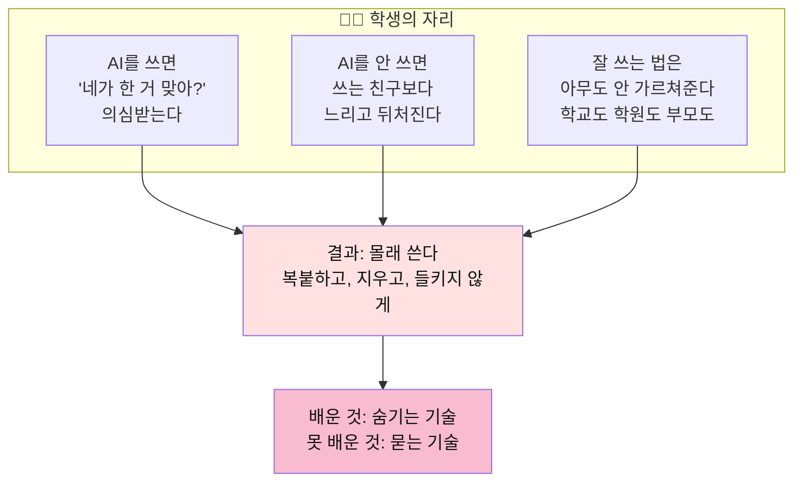
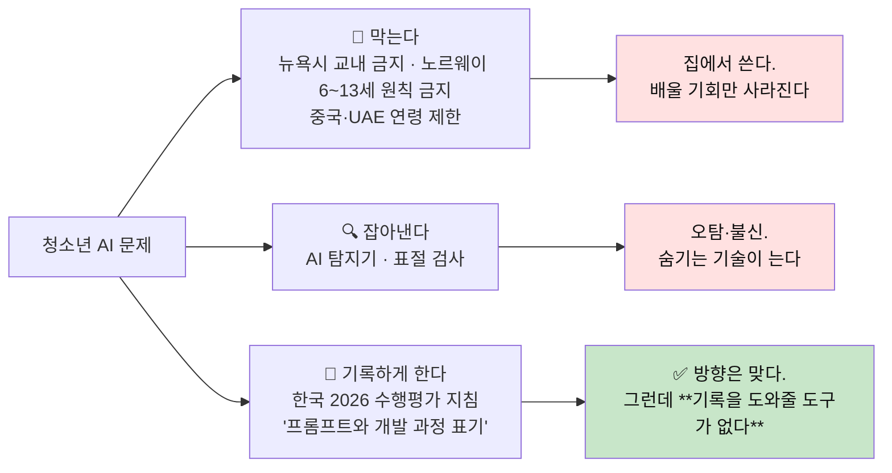
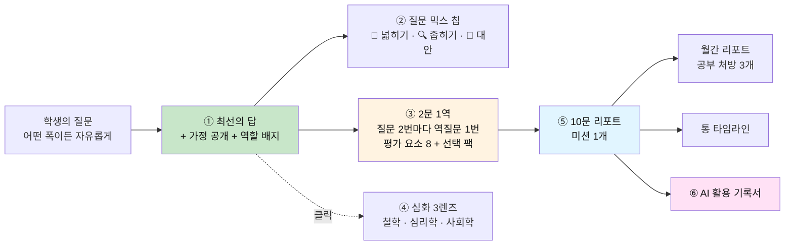
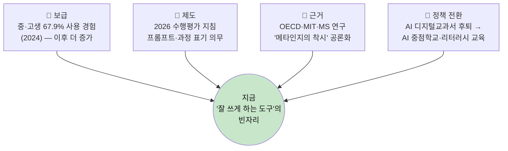
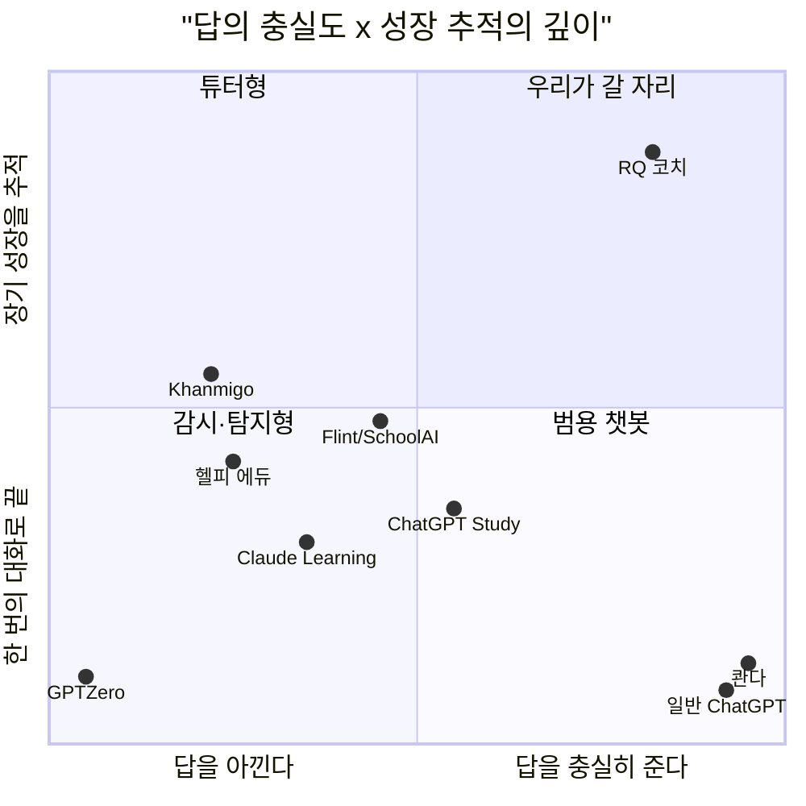
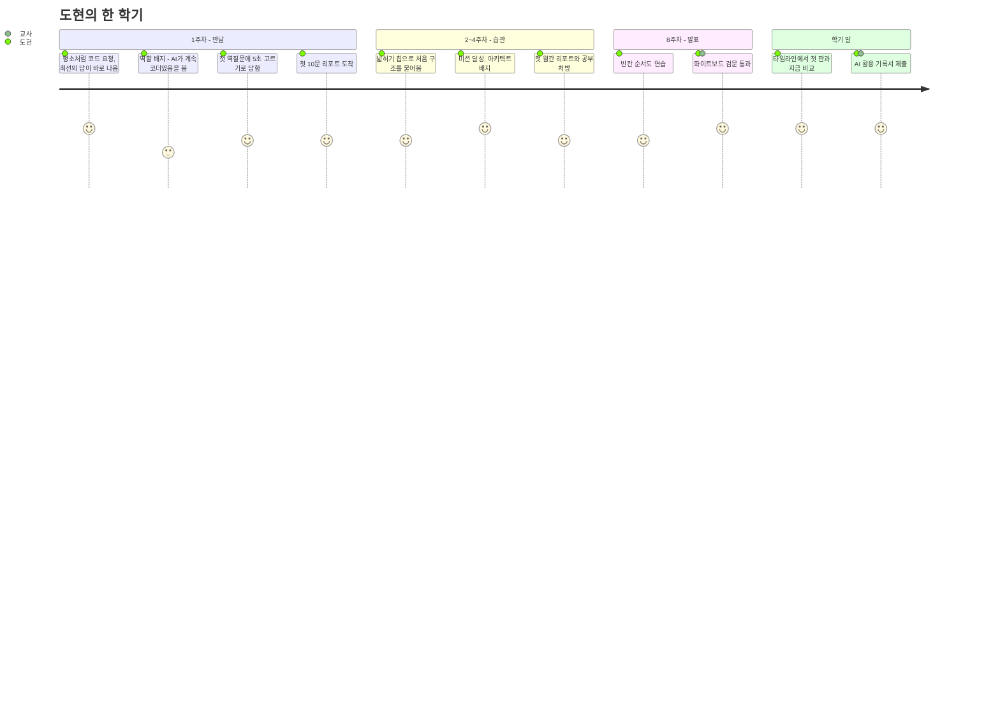
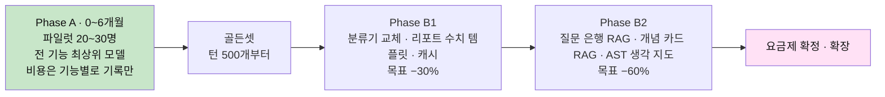
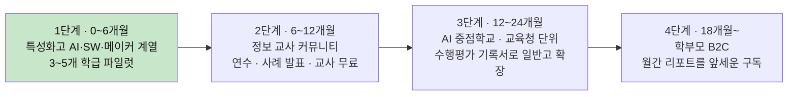
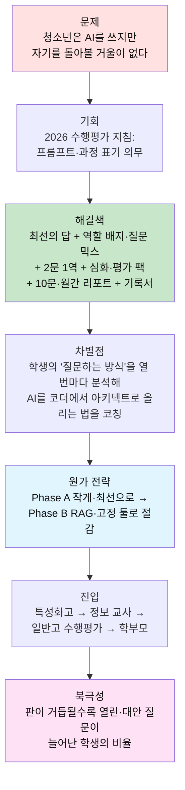

# 📈 사업계획서 — 답하고, 묻고, 코칭하는 청소년 AI (가칭 **RQ 코치**)

> **한 문장**: 청소년이 생성형 AI를 쓸수록 **생각이 얕아지는 게 아니라 깊어지도록**,
> **최선의 답** 위에 **질문 믹스 코칭 · 2문 1역 역질문 · 10문/월간 리포트**를 얹은 AI 도구.
>
> **최신 판**: [사업계획서 v4 — AskBack](AI_역질문_코치_사업계획서_v4.md) (설계서 v4 · 구현된 웹 기준)
> **제품 설계 근거**: [설계서 v3 — 열고, 좁히고, 되묻는다](AI_역질문_설계서_v3_열고_좁히고_되묻는다.md) · [v2](AI_역질문_설계서_v2_답하고_묻고_코칭한다.md) · [v1](AI_역질문_설계서_손으로_증명하는_프롬프트.md)
> **개정**: 설계서 v3 반영 — 최선의 답 우선(Phase A→B) · 질문 개방도와 역할 배지 · 2문 1역 · 심화 3렌즈와 평가 팩 · 분기 리포트 → 10문/월간 리포트
> **작성 기준일**: 2026-09-21 · 시장 수치는 공개 자료 기반이며, **추정치는 '추정'으로 표시**했다(부록 출처 참고)

---

## 0. 요약 (Executive Summary)

| 항목 | 내용 |
|---|---|
| **문제** | 중·고생 3명 중 2명이 생성형 AI를 쓴다. 그러나 쓰는 법은 아무도 가르쳐주지 않았고, 학교는 "금지"와 "허용" 사이에서 흔들린다. 학생은 **쓰면 의심받고, 안 쓰면 뒤처지는** 자리에 서 있다 |
| **기회** | 2026년부터 수행평가에서 AI를 쓰면 **도구·프롬프트·프롬프트 개발 과정을 표기**해야 한다. "프롬프트를 기록하고 돌아보는 일"이 **제도가 요구하는 일**이 됐다 |
| **해결책** | ① 비용을 아끼지 않는 **최선의 답** ② 질문의 폭을 비춰주는 **역할 배지와 질문 믹스 코칭** ③ **질문 2번마다 역질문 1번**(순서도·핵심 요소 등 평가 요소) ④ 클릭해서 여는 **철학·심리학·사회학 심화**와 **메이커·공유·협력·AI(자동화) 평가 팩** ⑤ **질문 10개마다 리포트 + 월간 리포트 + 통 타임라인** ⑥ 제출용 **AI 활용 기록서** |
| **차별점** | 경쟁 도구는 "답을 주거나(챗봇)", "답을 안 주거나(소크라테스 튜터)", "감시하거나(교실 플랫폼·탐지기)" 셋 중 하나다. **최선의 답을 주면서, 학생의 '질문하는 방식'을 10문 단위로 분석해 AI를 코더에서 아키텍트로 끌어올리는 법을 코칭하는 도구는 없다** |
| **고객** | 1차: 특성화고(메이커·AI·SW 계열)와 정보 교사 → 2차: AI 중점학교·일반고 수행평가 → 3차: 학부모 B2C |
| **수익 모델** | 학교 라이선스(학생당 연 과금) + 개인 구독(라이트 월 9,900원 · 프로 월 19,900원 가정) + 학원·메이커스페이스 B2B2C |
| **원가 전략** | **Phase A**: 소규모 파일럿에서 비용을 묻지 않고 최선의 품질을 만든다 → **Phase B**: 그 출력을 정답지(골든셋)로 삼아 RAG·고정 툴·소형 모델로 절감한다. 요금제는 Phase B 실측 후 확정 |
| **검증 계획** | 특성화고 1개 학급(20~30명) 파일럿 → 첫 주에 10문 리포트 발행 → 역질문 응답률 · O3+O4 질문 비율 · 미션 달성률로 효과 확인 |

---

## 1. 문제 제기 — **청소년의 자리에서** 본다

AI와 청소년에 대한 논의는 대부분 **어른의 시점**이다. "의존한다", "베낀다", "사고력이 떨어진다".
이 사업은 출발점을 바꾼다. **그 아이는 지금 어떤 자리에 서 있는가.**

### 1.1 청소년이 처한 세 겹의 딜레마



> **핵심 문제 정의**: 청소년의 문제는 "AI에 의존한다"가 아니다.
> **"AI를 쓰는 자기 자신을 돌아볼 거울이 없다"** 는 것이다.
> 어른은 직업 경험이라는 기준으로 AI의 답을 거른다. 청소년에겐 아직 그 기준이 없다. 그래서 **그럴듯한 답 = 맞는 답**이 된다.

### 1.2 숫자로 본 현실

| 사실 | 수치 | 출처 |
|---|---|---|
| 국내 중·고생의 생성형 AI 사용 경험 | **67.9%** (중·고생 5,778명, 2024.5~7) | 한국청소년정책연구원 |
| 사용 계기 1위는 '호기심', 수업·과제는 2위 | 43.7% / 16.7% | 同 |
| 학생의 AI 과의존을 우려하는 교사 | **90% 이상** | 국내 교육계 조사 보도 |
| GPT-4를 연습에 쓴 고교생의 이후 시험 성적 | 미사용 대비 **17% 낮음** (튀르키예 고교생 약 1,000명 RCT) | 펜실베이니아대 연구 · OECD 인용 |
| LLM으로 에세이를 쓴 집단 | 뇌 연결성 최저 · **자기 글을 인용하지 못함** · '인지 부채' | MIT Media Lab (2025) |
| AI를 신뢰할수록 | **비판적 사고를 덜 한다** (지식노동자 319명) | Microsoft Research · CMU (CHI 2025) |
| OECD의 진단 | **"메타인지의 착시"** — 명쾌한 답을 받으면 이해했다고 착각 | OECD 디지털 교육 전망 2026 |

### 1.3 세상의 대응은 두 갈래 — 둘 다 학생을 돕지 못한다



### 1.4 제도가 연 문 — 2026 수행평가 AI 활용 관리 방안

교육부와 17개 시도교육청은 2025년 12월 공동 방안을 발표했고, **2026년부터 시행** 중이다.

| 지침 내용 | 현장에서 생기는 일 | 우리 제품의 대응 |
|---|---|---|
| 교사가 AI 활용 **허용 범위**를 사전에 정한다 | 교사마다 기준이 다르고 관리 수단이 없다 | 교실 모드: 과제별 허용 범위 설정 |
| 학생은 **AI 도구 · 입력한 프롬프트 · 프롬프트 개발 과정**을 표기한다 | 학생은 대화창을 뒤져 복사·붙여넣기 한다. '개발 과정'은 뭘 써야 할지 모른다 | **AI 활용 기록서 자동 생성** — 프롬프트 이력 · 고친 과정 · 버린 것 · 내가 결정한 것 |
| 출처 없이 AI 생성물을 제출하면 **부정행위** | 억울한 의심과 실제 부정이 섞인다 | 과정 자체가 증거로 남는다 |
| 결과물 → **과정 중심 평가** | 교사가 30명의 과정을 볼 방법이 없다 | 2문 1역 돌아보기 기록 · 10문 리포트 · 통 타임라인 · 교사 요약 |
| 프롬프트 입력 시 **개인정보 유의** 지도 | 교육 자료가 없다 | 입력 시 개인정보 감지·경고 |

> 특성화고 메이커·AI 계열의 **"손으로 순서도를 그리고 핵심과 개선점을 설명해야 AI 사용 인정"** 관행은
> 이 지침이 나오기 전부터 현장이 찾아낸 답이다. 우리는 그 현장의 답을 **제품으로 만든다.**

---

## 2. 해결책 — 제품 개요

자세한 설계는 [설계서 v3](AI_역질문_설계서_v3_열고_좁히고_되묻는다.md)에 있다. 여기서는 사업 관점의 요약만 둔다.

### 2.1 제품이 서 있는 생각

> **질문의 폭이 AI의 역할을 정한다.** 너무 좁게만 물으면 AI는 **코더**에 머문다. 열고, 대안을 물으면 **디자이너·아키텍트**가 된다.
> 그런데 맥락 없이 너무 열면 AI는 **평이한 답**밖에 못 한다. 청소년에게 필요한 것은 "AI 쓰는 법"이 아니라 **이 폭을 섞는 법**이다.

| 질문의 폭 | 예 | AI의 역할 |
|---|---|---|
| O1 지시 | "7번 핀으로 바꿔줘" | ⌨️ 받아쓰기 |
| O2 좁은 질문 | "400 밑이면 펌프 켜는 코드 짜줘" | 👨‍💻 코더 |
| O3 조건 있는 열린 질문 | "이 제약과 기준에서 급수 로직을 어떻게 잡을까?" | 🛠 엔지니어·디자이너 |
| O4 대안 질문 | "이 방식 말고 둘 더. 각각 잃는 건?" | 🏛 아키텍트 |
| O5 맨 열린 질문 | "스마트팜 어떻게 만들어?" | 📚 백과사전 |

### 2.2 제품의 흐름



| 기능 | 학생이 얻는 것 | 교사·학부모가 얻는 것 |
|---|---|---|
| **① 최선의 답 + 역할 배지** | 다른 챗봇보다 나은 답. "이번 답에서 AI는 코더로 일했어" — 내 질문이 AI를 어디에 앉혔는지 매번 본다 | — |
| **② 질문 믹스 칩** | 다음 질문의 초안. 좁게만 묻던 학생이 한 단 위에서 묻게 된다 | — |
| **③ 2문 1역** | 5초~30초짜리 돌아보기. 흐름·핵심·이유·대안·실패·기준·검증·개선 중 하나 | 특성화고식 "순서도 검문"이 매일의 습관으로 |
| **④ 심화 + 평가 팩** | 철학·심리학·사회학으로 생각 넓히기 · 프로젝트에 맞는 평가 축(🔧메이커 📣공유 🤝협력 🤖AI 자동화)을 직접 고른다 | 과제 성격에 맞춘 평가 축 지정 |
| **⑤ 10문 리포트 · 월간 · 타임라인** | **오늘** 내 질문 습관을 안다. 미션 하나. 첫 판부터 지금까지의 성장을 한 줄로 본다 | 점수가 아닌 **성장의 증거** |
| **⑥ AI 활용 기록서** | 수행평가 표기 의무를 1분에 해결 | 과정 중심 평가의 근거 자료 |
| **⑦ 프로세스 → 에이전트** | 자기 방법론, 이후 에이전트 설계 역량 — 🤖 AI(자동화) 팩의 답이 에이전트 설계서 초안이 된다 | 포트폴리오 |

> **제품 철학 세 줄**
> 1. 답을 인질로 잡지 않는다. **최선의 답을 주고, 그 위에서 코칭한다.**
> 2. 늦은 평가는 평가가 아니다. **열 번마다 돌아본다.**
> 3. 억지로 묻지 않는다. 물을 게 없으면 건너뛴다.

---

## 3. 시장성

### 3.1 왜 지금인가 — 네 개의 흐름이 겹쳤다



### 3.2 시장 규모 (TAM · SAM · SOM)

**전제** — 2025년 초·중·고 학생 501.5만 명(교육기본통계). 이 중 중·고생은 **약 260만 명(추정)**.
개인 구독가는 월 9,900원(연 11.9만 원), 학교 라이선스는 학생당 연 2.4만 원으로 가정한다.

| 구분 | 정의 | 산식 | 규모 |
|---|---|---|---|
| **TAM** | 국내 중·고생 전체 | 260만 명 × 연 11.9만 원 | **약 3,090억 원/년** (추정) |
| **SAM** | 이미 생성형 AI를 쓰는 중·고생 | 260만 × 67.9% ≈ 177만 명 × 연 11.9만 원 | **약 2,100억 원/년** (추정) |
| **SOM (3년차)** | 학교 라이선스 8만 명 + 개인 유료 1.5만 명 | 8만 × 2.4만 + 1.5만 × 11.9만 | **약 37억 원/년** (목표) |

**참고 지표 — 지불 의사의 크기**

| 지표 | 수치 | 의미 |
|---|---|---|
| 2025년 사교육비 총액 | **27.5조 원** | 학부모 교육 지출의 절대 규모 |
| 참여 학생 1인당 월평균 | **60.4만 원** | 월 9,900원은 이 금액의 1.6% |
| 국내 에듀테크 시장 (2026 전망) | **약 11조 원** | 디지털 학습 도구에 대한 지출이 이미 형성됨 |
| Khanmigo 이용자 | 6.8만 → **70만+ (1년)**, 380개 이상 학군 | '가르치는 AI'에 대한 수요 검증 |

> **해석 주의**: TAM·SAM은 "전원이 구독한다면"의 상한선이다. 의사결정에 쓸 숫자는 **SOM과 그 전제**다.
> 3년차 SOM은 중·고생의 약 3.6%에 해당한다.

### 3.3 확장 시장

| 단계 | 시장 | 근거 |
|---|---|---|
| 1 | 특성화고 메이커·AI·SW 계열 | 이미 "설명해야 인정" 문화가 있음 → 제품-현장 적합성이 가장 높다 |
| 2 | 일반 중·고교 수행평가 | 2026 지침으로 전 학교가 같은 문제를 가짐 |
| 3 | 학원 · 메이커스페이스 · 코딩 교육 | 프로젝트 수업의 과정 증빙 수요 |
| 4 | 대학 신입생 · 부트캠프 | 같은 문제가 그대로 이어짐. AI 활용 과제의 과정 증빙 |
| 5 | 해외 (영어권 K-12) | 금지에서 '관리된 허용'으로 이동 중. Flint·SchoolAI가 연 시장 |

---

## 4. 경쟁 분석과 벤치마킹

### 4.1 경쟁 지형 — 다섯 부류

| 부류 | 대표 제품 | 하는 일 | 청소년 관점의 한계 |
|---|---|---|---|
| **A. 범용 챗봇의 학습 모드** | ChatGPT Study Mode · Claude Learning Mode · Gemini Guided Learning | 소크라테스식 질문 · 힌트 · 자기 성찰 프롬프트 | 모드를 **학생이 스스로 켜야** 한다. 급하면 끈다. 리포트 없음. 질문 자체(프롬프트의 폭과 습관)는 돌아보지 않는다 |
| **B. 소크라테스 튜터** | Khanmigo ($4/월) · 엘리스 헬피 에듀 | 답을 바로 안 주고 단계별 질문으로 유도 | **교과 문제 풀이** 중심. 프로젝트·만들기 맥락에 약하다. 답을 안 줘서 학생이 이탈한다 |
| **C. 교실 AI 플랫폼** | Flint · SchoolAI · MagicSchool · 클래스팅 AI · 뤼튼(교육청 플랫폼) | 교사가 만든 AI 튜터 · **대화 전체를 교사가 열람** | 구조가 **감시**다. 학생의 도구가 아니라 교사의 도구. 학생 개인의 성장 분석은 없다 |
| **D. 과정 증빙 · 탐지** | Grammarly Authorship · GPTZero · Turnitin | 글의 출처(직접 입력/붙여넣기/AI) 기록 · AI 생성 탐지 | **결백 증명** 도구. 배우게 해주지 않는다. 글쓰기에 한정 |
| **E. 문제 풀이 앱** | 콴다 | 사진 찍으면 풀이 제공 | 의존 문제의 **원인 쪽**에 있다 |
| *(연구)* | VISAR (arXiv 2603.15777) | 사고 보존형 글쓰기 도구. 학부 49명 배포 | 상용 제품 아님. 단, **"학생은 사고를 돕는 장치가 있으면 자발적으로 쓴다"** 는 근거 |

### 4.2 기능 비교표

| 기능 | 범용 챗봇 학습모드 | Khanmigo · 헬피 에듀 | Flint · SchoolAI | Grammarly Authorship | **RQ 코치** |
|---|---|---|---|---|---|
| 충실한 답 제공 | △ (모드 켜면 아낌) | ✕ (의도적으로 안 줌) | △ (교사 설정) | — | **◎ (초안·비평·실행 검증)** |
| 역질문 · 코칭 | ◯ (매번) | ◯ (매번) | △ | ✕ | **◯ (2문 1역 · 평가 요소 8개)** |
| **질문의 폭 코칭** (코더→아키텍트) | ✕ | ✕ | ✕ | ✕ | **◯ (역할 배지 · 넓히기/좁히기/대안 칩)** |
| 심화 렌즈 · 평가 축 선택 | ✕ | ✕ | △ (교사가 설정) | ✕ | **◯ (철학·심리학·사회학 / 메이커·공유·협력·AI 자동화)** |
| 답의 논리를 순서도로 | ✕ | ✕ | ✕ | ✕ | **◯ (3색 생각 지도)** |
| AI가 세운 가정 공개 | ✕ | ✕ | ✕ | ✕ | **◯** |
| **학생의 프롬프트 자체를 분석** | ✕ | ✕ | ✕ | ✕ | **◯ (6요소·유형·위임 범위)** |
| 성장 리포트 | ✕ | △ (학습 진도) | △ (교사용 통계) | ✕ | **◯ 10문마다 + 월간 공부 처방 + 통 타임라인** |
| 제출용 AI 활용 기록서 | ✕ | ✕ | ✕ | ◯ (글쓰기 한정) | **◯ (국내 지침 맞춤)** |
| 프로세스 → 에이전트 설계 | ✕ | ✕ | ✕ | ✕ | **◯** |
| 데이터의 주인 | 기업 | 기업·학교 | **교사** | 작성자 | **학생** (교사는 요약만) |
| 프로젝트·만들기 맥락 | ◯ | ✕ | △ | ✕ | **◯** |
| 가격 | 무료~월 2~3만 원 | $4/월 | 150명 $3,000/년 | 구독 포함 | 월 9,900 / 19,900원 · 학생당 연 2.4만 원~ (가정) |

### 4.3 포지셔닝



### 4.4 벤치마킹 — 가져올 것과 피할 것

| 대상 | ✅ 가져올 것 | 🚫 피할 것 |
|---|---|---|
| **Khanmigo** | 교사 무료 → 학군 확산 전략 · 저가($4) · 비영리적 신뢰 | 답을 끝까지 안 주는 설계(급한 학생은 떠난다) |
| **ChatGPT Study Mode** | 진입 장벽 0 · 기억과 진도의 누적 | 학습 모드가 **선택 사항**이라는 구조 |
| **Claude Learning Mode** | 소크라테스 원칙의 일관성 | 그 일관성이 곧 이탈 사유가 되는 점 |
| **Flint · SchoolAI** | 80명 무료 → 학교 라이선스 · 교사 설정 가능한 범위 | 대화 **전문 열람**(학생이 솔직해지지 않는다) |
| **Grammarly Authorship** | "탐지"가 아니라 **"과정 기록"** 이라는 프레임 · PDF 내보내기 | 증빙에서 멈추고 학습으로 안 이어지는 점 |
| **엘리스 헬피** | 교육청 단위 공급 · 정보 교과 특화 | 교사 업무 도구와 학생 학습 도구가 한 제품에 섞임 |
| **VISAR 연구** | 계획·논증 구조를 시각화하면 학생이 자발적으로 쓴다는 근거 | — |

---

## 5. 차별점과 방어력

### 5.1 여섯 가지 차별점

```text
1. 최선의 답을 준다          경쟁 '교육용 AI'의 대부분은 답을 아낀다. 우리는 가장 좋은 답 위에서 코칭한다.
2. 질문의 '폭'을 코칭한다     모두가 AI의 답을 다룬다. 우리는 학생의 질문이 AI를 코더로 만드는지
                            아키텍트로 만드는지를 매 답마다 비춰주고, 섞는 법을 알려준다.
3. 두 번 묻고 한 번 돌아본다   예측 가능한 리듬 + 정해진 평가 요소. 특성화고의 순서도 검문이 매일의 5초가 된다.
4. 심화와 평가 축을 고른다     철학·심리학·사회학 / 메이커·공유·협력·AI(자동화) — 밀어넣지 않고 학생이 연다.
5. 열 번마다 리포트          3개월 뒤가 아니라 오늘 안다. 미션 하나. 그리고 첫 판부터 지금까지를 통으로 본다.
6. 학생이 데이터의 주인이다    교사는 요약만. 감시 도구가 아니라 학생의 도구다.
```

### 5.2 방어력 (Moat)

| 축 | 내용 | 빅테크가 따라오기 어려운 이유 |
|---|---|---|
| **종단 데이터** | 한 학생의 판(10문) 단위 성장 궤적 — 질문 믹스 · 평가 요소 · 미션 | 범용 챗봇은 대화를 '학습 자료'로 구조화하지 않는다 |
| **골든셋과 질문 은행** | Phase A에서 쌓이는 "최선의 역질문·피드백·리포트" 정답지 → Phase B의 RAG 자산 | 청소년 프로젝트 맥락의 검수된 코칭 데이터는 시간과 현장이 있어야 쌓인다 |
| **처방 엔진** | 막힘 신호 → 지식/기술/습관 구멍 분류 → 학습 행동 | 국내 교육과정·프로젝트 수업 맥락의 분류 체계가 필요하다 |
| **현장 방법론** | 특성화고의 순서도 검문을 제품·교사 연수로 체계화 · 교사가 만드는 커스텀 평가 팩 | 기능이 아니라 **수업 운영 방식**이 같이 팔린다 |
| **제도 적합성** | 국내 수행평가 지침에 맞춘 기록서 양식 | 글로벌 제품은 국내 지침 단위까지 맞추지 않는다 |
| **신뢰 구조** | 학생 소유 · 교사 요약 열람 | 교사 열람 기반 플랫폼은 구조를 뒤집기 어렵다 |

> **정직한 평가**: 기능 하나하나는 빅테크가 몇 달이면 만든다. 방어력은 **기능이 아니라 쌓인 데이터와 학교 현장에 뿌리내린 운영 방식**에서 나온다.
> 그래서 초기 전략은 넓게 퍼지는 것이 아니라 **특성화고에서 깊게 자리 잡는 것**이다.

---

## 6. 페르소나 — 청소년 넷, 어른 둘

### 6.1 🧑‍🔧 도현 (특성화고 2학년 · AI학과) — **핵심 타깃**

| 항목 | 내용 |
|---|---|
| **상황** | 졸업 작품으로 AI 분리수거 로봇팔 제작 중. 코드의 70%는 AI가 짰다 |
| **하루** | 실습실에서 ChatGPT 탭을 항상 띄워둔다. 막히면 에러를 그대로 붙여넣는다 |
| **진짜 고민** | 다음 달 중간 발표에서 선생님이 **화이트보드에 순서도를 그려보라**고 한다. 돌아가긴 하는데 **왜 돌아가는지 설명을 못 한다** |
| **속마음** | "AI 쓴 게 잘못은 아니잖아. 근데 물어보면 할 말이 없어." |
| **필요한 것** | 답은 계속 받되, **내가 뭘 모르는지 미리 알려주는 것** |
| **제품의 첫 가치** | 역할 배지와 첫 10문 리포트 — "이번 판에서 AI는 열 번 중 아홉 번 ⌨️👨‍💻였어" |

### 6.2 📚 서윤 (일반고 1학년) — 수행평가 불안

| 항목 | 내용 |
|---|---|
| **상황** | 한 학기 수행평가 11개. 탐구 보고서에 AI를 썼는데 **표기를 어떻게 해야 하는지** 모른다 |
| **진짜 고민** | "프롬프트 개발 과정을 쓰라는데, 그게 뭔데?" 솔직히 쓰면 감점될까 봐 무섭다 |
| **속마음** | "다들 쓰는데 나만 정직하게 쓰면 손해 아냐?" |
| **필요한 것** | **정직하게 써도 불리하지 않은 기록** — 내가 판단한 부분이 드러나는 기록 |
| **제품의 첫 가치** | AI 활용 기록서 1분 내보내기 |

### 6.3 🌱 민준 (중3 · 메이커 동아리) — 성장형

| 항목 | 내용 |
|---|---|
| **상황** | 아두이노 스마트 화분 제작. 만드는 게 재밌다. AI가 코드를 주면 일단 올려본다 |
| **진짜 고민** | 고민이 없는 게 문제. 되니까 넘어간다. **같은 데서 계속 막히는 줄 모른다** |
| **필요한 것** | 재미를 끊지 않으면서 **한 번씩 옆에서 짚어주는 사람** |
| **제품의 첫 가치** | 10문 리포트의 '걸린 곳' — "millis() 질문이 세 판 합쳐 7번째야" · 미션 하나 |

### 6.4 😶 하은 (중2) — 저관여 · 가장 위험한 집단

| 항목 | 내용 |
|---|---|
| **상황** | 숙제를 AI에 통째로 넣고 결과를 붙여넣는다. 읽지 않는다 |
| **진짜 고민** | 숙제가 **왜 필요한지 모르겠다.** AI가 해주는데 |
| **속마음** | "어차피 선생님도 다 안 읽잖아." |
| **필요한 것** | 설교가 아니라 **작은 호기심 하나** |
| **제품의 첫 가치** | 10문 리포트의 '이번 판의 질문' — "열 개 중 제일 좋았던 질문은 이거야" |
| **설계 원칙** | 하은에게는 리듬을 **3문 1역 · 고르기(5초) 형태**로 시작한다. 떠나면 아무것도 못 한다 |

### 6.5 👩‍🏫 박지영 선생님 (특성화고 정보·AI 교과, 11년차) — 구매 영향자

| 항목 | 내용 |
|---|---|
| **상황** | 3개 반 72명. 모든 학생이 AI로 프로젝트를 만든다 |
| **진짜 고민** | 한 명씩 순서도 검문을 하면 **한 반에 2시간**. 지침은 과정을 평가하라는데 과정을 볼 방법이 없다 |
| **필요한 것** | 72명 중 **오늘 누구와 이야기해야 하는지** 알려주는 요약 |
| **구매 기준** | 수업 시간을 안 뺏을 것 · 학생부 기재 근거가 될 것 · 개인정보 문제가 없을 것 |

### 6.6 👨‍👩‍👧 학부모 (중3 자녀) — B2C 결제자

| 항목 | 내용 |
|---|---|
| **진짜 고민** | 아이가 AI로 숙제를 한다. **막아야 하나, 둬야 하나.** 물어볼 데가 없다 |
| **필요한 것** | 감시가 아니라 **"아이가 자라고 있다"는 증거** |
| **제품의 첫 가치** | 월간 리포트 공유 요약 — 첫 판의 질문 vs 최근 판의 질문, 그때와 지금 AI의 역할 |

---

## 7. 유저 시나리오

### 7.1 도현의 한 학기 — 첫날부터 발표까지



| 시점 | 도현이 하는 일 | 제품이 하는 일 | 도현에게 남는 것 |
|---|---|---|---|
| **1일차** | "로봇팔 서보모터 제어 코드 짜줘" | 최선의 답 + 내가 가정한 것 + **"이번 답에서 나는 👨‍💻 코더로 일했어"** | 기존 챗봇보다 답이 낫다 → **계속 쓴다** |
| **1일차** | 두 번째 질문 직후 | 역질문(🗺 흐름 · 고르기): "방금 코드의 순서로 맞는 건? ①②③ ④잘 모르겠어" | 5초. 부담 없다 |
| **3일차** | 질문 10개 도달 | **📄 첫 10문 리포트**: ⌨️3 👨‍💻6 📚1 · '기준' 0/10 · 미션 "10번 중 1번은 '이 구조가 맞을까?'로 묻기" | 석 달 뒤가 아니라 **3일 만에** 자기 질문 습관을 본다 |
| **2주차** | [🌅 넓히기] 칩을 눌러 초안을 고쳐 보냄 | 🛠 엔지니어로서의 답 — 서보 3개를 순차가 아니라 동시에 움직이는 구조 제안 | 질문을 바꿨더니 **답의 수준이 달라졌다** |
| **3주차** | "이 방식 말고 다른 건?" | 비교표 + 추천 + 추천이 틀리는 조건 · 🏛 아키텍트 · 배지 획득 | AI와 설계를 **의논**하기 시작한다 |
| **4주차** | 첫 월간 리포트 | 공부 처방: ①인터럽트 개념 ②에러 첫 줄 읽기 ③기준 먼저 정하기 | 다음 달에 **공부할 것**이 생긴다 |
| **7주차** | "다음 주 발표야" | 이정표 감지 → 빈칸 순서도 2칸 → 1칸 틀림 → 그 칸만 다시 | 발표 전에 **구멍을 미리 안다** |
| **8주차** | 화이트보드 검문 | (제품 밖) | 순서도를 그리고 핵심·개선점을 설명한다 ✅ |
| **학기 말** | 타임라인 [첫 판과 지금 비교] | 1판: ⌨️ 받아쓰기 30% · 👨‍💻 60% → 14판: 🛠 30% · 🏛 25% | 성장이 **한 줄로** 보인다 |
| **학기 말** | 수행평가 제출 | AI 활용 기록서 PDF (공유 팩 S2 '출처와 기여'의 답이 그대로 들어감) | 표기 의무 해결 + 자기 판단의 증거 |

### 7.2 서윤의 수행평가 주간 (5일)

```text
월  탐구 주제 "우리 동네 미세먼지와 등교 시간대" — 📣 공유 팩을 켠다 (수행평가는 출처와 기여가 중요하니까)
    "미세먼지 자료 찾아줘" → 답 + 📚 백과사전 배지 + [🔍 좁히기] "우리 구, 최근 1년, 등교 시간대로 좁혀서"
화  AI가 준 통계 하나가 이상함 → 역질문(🔬 검증): "이 숫자, 어디서 확인해 볼 수 있을까?" → 직접 찾아 수정
수  "보고서 구조 말고 다른 구성은?" → 🏛 비교표 → 역질문(📣 S2): "여기서 AI가 한 일과 네가 한 일을 한 줄씩 나누면?"
목  📄 10문 리포트 — O5 3회 → 1회로 줄었어 · '검증' 🟢 · 미션: 결론의 방향을 AI에게 묻지 말고 먼저 써보기
금  ▶ AI 활용 기록서 내보내기
     · 사용 도구 / 프롬프트 14개 / 개발 과정(질문이 어떻게 좁혀지고 넓혀졌는지)
     · AI가 한 것: 자료 후보 제시, 구성안 비교   · 내가 한 것: 주제 선정, 통계 검증, 결론  ← S2의 답
     → 정직하게 썼는데, 오히려 '내가 한 일'이 또렷이 보인다
```

### 7.3 박 선생님의 금요일 10분

```text
교사 요약 화면 (원문 대화는 보이지 않는다)

  3반 24명 · 이번 주 · 과제: 졸업작품 중간 점검 · 팩: 🔧 메이커 · 리듬 2:1
  ──────────────────────────────────────────────────────────────
  AI 역할이 ⌨️👨‍💻 90% 이상인 학생       5명  ← 설계를 혼자 다 정하고 있거나, 안 정하고 있거나. 오늘 5분씩
  돌아보기 '기준'이 계속 ⚪인 학생         7명  ← 다음 주 수업 도입 10분: "잘 됐다는 걸 뭘로 알지?"
  같은 개념에서 3회 이상 걸림             6명  ← 공통: '시리얼 통신' → 미니 강의
  미션 달성                            14명
  기록서 제출 완료                       17명
```

> 교사는 **감시자가 아니라 코치의 코치**가 된다. 누구에게, 무엇을 물어야 하는지 제품이 알려준다.

### 7.4 학부모가 받는 월간 요약 (학생이 공유를 선택한 경우만)

```text
📘 민준의 9월 — 한 장 요약
   첫 판의 질문     "아두이노로 스마트 화분 코드 짜줘"                       AI의 역할: ⌨️ 받아쓰기
   최근 판의 질문   "센서를 가장자리에 꽂았는데 가운데랑 다를까? 어느 쪽이 '진짜'야?"   AI의 역할: 🏛 아키텍트
   달라진 점       AI에게 받아쓰게 하던 아이가, AI와 설계를 의논합니다.
   다음 달         '시간을 다루는 법'을 공부하기로 스스로 정했습니다.
```

---

## 8. 비즈니스 모델

### 8.1 수익 구조

| 채널 | 고객 | 가격 (가정) | 포함 내용 |
|---|---|---|---|
| **무료** | 학생 개인 | 0원 | 최선의 답(일 한도) · 역할 배지 · 2문 1역 · 10문 리포트(최근 1개만 열람) |
| **라이트** | 학생·학부모 | **월 9,900원** | 월 질문 한도 내 전 기능 · 10문 리포트 전체 · 통 타임라인 · 기록서 내보내기 |
| **프로** | 학생·학부모 | **월 19,900원** | 무제한 · **월간 리포트 + 공부 처방** · 심화 3렌즈 · 평가 팩 · 프로세스 카드 · 포트폴리오 PDF |
| **학교 라이선스** | 학교·교육청 | **학생당 연 2.4만 원~** (30명 학급 무료 체험) | 프로 기능 + 교실 모드(리듬·팩 지정) · 교사 요약 · 과제별 AI 허용 범위 |
| **교사** | 교사 개인 | **무료** | 교사 요약 · 검문 카드 · 커스텀 평가 팩 · 수업 자료 (확산 채널) |
| **B2B2C** | 학원 · 메이커스페이스 · 코딩 교육 | 좌석당 월 과금 | 학교 라이선스와 동일 + 브랜딩 |

**가격 기준점** — Khanmigo $4/월(약 5,500원) · MagicSchool Plus $8.33/월 · Flint 150명 $3,000/년(1인당 약 $20/년) · 범용 챗봇 유료 플랜 월 2~3만 원대.
v3의 "최선의 답" 전략은 원가가 높아, 라이트/프로 2단 구성으로 바꿨다. **최종 요금은 Phase B 실측 후 확정한다.**

### 8.2 원가 전략 — Phase A에서 쓰고, Phase B에서 줄인다



| 항목 | 추정 (파일럿 첫 주에 실측으로 교체) | 비고 |
|---|---|---|
| Phase A 턴당 비용 | 300~700원 | 답(초안+비평+실행 검증) · 분석 · 생각 지도 · 역질문 · 채점 |
| 활성 학생 월 질문 수 | 60~100개 | v2 예시(3개월 214개) 기준 |
| **Phase A 학생 1인당 월 원가** | **약 2만~6만 원** | 구독가를 크게 넘는다 → **의도된 투자**. 인원을 작게 잡아 총액을 통제 |
| Phase A 총 LLM 예산 | 30명 × 6개월 ≈ **400만~1,100만 원** | 이 돈으로 "최선이 무엇인지"와 골든셋을 산다 |
| Phase B2 이후 1인당 월 원가 (목표) | 약 0.8만~2.4만 원 | −60% 달성 시 |
| 프로(19,900원) 공헌이익률 (목표) | 30~55% | 상단 원가에서는 빠듯하다 |
| 라이트(9,900원) | 월 질문 한도로 원가를 묶는다 | 한도는 실측 후 결정 |
| 학교 라이선스(월 환산 2,000원) | **현재 구조로는 적자** | 교육청 단위 계약가 상향 · 학교용 일 한도 · 절감 −80% 도전 · 모델 단가 하락 반영 |

> **가장 큰 재무 리스크는 원가다.** "최선의 답"은 추론 비용을 요구하고, v3는 그것을 알고 선택했다.
> 방어선은 셋이다 — ① Phase A는 작게 ② 기능별 비용 기록으로 줄일 곳을 데이터로 정한다 ③ **학생이 보는 답 본문은 끝까지 아끼지 않고, 그 주변(분류·집계·질문 생성)에서 줄인다.**
> LLM 단가는 해마다 내려왔다. 다만 그 하락을 계획의 전제로 삼지는 않는다.

### 8.3 3개년 목표 (시나리오)

| 지표 | 1년차 | 2년차 | 3년차 |
|---|---|---|---|
| 단계 | Phase A → B1 | Phase B2 · 요금제 확정 | 확장 |
| 도입 학교 | 5곳 (파일럿) | 60곳 | 250곳 |
| 학교 라이선스 학생 | 1,000명 | 2만 명 | 8만 명 |
| 개인 유료 구독 | 300명 | 4,000명 | 1.5만 명 |
| 연 매출 (추정 · 라이트가 기준의 보수적 계산) | 약 0.6억 원 | 약 9.6억 원 | **약 37억 원** |

---

## 9. 시장 진입 전략 (Go-to-Market)



| 단계 | 핵심 활동 | 왜 이 순서인가 |
|---|---|---|
| **1. 특성화고 파일럿** | 교사와 공동 설계 · 1학기 운영 · 첫 주에 10문 리포트, 첫 달에 월간 리포트 발행 | 이미 "설명해야 인정" 문화가 있다. **설득이 필요 없는 고객** |
| **2. 교사 커뮤니티** | 교사 계정 무료 · 검문 카드·수업안 공개 · 연수 | 학교 구매는 **교사 추천**으로 움직인다 (Khanmigo 방식) |
| **3. 일반고 · 교육청** | AI 활용 기록서를 앞세운다 | 2026 지침으로 **모든 학교가 같은 숙제**를 가졌다 |
| **4. B2C** | 월간 리포트 공유 요약이 학부모에게 도달 | 학생이 쓰던 제품을 **부모가 결제**하는 흐름 |

**초기 콘텐츠 자산**: "수행평가 AI 활용 기록서 쓰는 법" 무료 가이드 · 교사용 3분 검문 카드 · 프롬프트 노트(종이) 양식 — 제품 없이도 가치를 주는 자료로 신뢰를 먼저 쌓는다.

---

## 10. 실행 로드맵과 KPI

설계서 v3 §15의 단계(A0~A5 · B1~B2)와 맞춘다.

| 분기 | 제품 | 사업 | 핵심 KPI |
|---|---|---|---|
| **Q1** | **A0** 최선의 답(초안·비평·실행 검증) · **A1** 6요소·개방도 분석 · 역할 배지 · 칩 | 파일럿 학교 3곳 · 학생 20~30명 | **블라인드 비교에서 범용 챗봇 대비 선호 60%** |
| **Q2** | **A2** 2문 1역 · 평가 8요소 · **A3** 10문 리포트 · 통 타임라인 | 1학기 파일럿 운영 | 역질문 응답률 65% · 10문 리포트 열람률 70% |
| **Q3** | **A4** 심화 3렌즈 · 메이커·공유·협력·AI(자동화) 팩 · AI 활용 기록서 · **A5** 월간 리포트 | 첫 월간 리포트 · 사례집 | 미션 달성률 50% · 심화 사용 학생 30% |
| **Q4** | **A5** 교실 모드 · 교사 요약 · **B1** 골든셋 · 분류기 교체 · 캐시 | 학교 라이선스 유료 전환 | 파일럿 → 유료 전환 50% · 턴당 비용 −30% |
| **Q5~6** | **B2** 질문 은행 RAG · 개념 카드 RAG · AST 생각 지도 | 요금제 확정 · 교육청 1곳 · B2C 출시 | 턴당 비용 −60%(품질 유지) · 도입 60곳 |
| **Q7~8** | **C** 프로세스 카드 → 에이전트 설계 코칭 | 학원·메이커스페이스 채널 | 개인 유료 4,000명 |

**북극성 지표**: **판이 거듭될수록 O3+O4(열린 질문·대안 질문) 비율이 오른 학생의 비율** (구현 단계 제외).
학생의 언어로는 "AI를 🏛🛠로 쓰는 비중이 늘었는가". 매출도 사용량도 아닌 이 숫자가 "제품이 약속을 지키고 있는가"를 말해준다.

---

## 11. 리스크와 대응

| 리스크 | 가능성 | 영향 | 대응 |
|---|---|---|---|
| **빅테크가 같은 기능을 넣는다** | 높음 | 높음 | 기능이 아니라 **종단 데이터 · 국내 지침 적합 · 학교 운영 방식**으로 방어. 특정 모델에 종속되지 않는 구조 |
| **답을 주니 결국 의존을 돕는다** | 중간 | 높음 | 북극성 지표(O3+O4 비율)와 평가 요소의 형태 전진(고르기→서술)으로 상시 점검. 효과가 안 나오면 코칭 설계를 바꾼다. **효과 검증 결과를 공개**한다 |
| **원가가 구독가를 넘는다** (최선의 답 전략) | 높음 | 높음 | Phase A는 20~30명으로 작게 · 기능별 비용 기록 · Phase B에서 RAG·고정 툴·소형 모델로 −60% · 라이트/프로 2단 요금 · 학교용 일 한도와 교육청 단위 계약 |
| **2문 1역이 잔소리가 된다** | 중간 | 높음 | 억지 질문 금지(관련 요소 없으면 건너뜀) · 5초 고르기부터 · [나중에] 3연속이면 3:1·4:1 제안 · 급할 땐 적립 |
| **절감하다 품질이 무너진다** | 중간 | 높음 | 골든셋 대비 동등할 때만 교체 · 주 1회 표본 재평가 · 기능별 되돌리기 스위치 · 답 본문은 교체 대상에서 제외 |
| **청소년 개인정보** | 중간 | 높음 | 만 14세 미만 법정대리인 동의 · 최소 수집 · 학생 소유·삭제권 · 교사는 요약만 · 입력 시 개인정보 감지 |
| **학교 구매 주기가 길다** | 높음 | 중간 | 교사 무료 → 학급 무료 체험 → 학교 예산 편성기(하반기)에 맞춘 영업 |
| **학생이 역질문을 다 건너뛴다** | 중간 | 중간 | 막지 않는다. 역질문의 쓸모("이걸 정하면 답이 더 정확해져") · 복기함 · 10문 리포트의 질문 습관 분석은 역질문 없이도 나온다 |
| **미션·월간 처방이 틀린다** | 중간 | 중간 | 근거 데이터 공개 · 학생이 기각 가능 · 기각도 개선 데이터 |
| **제도가 바뀐다** (금지 쪽으로) | 낮음 | 높음 | 기록서는 부가 가치. 핵심 가치(최선의 답 + 질문 코칭 + 성장 리포트)는 제도와 무관하게 성립 |

---

## 12. 검증 계획 — 돈을 쓰기 전에 확인할 가설

| # | 가설 | 실험 | 통과 기준 |
|---|---|---|---|
| H0 | **종이로도 된다** | 제품 없이 프롬프트 노트: 질문 2개마다 평가 요소 1개를 스스로 적기 + 10문마다 수기 회고 | 4주 지속률 50% — 안 되면 앱으로도 안 된다 |
| H1 | 최선의 답은 체감된다 | 같은 질문을 범용 챗봇과 블라인드 비교 | 선호 60% 이상 · 전체 AI 사용의 50% 이상이 이 도구에서 발생 |
| H2 | **2문 1역**은 잔소리로 느껴지지 않는다 | 응답/건너뛰기 로그 + 인터뷰 | 응답률 65% · [나중에] 3연속 10% 미만 · "귀찮다" 30% 미만 |
| H3 | 역할 배지와 칩은 질문을 바꾼다 | 배지·칩 노출군 vs 비노출군 | 노출군의 O3+O4 비율이 유의하게 높다 · 칩 → 질문 전환 20% |
| H4 | **10문 리포트**는 읽히고 미션은 실행된다 | 발행 후 다음 판 추적 | 열람률 70% · 미션 달성률 50% |
| H5 | 월간 처방은 실행된다 | 첫 월간 발행 후 4주 추적 | 처방 3개 중 1개 이상 실행한 학생 33% |
| H6 | 억지 질문 금지 규칙이 품질을 지킨다 | 역질문별 "이 질문 어땠어?" 1탭 평가 | "뜬금없다" 10% 미만 |
| H7 | 교사는 요약만으로 수업 개입을 결정할 수 있다 | 교사 3명 주간 사용 | "오늘 누구와 이야기할지 알았다" 주 1회 이상 |
| H8 | Phase B의 절감은 품질을 건드리지 않는다 | 골든셋 대비 블라인드 평가 · 주 1회 표본 50개 | 기능별 기준(설계서 v3 §2.4) 충족 · 답 선호도 유지 |
| H9 | 학부모는 월간 리포트에 지불한다 | 공유 요약 → 구독 전환 랜딩 | 전환율 3% 이상 |

> **H0이 가장 먼저다.** 설계서 v1의 원칙 그대로 — 노트가 안 돌아가면 앱도 안 돌아간다.
> **H1이 그다음이다.** 답이 최고가 아니면 나머지 가설은 시험할 기회조차 없다.

---

## 13. 필요 자원 (초기 12개월)

| 영역 | 구성 | 비고 |
|---|---|---|
| **제품** | 풀스택 1~2 · AI/프롬프트 엔지니어 1~2 · 디자이너 0.5 | 난이도 최상: 답변기(비평·실행 검증) · 역질문 선택 로직 · Phase B의 골든셋 평가 체계 |
| **교육** | 교육 설계 1 (현직·전직 정보 교사) | 평가 요소·팩의 질문 은행 검수 · 처방 분류 체계 · 교사 연수 |
| **현장** | 파일럿 학교 교사 3~5명 (공동 설계자) | 자문료 · 사례 공동 발표 |
| **비용** | 인건비 + **Phase A LLM 예산 400만~1,100만 원(추정)** + 개인정보·보안 자문 | 정부 지원: 에듀테크 실증 · AI 바우처 · 창업 지원 사업 검토 |

---

## 14. 한 장 요약



---

## 부록 — 출처

**국내 현황 · 제도**
- [청소년 3명 중 2명, 생성형 AI 사용 경험 (한국청소년정책연구원 조사) — 에듀플러스](https://www.eduplusnews.com/news/articleView.html?idxno=14137)
- [청소년 67.9% 생성형 AI 사용… 교육 부족 우려 — 에듀모닝](https://edumorning.com/articles/126)
- [올해부터 바뀌는 중고등학교 수행평가 AI 활용 지침 — 대한민국 정책브리핑](https://www.korea.kr/news/reporterView.do?newsId=148957866)
- [시도교육청 「수행평가 시 인공지능(AI) 활용 관리 방안」 — 교육부](https://www.moe.go.kr/boardCnts/viewRenew.do?boardID=294&boardSeq=104984&lev=0&m=020402)
- [2026 학생부 기재요령 확정 — 한국대학신문](https://news.unn.net/news/articleView.html?idxno=590156)
- ["학생 사고력 마비"…교실 밖으로 쫓겨난 AI — 경제타임스](https://www.ket.kr/news/article.html?no=40591)
- [AI 교육 2026 대전환: AI 디지털교과서가 사라진 이유 — JackerLab](https://reads.jackerlab.com/2026-03-28_ai-%EA%B5%90%EC%9C%A1-%EB%8C%80%EC%A0%84%ED%99%98-%EA%B5%90%EC%8B%A4%EC%9D%98-%EB%AF%B8%EB%9E%98/)
- [월간 교육정책포럼 — 교육정책네트워크(KEDI)](http://edpolicy.kedi.re.kr/edpolicy/webzine/38/844819)

**시장 통계**
- [2025년 교육기본통계 조사 결과 — KDI 경제교육·정보센터](https://eiec.kdi.re.kr/policy/materialView.do?num=270346)
- [2025년 초중고 사교육비조사 결과 — 대한민국 정책브리핑](https://www.korea.kr/news/policyNewsView.do?newsId=156748552)
- [2025년 사교육비 조사: 사교육 총액 27.5조 — 에듀모닝](https://edumorning.com/articles/1882)

**연구**
- [Your Brain on ChatGPT — MIT Media Lab](https://www.media.mit.edu/publications/your-brain-on-chatgpt/)
- [The Impact of Generative AI on Critical Thinking — Microsoft Research](https://www.microsoft.com/en-us/research/publication/the-impact-of-generative-ai-on-critical-thinking-self-reported-reductions-in-cognitive-effort-and-confidence-effects-from-a-survey-of-knowledge-workers/)
- [Enhancing Critical Thinking in Generative AI Search with Metacognitive Prompts — arXiv](https://arxiv.org/pdf/2505.24014)
- [Lessons from Real-World Deployment of a Cognition-Preserving Writing Tool (VISAR) — arXiv](https://arxiv.org/abs/2603.15777)

**경쟁 제품**
- [Khanmigo pricing](https://www.khanmigo.ai/pricing) · [Khanmigo 68,000 → 700,000 users — AI for Cause](https://aiforcause.org/stories/khanmigo-ai-tutor)
- [Introducing study mode — OpenAI](https://openai.com/index/chatgpt-study-mode/) · [AI Study Modes: ChatGPT vs Gemini vs Claude (2026) — Glasp](https://glasp.co/articles/ai-study-modes-compared) · [ChatGPT vs Gemini vs Claude for Teachers — Educators Technology](https://www.educatorstechnology.com/2026/04/chatgpt-vs-gemini-vs-claude-for-teachers.html)
- [Flint Review 2026 — Tooliverse](https://tooliverse.ai/tools/flint) · [MagicSchool AI vs SchoolAI — Academic AI Trends](https://academicaitrends.com/blog/magicschool-ai-vs-schoolai-for-teachers/) · [MagicSchool Pricing 2026 — EduSage](https://www.edusageai.com/blogs/magicschool-pricing-for-teachers-and-districts-in-2026)
- [From AI Detection to Authorship — Grammarly](https://www.grammarly.com/blog/company/ai-detector-authorship/)
- [엘리스스쿨, 맞춤형 생성형 AI '헬피챗' 공개 — 스타트업엔](https://www.startupn.kr/news/articleView.html?idxno=59868) · [엘리스](https://elice.io/ko)
- [뤼튼 '크랙' 청소년 이용 제한 — 이데일리](https://www.edaily.co.kr/News/Read?newsId=03608006645578152) · [뤼튼 1,000억 원 투자 유치 — 한국일보](https://www.hankookilbo.com/news/article/A2026082616520005169)
- [2026 AI 중점학교를 위한 클래스팅 AI — 클래스팅 블로그](https://blog.classting.com/2026-ai-jungjeomhaggyo-dijiteolseondohaggyoreul-wihan-keulraeseuting-ai-sinjepum-3jong/) · [콴다 리뷰 — AI 도구 모음](https://www.aimoeum.com/ko/tools/qanda)

> **수치 관련 주의** — ① 중·고생 "약 260만 명"은 초·중·고 전체 501.5만 명에서 추정한 값이다. 투자 자료로 쓰기 전에 교육통계서비스(kess.kedi.re.kr)에서 학교급별 수치를 확인해야 한다.
> ② "교사 90% 이상 우려"와 "에듀테크 11조"는 2차 보도 기준이므로 원 조사를 확인해야 한다.
> ③ 가격·원가(턴당 300~700원 등)·3개년 목표는 **모두 가정**이며 §12의 파일럿으로 검증할 대상이다. 원가는 파일럿 첫 주의 실측값으로 교체한다.
