# 📈 사업계획서 v4 — AskBack: 코드보다 설계 먼저, 묻고 되묻고 기획서를 남기는 청소년 AI 코치

> **한 문장**: 코드 · 문장 · 영상은 AI가 금방 만드는 시대에, 청소년이 **그 앞의 설계(기획 · 알고리즘 · 전체 구조)를 자기 말로 정하게** 하고,
> 그 과정을 **기획서(.md)와 10문 리포트**로 남겨 주는 AI 코치.
>
> **제품 근거**: [설계서 v4 — 설계를 묻고, 기획서를 남긴다](AI_역질문_설계서_v4_설계를_묻고_기획서를_남긴다.md) · [사이트맵 · 주요 기능 v4](AI_역질문_사이트맵_v4.md)
> **이전 판**: [사업계획서 (설계서 v3 기준 · 가칭 RQ 코치)](AI_역질문_코치_사업계획서.md)
> **개정 요지**: ① 제품명 **AskBack** ② 결과물이 코드에서 **명세와 기획서**로 ③ 핵심 고객을 **프로젝트를 하는 중학생**으로 ④ 바이브 코딩 도구를 경쟁자가 아닌 **뒷단**으로 ⑤ **이미 돌아가는 웹 프로토타입**을 출발점으로
> **작성 기준일**: 2026-09-21 · 시장 수치는 이전 판의 공개 자료를 그대로 쓰며 **추정 · 가정은 그렇게 표시**했다(부록)

---

## 0. 요약

| 항목 | 내용 |
|---|---|
| **문제** | 중 · 고생 3명 중 2명이 생성형 AI를 쓴다. 이제는 **바이브 코딩**으로 중학생도 앱과 장치를 "만들어 낸다." 그런데 돌아가긴 하는데 **왜 돌아가는지, 무엇을 만들려던 건지** 말하지 못한다. 만드는 속도는 빨라졌고 설계하는 힘은 그대로다 |
| **기회** | ① 2026년부터 수행평가에서 AI를 쓰면 **도구 · 프롬프트 · 프롬프트 개발 과정**을 표기해야 한다 ② 코딩 도구는 넘치지만 **그 도구에 넣을 설계를 같이 만들어 주는 청소년용 도구는 없다** |
| **해결책** | ① 다섯 형식(논문 · 리서치 · 캠페인 · 서비스 · 제품) 중 하나로 시작 ② **코드 대신 명세**(규칙 카드 · 상태표 · 순서도 · 비교표)로 주는 최선의 답 ③ 모든 답 끝의 **열린 되묻기** + 두 번마다 **역질문** ④ 학생이 *자기 말로* 채우는 **기획서.md** ⑤ 질문 10개마다 **프로젝트 · N번째 리포트**(8칸 · 미션 1개) + 월간 처방 |
| **차별점** | 챗봇은 답을 주고, 튜터는 답을 아끼고, 교실 플랫폼은 감시하고, 코딩 도구는 만들어 준다. **답을 다 주면서 · 판단은 학생에게 남기고 · 그 설계를 문서로 쌓고 · 질문 습관을 열 번마다 돌려주는** 도구는 없다 |
| **고객** | 1차: **프로젝트를 하는 중학생**(메이커 · 발명 · 탐구 동아리, 자유학기 주제선택)과 지도교사 → 2차: 특성화고 · 일반고 수행평가 → 3차: 학부모 B2C · 메이커스페이스 · 코딩 학원 |
| **수익 모델** | 학교 · 기관 라이선스(학생당 연 과금) + 개인 구독(라이트 월 9,900원 · 프로 월 19,900원 **가정**) + B2B2C |
| **지금 있는 것** | Next.js **웹 프로토타입**이 돌아간다 — 다섯 형식 · 2문 1역 · 8칸 리포트 · 월간 · 심화 · 사진/음성 · .md 내보내기 · **예시 프로젝트 6개**(질문 16개씩) · 서버 없이 도는 **로컬 엔진**과 Claude API 연결 |
| **다음 12주** | 계정 · 서버 저장 · 개인정보 · 비용 기록 → **한 학급 파일럿** → 초안 완성률 · 되묻기 이어받기 · O3+O4 비율로 검증 |

---

## 1. 문제 제기 — 만드는 건 쉬워졌고, 설계는 그대로다

### 1.1 청소년이 서 있는 자리 (이전 판 §1 유지)

AI를 쓰면 의심받고, 안 쓰면 뒤처지고, 잘 쓰는 법은 아무도 안 가르쳐 준다. 그래서 몰래 쓴다.
**문제는 "AI에 의존한다"가 아니라 "AI를 쓰는 자기 자신을 돌아볼 거울이 없다"** 는 것이다.

### 1.2 v4가 새로 보는 문제 — 바이브 코딩 이후

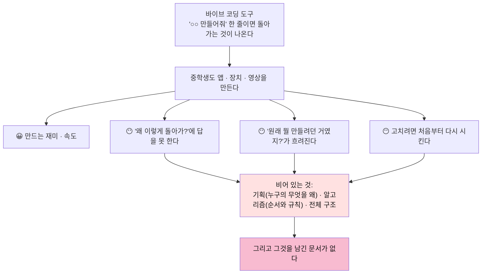

| 어른 개발자 | 청소년 |
|---|---|
| 설계 경험이 있어서 AI가 만든 것을 **거른다** | 거를 기준이 아직 없다. **돌아가면 맞는 것**이 된다 |
| 요구사항 문서를 먼저 쓰고 도구에 넣는다 | 한 줄로 시키고, 안 되면 다시 시킨다 |
| 고장 나면 구조를 보고 고친다 | 구조를 모르니 통째로 다시 만든다 |

> **핵심 문제 정의**: 청소년에게 필요한 것은 더 좋은 코딩 도구가 아니다.
> **코딩 도구에 넣기 전의 한 장 — 자기 말로 쓴 설계 — 를 같이 만들어 주는 상대**다.

### 1.3 숫자로 본 현실 (이전 판과 동일 · 출처는 부록)

| 사실 | 수치 |
|---|---|
| 국내 중 · 고생의 생성형 AI 사용 경험 | **67.9%** (한국청소년정책연구원, 2024) |
| 학생의 AI 과의존을 우려하는 교사 | 90% 이상 (2차 보도 기준 · 원 조사 확인 필요) |
| GPT-4로 연습한 고교생의 이후 시험 성적 | 미사용 대비 17% 낮음 (펜실베이니아대 RCT) |
| LLM으로 에세이를 쓴 집단 | 자기 글을 인용하지 못함 · '인지 부채' (MIT Media Lab, 2025) |
| OECD의 진단 | "메타인지의 착시" — 명쾌한 답을 받으면 이해했다고 착각한다 |

### 1.4 제도가 연 문 — 2026 수행평가 AI 활용 관리 방안

| 지침 내용 | 현장에서 생기는 일 | AskBack의 대응 | 상태 |
|---|---|---|---|
| 학생은 **AI 도구 · 프롬프트 · 프롬프트 개발 과정**을 표기 | 대화창을 뒤져 복붙한다. '개발 과정'은 뭘 쓸지 모른다 | **전체 기록.md** — 질문 원문 · 질문의 폭 · 단계 · AI 역할 · 되물은 것과 내 답 | ✅ 내보내기 구현 · 제출 양식은 W2 |
| 출처 없이 AI 생성물 제출은 부정행위 | 억울한 의심과 실제 부정이 섞인다 | **🫵 내가 정한 것 / 📌 AI가 가정한 것**이 문서에 나뉘어 남는다 | ✅ |
| 결과물 → **과정 중심 평가** | 교사가 30명의 과정을 볼 방법이 없다 | 프로젝트 · N번째 리포트 · 월간 · 교사 요약 | ✅ 리포트 · ⬜ 교사 요약 |
| 교사가 AI **허용 범위**를 사전에 정함 | 기준이 제각각이다 | 교실 모드(형식 · 리듬 · 팩 지정) | ⬜ W4 |
| 프롬프트 입력 시 **개인정보 유의** | 교육 자료가 없다 | 입력 시 개인정보 감지 · 경고 | ⬜ W1 |

### 1.5 필요성 — 누구에게, 왜 필요한가

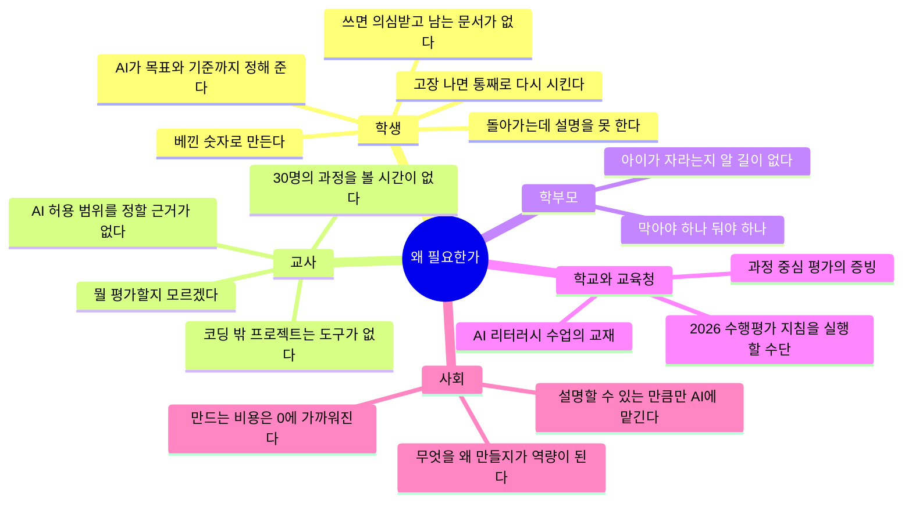

**필요성을 보여주는 열두 장면** — *(앱 예시)* 는 앱에 든 예시 시나리오, *(가상)* 은 설명을 위한 장면이다.

| # | 누구 | 장면 | 지금은 | AskBack이 있으면 |
|---|---|---|---|---|
| 1 | 학생 | "400 밑이면 펌프 켜" — 400은 예제에서 베낀 숫자 *(앱 예시)* | AI가 400 그대로 코드를 준다. 끝 | "그 400은 어디서 왔어?" → 직접 잰다(320 · 610) → 기준이 두 개가 된다 |
| 2 | 학생 | "30분마다 자세 알림" — 30분은 감 *(앱 예시)* | 30분 타이머가 만들어진다 | 5분마다 찍어 보니 20분째부터 무너진다 → 규칙이 데이터에서 나온다 |
| 3 | 학생 | 분리배출 앱에 페트병 · 컵라면 · 유리병 — 그냥 떠올린 품목 *(앱 예시)* | 아무도 안 헷갈리는 페트병 안내 앱 | 분리수거장에 40분 서서 센다 → 진짜 멈칫하는 품목 4개로 시작 |
| 4 | 학생 | "잔반 줄이는 앱" → 맛 투표 버튼 *(앱 예시)* | 맛 투표 페이지가 나온다 | "결국 뭘 알고 싶어?" → 맛이 아니라 **잔반 무게**가 목표였음을 안다 |
| 5 | 학생 | Teachable Machine 미리보기에서 97% *(앱 예시)* | "잘 되네" 하고 발표한다 | "그 사진은 시험 문제를 미리 본 거야" → 처음 보는 30장으로 센다 |
| 6 | 학생 | 발표 때 "센서가 빠지면요?" *(가상)* | 답을 못 한다. "AI가 짠 거라…" | 역질문에서 이미 답해 봤다 — "0이면 계속 물을 주니까 5초에서 끊어요" |
| 7 | 학생 | 수행평가 "프롬프트 개발 과정을 쓰시오" *(가상)* | 대화창을 뒤져 복붙. 뭘 써야 할지 모른다 | 전체 기록.md — 질문이 어떻게 넓어지고 좁혀졌는지, 내가 정한 것이 따로 있다 |
| 8 | 교사 | 자유학기 발표회 — 스무 팀이 다 "AI 앱" *(가상)* | 결과물만 보고 점수를 준다. 누가 이해했는지 모른다 | 기획서 한 장 + "AI가 가정한 것 중 내가 확인한 것" 하나를 말하게 한다 |
| 9 | 교사 | 메이커 동아리 — 한 명씩 순서도 검문 *(가상)* | 한 반에 2시간 | 2문 1역이 매일 5~30초씩 대신한다. 교사는 🧩 n/4 와 리포트만 본다 |
| 10 | 교사 | 사회 수업 설문 프로젝트 *(가상)* | 코딩 도구는 쓸모없고, 챗봇은 설문지를 통째로 써 준다 | 🔬 리서치 형식 — "이 결과로 누가 무엇을 다르게 결정해?"부터 묻는다 |
| 11 | 학부모 | 아이가 AI로 뭔가 만든다 *(가상)* | 기특한데 불안하다. 물어볼 데가 없다 | 월간 요약 — 첫 질문과 지금의 질문, 아이가 자기 말로 쓴 기획서 |
| 12 | 학교 | 2026 지침: AI 활용 표기 · 과정 중심 평가 | 양식만 있고 도구가 없다 | 학생은 평소처럼 묻기만 해도 기록이 쌓인다 |

### 1.6 있을 때와 없을 때 — 같은 3주

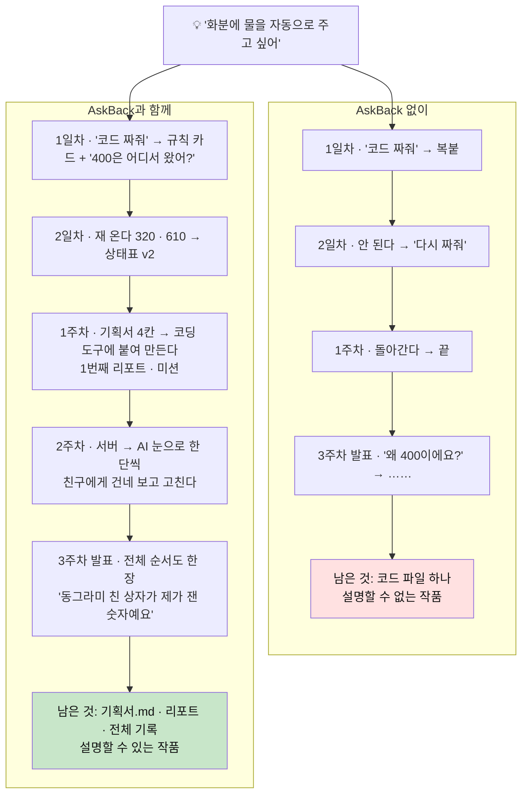

### 1.7 왜 기존 도구로는 안 되는가

| 시도 | 막히는 곳 |
|---|---|
| **일반 챗봇을 그냥 쓴다** | 시킨 대로 만든다. 베낀 숫자 · 빠진 기준을 묻지 않는다. 기록은 대화창에 흩어진다 |
| **챗봇의 학습 모드를 켠다** | 학생이 스스로 켜야 하고 급하면 끈다. 답을 아껴서 프로젝트가 멈춘다. 리포트 · 산출물이 없다 |
| **교사가 프롬프트 양식을 나눠 준다** | 양식은 채우지만 대화가 이어지지 않는다. 30명의 양식을 읽을 시간이 없다 |
| **바이브 코딩 도구의 계획 기능** | 어른 개발자용이다. 계획을 **AI가** 써 준다. 학생의 말로 남지 않고, 코딩 밖 프로젝트에는 못 쓴다 |
| **AI 탐지기 · 사용 금지** | 집에서 쓴다. 숨기는 기술만 는다 |
| **종이 순서도 검문** | 효과는 확실하다. 다만 교사 한 명이 한 반에 2시간 — 매일은 못 한다 → **AskBack이 이것을 매일의 5초로 만든다** |

---

## 2. 해결책 — 제품 개요

### 2.1 제품이 서 있는 생각

> **코드 · 문장 · 영상은 AI가 금방 만든다. 그 앞의 설계는 네가 정한다.**
> 그리고 v3의 생각은 그대로다 — **질문의 폭이 AI의 역할을 정한다.** 좁게만 물으면 AI는 코더에 머물고, 열고 대안을 물으면 아키텍트가 된다.

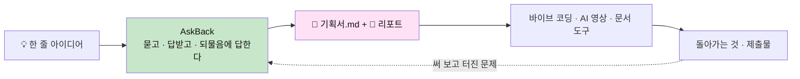

### 2.2 제품의 흐름과 가치

| 기능 | 학생이 얻는 것 | 교사 · 학부모가 얻는 것 |
|---|---|---|
| **① 다섯 형식 초안** (논문 · 리서치 · 캠페인 · 서비스 · 제품) | 무엇부터 정해야 하는지 — 채울 칸 4개와 그 칸을 채우는 질문 초안 | 코딩 수업 밖(탐구 · 사회참여 · 캠페인)에서도 쓴다 |
| **② 명세로 주는 최선의 답** | 규칙 카드 · 상태표 · 순서도 · 비교표 — 코딩 도구에 그대로 붙여넣는다. 확인하는 법이 붙는다 | "답을 안 주는 교육용 AI"가 아니다 → 학생이 떠나지 않는다 |
| **③ 답의 경계** (🫵 네가 정할 것 · 📌 가정) | AI가 대신 정하지 않은 것이 눈에 보인다 | 학생의 판단과 AI의 제안이 구분된 기록 |
| **④ 역할 배지 · 질문 믹스 칩** | 내 질문이 AI를 ⌨️👨‍💻🛠🏛📚 중 어디에 앉혔는지 · 넓히기/좁히기/대안/**설계로 돌아가기** | — |
| **⑤ 🙋 열린 되묻기 + 🧭 2문 1역** | 직접 재 보고 돌아와 묻는 티키타카 · 5초~30초짜리 이해 확인 | 특성화고식 "순서도 검문"이 매일의 습관으로 |
| **⑥ 기획서.md** | 내 말로 쓴 한 장 — 대회 · 수행평가 · 코딩 도구의 입력 | 과정 중심 평가의 근거 · AI 활용 기록 |
| **⑦ 프로젝트 · N번째 리포트 · 월간** | **오늘** 내 질문 습관을 안다(글자 수와 실은 것까지) · 미션 하나 · 공부 처방 | 점수가 아닌 **성장의 증거** |
| **⑧ 🔭 심화 · 별이** | 철학 · 심리학 · 사회학으로 생각 넓히기 · 질문을 먹고 자라는 캐릭터 | — |

> **제품 철학 네 줄**
> 1. 답을 인질로 잡지 않는다. **정보와 구현은 끝까지 주고, 판단은 학생에게 남긴다.**
> 2. **칸을 대신 채워 주지 않는다.** 학생의 말로 적은 것만 기획서가 된다.
> 3. 늦은 평가는 평가가 아니다. **열 번마다, 프로젝트마다, 같은 여덟 칸으로 돌아본다.**
> 4. 억지로 묻지 않는다. 물을 게 없으면 건너뛴다.

### 2.3 이미 만든 것 (2026-09-21)

| 자산 | 내용 | 사업적 의미 |
|---|---|---|
| **웹 프로토타입** | 온보딩 → 형식 → 대화 → 역질문 → 리포트 → 월간 → .md 내보내기까지 한 바퀴 | 설명이 아니라 **시연**으로 교사를 만난다 |
| **예시 프로젝트 6개** | 스마트 화분 · 거북목 웹캠 · 분리배출 판별기 · 반려동물 일지 · 급식 잔반 · 위험 등굣길 — 각 질문 16개, 5단 확장, 기획서, 리포트 | 교사 연수 자료 · 수업안의 본보기 · **질문 은행의 씨앗** |
| **시나리오 규칙 + 검사기** | "코드 없음 · 답마다 되묻기 · 2문 1역 · 10답 1리포트 · 5단 확장"을 스크립트가 검사 | 콘텐츠를 교사 · 외부 필자가 늘려도 품질이 유지된다 |
| **로컬 엔진** | 서버 · API 없이 같은 모양으로 돈다 | **비용 0원 체험** · 연수 · 박람회 · 오프라인 교실 |
| **Claude API 연결** | 역할 4개(답 · 역질문 · 피드백 · 심화) 구조화 출력 · 사진 입력 | 파일럿에 바로 쓸 수 있는 실제 엔진 |
| **`/demo` 시연 허브** | 폰 목업 + 코칭 해설 + JSON 보기 | 영업 · 제안서 · 투자 설명용 |

---

## 3. 시장성

### 3.1 왜 지금인가 — 다섯 개의 흐름

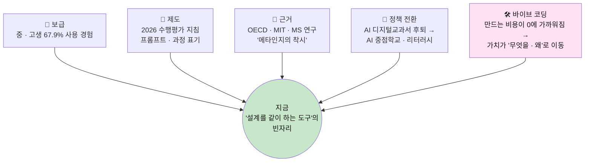

### 3.2 시장 규모 (이전 판의 전제 유지 · 전부 추정)

**전제** — 2025년 초 · 중 · 고 학생 501.5만 명. 중 · 고생 **약 260만 명(추정)**. 개인 구독 월 9,900원(연 11.9만 원) · 학교 라이선스 학생당 연 2.4만 원 **가정**.

| 구분 | 정의 | 산식 | 규모 |
|---|---|---|---|
| **TAM** | 국내 중 · 고생 전체 | 260만 × 연 11.9만 원 | 약 3,090억 원/년 (추정) |
| **SAM** | 이미 생성형 AI를 쓰는 중 · 고생 | 260만 × 67.9% ≈ 177만 × 연 11.9만 원 | 약 2,100억 원/년 (추정) |
| **SOM (3년차)** | 학교 · 기관 라이선스 8만 명 + 개인 유료 1.5만 명 | 8만 × 2.4만 + 1.5만 × 11.9만 | 약 37억 원/년 (목표) |

> **v4의 초점 시장**은 그 안의 **"프로젝트를 하는 중학생"** 이다 — 메이커 · 발명 · 탐구 · 사회참여 동아리, 자유학기 주제선택, 교내외 대회 준비.
> 이 집단의 인원은 **아직 세지 않았다.** 파일럿 전에 교육통계(학교급별 학생 수)와 동아리 · 대회 참가 규모를 확인해 SOM을 아래에서부터 다시 쌓는다.

**지불 의사의 크기** — 2025년 사교육비 27.5조 원 · 참여 학생 1인당 월 60.4만 원 · 국내 에듀테크 약 11조 원(2026 전망 · 2차 보도) · Khanmigo 1년 새 6.8만 → 70만+.

### 3.3 확장 시장

| 단계 | 시장 | 근거 |
|---|---|---|
| 1 | **중학교 프로젝트 수업 · 동아리 · 대회 준비** | 예시 6개가 전부 중1~중3의 프로젝트. 형식 다섯 개가 코딩 밖까지 덮는다 |
| 2 | 특성화고 메이커 · AI · SW 계열 | "순서도를 그리고 설명해야 AI 사용 인정" 문화 — 2문 1역과 기획서가 그대로 맞는다 |
| 3 | 일반 중 · 고교 수행평가 | 2026 지침으로 모든 학교가 같은 숙제를 가졌다 |
| 4 | 메이커스페이스 · 코딩 학원 · 영재원 | 바이브 코딩 수업의 **앞단 교재**로 |
| 5 | 대학 신입생 · 부트캠프 · 해외 K-12 | 같은 문제가 그대로 이어진다 |

### 3.4 어디서 쓰이는가 — 사용 공간 지도

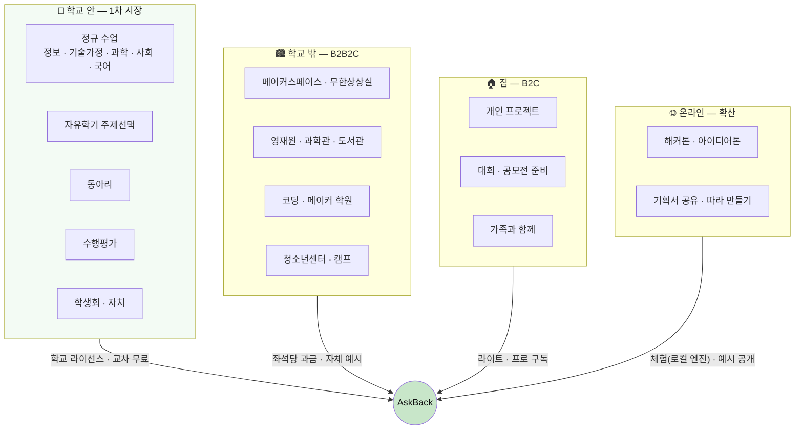

| 공간 | 결정하는 사람 | 돈을 내는 곳 | 들어가는 문 | 공간의 고민 → AskBack의 답 |
|---|---|---|---|---|
| 정규 수업 · 자유학기 | 교과 교사 | 학교 예산 · 교육청 | 8차시 수업안 · 교사 연수 | "AI로 만든 걸 뭘로 평가하지?" → 기획서 한 장 + 전체 기록 |
| 동아리 | 지도교사 | 동아리 운영비 | 예시 프로젝트 · 대회 준비 | "학생마다 주제가 다르다" → 형식 다섯 개 · 학생별 리포트 |
| 수행평가 | 교과 협의회 | 학교 | AI 활용 기록 양식 | "표기 의무를 어떻게 지키게 하지?" → 평소처럼 묻기만 해도 기록 |
| 메이커스페이스 · 학원 | 운영자 · 강사 | 기관 → 수강료에 포함 | 바이브 코딩 수업의 앞 2차시 | "만들긴 하는데 남는 게 없다" → 포트폴리오로 기획서 |
| 영재원 · 과학관 | 프로그램 담당 | 기관 예산 | 탐구 프로그램 교재 | "탐구 설계 지도가 어렵다" → 📄 🔬 형식의 전용 역질문 |
| 집 | 학생 · 학부모 | 학부모 | 월간 요약 · 친구 추천 | "막아야 하나 둬야 하나" → 자라는 증거 |
| 온라인 행사 | 주최 측 | 후원 · 무료 | 로컬 엔진 체험판 | "하루 만에 기획서를 받아야 한다" → 💡 티키타카 + 형식 체크 칸 |

### 3.5 활용 예시 스무 가지 — 교과 · 활동별

> 1~6은 앱에 들어 있는 **예시 프로젝트**, 7~20은 형식과 질문 초안이 어떻게 쓰일지 보여주는 **가상 예시**다.

| # | 공간 | 프로젝트 | 형식 | 작게 시작 → 한 단씩 | 남는 것 |
|---|---|---|---|---|---|
| 1 | 메이커 동아리 | 🌱 스마트 화분 | 🤖 | 센서와 규칙 → 서버 · 모니터링 → AI 눈 → 공유 | 상태표 · 통과 기준 · 차별점 |
| 2 | 집 | 🐢 거북목 감시 웹캠 | 💻 | 타이머 → AI 눈 → 기록 → 공유 | "영상은 바로 버린다"는 규칙 |
| 3 | 환경 동아리 | ♻️ 분리배출 사진 판별기 | 💻 | 규칙표 → AI 눈 → 기록 → 공유 | "틀린다면 일반쓰레기 쪽으로" 기준 |
| 4 | 집 · 가족 | 🐶 반려동물 이상행동 일지 | 💻 | 기록과 규칙 → 가족 공유 → AI 눈 · 귀 | 같은 끼니 7일 평균 규칙 |
| 5 | 사회참여 동아리 | 🍱 급식 잔반 예측기 | 💻 | 투표 → 재는 손 → 공공 데이터 → AI | 영양사 선생님께 드리는 한 장 |
| 6 | 학생회 · 안전부 | 🚸 위험 등굣길 지도 | 💻 | 종이 지도 → 재는 손 → 서버 → 구청에 한 장 | "서로 다른 3명 · 2일" 확정 규칙 |
| 7 | 과학 | 교실 조명 색과 집중 시간 | 📄 | 연구 질문 → 확인 절차 → 3회 측정 → 반론 | 반증 조건 한 문장 |
| 8 | 과학 | 아침밥과 1교시 졸음 | 📄 | 12명 3주 자가 체크 → 비교 기준 | 비교가 공정한지 점검표 |
| 9 | 과학 탐구대회 | 식물에 음악을 들려주면 | 📄 | 바꾸는 것 1 · 재는 것 1 · 고정할 것 | "무엇과 무엇을 비교하나" |
| 10 | 사회 | 학교 앞 횡단보도 대기 시간 | 🔬 | 3일 관찰 → 설문 → 학생회 건의 | 결과가 A면 · B면 무엇을 할지 |
| 11 | 사회 | 우리 동네 무인 가게 지도 | 🔬 | 걸어서 세기 → 항목 설계 → 표 2개 | 꼭 필요한 항목 · 없어도 되는 항목 |
| 12 | 학급 자치 | 체육대회 종목 설문 | 🔬 | 문항 5개 → 쏠림 점검 → 결과 한 장 | 표본 고르는 법 |
| 13 | 국어 · 환경 | 비닐봉지 안 받기 30초 영상 | 🎬 | 바꿀 행동 하나 → 메시지 → 콘티 4컷 → 배포 | "조회수 말고 무엇으로 확인하나" |
| 14 | 방송반 | 복도 우측통행 캠페인 | 🎬 | 첫 3초 → 컷의 역할 → 일주일 뒤 관찰 | 뺀 컷과 그 이유 |
| 15 | 보건 | 에너지음료 줄이기 | 🎬 | 누구의 행동인가 → 공감 컷 → 매점 앞 게시 | 저작권 · 초상권 점검 |
| 16 | 기술가정 | 우산 챙김 알리미 | 🤖 | 강수확률 규칙 → 현관문 센서 → LED | 입력 · 판단 · 출력 · 전원 네 칸 |
| 17 | 정보 | 교실 CO₂ 환기 신호등 | 🤖 | 재기 → 기준 두 개 → 신호등 → 기록 | 이상할 때의 행동(모르면 멈춘다) |
| 18 | 정보 | 시험 기간 공부 시간 기록 앱 | 💻 | 버튼 하나 → 목표 비교 → 주간 요약 | 첫 버전에서 안 만들 것 |
| 19 | 도서부 | 책 추천 쪽지함 | 💻 | 종이 쪽지 → 폼 → 분류 규칙 | 기억해야 하는 정보 세 가지 |
| 20 | 진로 · 창업 | 엄마 가게 딸기 신호등 *(앱의 티키타카 예시)* | 🤖/💻 | 한 줄 아이디어 → 8칸 카드 → 유저 시나리오 | 유저 시나리오.md |

### 3.6 학사 일정과 쓰임새 — 1년 단계도

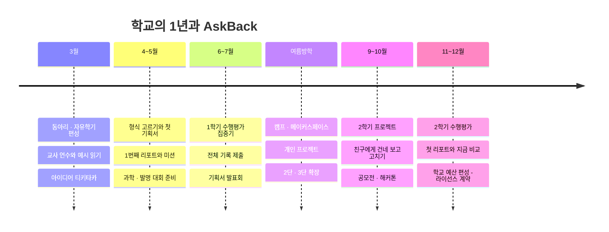

---

## 4. 경쟁 분석

### 4.1 경쟁 지형 — 여섯 부류

| 부류 | 대표 | 하는 일 | 청소년 관점의 한계 | AskBack과의 관계 |
|---|---|---|---|---|
| **A. 범용 챗봇 학습 모드** | ChatGPT Study · Claude Learning · Gemini Guided | 소크라테스식 질문 · 힌트 | 학생이 스스로 켜야 하고, 급하면 끈다. 질문 습관 · 산출물은 안 남는다 | 경쟁 |
| **B. 소크라테스 튜터** | Khanmigo · 엘리스 헬피 에듀 | 답을 아끼고 단계별로 유도 | 교과 문제 풀이 중심. 답을 안 줘서 떠난다 | 경쟁 |
| **C. 교실 AI 플랫폼** | Flint · SchoolAI · MagicSchool · 클래스팅 AI | 교사가 만든 튜터 · 대화 전문 열람 | 구조가 감시다. 학생의 도구가 아니다 | 경쟁 (학교 예산) |
| **D. 과정 증빙 · 탐지** | Grammarly Authorship · GPTZero · Turnitin | 출처 기록 · AI 생성 탐지 | 결백 증명에서 멈춘다 | 부분 경쟁 |
| **E. 문제 풀이 앱** | 콴다 | 사진 → 풀이 | 의존 문제의 원인 쪽 | — |
| **F. 바이브 코딩 · 생성 도구** ← v4 | Cursor · Claude Code · Replit · AI 영상 도구 | 한 줄 요청으로 결과물을 만든다 | 설계를 묻지 않는다. 어른용이고, 과정 기록 · 성장 분석이 없다 | **보완재 — AskBack의 기획서가 이 도구들의 입력이다** |

### 4.2 기능 비교표

| 기능 | 범용 학습 모드 | Khanmigo · 헬피 | Flint · SchoolAI | 바이브 코딩 도구 | **AskBack** |
|---|---|---|---|---|---|
| 충실한 답 | △ | ✕ (일부러 안 줌) | △ | ◎ (코드) | **◎ (명세 + 확인하는 법)** |
| **설계를 먼저 묻는다** | ✕ | ✕ | ✕ | ✕ | **◯ 형식별 기획 · 알고리즘 · 구조** |
| **판단을 학생에게 남긴다** (네가 정할 것 · 가정 공개) | ✕ | △ | ✕ | ✕ | **◯** |
| 되묻기 · 코칭 | ◯ (매번 · 끌 수 있음) | ◯ (매번) | △ | ✕ | **◯ 열린 되묻기 + 2문 1역(억지 질문 금지)** |
| 질문의 폭 코칭 (코더 → 아키텍트) | ✕ | ✕ | ✕ | ✕ | **◯ 역할 배지 · 칩** |
| **학생의 말로 쌓이는 산출물** | ✕ | ✕ | ✕ | △ (AI가 쓴 문서) | **◯ 기획서.md · 전체 기록.md** |
| 학생의 프롬프트 자체를 분석 | ✕ | ✕ | ✕ | ✕ | **◯ 폭 · 6요소 · 글자 수 · 단계** |
| 성장 리포트 | ✕ | △ 진도 | △ 교사 통계 | ✕ | **◯ 10문마다 · 월간 처방 · 첫 리포트와 지금** |
| 코딩 밖의 프로젝트 | ◯ | ✕ | △ | ✕ | **◯ 논문 · 리서치 · 캠페인** |
| 사진 · 음성 입력 | ◯ | △ | △ | △ | **◯** |
| 데이터의 주인 | 기업 | 기업 · 학교 | 교사 | 기업 | **학생** (지금은 기기 안 · 교사는 요약만 예정) |

### 4.3 포지셔닝

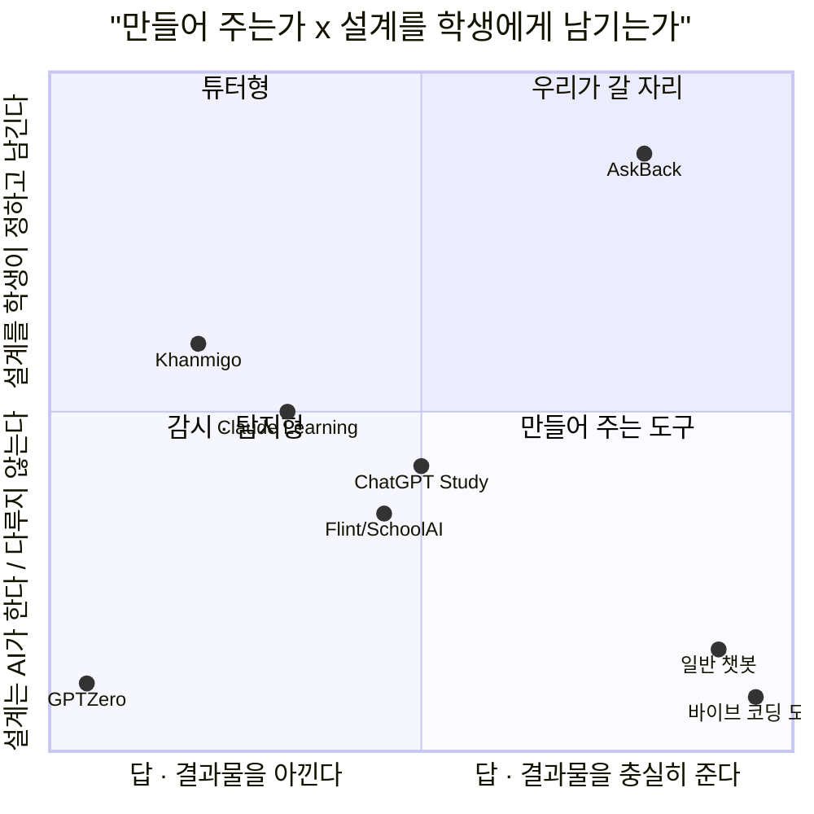

### 4.4 벤치마킹 — 가져올 것과 피할 것

| 대상 | ✅ 가져올 것 | 🚫 피할 것 |
|---|---|---|
| **Khanmigo** | 교사 무료 → 학교 확산 · 저가 | 답을 끝까지 안 주는 설계 |
| **ChatGPT Study Mode** | 진입 장벽 0 · 기억의 누적 | 학습 모드가 선택 사항인 구조 |
| **Flint · SchoolAI** | 무료 체험 → 학교 라이선스 · 교사 설정 | 대화 전문 열람 |
| **Grammarly Authorship** | "탐지"가 아니라 "과정 기록" · 내보내기 | 증빙에서 멈추는 것 |
| **바이브 코딩 도구** | 한 줄로 시작하는 가벼움 · .md를 입력으로 받는 관행 | 설계 없이 달리게 두는 것 |

---

## 5. 차별점과 방어력

### 5.1 일곱 가지 차별점

```text
1. 코드보다 설계 먼저        결과물은 명세다. 코딩 도구와 싸우지 않고 그 앞자리를 차지한다.
2. 다섯 형식                 같은 코칭이 메이커 · 앱 · 탐구 · 논문 · 캠페인에 쓰인다. 정보 교과 밖으로 나간다.
3. 답의 경계                 정보 · 구현은 끝까지, 판단은 학생에게. '네가 정할 것'이 화면에 남는다.
4. 두 겹의 되묻기             매 답의 열린 되묻기(티키타카) + 2문 1역(이해 확인). 억지로 묻지 않는다.
5. 학생의 말로 쌓이는 기획서    칸을 대신 채우지 않는다. 그래서 제출할 수 있고, 설명할 수 있다.
6. 프로젝트 · N번째 리포트     열 번마다, 어디서나 같은 여덟 칸. 글자 수와 실은 것까지 본다.
7. 학생이 데이터의 주인        교사는 요약만. 감시 도구가 아니라 학생의 도구다.
```

### 5.2 방어력 (Moat)

| 축 | 내용 | 따라오기 어려운 이유 |
|---|---|---|
| **시나리오 · 질문 은행** | 예시 프로젝트(16턴 · 5단 확장 · 기획서 · 리포트)와 형식별 역질문 · 힌트 3단. 검사기로 품질을 지킨다 | 청소년 프로젝트 맥락의 검수된 코칭 대본은 현장과 시간이 있어야 쌓인다. Phase B의 RAG 자산이 된다 |
| **종단 데이터** | 한 학생 · 한 프로젝트의 리포트 단위 궤적 — 질문 믹스 · 평가 요소 · 미션 · 확장 단수 | 범용 챗봇 · 코딩 도구는 대화를 학습 자료로 구조화하지 않는다 |
| **형식 체계** | 형식 × (체크 칸 · 질문 초안 · 코칭 지침 · 전용 역질문). 교사가 커스텀 형식 · 팩을 만든다(예정) | 기능이 아니라 **수업 운영 방식**이 같이 팔린다 |
| **제도 적합성** | 국내 수행평가 지침에 맞춘 기록 | 글로벌 제품은 국내 지침 단위까지 맞추지 않는다 |
| **신뢰 구조** | 학생 소유 · 교사 요약 | 교사 열람 기반 플랫폼은 구조를 뒤집기 어렵다 |
| **로컬 엔진** | API 없이 도는 체험판 | 연수 · 박람회 · 예산 없는 교실에 먼저 들어간다 |

> **정직한 평가**: 기능 하나하나는 빅테크도, 코딩 도구도 몇 달이면 만든다. 특히 코딩 도구가 "계획 모드"를 청소년용으로 내놓는 것이 가장 가까운 위협이다.
> 방어력은 **쌓인 시나리오 · 데이터와 학교에 뿌리내린 운영 방식**에서 나온다. 그래서 초기 전략은 넓게가 아니라 **한 학급에서 깊게**다.

---

## 6. 페르소나 — 청소년 넷, 어른 둘

### 6.1 🌱 민준 (중3 · 메이커 동아리) — **핵심 타깃** · 형식: 🤖 제품

| 항목 | 내용 |
|---|---|
| **상황** | 아두이노 스마트 화분. 코드는 AI가 짜 준다. 되니까 넘어간다 |
| **진짜 고민** | 고민이 없는 게 문제. "400"이 예제에서 베낀 숫자인 줄도 몰랐다 |
| **제품의 첫 가치** | 첫 답 끝의 되묻기 — "그 400은 어디서 왔어?" → 직접 재 본다(320 · 610) → 다음 질문이 달라진다 |
| **남는 것** | `스마트화분_기획서.md` — 상태표 · 통과 기준 · 버린 대안 · 내가 쓴 차별점 |

### 6.2 🍱 지우 (중2 · 사회참여 동아리) — 코딩 밖의 프로젝트 · 형식: 💻 서비스 / 🔬 리서치

| 항목 | 내용 |
|---|---|
| **상황** | 급식 잔반을 줄이고 싶다. 앱을 만들까, 조사를 할까 모른다 |
| **진짜 고민** | AI에게 물으면 "앱 기능 10가지"가 쏟아진다. 뭐부터 해야 할지 더 모르겠다 |
| **제품의 첫 가치** | 형식을 고르면 채울 칸이 4개로 줄어든다. 첫 단은 "투표와 규칙" — 서버도 AI도 아직 아니다 |
| **설계 원칙** | AI · 서버를 붙이는 게 곧 확장은 아니다. "3명 이상이면 확정" 같은 규칙으로 충분하면 그렇게 말한다 |

### 6.3 😶 하은 (중2) — 저관여 · 가장 위험한 집단

| 항목 | 내용 |
|---|---|
| **상황** | 숙제를 AI에 통째로 넣고 붙여넣는다. 읽지 않는다 |
| **필요한 것** | 설교가 아니라 작은 호기심 하나 |
| **제품의 첫 가치** | 별이가 자란다 · 리포트의 🏆 베스트 질문 — "열 개 중 제일 좋았던 질문은 이거야" |
| **설계 원칙** | 3문 1역 · 고르기(5초)부터. 떠나면 아무것도 못 한다 |

### 6.4 🧑‍🔧 도현 (특성화고 2학년 · AI학과) — 확장 타깃

| 항목 | 내용 |
|---|---|
| **상황** | 졸업 작품 로봇팔. 코드의 70%는 AI가 짰다. 다음 달 **화이트보드 순서도 검문** |
| **제품의 첫 가치** | 역질문이 매번 순서도를 따라가게 한다 — "이 상태에서 센서가 빠지면 다음엔 어디로 가?" |

### 6.5 👩‍🏫 박지영 선생님 (중학교 정보 · 기술 · 동아리 지도) — 구매 영향자

| 항목 | 내용 |
|---|---|
| **상황** | 자유학기 주제선택 + 메이커 동아리. 학생마다 프로젝트가 다르다 |
| **진짜 고민** | 아이들이 AI로 뚝딱 만들어 온다. **뭘 평가해야 할지** 모르겠다. 한 명씩 물어볼 시간은 없다 |
| **필요한 것** | 학생이 *자기 말로* 쓴 한 장 · 오늘 누구와 이야기해야 하는지 |
| **구매 기준** | 수업 시간을 안 뺏을 것 · 학생부 기재 근거 · 개인정보 문제 없을 것 · **예산 없이 먼저 써 볼 수 있을 것**(로컬 엔진 체험) |

### 6.6 👨‍👩‍👧 학부모 (중3 자녀) — B2C 결제자

감시가 아니라 **"아이가 자라고 있다"는 증거**가 필요하다. 첫 가치는 월간 리포트 요약 — 첫 리포트의 질문과 지금의 질문, 그때와 지금 AI의 역할.

---

## 7. 유저 시나리오

### 7.1 민준의 3주 — 예시 프로젝트 *스마트 화분* 그대로

> ⚠️ 아래는 앱에 들어 있는 **예시 시나리오**다(실제 학생 데이터 아님).

| 구간 | 민준이 하는 일 | 제품이 하는 일 | 남는 것 |
|---|---|---|---|
| **Q1** | "흙 센서값이 400 밑이면 펌프 3초 켜는 코드 짜줘" | 규칙 카드 + 순서도. 👨‍💻 코더 배지. 🙋 "400은 어디서 왔어?" · 💬 "3초 동안은 흙을 안 봐" | 기획서 1. 알고리즘 v1 |
| **Q2** | 직접 재 보고(320 · 610) 🌅 넓히기 칩으로 묻는다 | 상태표(대기 · 급수 · 휴식) · 기준 두 개의 이유 · 5분 로그 통과 기준 · 🛠 엔지니어 | 2. 알고리즘 v2 |
| **역질문** | "0이면 계속 마른 줄 알고 물을 계속 주겠네. 그래서 5초에서 끊는 거구나" | 💥 실패 조건 · 🟡 → 그 문장이 기획서 실패 조건 칸에 | 내 말 한 줄 |
| **Q3~Q10** | 서버 · 모니터링 → AI 눈(잎 이상 · 침입 동물)으로 한 단씩 | 매 답 되묻기 · 짝수 번째마다 역질문 · 대안 비교에 '하지 않는다' | 3~7장 |
| **10번째** | — | **📄 스마트 화분 · 1번째 리포트** — 열린 질문 8/10 · 🛠40% 🏛40% · 평균 94자 · 미션: 차별점 `___` 채우기 · 별이 Lv.2 | 리포트.md |
| **Q11~Q16** | 미션을 해 오고, 친구에게 건네 보고, 일주일 돌리고, 터진 문제로 규칙을 고친다 | v2 → v3 · 마지막은 전체 순서도 한 장 | 완성된 기획서.md → 코딩 도구로 |

### 7.2 박 선생님의 자유학기 8차시

```text
1차시   /demo 와 예시 프로젝트를 같이 읽는다 (서버 없이 · 계정 없이)
2차시   💡 아이디어 티키타카 — 한 줄 아이디어를 8칸 카드로. 각자 형식을 고른다
3~5차시  학생마다 자기 프로젝트 대화. 교사는 돌아다니며 헤더의 🧩 n/4 만 본다
6차시   첫 리포트 도착. 미션 하나씩. 짝과 🏆 베스트 질문을 바꿔 읽는다
7차시   초안.md 를 코딩 도구 / 영상 도구 / 문서에 넣어 만든다
8차시   발표 — 기획서 한 장 + "AI가 가정한 것 중 내가 확인한 것" 하나
평가    전체 기록.md (질문의 폭 · 내가 정한 것 · 되물음에 한 답)  ← 과정 중심 평가의 근거
```

### 7.3 학부모가 받는 월간 요약 (학생이 공유를 고른 경우 · 예정)

```text
📘 민준의 9월 — 한 장 요약
   첫 리포트의 질문   "흙 센서값이 400 밑이면 펌프 3초 켜는 코드 짜줘"          AI의 역할: 👨‍💻 코더
   최근의 질문        "…틀린다면 괜히 울리는 쪽이 나아. 놓치지만 않으면 돼."     AI의 역할: 🏛 아키텍트
   달라진 점          AI에게 받아쓰게 하던 아이가, AI와 설계를 의논합니다.
   남긴 것            스마트화분_기획서.md — 본인의 말로 쓴 규칙 · 기준 · 차별점
```

---

## 8. 비즈니스 모델

### 8.1 수익 구조 (가격은 전부 가정 · 실측 후 확정)

| 채널 | 고객 | 가격 (가정) | 포함 내용 |
|---|---|---|---|
| **체험** | 누구나 | 0원 | **로컬 엔진** — 예시 6개 · 아이디어 티키타카 · 가이드 · 답 카드 기반 대화. 서버 비용이 들지 않는다 |
| **무료** | 학생 개인 | 0원 | Claude 답(일 한도) · 역할 배지 · 2문 1역 · 최근 리포트 1장 |
| **라이트** | 학생 · 학부모 | 월 9,900원 | 월 한도 내 전 기능 · 리포트 전체 · 기획서/전체 기록 내보내기 |
| **프로** | 학생 · 학부모 | 월 19,900원 | 무제한 · 월간 리포트와 공부 처방 · 심화 · 팩 · 사진 입력 · 포트폴리오 PDF |
| **학교 · 기관 라이선스** | 학교 · 교육청 · 영재원 | 학생당 연 2.4만 원~ (한 학급 무료 체험) | 프로 + 교실 모드 · 교사 요약 · 커스텀 형식 · 팩 |
| **교사** | 교사 개인 | 무료 | 교사 요약 · 수업안 · 예시 시나리오 만들기 도구 |
| **B2B2C** | 메이커스페이스 · 코딩 학원 | 좌석당 월 과금 | 라이선스와 동일 + 브랜딩 · 자체 예시 프로젝트 |

### 8.2 원가 전략 — v4에서 구조가 가벼워졌다

| 항목 | v3 계획 | v4 현재 구현 | 원가에 주는 영향 |
|---|---|---|---|
| 답 생성 | 초안 + 자기 비평 + **코드 실행 검증** | 한 번의 구조화 출력(분석 · 답 · 가정 · 네가 정할 것 · 위험 한 줄을 **한 호출에**) | 호출 수 ↓ · 샌드박스 불필요 |
| 분석 | 별도 분석기 호출 | 로컬 규칙 분석 + 답 호출이 보정 | 호출 0 |
| 역질문 | 매번 생성 | **요소 선택은 로컬 규칙**, 문장 다듬기만 1호출. 🙋 나한테 물어봐는 템플릿 그대로(호출 0) | 호출 ↓ |
| 채점 | 매번 모델 | F1 고르기는 **보기 점수**(호출 0). 서술형만 1호출 | 호출 ↓ |
| 리포트 · 월간 · 미션 | 모델 작성 | **전부 집계와 규칙**(호출 0). 코멘트도 수치에서만 | 호출 0 |
| 프롬프트 | — | 시스템 프롬프트 캐시 · 최근 12개 대화만 | 입력 토큰 ↓ |
| 폴백 | — | 로컬 답 카드 | 장애 · 한도 초과에도 끊기지 않는다 |

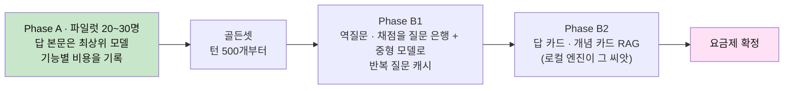

| 항목 | 추정 (파일럿 첫 주의 실측으로 교체) |
|---|---|
| 한 턴의 모델 호출 수 | 평균 **1.3~1.8회** (답 1 + 두 번에 한 번 역질문 다듬기 + 서술형 채점) — v3 계획은 턴당 4~6회 |
| Phase A 턴당 비용 | **v3 추정(300~700원)보다 낮다고 보지만 아직 재지 않았다.** `/api/turn`이 받는 `usage`를 턴에 기록하는 일이 W1의 첫 과제 |
| 활성 학생 월 질문 수 | 60~100개 (가정) |
| 학교 라이선스(월 환산 2,000원) | 여전히 가장 빠듯하다 → 학교용 일 한도 · 로컬 엔진 혼용 · 교육청 단위 계약가 |

> **가장 큰 재무 리스크는 여전히 원가다.** 방어선은 셋 — ① Phase A는 작게 ② 기능별 비용 기록으로 줄일 곳을 데이터로 정한다
> ③ **학생이 보는 답 본문은 끝까지 아끼지 않고, 그 주변(선택 · 채점 · 집계)에서 줄인다** — v4는 이 ③을 이미 절반쯤 구현했다.

### 8.3 3개년 목표 (시나리오 · 이전 판 유지)

| 지표 | 1년차 | 2년차 | 3년차 |
|---|---|---|---|
| 단계 | 파일럿 → B1 | B2 · 요금제 확정 | 확장 |
| 도입 학교 · 기관 | 5곳 | 60곳 | 250곳 |
| 라이선스 학생 | 1,000명 | 2만 명 | 8만 명 |
| 개인 유료 구독 | 300명 | 4,000명 | 1.5만 명 |
| 연 매출 (추정) | 약 0.6억 원 | 약 9.6억 원 | 약 37억 원 |

---

## 9. 시장 진입 전략

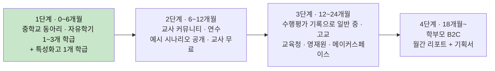

| 단계 | 핵심 활동 | 왜 이 순서인가 |
|---|---|---|
| **1. 학급 파일럿** | 교사와 8차시 수업안 공동 설계 · 첫 주에 첫 리포트 · 학기 말에 기획서 발표회 | 프로젝트 수업은 **평가할 거리**를 찾고 있다. 기획서 한 장이 그 답이다 |
| **2. 교사 커뮤니티** | `/demo` · 로컬 엔진으로 **예산 없이 체험** · 예시 시나리오와 작성 규칙 공개 · "우리 수업용 예시 만들기" 연수 | 학교 구매는 교사 추천으로 움직인다. 교사가 만든 시나리오는 곧 자산이다 |
| **3. 수행평가 · 기관** | 전체 기록.md → AI 활용 기록서 양식 | 2026 지침으로 모든 학교가 같은 숙제를 가졌다 |
| **4. B2C** | 월간 요약과 기획서가 학부모에게 도달 | 학생이 쓰던 제품을 부모가 결제한다 |

**초기 콘텐츠 자산** — 예시 프로젝트 6개(읽기만 해도 수업 자료) · 📚 가이드 4편(답은 어디까지 하는가 · 질문의 폭 · 2문 1역 · 리포트 읽는 법) · 종이판 "형식 체크 칸 4개 + 규칙 카드" 워크시트.
**시즌** — 1학기 초(동아리 · 자유학기 편성) · 대회 준비철 · 2학기 수행평가 집중기 · 하반기 학교 예산 편성기.

### 9.1 교사 한 명이 학교 하나가 되기까지 — 도입 단계도

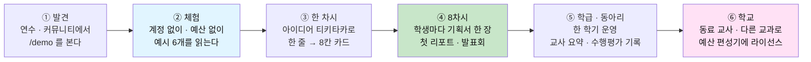

| 단계 | 교사가 얻는 것 | 우리가 주는 것 | 비용 | 다음 단계로 넘어가는 신호 |
|---|---|---|---|---|
| ① 발견 | "이런 식으로 되묻는구나" | `/demo` · 예시 6개 · 가이드 4편 | 0 | "우리 반 주제로도 되나요?" |
| ② 체험 | 서버 · 계정 없이 교실 PC에서 바로 | 로컬 엔진 | 0 | 예시를 수업 자료로 쓴다 |
| ③ 한 차시 | 학생 전원이 8칸 카드 한 장 | 티키타카 · 종이 워크시트 | 0 | 학생들이 "내 걸로 해 보고 싶다" |
| ④ 8차시 | 평가할 수 있는 기획서 | 학급 무료 체험(Claude 엔진) · 수업안 | 우리 부담 | 초안 완성률 50% · 교사의 재사용 의사 |
| ⑤ 한 학기 | 리포트 · 전체 기록 · (예정) 교사 요약 | 교실 모드 | 학급 단위 | 동료 교사에게 소개 |
| ⑥ 학교 | 교과를 넘는 공통 도구 | 학교 라이선스 · 커스텀 형식 | 학생당 연 과금 | 교육청 · 인근 학교 |

### 9.2 시장 진입 단계도

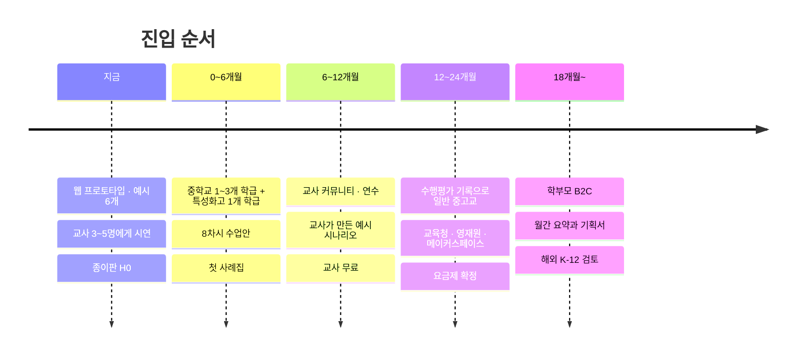

---

## 10. 실행 로드맵과 KPI

설계서 v4 §16의 단계와 맞춘다.

| 시기 | 제품 | 사업 | 핵심 KPI |
|---|---|---|---|
| **지금** | **W0** 웹 프로토타입 ✅ · 예시 6개 ✅ | 교사 3~5명에게 `/demo` 시연 · 종이판 H0 | 교사의 "우리 반에서 해보고 싶다" 3명 |
| **~4주** | **W1** 계정(파일럿 코드) · 서버 저장 · 개인정보 감지 · 보호자 동의 · **기능별 비용 기록** | 파일럿 학급 확정 · 동의 절차 | 한 학급이 자기 기기로 이어 쓴다 · 턴당 비용 실측 |
| **~8주** | **W2** 기획서.md 자동 누적 · 역질문 답 → 기획서 한 줄 · AI 활용 기록서 양식 | 8차시 수업 운영 | **초안 완성률 50%** · 블라인드 선호 60% |
| **~11주** | **W3** 복기함 모아 보기 · 미션 바꾸기 · 생각 지도 | 첫 월간 리포트 · 사례 정리 | 역질문 응답률 65% · 리포트 열람률 70% · 미션 달성률 50% |
| **~16주** | **W4** 교실 모드 · 교사 요약 · 포트폴리오 PDF | 기획서 발표회 · 학교 2~3곳 추가 | 교사 "오늘 누구와 이야기할지 알았다" 주 1회 |
| **이후** | **B1 · B2** 절감 · **C** 에이전트 설계 코칭 | 요금제 확정 · 교육청/기관 1곳 · B2C | 턴당 비용 −60%(품질 유지) · 유료 전환 50% |

**북극성 지표**: **리포트가 거듭될수록 O3+O4(열린 · 대안 질문) 비율이 오른 학생의 비율** (구현 단계 제외).
**v4의 짝 지표**: **체크 칸 4/4를 자기 말로 채워 기획서를 내보낸 프로젝트의 비율.** 앞의 것은 "묻는 법이 자랐는가", 뒤의 것은 "설계가 남았는가"를 말한다.

---

## 11. 리스크와 대응

| 리스크 | 가능성 | 영향 | 대응 |
|---|---|---|---|
| **학생은 결국 코드를 원한다** — 명세가 답답하다 | 중간 | 높음 | 막지 않는다 · 분명히 다시 요청하면 코드를 준다(핵심 20줄) · "코딩 도구에 붙여넣으면 바로 나와"를 **수업 7차시에서 실제로 체험**시킨다 · 블라인드 비교(H1)로 확인하고, 선호가 안 나오면 코드 비중을 올린다 |
| **코딩 도구 · 빅테크가 '청소년용 계획 모드'를 넣는다** | 높음 | 높음 | 기능이 아니라 시나리오 · 종단 데이터 · 국내 지침 · 학교 운영 방식으로 방어. 특정 모델에 종속되지 않는 구조(역할별 프롬프트 · 로컬 폴백) |
| **기획서를 AI 답 복붙으로 채운다** | 높음 | 중간 | "네 말로" 안내 · 글자 수 제한 · 직전 답과의 유사도 검사(W1) · 역질문이 같은 칸을 말로 다시 묻는다 |
| **원가가 구독가를 넘는다** | 중간 | 높음 | §8.2 — 호출 수를 이미 줄였다 · 비용 기록 → 절감 · 학교용 일 한도 · 로컬 엔진 혼용 |
| **되묻기가 두 겹이라 잔소리가 된다** | 중간 | 높음 | 열린 되묻기는 **한 줄 · 무시해도 아무 일 없음** · 역질문은 억지 질문 금지 · [나중에] 3연속이면 3:1 · 4:1 · ⚡ 답만 모드 |
| **기기 저장(localStorage)이라 기록이 사라진다** | 높음 (지금) | 높음 | W1 서버 저장 전까지는 파일럿을 하지 않는다 · 그 전 시연은 .json/.md 내보내기로 백업 |
| **청소년 개인정보 · 사진 입력** | 중간 | 높음 | 만 14세 미만 법정대리인 동의 · 최소 수집 · 학생 소유 · 삭제권 · 사진은 줄여서 전송 · 얼굴 · 개인정보 감지 경고(W1) · 교사는 요약만 |
| **답을 주니 결국 의존을 돕는다** | 중간 | 높음 | 북극성 + 짝 지표 + 형태 전진(고르기 → 서술)으로 상시 점검 · 효과 검증 결과를 공개 |
| **예시 시나리오가 '정답'처럼 읽힌다** | 중간 | 중간 | 모든 곳에 `예시` 딱지 · 차별점 `___` 은 비워 둔다 · 교사 연수에서 "읽고 나서 자기 주제로" |
| **학교 구매 주기가 길다** | 높음 | 중간 | 교사 무료 → 학급 무료 체험 → 예산 편성기에 맞춘 영업 |
| **제도가 바뀐다** (금지 쪽으로) | 낮음 | 높음 | 기록서는 부가 가치. 핵심 가치(설계 · 질문 코칭 · 기획서)는 제도와 무관하게 성립 |

---

## 12. 검증 계획 — 돈을 쓰기 전에 확인할 가설

| # | 가설 | 실험 | 통과 기준 |
|---|---|---|---|
| H0 | **종이로도 된다** | 제품 없이 워크시트: 형식 체크 칸 4개 + 규칙 카드 + 질문 2개마다 "순서도로 말하면?" 스스로 적기 | 4주 지속률 50% — 안 되면 앱으로도 안 된다 |
| H1 | **명세로 주는 답이 더 낫다고 느낀다** | 같은 질문을 범용 챗봇(코드 답)과 블라인드 비교 + "코딩 도구에 붙여 돌려 보기" 후 재평가 | 선호 60% |
| H2 | **열린 되묻기가 다음 질문을 바꾼다** | 다음 질문이 되묻기에 답하며 시작한 비율 · 직접 잰 값이 들어간 비율 | 40% · "귀찮다" 30% 미만 |
| H3 | 2문 1역은 잔소리가 아니다 | 응답/나중에 로그 + 인터뷰 | 응답률 65% · [나중에] 3연속 10% 미만 |
| H4 | **기획서는 학생의 말로 채워진다** | 체크 칸 4/4 비율 · 직전 답과의 유사도 | 완성률 50% · 유사도 0.55 미만 80% |
| H5 | **기획서는 다음 도구의 입력으로 쓰인다** | .md 내보낸 학생 추적 · 7차시 관찰 | 50%가 붙여넣어 돌려 봄 |
| H6 | 역할 배지 · 칩(설계로 돌아가기)은 질문을 바꾼다 | 노출군 vs 비노출군 | O3+O4 비율 유의차 · 칩 → 질문 전환 20% |
| H7 | 리포트는 읽히고 미션은 실행된다 | 발행 후 다음 10문 추적 | 열람률 70% · 미션 달성률 50% |
| H8 | 교사는 기획서 + 요약만으로 평가 · 개입을 결정할 수 있다 | 교사 3명 한 학기 | "평가 근거로 썼다" 3명 중 2명 |
| H9 | 다섯 형식은 코딩 밖에서도 통한다 | 논문 · 리서치 · 캠페인 형식 각 5명 | 형식별 초안 완성률이 서비스 · 제품과 비슷 |
| H10 | 학부모는 월간 요약 + 기획서에 지불한다 | 공유 요약 → 구독 랜딩 | 전환율 3% |

> **H0 → H1 → H4 순서다.** 종이로 안 되면 앱도 안 되고, 명세가 답으로 인정받지 못하면 나머지는 시험할 기회가 없고,
> 기획서가 학생의 말로 채워지지 않으면 이 제품은 또 하나의 요약기다.

---

## 13. 필요 자원 (초기 12개월)

| 영역 | 구성 | 비고 |
|---|---|---|
| **제품** | 풀스택 1~2 · AI/프롬프트 엔지니어 1 · 디자이너 0.5 | 프로토타입이 있어 첫 과제는 **계정 · 서버 저장 · 비용 기록**. 난이도 높은 곳: 기획서 자동 누적 · 역질문 선택 로직 · Phase B 평가 체계 |
| **콘텐츠** | 시나리오 작가 · 교육 설계 1 (현직 · 전직 정보 · 기술 교사) | 형식별 예시 시나리오 확충(논문 · 리서치 · 캠페인 예시가 아직 없다) · 질문 은행 검수 · 수업안 |
| **현장** | 파일럿 교사 3~5명 (공동 설계자) | 자문료 · 사례 공동 발표 |
| **비용** | 인건비 + Phase A LLM 예산(**실측 후 산정** · v3 추정 400만~1,100만 원보다 낮을 것으로 봄) + 개인정보 · 보안 자문 | 정부 지원: 에듀테크 실증 · AI 바우처 · 창업 지원 사업 검토 |

---

## 14. 한 장 요약

### 14.1 사업 마인드맵

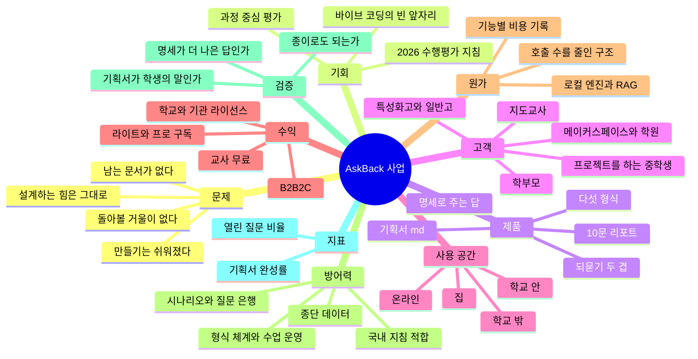

### 14.2 흐름으로 본 한 장

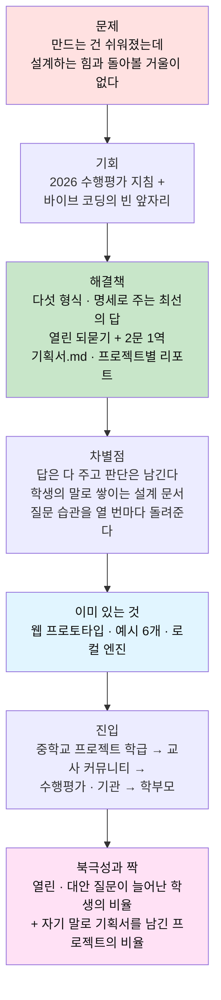

---

## 부록 — 출처와 주의

시장 · 제도 · 연구 · 경쟁 제품의 출처 링크는 [이전 판 부록](AI_역질문_코치_사업계획서.md#부록--출처)을 그대로 쓴다. 핵심만 다시 적는다.

- [청소년 3명 중 2명, 생성형 AI 사용 경험 (한국청소년정책연구원) — 에듀플러스](https://www.eduplusnews.com/news/articleView.html?idxno=14137)
- [시도교육청 「수행평가 시 인공지능(AI) 활용 관리 방안」 — 교육부](https://www.moe.go.kr/boardCnts/viewRenew.do?boardID=294&boardSeq=104984&lev=0&m=020402)
- [2025년 교육기본통계 — KDI 경제교육 · 정보센터](https://eiec.kdi.re.kr/policy/materialView.do?num=270346) · [2025년 초중고 사교육비조사 — 정책브리핑](https://www.korea.kr/news/policyNewsView.do?newsId=156748552)
- [Your Brain on ChatGPT — MIT Media Lab](https://www.media.mit.edu/publications/your-brain-on-chatgpt/) · [The Impact of Generative AI on Critical Thinking — Microsoft Research](https://www.microsoft.com/en-us/research/publication/the-impact-of-generative-ai-on-critical-thinking-self-reported-reductions-in-cognitive-effort-and-confidence-effects-from-a-survey-of-knowledge-workers/)
- [Khanmigo pricing](https://www.khanmigo.ai/pricing) · [Introducing study mode — OpenAI](https://openai.com/index/chatgpt-study-mode/) · [From AI Detection to Authorship — Grammarly](https://www.grammarly.com/blog/company/ai-detector-authorship/)

> **수치 관련 주의**
> ① 중 · 고생 "약 260만 명", TAM · SAM · SOM, 3개년 목표는 **이전 판의 추정을 그대로 옮긴 것**이다. 투자 자료로 쓰기 전에 교육통계서비스(kess.kedi.re.kr)에서 학교급별 수치를 확인한다.
> ② v4의 초점 시장("프로젝트를 하는 중학생")의 **인원은 아직 조사하지 않았다.** 이 문서에는 그 숫자를 적지 않았다.
> ③ 바이브 코딩 도구를 쓰는 중학생의 비율 · 실태에 대한 **공개 통계는 확인하지 못했다.** §1.2는 현장 관찰에 기댄 문제 제기이며, 파일럿 사전 설문으로 확인할 대상이다.
> ④ 가격 · 원가 · 호출 수(1.3~1.8회)는 **모두 가정 또는 구현 구조에서 어림한 값**이다. 턴당 비용은 아직 재지 않았다 — W1에서 실측으로 교체한다.
> ⑤ §7.1의 민준 · 수치(320 · 610 · 94자 · 8/10 등)는 앱에 들어 있는 **예시 시나리오의 값**이며 실제 학생 데이터가 아니다.
