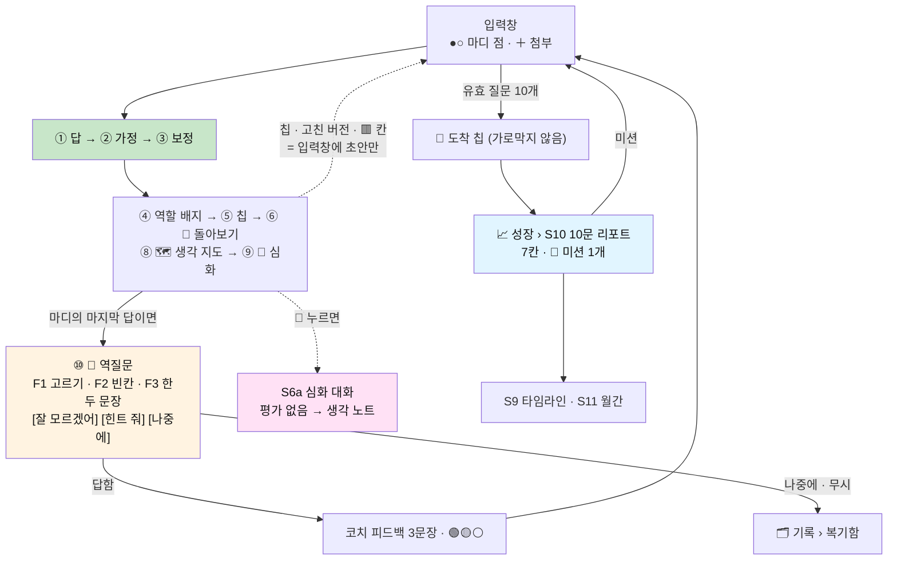

# 📱 화면 설계서 v3 (앱) — 답 아래에 붙고, 가로막지 않는다

> **한 문장**: 설계서 v3의 기능 전부를 **모바일 앱 화면**으로 옮긴다. 와이어프레임 · 상태 · 규칙 · 예외 · 로그까지 적는다.
>
> **기준 문서**: [설계서 v3](AI_역질문_설계서_v3_열고_좁히고_되묻는다.md) (§13 화면 설계 요약을 이 문서가 푼다) · [M0 설계서](AI_역질문_M0_화면흐름_시스템프롬프트.md) (S1~S5 · S8의 M0 상세는 그 문서가 원본이다)
> **짝 문서**: [사이트맵 v3](AI_역질문_사이트맵_v3.md) — 화면 ID · 경로 · 출시 단계의 원본
> **이 문서의 태도**: M0 설계서에 이미 있는 화면은 **다시 그리지 않고 v3에서 달라지는 것만** 적는다. 새 화면은 전부 그린다.
> **움직이는 시연**: `frontend` 에서 `npm run dev` → `/demo` — 서버 없이 예시 JSON(`frontend/src/data/scenarios/*.json` — 🌱 스마트 화분 · 🍱 급식 잔반 예측기 · 🚸 위험 등굣길 지도, 모두 **예시**)으로 S3 대화 · S3d 역질문 · S6 심화 · S10 리포트의 티키타카를 보여준다
> **단계 표기**: `(M0)` `(M1)` `(M2)` `(M3)` `(C)` — 사이트맵 §0과 같다.

---

## 0. 화면 설계의 일곱 원칙

v3의 원칙을 화면의 규칙으로 옮긴 것이다. 화면을 새로 그릴 때마다 이 일곱 줄에 비춰 본다.

| # | 원칙 | 화면에서의 뜻 | 근거 |
|---|---|---|---|
| P1 | **답보다 먼저 나오는 것은 없다** | 배지·칩·카드·역질문은 답 스트리밍이 끝난 뒤에만 나타난다. 로딩 중에 자리(스켈레톤)도 잡지 않는다 | v3 §8 |
| P2 | **붙는다, 가로막지 않는다** | 새 기능은 답 **아래에 붙는 펼침**으로 들어간다. 전체 화면 모달은 학생이 눌렀을 때만 | v3 §7.4 |
| P3 | **1열** | 목록은 전부 1열 · 한 항목이 한 줄(또는 한 카드). 격자·가로 캐러셀을 쓰지 않는다 | v3 §13 |
| P4 | **숫자 대신 색** | 점수·등급·순위를 보여주지 않는다. 🟢🟡⚪ 과 막대만. 다른 학생과의 비교는 어떤 화면에도 없다 | v3 §4.3 · §9.5 |
| P5 | **누르면 채워질 뿐, 보내지지 않는다** | 칩·예시·고친 버전은 입력창에 초안을 채운다. 전송은 언제나 학생의 손가락 | v3 §6.1 |
| P6 | **"잘 모르겠어"와 [나중에]는 언제나 있다** | 역질문의 모든 형태에 빠져나갈 문이 있다. 크기와 위치가 다른 선택지와 같다 | v3 §4.2 |
| P7 | **예측 가능하다** | 다음 역질문까지(●○), 다음 리포트까지(7/10)가 항상 보인다. 놀라게 하지 않는다 | v3 §13 |

---

## 1. 디자인 토큰

### 1.1 색 — 의미가 있는 색만 고정한다

| 토큰 | 라이트 | 쓰임 |
|---|---|---|
| `role.typist` ⌨️ | `#EEEEEE` | O1 받아쓰기 배지 · 막대 |
| `role.coder` 👨‍💻 | `#E1F5FF` | O2 코더 |
| `role.engineer` 🛠 | `#C8E6C9` | O3 엔지니어 · 디자이너 |
| `role.architect` 🏛 | `#FFE1F5` | O4 아키텍트 |
| `role.encyclopedia` 📚 | `#FFF3E1` | O5 백과사전 |
| `review.good` 🟢 | 초록 | 역질문 점수 2~3 |
| `review.partial` 🟡 | 노랑 | 점수 1 |
| `review.unknown` ⚪ | 회색 테두리 | 점수 0 · "잘 모르겠어" |
| `map.mine` 🟩 | 초록 | 생각 지도 — 네가 말한 것 |
| `map.ai` 🟨 | 노랑 | 생각 지도 — 내가 채운 것 |
| `map.open` 🟥 | 빨강 | 생각 지도 — 네가 정할 것 |
| `coach.bubble` | 연한 주황 `#FFF3E1` | 역질문 · 코치 피드백 말풍선 (답 말풍선과 구분) |
| `deep.bubble` | 연한 분홍 `#FFE1F5` | 심화 대화 |
| `warn.band` | 연한 노랑 | 개인정보 경고 띠 · 오프라인 띠 |

```text
색의 규칙
  · 역할 5색에는 '좋은 색 · 나쁜 색'이 없다. 빨강·초록을 역할에 쓰지 않는다 — 배지가 등급으로 읽히면 안 된다.
  · 색만으로 뜻을 전하지 않는다. 🟢🟡⚪ 옆에는 항상 모양(●◐○) 또는 글자가 같이 간다 (색각 이상 대응).
  · 다크 모드: 위 파스텔은 채도를 낮춘 어두운 톤으로 바꾸고 글자는 밝게. 의미 매핑은 그대로.
  · 🟥 '네가 정할 것'은 경고가 아니다. 다크/라이트 모두에서 '비어 있음'으로 읽히도록 점선 테두리를 같이 쓴다.
```

### 1.2 글자 · 간격 · 터치

| 항목 | 값 |
|---|---|
| 본문 | 16pt · 줄간격 1.6 (답은 길다. 읽기 편한 게 먼저) |
| 코드 블록 | 14pt 고정폭 · **가로 스크롤** (줄바꿈하지 않는다) · 오른쪽 위 [복사] |
| 보조 글자 | 13pt (배지 설명 · 시각 · 6요소 칩) |
| 시스템 글자 크기 | OS의 글자 크기 설정을 따른다 (최대 130%까지 레이아웃 보장) |
| 터치 영역 | 최소 44×44pt · 칩과 선택지 사이 간격 8pt 이상 |
| 말풍선 너비 | 학생 78% · AI 답 100% (답은 말풍선이 아니라 **본문**처럼 넓게) |
| 모서리 | 카드 12 · 칩 999(알약) · 시트 위쪽 20 |

---

## 2. 앱 셸

### 2.1 뼈대

```text
┌──────────────────────────────┐
│ (상태바 · 세이프 에어리어)       │
├──────────────────────────────┤
│  헤더  제목            (우측)  │  ← 56pt · 스크롤해도 고정
├──────────────────────────────┤
│                              │
│          본문 (1열)            │
│                              │
├──────────────────────────────┤
│  💬 대화    🗂 기록    📈 성장   │  ← 탭바 · S3 · 전체 화면에서는 숨김
└──────────────────────────────┘
│ (홈 인디케이터 세이프 에어리어)   │
```

### 2.2 탭바

| 탭 | 루트 | 점 표시 | 단계 |
|---|---|---|---|
| 💬 대화 | S2 홈 | — | M0 |
| 🗂 기록 | S4 (세그먼트: 질문 · 복기함 · 생각 노트) | 복기함에 새로 쌓임 | M0 (세그먼트는 M1·M2에 늘어남) |
| 📈 성장 | S9 타임라인 | 안 읽은 리포트 | M1 |

- M0에서는 탭이 둘이다. M1에서 `성장`이 생길 때 **한 번만** 코치 마크로 알린다: "여기에 네 리포트가 쌓일 거야."
- 점에는 숫자를 쓰지 않는다.

### 2.3 시트와 펼침

| 종류 | 언제 | 닫는 법 |
|---|---|---|
| **펼침 카드** | 답에 딸린 것 (돌아보기 · 생각 지도 · 심화 렌즈 · 힌트) | ▾ 다시 탭 · 스크롤해서 지나가면 그대로 둠 |
| **바텀시트 (중간 높이)** | 짧은 설명 · 선택 (배지 설명 · 미션 바꾸기 · ⋯ 메뉴 · 첨부) | 아래로 끌기 · 바깥 탭 · 뒤로 가기 |
| **전체 화면** | 몰입해서 읽거나 쓰는 것 (리포트 · 심화 대화 · 복기 풀기 · F4) | `‹` · 가장자리 스와이프 |

### 2.4 키보드와 입력창

```text
· 입력창은 키보드 위에 붙어 올라온다. 키보드가 올라와도 마지막 말풍선이 가려지지 않게 본문이 같이 밀린다.
· 입력창은 1줄 → 최대 6줄까지 자란다. 그 이상은 입력창 안에서 스크롤.
· 줄바꿈 = 엔터. 전송 = ➤ 버튼뿐이다 (모바일에서 엔터 전송은 오발송이 잦다). 외장 키보드는 ⌘/Ctrl+Enter.
· 작성 중인 글은 프로젝트별로 기기에 저장된다. 앱이 죽어도, 전화가 와도, 탭을 옮겨도 남는다.
· 칩이 초안을 채울 때 입력창에 이미 글이 있으면 덮어쓰지 않는다 → "지금 쓰던 글이 있어. 바꿀까?" [바꾸기] [그대로]
· 초안의 ___ 는 연한 색 토큰으로 보이고, 탭하면 그 빈칸만 선택된다. ___ 가 남은 채 전송하면 막지 않고 한 번만 묻는다: "빈칸이 남아 있어. 그대로 보낼까?"
```

### 2.5 제스처 · 햅틱

| 동작 | 결과 |
|---|---|
| 가장자리 → 오른쪽 스와이프 | 뒤로 |
| 말풍선 길게 누름 | [복사] [이 질문 지우기] (학생 말풍선) · [복사] [신고] (답) |
| 역할 배지 길게 누름 | S3c 시트의 "이 배지, 맞는 것 같아?"로 바로 |
| 목록 당겨서 새로고침 | S2 · S4 · S7 · S9 |
| 햅틱 | 전송(약) · 역질문 선택지 탭(약) · 미션 ✅(중) — 그 밖에는 쓰지 않는다 |

### 2.6 태블릿 · 가로 (M1부터)

```text
┌───────────────┬──────────────────────────┬─────────────────────┐
│ 프로젝트 목록    │  S3 대화                  │  보조 패널             │
│ (S2 · 접을 수    │                          │  🗺 생각 지도           │
│  있음)          │                          │  또는 📄 리포트          │
│               │  [ 입력창 ]                │  또는 🔎 돌아보기         │
└───────────────┴──────────────────────────┴─────────────────────┘
      280pt               가변 (최소 420pt)             360pt
```

- 폭 768pt 이상에서 3단, 600~767pt에서 2단(대화 + 보조 패널), 그 아래는 폰 레이아웃.
- 보조 패널은 폰의 '펼침/전체 화면'을 **옆에** 여는 것뿐이다. 내용과 규칙은 같다. 1열 원칙은 패널 안에서 그대로.

### 2.7 접근성

```text
· 스크린리더: 답이 스트리밍되는 동안은 읽지 않고, 끝나면 "답 도착" 한 번 알린 뒤 학생이 읽기를 시작한다.
· 이모지에는 전부 대체 텍스트 — 👨‍💻 → "코더", 🟡 → "부분적으로 맞음", ●○ → "다음 돌아보기 질문까지 질문 1개".
· 움직임 줄이기 설정이면 부가물의 0.15초 순차 페이드인을 한 번에 표시로 바꾼다.
· 생각 지도(순서도)는 '목록으로 보기' 전환을 제공한다 — 칸을 순서대로 읽을 수 있게.
```

---

## 3. 공통 컴포넌트

| ID | 컴포넌트 | 설명 | 쓰이는 곳 |
|---|---|---|---|
| C-01 | **답 본문** | 마크다운 · 코드 블록(가로 스크롤 · 복사) · 표(가로 스크롤) · 머메이드 | S3 · S8 |
| C-02 | **가정 블록** | 💬 내가 가정한 것 — 답 말풍선 **안쪽** | S3 |
| C-03 | **보정 블록** | 🔧 하나 보탤게 / ⚠️ 내가 방금 틀린 게 있어 — 늦게 도착 | S3 |
| C-04 | **역할 배지 줄** | "이번 답에서 나는 👨‍💻 코더로 일했어 ⓘ" · 탭 → S3c | S3 |
| C-05 | **역할 아이콘 열** | 👨‍💻👨‍💻🛠⌨️👨‍💻 (최근 5개) 또는 ⌨️2 👨‍💻4 🛠1 🏛3 (분포) | S2 · S4 · S9 · S10 |
| C-06 | **칩** | 🌅 넓히기 · 🔍 좁히기 · 🔀 대안 묻기 · 최대 2개 | S3 |
| C-07 | **펼침 머리줄** | ▸ 🔎 내 질문 돌아보기 · ▸ 🗺 생각 지도 · ▸ 🔭 심화 | S3 |
| C-08 | **역질문 말풍선** | 코치 색 · 형태별 입력 영역 · [잘 모르겠어] [나중에] | S3 · S7a |
| C-09 | **힌트 사다리** | 💡 힌트 → 📎 예시 → 🤖 내 생각 · 한 단씩만 열린다 | S3 · S7a |
| C-10 | **마디 점** | ●○ (2:1) · ●○○ (3:1) · ●○○○ (4:1) | S3 입력창 왼쪽 |
| C-11 | **판 막대** | 얇은 진행 막대 + "7/10" | S3 헤더 아래 · S9 빈 상태 |
| C-12 | **6요소 칩 줄** | 왜✅ 맥✅ 제⬜ 기⬜ 검⬜ 버⬜ | S3a · S4 · S10 |
| C-13 | **돌아보기 색 줄** | 🟢🟢🟡⚪ + 요소 아이콘 | S9 · S10 · S11 |
| C-14 | **믹스 막대** | O1~O5 가로 막대 5줄 + 참고 믹스 한 줄 | S10 · S11 |
| C-15 | **미션 카드** | 🎯 또렷한 테두리 · 근거 한 줄 · [미션 바꾸기] | S10 · S3 상단(진행 중) |
| C-16 | **상단 알림 칩** | "📄 7번째 판 리포트 도착" · 탭 → 이동 · ✕ 닫기 | S3 |
| C-17 | **띠** | 입력창 위 한 줄 경고 (개인정보 · 오프라인 · 전송 대기) | S3 |
| C-18 | **빈 상태** | 그림 없이 글 두 줄 + 행동 하나 | 모든 목록 |

---

## 4. 화면별 설계

### S0 시작 (M0)

| 조건 | 가는 곳 |
|---|---|
| 세션 없음 | S1-1 |
| 온보딩 중간 이탈 | 멈춘 장 |
| 세션 있음 · 마지막 사용 24시간 이내 | 마지막 S3 (작성 중이던 글 복원) |
| 세션 있음 · 그 외 | S2 |
| 딥링크 · 알림으로 실행 | 그 화면 (로그인이 필요하면 로그인 뒤 복귀) |
| 최소 지원 버전 미만 | X3 강제 업데이트 |

스플래시는 로고만, 1초 이내. 광고성 문구·팁을 넣지 않는다.

---

### S1 온보딩 (M0)

①약속 ②나 ③첫 프로젝트는 [M0 설계서 §2 S1](AI_역질문_M0_화면흐름_시스템프롬프트.md) 그대로다. 앱에서 더해지는 것만 적는다.

```text
S1-5 로그인 (①약속 다음, ②나 앞)            S1-4 보호자 동의 (14세 미만일 때만)
┌──────────────────────────┐            ┌──────────────────────────┐
│  어떻게 들어올래?            │            │  보호자 확인이 필요해        │
│                          │            │                          │
│  [  Apple로 계속하기   ]   │            │  만 14세가 안 됐으면         │
│  [  Google로 계속하기  ]   │            │  보호자 동의가 있어야 해.     │
│  [  카카오로 계속하기   ]   │            │  법으로 정해진 거야.         │
│                          │            │                          │
│  파일럿 코드가 있어?        │            │  보호자 이메일 또는 전화번호   │
│  [ _ _ _ _ _ _ ]         │            │  [                     ] │
│                          │            │  [ 동의 요청 보내기 ]        │
│  약관 · 개인정보 처리방침    │            │                          │
│                          │            │  기다리는 동안 3번까지는      │
│                          │            │  물어볼 수 있어. [ 체험하기 ] │
└──────────────────────────┘            └──────────────────────────┘
```

| 디테일 | 처리 |
|---|---|
| 순서 | 약속 → 로그인 → 나 → 첫 프로젝트. **약속이 로그인보다 먼저다** — 무엇을 하는 곳인지 알고 나서 계정을 만든다 |
| 90초 목표 | 로그인 포함 4장. 관심사·설명은 건너뛸 수 있다 |
| 알림 권한 | 여기서 묻지 않는다 (사이트맵 §6) |
| 보호자 동의 | 보호자는 **웹 링크**로 동의한다. 앱 설치를 요구하지 않는다 · 동의 대기 중 상태는 S5-4에 표시 |
| 교실 코드 | M3: 파일럿 코드 자리에 학급 코드를 넣으면 교실 참여로 시작 |

---

### S2 홈 (M0 → M1)

M0 와이어프레임에 **카드 한 줄**이 더해진다.

```text
┌────────────────────────────────────────────────┐
│  민준의 프로젝트                            ⚙️  │
├────────────────────────────────────────────────┤
│  🌱 스마트 화분                       🔧  🏫    │  ← 켠 팩 아이콘 (M2) · 교실 과제 (M3)
│     상추 화분 자동 급수                          │
│     질문 68개 · 어제                            │
│     최근 역할  👨‍💻👨‍💻🛠⌨️👨‍💻                     │
│     🎯 기준 한 줄 넣어보기 · 이번 판 8/10         │  ← (M1) 진행 중인 미션 + 판 진행
├────────────────────────────────────────────────┤
│  📝 미세먼지 탐구 보고서                          │
│     …                                          │
├────────────────────────────────────────────────┤
│                [ + 새 프로젝트 ]                 │
└────────────────────────────────────────────────┘
```

| 디테일 | 처리 |
|---|---|
| 미션 줄 | 미션은 학생 단위 1개다(§7.4). **가장 최근에 쓴 프로젝트 카드에만** 보인다. 여러 카드에 같은 미션을 반복하지 않는다 |
| 카드 왼쪽으로 밀기 | [보관] — 삭제는 S5-1에서만 |
| 보관된 프로젝트 | 목록 맨 아래 "보관함 (3)" 한 줄 |
| 빈 상태 | 생길 수 없다 (`자유 질문`이 항상 있다) |

---

### S2a 프로젝트 만들기 (M0 → M2)

```text
┌────────────────────────────────────────────────┐
│ ✕   새 프로젝트                                  │
├────────────────────────────────────────────────┤
│  뭘 만들어?                                      │
│  [ 스마트 화분                              ]    │
│  한 줄로 설명하면? (선택)                          │
│  [ 상추 화분 자동 급수                       ]    │
│                                                │
│  ── 무엇을 같이 돌아볼까? (M2) ─────────────────   │
│  여러 개 골라도 돼. 나중에 바꿀 수 있어.             │
│                                                │
│  ☑ 기본        흐름·핵심·이유·대안·실패·기준·검증·개선 │  ← 항상 켜짐 · 끌 수 없음
│  ☐ 🔧 메이커    내 손으로 만들고, 실패하고, 고쳤는가    │
│  ☐ 📣 공유      남이 따라 할 수 있게 내놓았는가        │
│  ☐ 🤝 협력      다른 팀·서비스와 어떻게 손잡을까       │
│  ☐ 🤖 AI·자동화  무엇을 맡기고, 무엇을 끝까지 쥘까      │
│                                                │
│  💡 지금 단계가 '만드는 중'이면 🔧 메이커가 잘 맞아.    │  ← 참고선. 자동 선택하지 않는다
│                                                │
│                [ 시작하기 ]                      │
└────────────────────────────────────────────────┘
```

| 디테일 | 처리 |
|---|---|
| 팩을 하나도 안 고름 | 정상. 기본 8요소만으로 시작한다. 권하는 문구를 다시 띄우지 않는다 |
| 팩 행을 탭 | 체크 · 행 오른쪽 ⓘ → 그 팩의 요소 4개와 대표 역질문을 시트로 |
| 팩을 여러 개 켬 | 안내 한 줄: "여러 개를 켜도 돌아보기 질문이 늘어나진 않아. 섞여서 나올 뿐이야." (10문당 팩 질문 합쳐서 2개 · §5.4) |
| 교실 과제로 생성 | 팩·리듬이 채워진 채 잠김 · "선생님이 정했어" |
| M0 · M1 | 팩 구역 전체가 없다. 이름·설명만 |

---

### S2b 프로젝트 설정 (M0 → M2)

| 항목 | 내용 | 단계 |
|---|---|---|
| 이름 · 설명 · 이모지 | 편집 | M0 |
| **돌아보기 리듬** | `2문 1역` (기본) · `3문 1역` · `4문 1역` — 고르면 마디 점(C-10)의 개수가 바로 바뀐다 | M1 |
| **⚡ 답만 모드** | 이 프로젝트만 / 전체(S5-2) | M0 |
| **평가 팩** | S2a와 같은 목록. 중간에 바꾸면 **다음 판부터** 리포트의 팩 섹션이 바뀐다고 알린다 | M2 |
| 프로젝트 단계 | 탐색 · 설계 · 구현 · 검증 — 분석기가 추정한 값을 보여주고 학생이 고칠 수 있다 (참고 믹스와 넓히기 칩의 문턱에 쓰인다 · §11) | M1 |
| AI 활용 기록서 | → S14 | C |
| 보관 | 홈에서 숨김 | M0 |

---

### S3 대화 ★ (M0 → M2)

#### S3-1 v3 전체 뼈대

M0의 ①~⑦([M0 §2 S3](AI_역질문_M0_화면흐름_시스템프롬프트.md))에 M1·M2의 것이 붙는다. **순서가 곧 규칙이다.**

```text
┌────────────────────────────────────────────────┐
│ ‹  🌱 스마트 화분                    ⚡    ⋯    │   헤더 (⚡는 답만 모드일 때만)
│ ▔▔▔▔▔▔▔▔▔▔▔▔▔▔▔▔▔▔▔▔▔▔▔▔▔▔▔▔▁▁▁▁▁▁▁▁▁▁  7/10  │   ⑪ 판 막대 (M1)
├────────────────────────────────────────────────┤
│        ┌ 📄 7번째 판 리포트 도착        ✕ ┐       │   ⑫ 상단 알림 칩 (M1 · 있을 때만)
│                                                │
│              🙋 센서값 400 밑이면 펌프 3초         │   학생 말풍선 (오른쪽)
│                 켜는 코드 짜줘                   │
│                                                │
│  (답 본문 — 마크다운 · 코드 블록)                  │   ① 답 (스트리밍)
│                                                │
│  💬 내가 가정한 것                               │   ② 가정
│   · 센서는 A0, 펌프는 7번 핀                      │
│  🔧 하나 보탤게 — 3초 동안은 센서를 안 읽어.        │   ③ 보정 (늦게 도착)
│                                                │
│  이번 답에서 나는 👨‍💻 코더로 일했어  ⓘ             │   ④ 역할 배지
│  [ 🌅 넓히기 ]                                  │   ⑤ 칩 (최대 2)
│  ▸ 🔎 내 질문 돌아보기                            │   ⑥ 펼침
│  ▸ 🗺 생각 지도                                  │   ⑧ 펼침 (M1 · 늦게 도착)
│  ▸ 🔭 심화                                      │   ⑨ 펼침 (M2)
│  👍  👎                                         │   ⑦ 답 평가
│                                                │
│  ┌ 🧭 ─────────────────────────────────────┐   │   ⑩ 역질문 말풍선 (M1)
│  │ 방금 코드에서, 펌프가 도는 3초 동안 센서가    │   │      마디의 마지막 답 뒤에만
│  │ 빠지면 어떻게 될 것 같아?                   │   │
│  │ [                                    ]   │   │
│  │ [ 잘 모르겠어 ]   [ 힌트 줘 ]   [ 나중에 ]   │   │
│  └─────────────────────────────────────────┘   │
├────────────────────────────────────────────────┤
│ ●○  ＋  [ 무엇이든 물어봐                ] ( ➤ )│   ⑬ 마디 점 (M1) · ＋ 첨부/메뉴
└────────────────────────────────────────────────┘
```

**도착 순서와 시간 제한**

| 순서 | 요소 | 시간 규칙 |
|---|---|---|
| 1 | ① 답 · ② 가정 | 첫 토큰 최우선. 그 전에는 점 세 개뿐 |
| 2 | ④ 배지 → ⑤ 칩 → ⑥ 돌아보기 → ⑦ 👍👎 | 답 종료 후 0.15초 간격 · **2초 안에 못 오면 이번 턴은 없이 끝낸다** |
| 3 | ⑩ 역질문 | 답 종료 후 **1~2초 안에.** 넘기면 이번 마디는 건너뛴다 (카운터만 리셋) |
| 4 | ③ 보정 · ⑧ 생각 지도 | 늦어도 된다. 준비되면 **알림 없이** 조용히 붙는다 |
| — | ⑨ 심화 | 항상 있다 (M2 이후) |

```text
자동 스크롤의 규칙
  · 스트리밍 중에는 맨 아래를 따라간다. 학생이 위로 스크롤하면 즉시 멈추고 [↓ 최신으로] 버튼을 띄운다.
  · 부가물·역질문이 붙을 때 화면을 움직이지 않는다. 학생이 읽던 줄이 밀려 올라가면 안 된다.
  · 역질문이 화면 밖 아래에 붙었으면 입력창 위에 작은 알약: "🧭 하나 물어봐도 돼?" — 탭하면 그리로 스크롤.
```

#### S3-2 M0 상태표에 v3가 더하는 상태

| 상태 | 화면 | 디테일 |
|---|---|---|
| **역질문 대기** | ⑩이 열려 있고 입력창도 살아 있다 | 학생은 역질문에 답하거나, 그냥 새 질문을 보낼 수 있다. 입력창에서 보낸 글은 **새 질문**이다 — 역질문의 답은 말풍선 **안의** 입력 영역으로만 받는다 (둘을 헷갈리지 않게) |
| **역질문 무시하고 새 질문** | ⑩이 한 줄로 접힌다: "🧭 복기함에 넣어뒀어" | 미응답으로 S7에. 새 질문은 새 마디의 1번 → 마디 점 ●○ |
| **[나중에]** | 같은 접힘 · 문구: "알겠어. 복기함에 있을게." | 3회 연속이면 S3j |
| **긴 답 (코드 100줄 이상)** | ⑩이 펼쳐진 채가 아니라 **접힌 한 줄**로 붙는다: "🧭 다 보고 나면 하나만 물어볼게 ▸" | 학생이 답을 다 본 뒤 펼친다 |
| **급함 감지** ("10분 뒤 발표", "빨리") | ⑩ 없음 · 마디 점 옆에 작은 🧺 | 다음 접속 때 "아까 못 물어본 것 하나" 인라인 카드 → [지금 볼게] S7a · [괜찮아] |
| **O5 질문** | 답 끝에 좁히는 질문 3개가 **탭할 수 있는 줄**로 | 탭 → 입력창에 "① 뭘 키울 거야? → ___" 초안. 전송 아님 (P5) |
| **정서적 대화** | ④~⑩ 전부 없음 | 답만. 필요 시 도움받을 곳 카드(전화·채팅 상담) — 광고처럼 보이지 않게 글만 |
| **답 정정** (나중에 틀린 걸 앎) | 그 답에 ⚠️ 블록 · 그 턴의 역질문 색이 회색 줄로 | 점수 무효. 학생이 잡아냈으면 🕳 구멍 발견자 배지 |
| **교실 과제 진행 중** | 헤더 아래 한 줄: "🏫 자동 급수 과제 · 3문 1역" | 탭 → 과제 설명 시트 |

#### S3a 🔎 내 질문 돌아보기 (M0)

[M0 §2 S3a](AI_역질문_M0_화면흐름_시스템프롬프트.md) 그대로. v3에서 더해지는 것:

| 더해지는 것 | 내용 |
|---|---|
| 개방도 한 줄 (M1) | 카드 맨 위: "이 질문은 **좁은 질문(O2)** 이었어 — 설계는 네가, 구현은 내가." 학생 화면에 `O2`라는 기호를 쓸지는 파일럿에서 확인 (기본은 말로만) |
| 미션 연결 (M1) | 진행 중인 미션과 관련된 칸이면 🎯 표시: "기준 ⬜ 🎯 — 이번 판 미션이 이거였지" |
| 폰에서의 폭 | '고친 버전'의 염두 주석은 문장 **아래 줄**에 들여쓰기로 (M0 와이어프레임의 오른쪽 주석은 폰에서 안 들어간다) |

```text
[ 고친 버전 보기 ] — 폰 레이아웃
   "상추 화분 자동 급수를 만들고 있어.
      └ [목적] 결과물보다 목표를 먼저
    센서는 A0, 5V 펌프야.
      └ [맥락] 네가 이미 알려준 것
    펌프가 켜졌다 꺼졌다 하지 않는 게 중요해.
      └ [기준] 그럴듯함과 정답을 가르는 잣대
    급수 로직을 어떻게 잡으면 좋을까?"
      └ [열기] 방법을 맡기는 대신 이유를 같이 받는다
                          [ 이걸로 다시 물어보기 ]
```

#### S3b 칩 (M0) · S3c 역할 배지 시트 (M0)

M0 설계서 그대로. 앱에서의 추가 규칙은 §2.4(입력창에 글이 있을 때 · 빈칸 토큰)에 있다.
S3c는 중간 높이 바텀시트. 프로젝트 성격이 글쓰기면 역할 이름이 받아쓰기 / 대필 / 편집자 / 기획 파트너 / 백과사전으로 바뀐다(§2.3).

#### S3d 역질문 말풍선 — 형태별 (M1)

**공통 구조**

```text
┌ 🧭 돌아보기 ─────────────────────── 🎯 기준 ┐   ← 평가 요소 이름 (작게). 팩 요소면 🔧 M2 식으로
│ (질문 — 2문장 이내 · 마디의 구체적인 것을 담는다)   │
│ (이 질문에 답하면 뭐가 좋은지 한 줄 — 연한 글자)    │
│                                              │
│ (형태별 입력 영역)                              │
│                                              │
│ [ 잘 모르겠어 ]      [ 힌트 줘 ]      [ 나중에 ]  │   ← 세 버튼의 크기는 같다 (P6)
└──────────────────────────────────────────────┘
```

**F1 고르기** — 5초

```text
┌ 🧭 돌아보기 ─────────────────────── 📏 기준 ┐
│ 그럼 네 화분에서 '물이 충분하다'는 건            │
│ 어느 쪽에 가까워?                             │
│ 이게 정해지면 센서를 꽂을 깊이가 정해져.          │
│                                            │
│  ( ) 흙 표면이 젖음                           │
│  ( ) 뿌리 깊이가 젖음                         │
│  ( ) 잎이 처지지 않음                         │
│  ( ) 잘 모르겠어                              │   ← 보기 안에 같은 모양으로 들어간다
│                                            │
│                          [ 나중에 ]          │
└────────────────────────────────────────────┘
```

- 보기는 세로 1열 · 한 번 탭으로 선택과 제출이 같이 된다 (확인 버튼 없음 — 5초짜리다).
- 고른 뒤에는 보기가 잠기고 고른 것만 진하게. 정답·오답 표시(○✕)를 하지 않는다. 피드백은 말로 온다(S3f).

**F2 빈칸** — 15초

```text
┌ 🧭 돌아보기 ─────────────────────── 🗺 흐름 ┐
│ 방금 만든 걸 3칸으로 말하면? 빈칸 두 개만 채워줘.  │
│                                            │
│   [ 센서 값을 읽는다 ] → [ ____?____ ] → [ ____?____ ]
│        🟩                  탭해서 입력          탭해서 입력
│                                            │
│ [ 잘 모르겠어 ]     [ 힌트 줘 ]     [ 다 했어 ]  │
│                                  [ 나중에 ]  │
└────────────────────────────────────────────┘
```

- 빈칸을 탭하면 그 칸 아래에 한 줄 입력이 열린다. 칸 하나에 20자 이내.
- 폰 폭에서 3칸이 안 들어가면 **세로 흐름**(↓)으로 바꾼다. 가로 스크롤을 만들지 않는다.
- 문장 빈칸형도 같은 컴포넌트: "임계값을 두 개로 나눈 건 `____` 때문이야."

**F3 한두 문장** — 30초

```text
┌ 🧭 돌아보기 ─────────────────────── 💥 실패 ┐
│ 방금 코드에서, 펌프가 도는 3초 동안 센서가       │
│ 빠지면 어떻게 될 것 같아?                      │
│                                            │
│ ┌────────────────────────────────────────┐ │
│ │ 엉성해도 돼. 네 말로 한두 문장.             │ │   ← 3줄 입력 · 200자 · 🎤 음성 입력
│ └────────────────────────────────────────┘ │
│ [ 잘 모르겠어 ]    [ 힌트 줘 ]      [ 보내기 ]  │
│                                  [ 나중에 ]  │
└────────────────────────────────────────────┘
```

- 붙여넣기는 막지 않는다. 직전 답과 유사도가 높으면 피드백에서 "네 말로 한 줄만" 1회 권유(§11) — 화면에서 지적·경고하지 않는다.
- 🎤: 모바일에선 말이 글보다 쉽다. OS 음성 입력을 쓴다.

**F4 그리기 · 설명 (S3d-4 · M3)** — 3분 · 전체 화면

```text
┌────────────────────────────────────────────────┐
│ ✕   손으로 그려보기                    [ 나중에 ] │
├────────────────────────────────────────────────┤
│  자동 급수의 흐름을 순서도로 그려줘.               │
│  종이에 그려서 찍어도 되고, 여기에 그려도 돼.        │
│                                                │
│   [ 📷 종이에 그린 걸 찍기 ]   [ ✏️ 여기에 그리기 ]   │
│                                                │
│  (그리기 캔버스 또는 찍은 사진 미리보기)             │
│                                                │
│  🎤 1분 설명 (선택)          ● 00:00             │
│                                                │
│                   [ 다 했어 ]                   │
└────────────────────────────────────────────────┘
      ↓
  겹쳐 보기: 내 그림 ↔ 생각 지도 · 차이 나는 칸만 같이 본다
```

- 이정표(T5) · 교실 모드 · 학생이 [🙋 나한테 물어봐 → 그려볼래]를 골랐을 때만.
- 카메라 권한은 [📷]을 처음 누른 그 순간에 묻는다(X2).

**형태는 누가 정하나** — 학생이 고르지 않는다. 최근 점수로 정해진다(§4.2). 다만 말풍선 오른쪽 위 `⋯` → [더 쉽게 물어봐줘] 는 언제나 있다 (F3 → F2 → F1).

#### S3e 힌트 사다리 (M1)

```text
[ 힌트 줘 ] 또는 [ 잘 모르겠어 ]
   ↓
│ 💡 힌트                                       │
│    delay(3000) 동안 보드가 다른 일을 할 수 있을까? │
│                          [ 아직 모르겠어 ▾ ]   │
   ↓
│ 📎 예시                                       │
│    전자레인지를 3분 돌리면, 그동안 문을 열어도 ...  │
│                          [ 그래도 모르겠어 ▾ ]  │
   ↓
│ 🤖 내 생각은 이래                               │
│    3초는 무조건 돌아. 센서가 빠져도 몰라. 그래서 …  │
│    네 말로 한 줄로 바꿔 말해볼래?  [          ]    │
```

| 디테일 | 처리 |
|---|---|
| 한 단씩 | 다음 단은 이전 단을 **연 뒤에만** 보인다. 세 단이 한꺼번에 열리지 않는다 |
| 입력 영역 유지 | 어느 단에서든 위의 입력 영역은 살아 있다. 힌트를 보고 바로 답할 수 있다 |
| "잘 모르겠어" | 누르는 즉시 ⚪으로 기록하고 💡부터 연다. "괜찮아, 이건 아직 아무도 안 정한 칸이야" 같은 받아주는 한 줄이 먼저 |
| 3단 뒤 | 답하지 않고 넘어가도 된다. [알겠어, 넘어갈게] 가 있다 |
| 기록 | 어느 단까지 열었는지 (`hintStage`) — 힌트 후에 풀리면 최대 🟡 |

#### S3f 코치 피드백 (M1)

```text
│ 🧭  "3초는 무조건 도는구나" — 맞아, 3초는 무조건이야.        │  ① 받아준다 (학생의 말을 인용)
│     그래서 보통은 '얼마나 오래'가 아니라 '언제 멈출지'로 짜.    │  ② 하나 보탠다
│     계속 갈래, 이걸 먼저 볼래?                              │  ③ 돌려준다
│     [ 이걸 먼저 볼래 ]   [ 하던 거 계속 ]                    │
│                                          🟡 왜 🟡야?       │
```

- 3문장 이내 · 점수·등급을 말하지 않는다 · 색은 오른쪽 아래에 작게.
- **[이걸 먼저 볼래]** → 입력창에 초안 (P5). **[하던 거 계속]** → 말풍선이 접히고 입력창에 포커스.
- **왜 🟡야?** (S3f-1 시트): 채점 근거 한 줄을 코치 말투로. "방향은 맞았어. 다만 힌트를 본 뒤에 나온 답이라 노랑이야. 다음에 또 물어볼게." + [이건 아닌 것 같아] → 채점 골든셋 재료.
- 피드백 뒤 마디 점이 ●○ → ○○ 로 리셋되는 짧은 애니메이션 (움직임 줄이기면 생략).
- 학생의 답이 🟥 칸을 채웠으면: 생각 지도 머리줄에 "🟥 → 🟩 한 칸 바뀌었어" 한 줄.

#### S3g 🗺 생각 지도 (M1)

```text
▾ 🗺 생각 지도                         [ 크게 보기 ⤢ ]  [ 목록으로 ]
│
│   ┌──────────────┐
│   │ 🟩 센서 값 읽기  │
│   └──────┬───────┘
│          ↓
│   ┌──────────────┐     아니오
│   │ 🟨 400보다 작나? │ ─────────→ (처음으로)
│   └──────┬───────┘
│          ↓ 예
│   ┌──────────────┐
│   │ 🟩 펌프 3초 켜기 │
│   └──────┬───────┘
│          ↓
│   ┌┄┄┄┄┄┄┄┄┄┄┄┄┄┄┐
│   ┊ 🟥 언제 멈출까?  ┊   ← 점선 = 아직 아무도 안 정한 칸
│   └┄┄┄┄┄┄┄┄┄┄┄┄┄┄┘
│
│   🟩 네가 말한 것 3   🟨 내가 채운 것 1   🟥 네가 정할 것 1
```

| 디테일 | 처리 |
|---|---|
| 방향 | 폰에서는 **항상 위→아래.** 가로 순서도는 그리지 않는다 |
| 칸 탭 | 시트: 🟩 "네가 이렇게 말했어: …" · 🟨 "여긴 내가 넣었어. 왜 필요한지 → …" · 🟥 "여긴 비어 있어. 같이 정해볼까?" [이걸 물어볼래] → 입력창 초안 |
| 칸 고치기 | 칸 길게 누름 → [이 칸 고치기]. 학생이 고치면 🟩이 된다. 지도는 "내가 이해한 흐름"이지 정답이 아니다 |
| 칸 색 위의 작은 점 | 그 칸을 역질문으로 물은 적이 있으면 🟢🟡⚪ 작은 점이 모서리에 (이해 상태) |
| 크게 보기 | 전체 화면 · 두 손가락 확대 · 8칸 이상이면 기본으로 접힌 묶음 |
| 늦게 도착 | 머리줄 `▸ 🗺 생각 지도`는 준비됐을 때 비로소 나타난다. "만드는 중…"을 보여주지 않는다 (P1) |
| 코드가 없는 답 | 지도가 의미 없으면 머리줄 자체가 없다 |

#### S3h 마디 점 · 판 막대 (M1)

| 요소 | 모양 | 규칙 |
|---|---|---|
| **마디 점** | 입력창 왼쪽 `●○` | 채워진 점 = 이번 마디에서 이미 한 질문. 2:1이면 점 2개, 3:1이면 3개. 마지막 점이 채워질 질문을 보낼 때 점이 살짝 커진다 — "이번 답 뒤에 물어볼게"의 예고 |
| 점을 탭 | 말풍선 툴팁: "질문 2번마다 내가 하나 되물어. 지금은 1번째야." + [리듬 바꾸기] → S2b |
| 유효 질문이 아닐 때 | 점이 안 찬다. 설명하지 않는다 (인사에 "이건 안 세"라고 말하는 건 어색하다) |
| **판 막대** | 헤더 아래 2pt 막대 + 오른쪽 `7/10` | 탭 → 툴팁: "질문 10개마다 리포트가 나와. 3개 남았어." · 10/10이 되는 순간에도 **아무 연출 없음** — 리포트는 C-16 칩으로 조용히 |
| 답만 모드 | 둘 다 숨김. 세는 것은 계속한다 |

#### S3i 리포트 도착 칩 (M1)

```text
        ┌ 📄 7번째 판 리포트 도착          ✕ ┐     ← 헤더 아래 떠 있는 알약 · 대화를 가리지 않는 위치
```

| 상황 | 처리 |
|---|---|
| 10번째 답 직후 | 칩만. 소리·진동·모달 없음 |
| 5분 안에 다음 질문을 보냄 | 칩 유지 (작업 흐름을 끊지 않는다) |
| ✕ | 칩만 닫힌다. 성장 탭에 점은 남는다 |
| 3판 연속 미열람 | 칩 대신 대화창 안에 **S10b 3줄 요약 카드**: 믹스 한 줄 · 돌아보기 한 줄 · 미션 한 줄 + [전체 보기] |

#### S3j 리듬 완화 제안 (M1)

```text
│ 🧭 요즘 바쁜 것 같아. 내가 덜 물어볼까?                   │
│    [ 지금처럼 2번마다 ]  [ 3번마다 ]  [ 4번마다 ]          │
```

- [나중에] 3회 연속일 때 **한 번만.** 고르면 즉시 마디 점 개수가 바뀐다. 장난 답 3회 연속에도 같은 카드.
- "끄기"는 여기 없다. 끄고 싶으면 ⚡ 답만 모드 — 그 길은 ⋯ 메뉴에 항상 있다.

#### S3k · S3m · S3n 입력창 주변 (M0 → M1)

```text
＋ 버튼 → 시트                              ⋯ 버튼 → 시트
  📷 사진 찍기                                프로젝트 설정            → S2b
  🖼 사진 고르기                               ⚡ 답만 모드   ( ○ )
  📋 코드 붙여넣기 (고정폭 입력창이 열린다)        🗂 이 프로젝트의 기록 보기 → S4
  🙋 나한테 물어봐 (M1)                         🧺 복기함 (2)            → S7 (M1)
                                             📄 지난 리포트           → S9 (M1)
```

| 디테일 | 처리 |
|---|---|
| 사진 | 회로·에러 화면·손으로 그린 순서도. 최대 4장 · 전송 전 미리보기에서 [✕] · 얼굴·이름표가 보이면 개인정보 경고(C-17)와 같은 흐름 |
| 사진·코드만 보냄 | 개방도 `NA` — 배지 없음 · 믹스 통계 제외. 유효 질문으로는 센다 |
| 🙋 나한테 물어봐 | 리듬과 무관하게 역질문 1개. 마디 점은 그대로. 교실 모드면 [그려볼래](F4) 선택지 추가 |
| 권한 | 카메라·사진 권한은 그 항목을 처음 누를 때 묻는다 |

#### S3p 개인정보 경고 (M0)

M0 설계서 그대로 (입력창 위 노란 띠 · [가리고 보내기] [고칠게]). 앱에서는 **사진 속 글자**(OCR)의 전화번호·주소도 같은 띠로 다룬다 — 기기에서 처리하고, 판정 전에는 서버로 올리지 않는다.

---

### S4 질문 기록 (M0 → M1)

M0 와이어프레임 그대로. M1에 더해지는 것:

```text
│  👨‍💻 "센서값 400 밑이면 펌프 3초 켜는 코드 짜줘"          │
│      왜⬜ 맥✅ 제⬜ 기⬜ 검⬜              14:11         │
│      🧭 💥실패 🟡                                       │  ← 이 턴 뒤에 역질문이 있었으면 한 줄
│  ─ ─ ─ ─ ─ ─ ─ 7번째 판 ─ ─ ─ ─ ─ ─ ─  📄             │  ← 판 경계선 · 탭 → S10
```

- 상단 세그먼트 `질문 │ 복기함 │ 생각 노트` (M1·M2에 하나씩 늘어난다. M0에는 세그먼트가 없다).
- 필터: 프로젝트 · 역할(⌨️👨‍💻🛠🏛📚). 검색은 질문 원문만.
- 여전히 **통계 화면은 없다.** 숫자는 성장 탭의 리포트가 맡는다.

---

### S6 🔭 심화 (M2)

#### S6 렌즈 고르기 — S3의 펼침

```text
▾ 🔭 심화
│  ┌────────────────────────────────────────┐
│  │ 🧭 철학     이게 정말 풀어야 할 문제일까?    │
│  ├────────────────────────────────────────┤
│  │ 🫀 심리학   사람은 왜 그렇게 행동할까?       │
│  ├────────────────────────────────────────┤
│  │ 🌍 사회학   이게 퍼지면 누구의 무엇이 바뀔까? │
│  └────────────────────────────────────────┘
│                               하나를 골라줘
```

- 카드 3장은 세로 1열. 카드의 한 줄은 고정 문구가 아니라 **이 답의 맥락에 맞춘 질문 미리보기**로 바꿀 수 있다(Phase A).
- 고르면 S6a가 **전체 화면**으로 열린다. 프로젝트 대화와 섞이지 않는다 — 심화는 2문 1역 카운터 밖이다.

#### S6a 심화 대화

```text
┌────────────────────────────────────────────────┐
│ ‹  🫀 심리학 · 스마트 화분             L1 ● ○ ○   │   ← 깊이 표시
├────────────────────────────────────────────────┤
│  ┌ 시작한 곳 ──────────────────────────────┐    │
│  │ "센서를 가장자리에 꽂았는데 가운데랑…" 의 답  │    │   ← 접힌 인용 · 탭 → S3 그 턴
│  └────────────────────────────────────────┘    │
│                                                │
│  🫀 사람들이 화분에 물을 안 주는 건 까먹어서일까,     │
│     얼마나 줘야 할지 몰라서일까?                   │
│     나는 후자 같기도 한데. 너는?                   │   ← 코치도 자기 생각 한 줄을 깐다
│                                                │
│               나는 얼마나 줄지 몰라서였어  🙋       │
│                                                │
│  🫀 (받아주는 한두 문장)                          │
│     [ 한 단 더 깊이 ]  [ 다른 렌즈로 ]  [ 여기까지 ] │
├────────────────────────────────────────────────┤
│ [ 네 생각을 적어줘                       ] ( ➤ )│   ← 마디 점 없음 · 판 막대 없음
└────────────────────────────────────────────────┘
```

| 디테일 | 처리 |
|---|---|
| 없는 것 | 역할 배지 · 칩 · 돌아보기 · 역질문 · 채점 · 색. 심화에는 **평가가 없다** |
| 📌 | 학생 말풍선을 길게 누르면 [생각 노트에 담기]. L2 이상에서 나온 학생의 문장은 자동 후보 — 대화가 끝날 때 "이 문장들을 노트에 담을까?"로 고르게 한다 |
| [다른 렌즈로] | 같은 스레드 안에서 렌즈가 바뀐다. 헤더 아이콘과 말풍선 색 띠가 바뀌고 깊이는 L1로 |
| [여기까지] | S3으로. S3의 그 답 아래 `▸ 🔭 심화` 가 `▸ 🔭 심화 · 🫀 L2까지` 로 바뀐다 (이어서 하기) |
| 시간·개수 | 제한 없다 |

#### S6b 확장 질문 — L3 뒤

```text
│  🫀 그러면 네 화분은 '대신 주는 기계'일까,                  │
│     '얼마나 줘야 하는지 알려주는 기계'일까?                  │
│     후자라면 지금 코드에서 뭐가 달라져야 해?                 │
│                                                        │
│     [ 이 생각을 프로젝트로 가져가기 ]    [ 노트에만 담기 ]      │
```

- **[프로젝트로 가져가기]** → S3으로 돌아가며 입력창에 초안 (P5). 이렇게 보낸 질문이 방향을 바꾸면 🌅 배지 후보.

#### S6c 생각 노트 — 기록 탭 세그먼트

```text
│  9월 21일 · 🫀 심리학 · 🌱 스마트 화분                      │
│  "나는 얼마나 줄지 몰라서였어. 그러니까 내 화분은             │
│   알려주는 기계여야 해."                                   │
│                                              L3 · ⭐    │
├──────────────────────────────────────────────────────┤
│  9월 12일 · 🧭 철학 · 📝 미세먼지 …                         │
```

- 1열 · 한 문장이 한 카드 · 전부 **학생의 문장**이다 (코치의 말은 담지 않는다).
- ⭐ = 학생이 직접 단 별. 월간 리포트 7장 '가장 깊었던 생각'의 후보가 된다.
- 탭 → S6a 그 대화 · 길게 누름 → [지우기] [고치기].

---

### S7 복기함 (M1)

```text
┌────────────────────────────────────────────────┐
│  기록      질문  │ [복기함] │  생각 노트            │
├────────────────────────────────────────────────┤
│  여유 있을 때 하나씩. 안 해도 괜찮아.               │
├────────────────────────────────────────────────┤
│  🧺 아직 안 본 것                                │
│  📏 기준   "'잘 되는 화분'을 한 줄로 정하면?"       │
│           🌱 스마트 화분 · 9/20 · 나중에            │
│  🔬 검증   "이 코드가 맞는지 어떻게 확인해 볼 거야?" │
│           🌱 스마트 화분 · 9/19 · 답만 모드         │
├────────────────────────────────────────────────┤
│  🟡⚪ 다시 볼 만한 것                             │
│  💥 실패 🟡  "펌프가 도는 3초 동안 센서가 빠지면…"   │
│  📏 기준 ⚪  "'물이 충분하다'는 건 어느 쪽에…"       │
├────────────────────────────────────────────────┤
│  ▸ 다 본 것 (12)                                │
└────────────────────────────────────────────────┘
```

| 디테일 | 처리 |
|---|---|
| 첫 줄 문구 | "안 해도 괜찮아"를 지우지 않는다. 복기함은 숙제함이 아니다 |
| 개수 표시 | 탭 점만. 목록 안에서도 "밀린 12개" 같은 문구를 쓰지 않는다 |
| 오래된 것 | 30일 지난 '안 본 것'은 조용히 `다 본 것` 아래 "지나간 것"으로 내려간다. 마디의 맥락이 식은 질문은 억지 질문이 된다 |
| 왼쪽으로 밀기 | [이건 넘길래] — 기록은 '넘김'으로 남고 목록에서 사라진다 |
| 빈 상태 | "여긴 비어 있어. 대화하다가 [나중에]를 누른 질문이 여기 모여." |

**S7a 복기 풀기** — 전체 화면

```text
┌────────────────────────────────────────────────┐
│ ‹  복기                                         │
├────────────────────────────────────────────────┤
│  ▾ 그때의 대화 (9/20 · 질문 2개)                   │   ← 마디(2문답)를 접힌 채로. 펼치면 원문
│     🙋 "soilPin A0에서 A1로 바꿔줘"               │
│     🙋 "센서값 400 밑이면 펌프 3초 켜는 코드 짜줘"   │
│                                                │
│  (C-08 역질문 말풍선 — S3d와 동일)                 │
│  (C-09 힌트 사다리)                              │
│  (S3f 코치 피드백)                               │
│                                                │
│            [ 다음 것 ]      [ 그때 대화로 가기 ]    │
└────────────────────────────────────────────────┘
```

- 여기서 푼 결과는 원래 턴의 `reverseQuestion`을 갱신한다. 이미 발행된 10문 리포트의 색은 **바꾸지 않는다** (리포트는 그때의 기록이다) — 대신 S9 타임라인의 그 판에 "🧺 나중에 1개 풀었어" 가 덧붙는다.

---

### S8 블라인드 비교 (M0 · 파일럿)

M0 설계서 그대로. 폰에서는 A·B를 **좌우가 아니라 위아래 탭 전환**으로: `[ A ] [ B ]` 세그먼트 + 아래 고정 버튼 `[A가 나아] [비슷해] [B가 나아]`. 두 답을 모두 열어본 뒤에만 버튼이 활성화된다.

---

### S9 통 타임라인 (M1)

```text
┌────────────────────────────────────────────────┐
│  민준의 타임라인                       🏅   ⤓    │   ← 🏅 S12 배지 · ⤓ S9b PDF
├────────────────────────────────────────────────┤
│  지금 · 8번째 판   ▔▔▔▔▔▁▁▁▁▁  5/10              │   ← 진행 중인 판 (C-11)
│  🎯 기준 한 줄 넣어보기 · 지금까지 1번               │
├────────────────────────────────────────────────┤
│           [ 첫 판과 지금 비교 ]                    │
├────────────────────────────────────────────────┤
│  7판  9/21                              ● 새 것  │
│  ⌨️2 👨‍💻4 🛠1 🏛3                                │
│  돌아보기 🟢🟢🟡⚪    🎯 ✅                         │
│  ⭐ "어느 쪽이 '진짜'야?"                          │
├────────────────────────────────────────────────┤
│  6판  9/18                                      │
│  ⌨️3 👨‍💻6 🛠1                                    │
│  돌아보기 🟢🟡🟡⚪    🎯 ➖                         │
├────────────────────────────────────────────────┤
│  ━━━━━━━━ 📘 9월 월간 ━━━━━━━━              ›    │   ← 월간 구분선 · 탭 → S11 (M3)
├────────────────────────────────────────────────┤
│  4판  9/09   …                                  │
│   ⋮                                             │
│  1판  8/28                                      │
│  ⌨️5 👨‍💻3 📚2                                    │
│  돌아보기 (없음)                                  │
│  ⭐ "아두이노로 스마트 화분 코드 짜줘"               │
└────────────────────────────────────────────────┘
```

| 디테일 | 처리 |
|---|---|
| 한 판이 한 카드 | v3 예시의 '한 줄'은 폰 폭에서 **3~4줄짜리 카드 하나**가 된다. 열은 여전히 1열 |
| 최신이 위 | 위로 스크롤하면 최신, 아래로 내려가면 예전의 나. 맨 아래가 1판 |
| 역할 열 | 0인 역할은 쓰지 않는다. 이모지 + 숫자 (C-05) |
| 미션 배지 | ✅ 해냄 · ➖ 못 함 · ✂️ 작게 쪼갬 · ✏️ 학생이 바꿈 — ✕(실패) 기호는 쓰지 않는다 |
| 빈 상태 (첫 판 전) | 진행 중 판 카드만 + "첫 리포트까지 질문 6개. 그냥 평소처럼 물어보면 돼." |
| 데이터 부족 판 | "돌아보기 데이터가 적어" 한 줄 (답만 모드 등) — 빈칸을 나쁜 것처럼 보이게 하지 않는다 |

**S9a 첫 판과 지금 비교** — 시트

```text
│   1판의 나 · 8/28                 7판의 나 · 9/21        │   ← 폰에서는 위아래로 쌓는다
│   ⌨️ 받아쓰기 50% · 📚 20%         🏛 아키텍트 30% · 👨‍💻 40%  │
│   기준 0/10                      기준 2/10             │
│   "아두이노로 스마트 화분 코드 짜줘"  "어느 쪽이 '진짜'야?"    │
│                                                      │
│   💬 한 달 전엔 AI에게 받아쓰게 했고, 지금은 AI와 설계를 의논해. │
│                                        [ 이미지로 저장 ] │
```

- 비교 대상은 언제나 **예전의 나**뿐이다 (P4). 판이 2개 미만이면 버튼 자체가 없다.

**S9b 포트폴리오 PDF** — 시트: 기간 · 포함할 것(타임라인 · 이번 판의 질문들 · 생각 노트 ⭐ · 월간 처방)을 고르고 → OS 공유 시트. 생성은 서버에서, 파일은 기기로. 교사·보호자에게 가는 것은 **학생이 고른 이 요약본뿐**이다.

---

### S10 📄 10문 리포트 (M1)

v3 §7.2의 7칸을 폰 1화면(세로 스크롤 1.5~2 화면)에 담는다. **칸의 순서는 바꾸지 않는다.**

```text
┌────────────────────────────────────────────────┐
│ ‹  7번째 판                              ⋯     │
│    질문 61~70 · 9월 19~21일 · 🌱 스마트 화분       │
├────────────────────────────────────────────────┤
│ ① 지난 미션                                      │
│    "10번 중 2번은 '말고 다른 방법은?'으로 묻기"       │
│    ✅ 3번 해냈어. 그중 한 번은 센서 위치를            │
│       바꾸는 계기가 됐고.           [ 그 질문 보기 ]  │
├────────────────────────────────────────────────┤
│ ② 질문 믹스                                      │
│    ⌨️ 지시      ▇▇          2                    │
│    👨‍💻 좁은     ▇▇▇▇        4                    │
│    🛠 열린      ▇           1                    │
│    🏛 대안      ▇▇▇         3   ← 지난 판 0       │
│    📚 맨 열린    ·           0                    │
│    참고 · 구현 단계에서 흔히 잘 통하는 믹스            │
│    👨‍💻 60% · 🛠 25% · 🏛 5%                  ⓘ    │
│    💬 구현 중인데도 대안을 세 번 물었어. …            │
├────────────────────────────────────────────────┤
│ ③ 질문에 실은 것                                  │
│    왜 ▇▇▇▇▇▇▇▇·· 8    맥 ▇▇▇▇▇▇▇▇▇· 9           │
│    제 ▇▇▇▇▇▇···· 6    기 ▇▇········ 2           │
│    검 ▇▇▇······· 3    버 ▇········· 1           │
├────────────────────────────────────────────────┤
│ ④ 돌아보기  (5개 중 4개 응답)                      │
│    🗺 흐름   🟢  빈칸                             │
│    💬 이유   🟢  한두 문장                         │
│    💥 실패   🟡  한두 문장 · 힌트 후                 │
│    📏 기준   ⚪  "잘 모르겠어"                      │
│    🧺 나중에 1건                   [ 복기함에서 보기 ]│
├────────────────────────────────────────────────┤
│ ⑤ 걸린 곳                                        │
│    millis() — 이번 판 2번 · 지난 세 판 합쳐 7번째    │
├────────────────────────────────────────────────┤
│ ⑥ 이번 판의 질문  ⭐                               │
│    "센서를 화분 가장자리에 꽂았는데, 가운데랑          │
│     값이 다를까? 다르다면 어느 쪽이 '진짜'야?"        │
│    💬 코드가 아니라 '무엇을 재고 있는가'를 물었어. …    │
│                                   [ 그 대화로 ]   │
├────────────────────────────────────────────────┤
│ ┏ ⑦ 다음 판 미션 ━━━━━━━━━━━━━━━━━━━━━━━━━━━━┓ │   ← 이 카드만 테두리가 또렷하다
│ ┃ 🎯 새 기능을 만들기 전에                        ┃ │
│ ┃    "잘 됐다는 건 ___로 알 수 있다"               ┃ │
│ ┃    한 줄을 질문에 넣어보기                       ┃ │
│ ┃                                              ┃ │
│ ┃ '기준'이 세 판 연속으로 가장 비어 있고,            ┃ │
│ ┃ 돌아보기에서도 ⚪였어.                           ┃ │
│ ┃                                              ┃ │
│ ┃      [ 좋아, 해볼게 ]     [ 미션 바꾸기 ]         ┃ │
│ ┗━━━━━━━━━━━━━━━━━━━━━━━━━━━━━━━━━━━━━━━━━━━━━━┛ │
└────────────────────────────────────────────────┘
```

| 칸 | 디테일 |
|---|---|
| 헤더 ⋯ | [이미지로 저장] [이 리포트 어땠어? 👍👎] — 유용도 평가는 Phase B 교체 조건의 재료 |
| ① | 첫 판에는 칸 자체가 없다. ➖일 때는 탓하지 않는다: "이번엔 못 했어. 그래서 미션을 더 작게 만들었어." |
| ② | 막대의 색은 역할 5색. 참고 믹스 ⓘ → "이건 규칙이 아니라 참고선이야. 네 믹스를 고치라는 게 아니야." · NA가 절반 이상이면 칸 전체가 "이번 판은 코드·에러를 주로 붙여넣었어" + 에러 패턴 요약으로 바뀐다 |
| ③ | 0~10 막대 6개를 2열로 (이 표만 예외적으로 2열 — 1열이면 미션 카드가 너무 아래로 밀린다) |
| ④ | 행 탭 → 그 역질문과 내 답 · 코치 피드백을 시트로. 응답 2개 미만이면 "돌아보기 데이터가 적어" |
| ⑤ | 있을 때만. 없으면 칸을 그리지 않는다 (빈 칸을 "없음"으로 채우지 않는다) |
| ⑥ | [그 대화로] → S3 `?turn=` |
| ⑦ | **[좋아, 해볼게]** 는 확인일 뿐 필수가 아니다. 안 눌러도 미션은 시작된다. 누르면 S3 상단에 미션 카드가 한 번 보이고 사라진다 |
| 팩 섹션 (M2) | ④와 ⑤ 사이에 "🔧 메이커 돌아보기" — 같은 모양의 행 |
| 여러 프로젝트 | ②③의 막대 옆에 프로젝트 이모지 태그. 리포트는 학생 단위 1장 |

**S10a 미션 바꾸기** — 시트

```text
│  어떤 걸로 바꿀까?                                      │
│  ( ) 질문에 '이걸로 확인할 거야' 한 줄 넣어보기  ← 검 3/10  │   ← 다른 근거에서 나온 후보 2개
│  ( ) 막혔을 때 에러만 붙이지 말고 '뭘 해봤는지' 같이 쓰기    │
│  ( ) 내가 직접 쓸게  [                            ]     │
│  ( ) 이번 판은 미션 없이 갈래                            │
│                                         [ 이걸로 ]     │
```

- 학생이 바꾼 미션도 똑같이 추적한다. "미션 없이"도 정당한 선택이다 — 타임라인에는 `🎯 —`.

---

### S11 📘 월간 리포트 (M3)

세로 스크롤 8장. 상단에 **장 점프 바**(가로 스크롤 알약: 1 판들 · 2 믹스 · 3 요소 · 4 걸린 곳 · 5 미션 · 6 처방 · 7 생각 · 8 목표).

```text
┌────────────────────────────────────────────────┐
│ ‹  📘 9월                                  ⤓    │
│  [1 판들][2 믹스][3 요소][4 걸린 곳][5 미션][6 처방]… │
├────────────────────────────────────────────────┤
│ 1. 이번 달의 판들                                 │
│    4판  ⌨️4 👨‍💻5 📚1        🟡⚪⚪                  │   ← S9의 카드를 압축한 행
│    5판  ⌨️2 👨‍💻7 🛠1        🟡🟡⚪                  │
│    6판  ⌨️3 👨‍💻6 🛠1        🟢🟡🟡⚪                │
│    7판  ⌨️2 👨‍💻4 🛠1 🏛3    🟢🟢🟡⚪                │
├────────────────────────────────────────────────┤
│ 2. 질문 믹스의 변화    (판별 누적 막대 4개)           │
│ 3. 평가 요소 지도                                  │
│    🗺 흐름   ⚪ → 🟡 → 🟢 → 🟢     고르기 → 빈칸      │   ← 색의 흐름 + 형태의 전진
│    📏 기준   ·  → ⚪ → ⚪ → ⚪     고르기             │
│ 4. 걸린 곳          5. 미션 기록                   │
├────────────────────────────────────────────────┤
│ 6. 📚 공부 처방                                   │
│  ┌ ① 📚 지식 ────────────────────────────────┐  │
│  │ 시간을 다루는 법 (delay vs millis)            │  │
│  │ 네 판 연속 '걸린 곳' · 합계 11회               │  │
│  │ → 40분 개념 학습 1회 + LED 두 개 연습 1개       │  │
│  │ 🤝 내가 도울게: 타이머 칸부터 펼쳐줄게.          │  │
│  │                    [ 자세히 ]  [ 해볼게 ☐ ]   │  │
│  └────────────────────────────────────────────┘  │
│  ┌ ② 🧭 습관 ─ 기준 먼저 정하기 …                ┐  │
├────────────────────────────────────────────────┤
│ 7. 가장 깊었던 생각   (생각 노트의 문장 1~2개)        │
│ 8. 다음 달 목표       ✏️ 탭해서 고치기 · 지우기       │
└────────────────────────────────────────────────┘
```

| 디테일 | 처리 |
|---|---|
| 처방 카드 | 최대 3장 · 종류 아이콘 📚 지식 / 🛠 기술 / 🧭 사고 습관 · **근거 수치가 카드 안에 보인다** (근거 없는 문장은 쓰지 않는다 §9.5) |
| [해볼게 ☐] | 체크는 학생의 메모일 뿐. 검사하지 않는다. 다음 달 5장 '미션 기록' 옆에 참고로만 |
| S11a 처방 상세 | 시트: 근거가 된 턴 목록(탭 → S3) · 구체 행동 · 기대 효과 · 코치의 약속 |
| S11b 목표 | 인라인 편집. 학생이 지우면 그대로 비운다 — 다시 채워 넣지 않는다 |
| 미니 월간 | 그 달 10문 리포트가 2개 미만이면 1·6·8장만. "이번 달은 질문이 적었어. 있는 만큼만 봤어." |
| ⤓ | PDF · 이미지. 교사·보호자 공유는 학생이 고른 요약본만 |

---

### S12 배지 모음 (M1)

```text
│  받은 것                                              │
│  🏛 아키텍트 호출      9/21 · 7판에서 대안 질문 3번         │
│  ⚪ 모른다고 말하기     9/18 · "잘 모르겠어" 10번 — 정직이 재료야 │
│  받을 수 있는 것                                        │
│  🎚 믹스 마스터        한 판 안에 👨‍💻 · 🛠 · 🏛 를 모두        │
│  🎯 미션 3연속         ▇▇· 2/3                          │
```

- 1열 · 받은 날짜와 **무엇 때문에 받았는지**가 붙는다. 탭 → 그 판/그 턴.
- 배지 획득 알림은 S3 상단 칩(C-16)으로만. 전체 화면 축하 연출은 없다 (P2).
- "완성함"에는 배지가 없다. "모른다고 말함" "대안을 물음" "차이를 자기 말로 씀"에 배지가 있다.

---

### S13 🤝 [찾아줘] 이웃 후보 (M2)

협력 팩 C1 역질문 말풍선에만 [찾아줘] 버튼이 붙는다.

```text
│  비슷한 걸 하고 있는 곳 (검색 결과 · 내가 찾은 거라 틀릴 수 있어)  │
│  ☐ ○○ 스마트 화분 키트      제품 · 자동 급수 + 앱 알림         ↗ │
│  ☐ △△ 고등학교 메이커 동아리   학생 프로젝트 · 수경 재배          ↗ │
│  ☐ □□ 오픈소스 프로젝트      코드 공개 · 토양 센서 로깅          ↗ │
│                                                            │
│  이 중에 네 이웃은?  [ 고른 걸로 ]   [ 내가 직접 찾아볼게 ]        │
```

| 디테일 | 처리 |
|---|---|
| 차이는 학생이 먼저 | 후보에는 **이름과 한 줄 소개만.** "너와의 차이"를 AI가 채우지 않는다 — C2는 학생이 먼저 쓴다(§5.4) |
| ↗ | 인앱 브라우저로 연다. 외부 링크임을 표시 |
| 고른 뒤 | S2b에 "이웃: ○○" 저장 → C2~C4가 역질문 풀에 들어온다 |
| 이웃을 아직 모름 | C1만 묻는다. C2~C4는 풀에서 빠져 있다 |

### S14 AI 활용 기록서 (C)

S2(출처와 기여) · A2(사람의 몫)의 답이 그대로 들어간 1장짜리 문서. 🤖 팩을 켰으면 A1~A4 → 에이전트 설계서 초안(역할과 단계 · 사람 확인 지점 · 판단 기준과 멈춤 조건 · 실패 시 행동). 학생이 고치고 → PDF. 상세 설계는 C 단계에서.

---

### S5 설정 (M0 → M3)

| 묶음 | 항목 | 디테일 | 단계 |
|---|---|---|---|
| **S5-1 내 데이터** | 질문 기록 내려받기 (JSON · PDF) | 서버에서 생성 → OS 공유 시트 | M0 |
| | 프로젝트별 삭제 · 전체 삭제 | 즉시 · 되돌릴 수 없음을 한 번 확인 · 확인 문구를 직접 입력하게 하지 않는다 (청소년에게 겁주지 않는다. 버튼 두 번이면 충분) | M0 |
| **S5-2 대화 방식** | ⚡ 답만 모드 (전체) | 기본 꺼짐 | M0 |
| | 말투 | 반말(기본) / 존댓말 | M0 |
| | 기본 리듬 | 2:1 / 3:1 / 4:1 — 새 프로젝트의 기본값 | M1 |
| **S5-3 알림** | 10문 리포트 · 월간 · 교사 과제 | 각각 on/off | M1 |
| | 조용한 시간 | 기본 22~08시 · 수업 시간 추가 | M1 |
| **S5-4 계정** | 로그아웃 · **계정 삭제** | 계정 삭제는 앱 안에서 끝난다 (웹으로 보내지 않는다) — 스토어 요건 | M0 |
| | 보호자 동의 상태 | 대기 중 / 완료 · [다시 보내기] | M0 |
| **S5-5 파일럿** | 블라인드 비교 참여 | on/off | M0 |
| **S5-6 교실** | 학급 코드 · 선생님께 보이는 것 | "선생님은 네가 고른 요약만 봐. 질문 원문은 안 보여." + 공유 범위 선택 | M3 |
| **S5-7 정보** | 약속 다시 보기 · 약관 · 개인정보 처리방침 · 오픈소스 · 버전 · 의견 보내기(X4) | 약속 ①의 세 줄은 언제든 다시 볼 수 있다 | M0 |

---

### T1~T3 교사 (M3 · 웹)

앱이 아니라 웹이다. 이 문서에서는 **학생 앱에 영향을 주는 것**만 적는다.

| 교사가 정하는 것 (T2) | 학생 앱에서 |
|---|---|
| 리듬 1:1 ~ 4:1 | S3 마디 점 개수 · S2b에서 잠김 |
| 팩 지정 · 커스텀 팩 (요소를 직접 씀) | 역질문 말풍선 요소 이름에 🏫 · 리포트에 과제 섹션 |
| F4(그리기·설명) 허용 | S3d-4 열림 |
| 숙제 통째 넘김에 대한 설정 | 답변기의 동작이 교사 설정을 따른다 (§11) |

교사 요약(T3)에는 학생이 S5-6에서 고른 범위만 간다. 질문 원문·심화 대화·생각 노트는 기본적으로 가지 않는다.

---

## 5. 시스템 화면과 상태

### X1 오프라인 · 전송 실패

```text
│ ⚠ 연결이 끊겼어. 네 질문은 그대로 있어.      [ 다시 시도 ]  │   ← C-17 띠
```

| 상황 | 처리 |
|---|---|
| 오프라인에서 전송 | 말풍선에 🕓 · 띠: "연결되면 보낼게." 연결되면 자동 전송 — **단, 5분이 넘었으면** 자동으로 보내지 않고 묻는다 ("아까 쓴 질문, 지금 보낼까?") |
| 스트리밍 중 끊김 | 받은 데까지 남긴다 · [이어서 받기] · 부가물 없음 · 유효 질문으로 세지 않는다 |
| 앱이 백그라운드로 감 | 스트림이 끊길 수 있다. 서버는 답을 끝까지 생성·저장하고, 돌아오면 완성본을 채운다. 역질문은 **붙이지 않는다** (뒷북) |
| 오프라인에서 읽기 | S4 · S7 · S9 · S10 · S11 은 마지막 동기화분을 보여준다. 상단에 "마지막 동기화 14:32" |
| 입력 내용 | 어떤 경우에도 잃지 않는다 (§2.4) |

### X2 권한

| 권한 | 묻는 순간 | 거절하면 |
|---|---|---|
| 알림 | 첫 10문 리포트가 도착했을 때 · 앱 자체 설명 시트 → OS 권한 창 | 다시 조르지 않는다. S5-3에 길만 둔다 |
| 카메라 | ＋ → 📷 를 처음 누를 때 | 사진 고르기는 그대로 쓸 수 있다 |
| 사진 | ＋ → 🖼 (OS 선택기를 쓰면 권한이 필요 없다 — 선택기를 우선한다) | — |
| 마이크 | F3 🎤 · F4 1분 설명 | 글로 쓰면 된다 |

### X3 강제 업데이트 · 점검

전체 화면. 프롬프트·파이프라인이 서버에 있으므로 강제 업데이트는 **스키마가 깨질 때만.** 점검 중에도 S4·S9 읽기는 열어둔다.

### X4 신고 · 의견

답 길게 누름 → [신고] → 이유 선택(틀린 내용 · 부적절 · 위험 · 기타) + 한 줄(선택). 👎 와는 다르다 — 👎는 품질 신호, 신고는 안전 신호. 생성형 AI 앱의 스토어 요건이므로 **M0부터** 있어야 한다.

### 빈 상태 · 로딩 (C-18)

| 화면 | 빈 상태 문구 |
|---|---|
| S3 (빈 대화) | 프로젝트 이름 + 개방도가 다른 예시 질문 3개 (O2·O3·O4) — 탭하면 입력창에 채워짐 |
| S4 | "아직 질문이 없어. 대화 탭에서 뭐든 물어봐." |
| S7 | "여긴 비어 있어. 대화하다가 [나중에]를 누른 질문이 여기 모여." |
| S6c | "🔭 심화에서 네가 한 말 중에 남기고 싶은 걸 여기에 담을 수 있어." |
| S9 | "첫 리포트까지 질문 6개. 그냥 평소처럼 물어보면 돼." |

- 로딩은 목록에만 스켈레톤을 쓴다. **S3의 답 아래 부가물에는 스켈레톤을 쓰지 않는다** (P1 — 자리를 먼저 잡으면 답보다 부가물이 먼저 보인다).

---

## 6. 화면 이벤트 로그 → 성공 지표

화면마다 **무엇을 남겨야 v3 §14의 지표가 계산되는지**. 화면을 만들 때 이 표의 이벤트가 빠지면 그 화면은 미완성이다.

| 지표 (v3 §14 · M0 G1~G6) | 화면 | 남길 이벤트 |
|---|---|---|
| 답 품질 · G1 | S8 | `compare_shown` `compare_choice{A\|same\|B}` `reason?` |
| 첫 글자 지연 · G5 | S3 | `send` → `first_token` (ms) |
| 배지 납득도 · G3 | S3c | `badge_open` `badge_agree` `badge_disagree{picked}` |
| 칩 전환율 · G4 | S3b | `chip_shown{kind}` `chip_tap` `chip_edited` `chip_sent{openness}` `chip_ignored` |
| 역질문 응답률 | S3d · S7a | `rq_shown{element,form}` `rq_answered` `rq_later` `rq_ignored` `rq_dontknow` `hint_open{stage}` `rq_easier` |
| [나중에] 3연속 비율 | S3j | `rhythm_offer_shown` `rhythm_changed{to}` |
| O3+O4 비율 · 역할 분포 | S3 | 턴 기록의 `analysis.openness` (화면 이벤트 아님) |
| 10문 리포트 열람률 | S3i · S10 | `report_chip_shown` `report_open{source: chip\|tab\|push\|summary}` `report_scroll_depth` `report_useful{👍\|👎}` |
| 미션 달성률 | S10 · S10a | `mission_accept` `mission_changed{to}` `mission_none` + 턴 기록의 `evidenceTurns` |
| 형태 전진 (F1→F3) | — | 역질문 기록의 `form` 추이 |
| 심화 사용률 | S6 · S6a | `deep_open` `lens_pick{lens}` `deep_depth{L1..L3}` `deep_to_project` `note_saved` |
| 돌아보기 카드 사용 | S3a | `review_open` `dwell_ms` `fix_self` `fix_show` `fix_resend` |
| 생각 지도 열람률 | S3g | `map_open` `map_node_tap{color}` `map_node_edit` |
| 복기함 사용 | S7 | `review_box_open` `review_item_open` `review_item_skip` |
| 알림 효과 | 푸시 | `push_sent{kind}` `push_open` `push_permission{granted\|denied}` |

```text
로그의 원칙
  · 화면 이벤트에는 질문 원문을 싣지 않는다. turnId로만 잇는다.
  · 학생이 S5-1에서 지우면 화면 이벤트도 같이 지워진다.
  · 분석 도구(서드파티 SDK)로 원문·이름·학교가 나가지 않게 한다. 미성년자 대상 앱이다 — 광고 식별자를 쓰지 않는다.
```

---

## 7. 단계별 화면 범위

| 단계 | 새로 만드는 화면 | 기존 화면에 붙는 것 |
|---|---|---|
| **M0** | S0 · S1(1~5) · S2 · S2a(기본) · S2b(기본) · S3 · S3a · S3b · S3c · S3m · S3n · S3p · S4 · S5(1·2·4·5·7) · S8 · X1~X4 | — |
| **M1** | S3d(F1~F3) · S3e · S3f · S3g · S3j · S7 · S7a · S9 · S9a · S9b · S10 · S10a · S10b · S12 · S5-3 | S3: 마디 점 · 판 막대 · 도착 칩 · 🙋 · S2: 미션 줄 · S4: 역질문 줄 · 판 경계 · 탭바: 📈 성장 · 태블릿 2단 |
| **M2** | S6 · S6a · S6b · S6c · S13 | S2a·S2b: 팩 선택 · S3d: 팩 요소 · S10: 팩 섹션 · 기록 탭: 생각 노트 세그먼트 |
| **M3** | S11 · S11a · S11b · S3d-4(F4) · S5-6 · T1~T3(웹) | S9: 월간 구분선 · S2: 🏫 · S2b: 잠김 표시 |
| **C** | S14 | S2b: 기록서 진입 |

> **M0에서 자리만 예약하는 것** (M0 설계서 §0과 같다): 입력창 왼쪽의 마디 점 자리 · 헤더 아래 판 막대 자리 · 답 아래 펼침 줄 2개의 자리. 보이지 않지만 레이아웃은 M1을 알고 짠다 — M1에서 화면이 출렁이지 않게.

---

## 8. 화면에서 가장 자주 틀릴 곳 — 미리 적어 둔다

| 틀리기 쉬운 곳 | 그렇게 되면 | 지킬 것 |
|---|---|---|
| 부가물에 스켈레톤을 깐다 | 답보다 배지 자리가 먼저 보인다. "평가받는 도구"가 된다 | P1. 답이 끝난 뒤 페이드인 |
| 역질문이 붙으며 화면이 밀린다 | 읽던 코드가 위로 날아간다. 역질문이 방해물이 된다 | 스크롤 위치 고정 + "🧭 하나 물어봐도 돼?" 알약 |
| 역질문의 답을 입력창으로 받는다 | 새 질문과 역질문의 답이 섞여 카운터가 꼬인다 | 역질문의 답은 **말풍선 안**에서만 |
| [나중에]를 작게·흐리게 만든다 | 다크 패턴. 응답률은 오르고 신뢰는 내려간다 | P6. 같은 크기 · 같은 줄 |
| 복기함에 숫자 배지를 단다 | 밀린 숙제함이 된다 | 점만 · "안 해도 괜찮아" |
| 리포트를 모달로 띄운다 | 10번째 질문이 '끊기는 지점'이 된다 | 칩만 (S3i) |
| 역할 배지에 초록/빨강을 쓴다 | 🏛=좋음, ⌨️=나쁨으로 읽혀 O4만 흉내 낸다 | 중립 5색 + "어느 게 더 좋은 건 아니야" |
| F2 순서도를 가로로 둔다 | 폰에서 가로 스크롤 · 빈칸이 화면 밖 | 세로 흐름 |
| 타임라인을 '진짜 한 줄'로 욱여넣는다 | 폰에서 읽을 수 없다 | 한 판 = 한 카드 (1열은 유지) |
| 칩이 쓰던 글을 덮어쓴다 | 학생의 글을 도구가 지운다 — 약속 위반 | 덮어쓰기 전에 묻는다 |
| 알림으로 재방문을 유도한다 | 청소년 대상 앱의 신뢰를 잃는다 | 리포트·월간·과제뿐 · 하루 1개 |
| 심화 대화에 배지·색을 붙인다 | 생각을 넓히는 자리가 평가 자리가 된다 | S6a에는 평가 요소가 하나도 없다 |

---

## 9. 한 페이지 요약



```text
화면 설계 여섯 줄
  1. 답이 먼저 그려진다. 나머지는 답이 끝난 뒤, 답 아래에 붙는다.
  2. 누르면 채워질 뿐이다. 보내는 건 언제나 학생이다.
  3. 빠져나갈 문은 언제나 같은 크기로 있다 — [잘 모르겠어] [나중에].
  4. 알릴 때는 칩과 점. 대화를 가로막는 화면은 없다.
  5. 숫자 대신 색, 남이 아니라 예전의 나.
  6. 탭은 셋, 열은 하나. 늘어나는 건 탭이 아니라 펼침이다.
```
