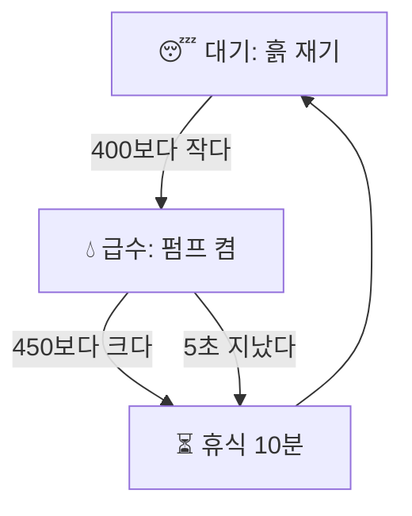

**결론: 뼈대(읽기 → 판단 → 행동)는 맞아. '3초 고정'만 '언제 멈출지'로 바꾸자.**

### 왜
지금 규칙은 물을 *얼마나 오래* 줄지만 정했어. 그 3초 동안은 흙을 안 보니까 중간에 멈출 수도 없어. 목표가 **"상추가 안 마르는 것"** 이면 물어야 할 건 **'언제 멈출지'** 야. 그래서 화분에 상태를 세 개 둘게.

| 상태 | 하는 일 | 다음 상태로 가는 조건 |
|---|---|---|
| 😴 대기 | 계속 흙을 잰다 | 값 < 400 → 급수 |
| 💧 급수 | 펌프를 켠 채로 계속 잰다 | 값 > 450 **또는** 5초 경과 → 휴식 |
| ⏳ 휴식 | 물이 스며들길 기다린다 | 10분 뒤 → 대기 |

5초는 **안전장치**야 — 센서 선이 빠져도 물이 넘치지 않게. 5V 펌프 기준으로 잡았어.

### 확인하는 법
시리얼 모니터를 5분 켜 두고, 센서를 물컵에 넣었다 뺐다 해 봐. 넣자마자 상태가 '급수 → 휴식'으로 바뀌면 성공. (코딩 도구가 짜 준 코드는 네 보드에서 네가 확인해야 해.)

### 고려했지만 고르지 않은 것
**타이머 방식**(아침저녁 10초). 만들기는 쉬운데, 시연에서 "센서를 보고 판단한다"를 보여줄 수 없어서 뺐어.
