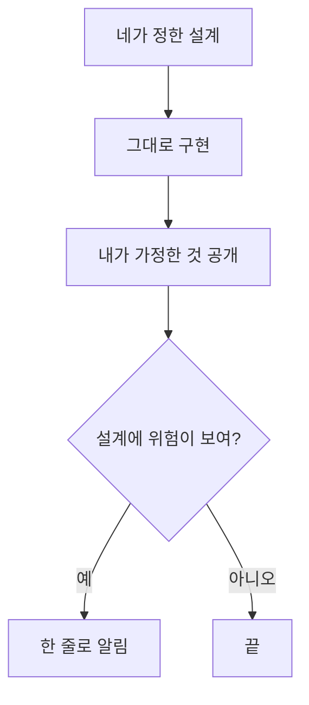

> 🧪 **로컬 데모 엔진**이야. Claude API가 연결되면 이 자리에 실제 결과물이 들어와.

네 요청은 이렇게 읽었어.

> {{question}}

**O2(좁은 질문)에는 이렇게 답해**

```mermaid
flowchart TD
  A[네가 정한 설계] --> B[그대로 구현]
  B --> C[내가 가정한 것 공개]
  C --> D{설계에 위험이 보여?}
  D -- 예 --> E[한 줄로 알림]
  D -- 아니오 --> F[끝]
```

설계는 네가 정했으니 나는 옮기기만 해. 구조 자체가 맞는지 궁금하면 아래 **🌅 넓히기**를 눌러 봐.
