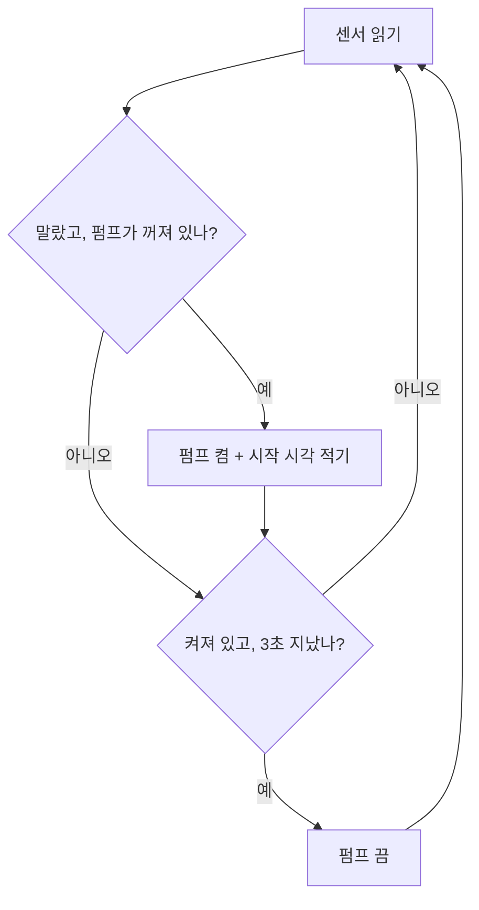

`delay()`는 **그동안 보드를 통째로 멈춰.** `millis()`는 "켜진 지 몇 ms 지났는지"만 알려주고 멈추지 않아. 그래서 *"언제 시작했는지 적어 두고, 지금 시각과 비교"* 하는 식으로 써.

**스톱워치로 생각하면 쉬워.**

| | `delay(3000)` 방식 | `millis()` 방식 |
|---|---|---|
| 비유 | 3분 타이머를 맞추고 **눈을 감고** 기다린다 | 시작 시각을 **적어 두고**, 하던 일을 하면서 가끔 시계를 본다 |
| 규칙 | 켠다 → 3초 멈춤 → 끈다 | 켤 때 시각을 적는다 → 매번 "지금 − 적어 둔 시각 ≥ 3초?"를 묻는다 → 맞으면 끈다 |

| | `delay(3000)` | `millis()` 비교 |
|---|---|---|
| 3초 동안 센서 | 못 읽음 | 계속 읽음 |
| 중간에 멈추기 | 불가능 | 가능 |
| 기억할 것 | 없음 | '시작 시각' · '지금 켜져 있나' 두 가지 |

**확인하는 법**: LED 두 개를 서로 다른 주기(0.3초, 1초)로 깜빡여 봐. `delay`로는 안 되고 `millis`로는 돼 — 그게 차이의 전부야.
