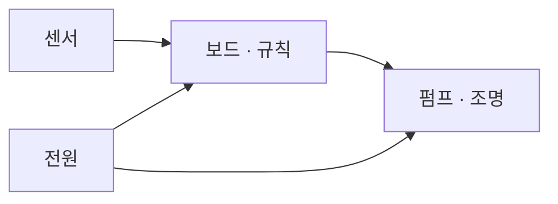

크게 네 덩어리야.

1. **재는 것** — 흙 수분·온도·빛 센서
2. **움직이는 것** — 펌프, 조명, 팬
3. **판단하는 것** — 아두이노 같은 보드와 그 안의 규칙
4. **전원** — 보드용과 모터용을 나눠야 안전해

> 💬 이 질문엔 누구에게 물어도 같은 답밖에 못 해. 아래 중 **하나만** 알려주면 '네 스마트팜' 얘기를 할 수 있어.
>
> ① 뭘 키울 거야?
> ② 지금 가진 부품은?
> ③ 언제까지, 누구한테 보여줄 거야?
