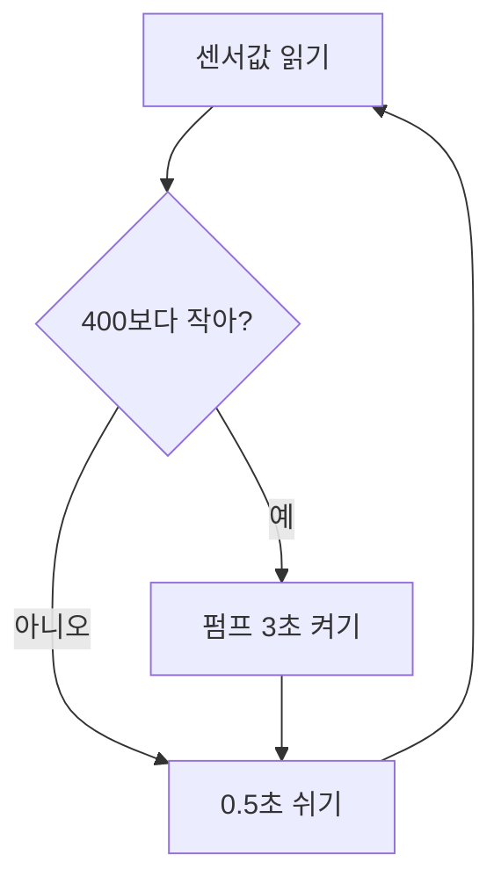

코드 대신 **규칙 카드**로 적어줄게. 이 카드를 코딩 도구에 붙여넣으면 코드는 바로 나와.

### 급수 규칙 v1

| 칸 | 내용 |
|---|---|
| 입력 | 흙 센서값 (0.5초마다 읽기) |
| 판단 | 값이 **400보다 작으면** '말랐다' |
| 출력 | 펌프를 **3초** 켜고 끈다 |
| 반복 | 0.5초 쉬고 처음으로 |

### 돌아가는 순서

### 확인하는 법
센서를 마른 흙 · 젖은 흙 · 물컵에 차례로 꽂고 값을 적어 봐. 400이 그 사이 어디쯤인지 네 눈으로 봐야 해.
