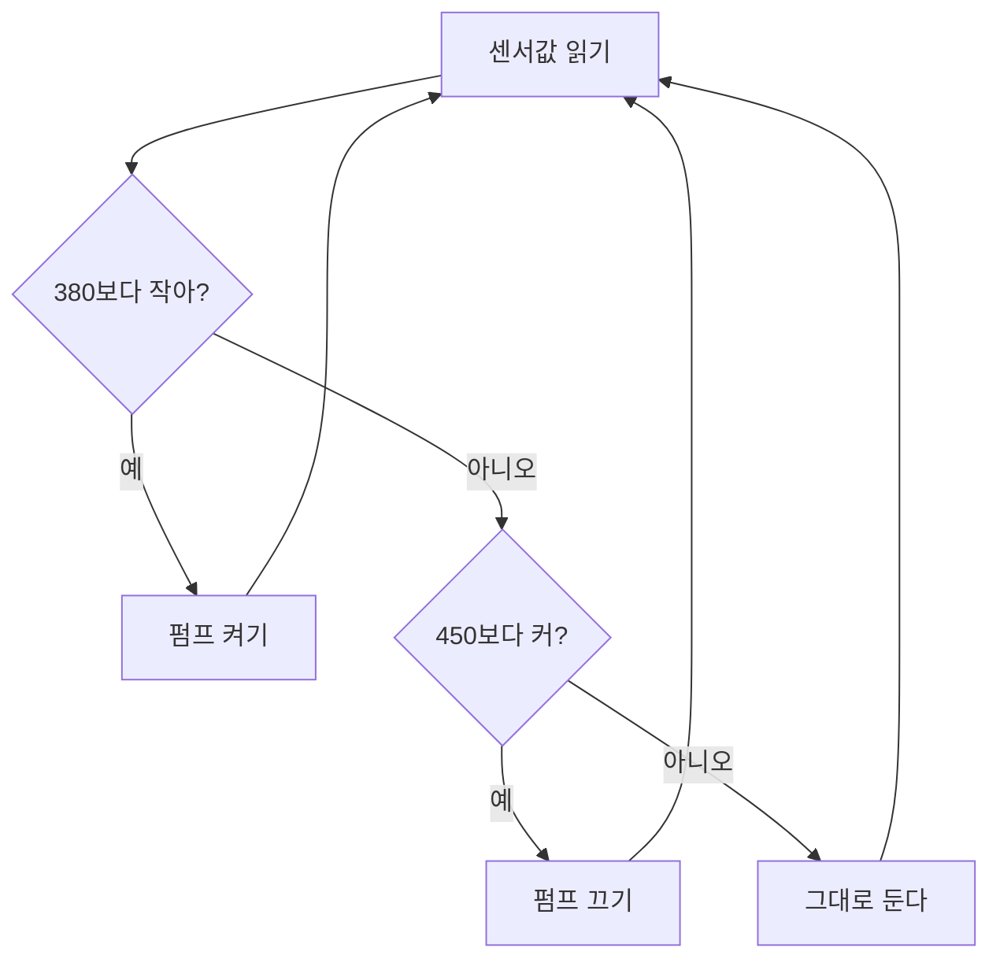

**결론: 임계값을 하나가 아니라 두 개로 잡자.** (이걸 *히스테리시스*라고 불러 — 켜는 기준과 끄는 기준을 다르게 두는 방법이야.)

### 왜
값이 기준 근처에서 흔들리면 기준이 하나일 때 펌프가 켜졌다 꺼졌다 해. 네 기준이 **"펌프가 깜빡이지 않는 것"** 이니까, 켜는 값(380)과 끄는 값(450) 사이에 '아무것도 안 하는 구간'을 두면 돼.

### 규칙 카드

| 칸 | 내용 |
|---|---|
| 켜는 기준 | 값 < 380 이고, 지금 꺼져 있을 때 |
| 끄는 기준 | 값 > 450 이고, 지금 켜져 있을 때 |
| 그 사이 (380~450) | 하던 대로 둔다 |
| 기록 | 센서값 · 펌프 상태를 0.2초마다 한 줄 |

### 확인하는 법
시리얼 모니터를 5분 켜 두고 `pumping` 값이 바뀐 횟수를 세어 봐. **세 번 이하**면 깜빡임은 잡힌 거야. (380과 450은 출발값이야 — 네 흙에서 재 보고 고쳐.)

### 고려했지만 고르지 않은 것
**타이머 방식**(하루 두 번 10초). 만들기는 제일 쉬운데, 2시간 시연에서는 '센서를 보고 판단한다'는 걸 보여줄 수 없어서 뺐어.
