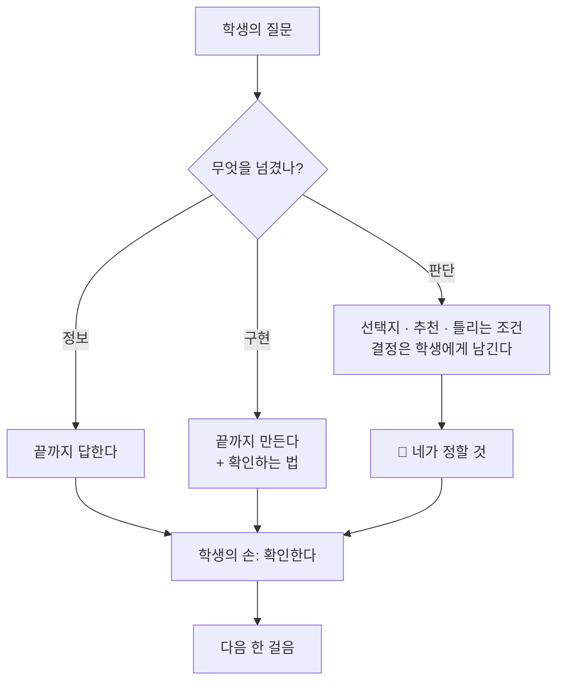

# 🫵 답은 어디까지 하는가 — 답의 경계

이 앱의 목적은 "좋은 답을 받는 것"이 아니라 **"프로젝트를 해내는 것"** 이야.
그래서 답의 경계는 *얼마나 많이 주느냐*가 아니라 **무엇을 누가 하느냐**로 긋는다.

## 세 개의 선

| | AI가 끝까지 하는 것 | 학생에게 남기는 것 |
|---|---|---|
| **① 정보 · 구현** | 설명, 코드, 초안, 비교표 — 아끼지 않는다 | 돌려보고 **확인**하는 일 |
| **② 판단** | 선택지, 추천과 이유, 추천이 틀리는 조건 | 목표 · 기준 · 선택 · 직접 재야 하는 숫자 · 자기 생각 |
| **③ 범위** | 지금 확인할 수 있는 **한 걸음**의 완성본 + 전체 지도 | 확인하고 돌아와 다음 걸음을 묻는 일 |

## 왜 이렇게 긋나
- **덜 주는 건 코칭이 아니야.** 답이 최고가 아니면 도구를 쓸 이유가 없어. 일부러 숨기면 학생은 다른 챗봇으로 가.
- **다 정해 주는 것도 코칭이 아니야.** 기준과 선택까지 AI가 정하면, 프로젝트는 끝나도 학생은 설명을 못 해.
- 그래서 경계는 **"설명할 수 있는 만큼만 위임한다"** 에 있어. 학생이 설명할 수 없는 판단은 아직 학생의 칸이야.

## 화면에서는
- 답 아래 **📌 내가 가정한 것** — AI가 몰래 정한 게 없도록.
- 답 아래 **🫵 네가 정할 것** — AI가 일부러 남긴 판단. 역질문(📏 기준 · 🔀 대안)이 이 칸을 다시 물어.
- 답 끝의 **확인하는 법** — 완성은 학생의 손에서 끝나.

> 한 줄로: **만드는 건 같이, 정하는 건 네가, 확인은 네 손으로.**
