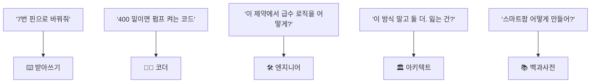

# 🔭 질문의 폭이 AI의 역할을 정한다

AI는 **질문이 허락한 만큼만** 생각해.

## 다섯 가지 폭

| 단계 | 질문의 모양 | 얻는 것 | 잃는 것 |
|---|---|---|---|
| **O1 지시** | 다 정해서 시킨다 | 속도 | AI의 판단 전부 |
| **O2 좁은** | 구현만 묻는다 | 정확한 구현 | 내 설계가 틀려도 그대로 |
| **O3 열린** | 목표·제약·기준 + 방법 | 맞춤형 설계 | — |
| **O4 대안** | 다른 길과 대가 | 선택지와 근거 | 시간 |
| **O5 맨 열린** | 맥락 없이 크게 | 개요 | 나에게 맞는 답 |

> 너무 좁으면 AI는 **코더**밖에 못 되고, 너무 열면 **평이한 답**밖에 못 해.
> 좋은 답은 **O3와 O4를 중심에 두고, 필요할 때 O2로 좁히는** 사람에게 와.

## 같은 주제, 다른 질문

## 단계마다 잘 통하는 배합

| 단계 | O2 | O3 | O4 |
|---|---|---|---|
| 탐색·정의 | 10 | 50 | 30 |
| 설계 | 20 | 40 | 40 |
| 구현 | 60 | 25 | 5 |
| 검증·개선 | 30 | 30 | 40 |

이 표는 규칙이 아니라 **참고선**이야. 어떤 폭의 질문이든 막지 않아.
