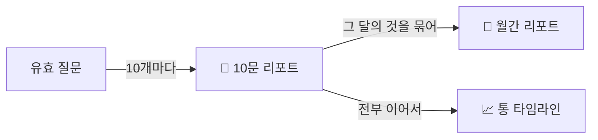

# 📄 리포트 읽는 법

## 10문 리포트 — 1화면 7칸

| 칸 | 내용 |
|---|---|
| ① 지난 미션 | 지난 판 미션의 결과 한 줄 |
| ② 질문 믹스 | O1~O5 막대 + AI 역할 분포 |
| ③ 질문에 실은 것 | 왜·맥·제·기·검·버 |
| ④ 돌아보기 결과 | 역질문별 🟢🟡⚪ |
| ⑤ 걸린 곳 | 반복된 개념 (있을 때만) |
| ⑥ 이번 판의 질문 | 가장 좋았던 질문 1개 |
| ⑦ 다음 판 미션 | **딱 하나.** 바꿔도 돼 |

## 원칙
- 비교 대상은 언제나 **예전의 너**야. 다른 학생과 비교하지 않아.
- 근거 수치가 없는 말은 하지 않아.
- 리포트는 끼어들지 않아. 화면 위에 칩만 띄우고, 여는 건 네 마음.
