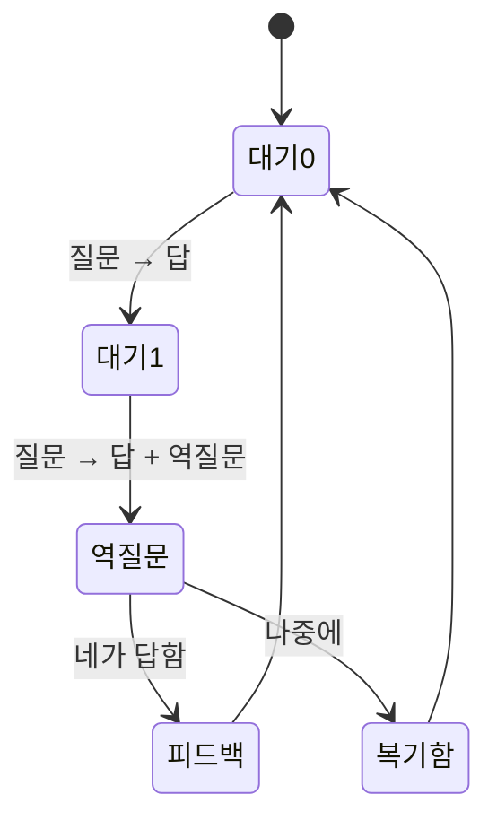

# 🔁 2문 1역 — 두 번 묻고, 한 번 돌아본다

네가 **유효 질문 2개**를 하면, 두 번째 답 끝에 내가 **역질문 1개**를 붙여.

입력창 옆 점 두 개 ●○ 가 다음 역질문까지 남은 질문이야. 예측할 수 있어야 거부감이 없으니까.

## 역질문이 묻는 8가지

| | 요소 | 묻는 것 |
|---|---|---|
| 🗺 | 흐름 | 입력 → 처리 → 출력 |
| 🎯 | 핵심 | 없으면 무너지는 한 곳 |
| 💬 | 이유 | 왜 이 방식인가 |
| 🔀 | 대안 | 다른 길과 그 대가 |
| 💥 | 실패 조건 | 언제 안 되나 |
| 📏 | 기준 | 잘 됐다는 걸 뭘로 아나 |
| 🔬 | 검증 | 어떻게 확인하나 |
| 🔧 | 개선 | 무엇을 고쳤나 |

## 약속
- **"잘 모르겠어"는 언제나 선택지에 있어.** 그것도 기록되고, 가장 정직한 재료야.
- 점수는 숫자로 안 보여줘. 🟢🟡⚪ 색으로만.
- 물을 게 마땅치 않으면 **건너뛰어.** 억지로 묻지 않아.
- 바쁘면 [나중에] — 복기함에 모아 둘게.
