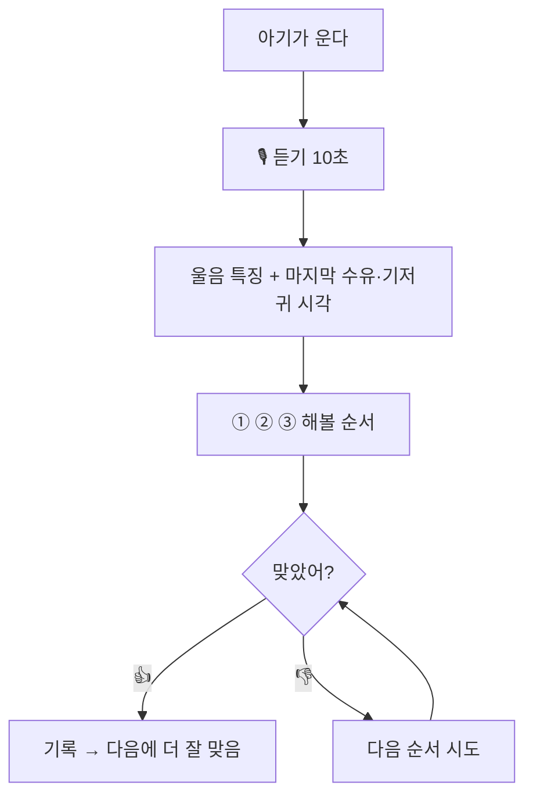

# 👶 유저 시나리오 — 이것부터 해봐

> **처음 한 줄**: "아기가 왜 우는지 알려주는 앱을 만들고 싶어."
> **티키타카 7번 뒤**: '맞히는 앱'이 '순서를 알려주는 앱'으로 바뀌었어.

## 주인공
**이모 (첫 아기, 생후 2개월)** — 새벽마다 이유를 몰라 같이 운다. 한 손엔 아기, 한 손엔 폰.

## 장면

| # | 이모가 하는 일 | 화면 | 이모의 마음 |
|---|---|---|---|
| 1 | 새벽 3시, 아기가 운다. 한 손으로 폰을 든다 | 화면 전체가 버튼 하나 **🎙 듣기** | "뭘 눌러야 할지 고민 안 해도 되네" |
| 2 | 버튼을 누르고 10초 기다린다 | 물결 애니메이션 | — |
| 3 | 결과를 본다 | **① 분유** (마지막 수유 3시간 전) ② 기저귀 ③ 안아주기 — 큰 글씨, 색 | "분유부터" |
| 4 | 분유를 먹이니 그친다. **👍 맞았어**를 누른다 | "기록했어. 잘 자" | "8분 걸렸다" |
| 5 | (다른 날) 아기 몸이 뜨겁다 | **열이 나면 병원에 먼저 물어봐** 안내만 | 앱이 판단하지 않아서 오히려 믿음이 간다 |

## 주말 2일 계획
1. **토 오전** — 공개 울음 데이터로 3분류 연습
2. **토 오후** — 버튼 하나짜리 화면 + 수유·기저귀 시각 기록
3. **일 오전** — "순서 1·2·3" 결과 화면 (큰 글씨 · 색)
4. **일 오후** — 이모에게 설치 → 2주 기록 부탁 (20분 → 10분이 목표)

## 누가 무엇을 했나

| 도윤이 정한 것 | 코치가 보탠 것 |
|---|---|
| 이모라는 한 명 · 한 손 조작 · **'정답' 대신 '순서'** · 시간으로 재기 · 아픈지는 판단 안 함 | 실제 캠프 주제였다는 것 · 울음 분류가 어렵다는 현실 · 공개 데이터셋 |

> 코치가 "어렵다"는 사실을 숨기지 않았기 때문에, 도윤은 **만들 수 있는 정의**로 바꿀 수 있었어.
