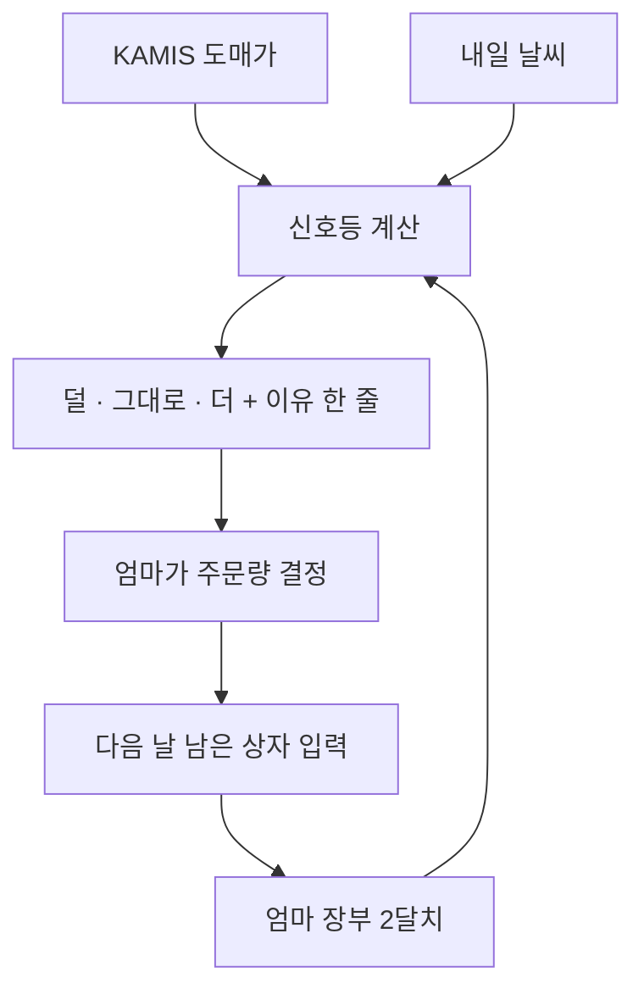

# 🍓 유저 시나리오 — 딸기 신호등

> **처음 한 줄**: "과일 가격을 예측하는 AI를 만들고 싶어."
> **티키타카 7번 뒤**: '가격 예측 AI'가 '엄마의 매입 신호등'이 됐어.

## 주인공
**엄마 (시장 과일 가게 12년차)** — 매일 밤 10시, 내일 딸기를 몇 상자 떼올지 감으로 정한다.

## 장면

| # | 엄마가 하는 일 | 화면 | 엄마의 마음 |
|---|---|---|---|
| 1 | 밤 10시, 식탁에서 하준이 보낸 카톡 링크를 누른다 | 웹페이지 한 장 | "앱 안 깔아도 되네" |
| 2 | 맨 위를 본다 | 🟡 **내일 딸기: 덜** | — |
| 3 | 이유를 읽는다 | "내일 비 · 도매가 3일째 오름 · 지난달 비 온 날엔 6상자 남았어" | "장부 얘기네. 맞아, 그랬지" |
| 4 | 평소 10상자 대신 7상자를 주문한다 | — | "한번 믿어보자" |
| 5 | 다음 날 저녁, 남은 상자 수를 입력한다 | "1상자 남음 · 기록했어" | 버리는 딸기가 줄었다 |

## 주말 2일 계획
1. **토 오전** — 엄마 장부 2달 치를 엑셀로 옮기기
2. **토 오후** — KAMIS API + 날씨 API 붙이기
3. **일 오전** — 규칙 3개로 신호등 만들기 (비 · 가격 추세 · 요일)
4. **일 오후** — 웹페이지 한 장 → 엄마께 카톡 → 2주간 버린 상자 수 세기

## 누가 무엇을 했나

| 하준이 정한 것 | 코치가 보탠 것 |
|---|---|
| 엄마라는 한 명 · 밤 10시 · **숫자 대신 신호등** · 버린 상자 수 · 딸기 하나, 웹페이지 한 장 | 같은 계열의 실제 프로젝트 · KAMIS 공공 API · 가격 예측은 오차가 크다는 것 |

> "엄마는 숫자를 안 믿어"는 코치가 절대 알 수 없는 정보야. **사용자를 아는 사람이 설계자**야.
