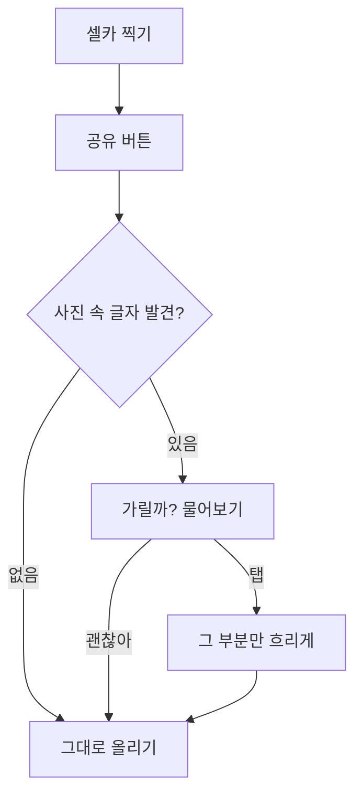

# 🕵️ 유저 시나리오 — 올리기 전에 한 번

> **처음 한 줄**: "SNS에 사진 올리기 전에 개인정보를 가려주는 앱을 만들고 싶어."
> **티키타카 7번 뒤**: 아래 장면이 전부 서연의 말에서 나왔어.

## 주인공
**지우 (중2)** — 하루에 스토리를 서너 개 올린다. 올리기 전 확인은 한 번도 안 한다.

## 장면

| # | 지우가 하는 일 | 화면 | 지우의 마음 |
|---|---|---|---|
| 1 | 하굣길에 친구와 교복 셀카를 찍는다 | — | "이거 잘 나왔다" |
| 2 | 갤러리에서 **공유** 버튼을 누른다 | 공유 목록에 '올리기 전에 한 번'이 보인다 | (평소와 똑같은 동작) |
| 3 | 그걸 누른다 | 사진 위 명찰에 노란 테두리 · **"이름이 보여. 가릴까?"** | "어, 진짜 보이네" |
| 4 | 테두리를 한 번 탭한다 | 명찰만 흐려진다 · [이대로 올리기] | "3초 걸렸네" |
| 5 | 스토리에 올린다 | — | 아무 일도 일어나지 않는다 ← **이게 성공** |

## 주말 2일 계획
1. **토 오전** — 명찰 사진 20장 찍기 (친구 3명 동의)
2. **토 오후** — 사진 올리면 글자 위치에 테두리가 뜨는 화면
3. **일 오전** — 탭하면 흐려지고 저장되는 기능
4. **일 오후** — 20장 테스트(목표 18장) → 지우에게 일주일 써보라고 부탁

## 누가 무엇을 했나

| 서연이 정한 것 | 코치가 보탠 것 |
|---|---|
| 지우라는 한 명 · 공유 버튼에서 바로 · "가릴까?" 물어보기 · 18/20 · 글자만 | 같은 문제의 수상작이 있다는 것 · OCR은 무료라는 것 · 실행 흔적이 점수라는 것 |

> 코치는 **정보**를 보탰고, **결정**은 전부 서연이 했어. 그래서 발표에서 "왜?"라는 질문에 서연이 답할 수 있어.
