# 틴스파크AI 기획문서

> AskBack 업그레이드 — 답은 끝까지 주되, 코칭하며, 기획서까지 완성한다  
> 2026-09-25 · @종필

---

## 0. 핵심 구조 — AskBack 엔진 + 틴스파크AI 프레임

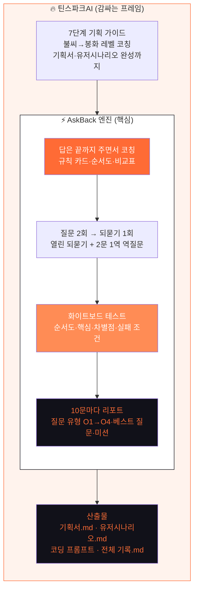

| 레이어 | 역할 | 무엇이 달라지나 |
| --- | --- | --- |
| **AskBack 엔진** | 답+코칭, 2문 1역 되묻기, 화이트보드 테스트, 10문 리포트 | 그대로 유지 (핵심 기능 100%) |
| **틴스파크AI 프레임** | 7단계 가이드 코칭, 레벨 체계, 기획서·유저시나리오 완성 | 새로 감싸는 구조 |
| **산출물** | 기획서.md + 유저시나리오.md + 코딩 프롬프트 + 전체 기록.md | 기존 4칸 → 전체 기획 문서로 확장 |

---

## 1. 프로젝트 개요

| 항목 | 내용 |
| --- | --- |
| 서비스명 | 틴스파크AI (TeenSparkAI) |
| 이전 명칭 | AskBack |
| 한 줄 정의 | 답은 끝까지 주면서, 코칭과 되묻기로 학생이 직접 기획서를 완성하는 AI 코치 |
| 핵심 문장 | 열린 질문 하나가 제품의 설계도로 |
| 현재 URL | askback-omega.vercel.app |

### AskBack에서 무엇이 달라지나

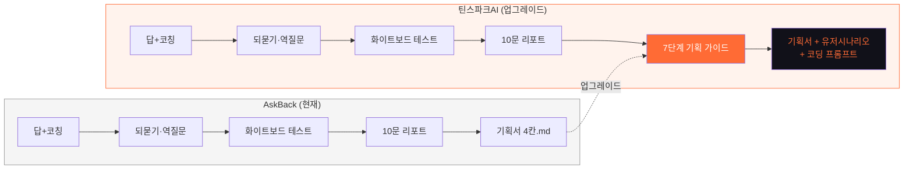

| 구분 | AskBack | 틴스파크AI |
| --- | --- | --- |
| 답+코칭 | ✅ | ✅ 그대로 |
| 2문 1역 되묻기 | ✅ | ✅ 그대로 |
| 화이트보드 테스트 | ✅ | ✅ 그대로 |
| 10문 리포트 | ✅ | ✅ 그대로 |
| 5가지 형식 | ✅ | ✅ 그대로 |
| 기획서 4칸 | ✅ | ✅ → 7단계 기획서로 확장 |
| 7단계 가이드 코칭 | ❌ | ✅ 신규 |
| 유저 시나리오 완성 | ❌ | ✅ 신규 |
| 코딩 프롬프트 생성 | ❌ | ✅ 신규 |
| 레벨 체계 (불씨→봉화) | ❌ | ✅ 신규 |
| 브랜드 리뉴얼 | ❌ | ✅ 신규 |

### 핵심 원칙 (AskBack에서 계승)

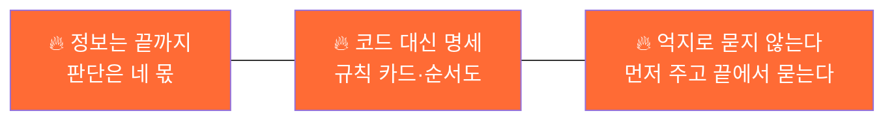

---

## 2. 브랜드 가이드

| 항목 | 규정 |
| --- | --- |
| 아이콘 | 다크 라운드 사각(rx12) 안 기하학적 번개 + 궤도 점 |
| 워드마크 | 소문자 `teensparkai` — teen(다크) + spark(오렌지) + ai(30% 불투명) |
| Accent | `#FF6B35` / 그라데이션 `#FF8C55→#FF4D00` |
| Dark Navy | `#111119` |
| 서체 | Space Grotesk(영문) + Pretendard(한글) |
| 메인 슬로건 | 아이디어에 불꽃, 설계는 내가 |
| 영문 | Design before code |
| 학생용 | AI한테 시키기 전에, 스파크 먼저 |
| 교사용 | 과정이 남는 AI 기획 코치 |

---

## 3. AskBack 엔진 — 질문이 지나가는 5칸

AskBack의 핵심 루프는 그대로 유지된다. 틴스파크AI는 이 루프 위에 기획 가이드를 얹는다.

### 질문 흐름 전체도

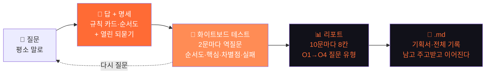

### 되묻기 — 두 겹 구조

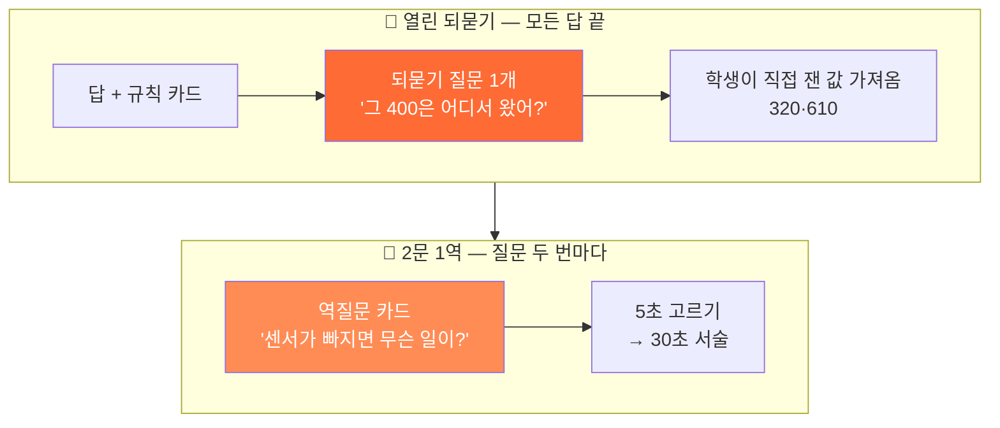

### 화이트보드 테스트 — 4관문

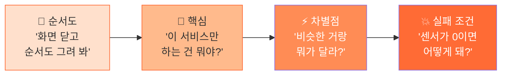

### 10문 리포트 — 8칸 구성

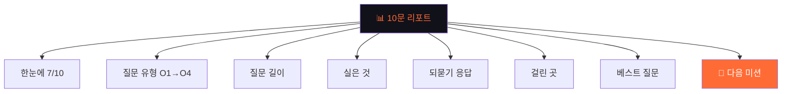

### 질문 레벨 O1→O4

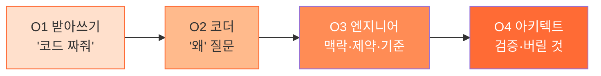

### 5가지 형식

| 형식 | 설계의 의미 | 채울 칸 |
| --- | --- | --- |
| 🤖 제품 | 부품·센서·동작 규칙 | 동작 시나리오·부품·구조·순서 |
| 💻 서비스 | 화면·흐름·사용자 | 사용자·핵심기능·흐름·화면 |
| 🎬 캠페인 | 메시지·타겟·매체 | 핵심 메시지·타겟·매체·효과 측정 |
| 🔬 리서치 | 질문·방법·분석 | 연구 질문·수집 방법·분석·목차 |
| 📄 논문 | 주장·근거·반론 | 연구 질문·확인 방법·자료·목차 |

---

## 4. 틴스파크AI 프레임 — 7단계 기획 가이드

AskBack 엔진 위에 7단계 가이드를 얹어, 대화 도중 기획서와 유저 시나리오가 함께 완성된다.

### AskBack 루프 + 기획 가이드 통합도

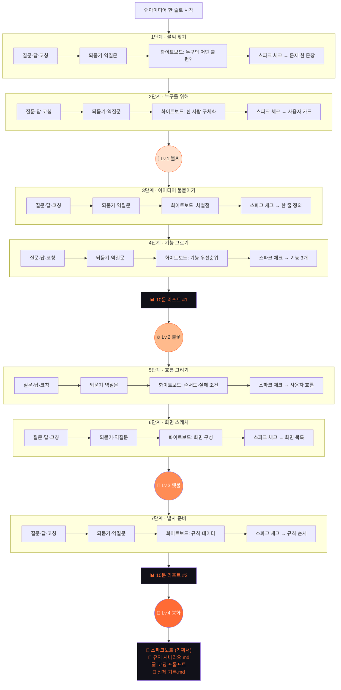

### 각 단계 안에서 일어나는 일

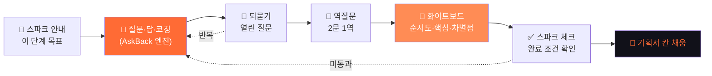

### 7단계 한눈에 보기

| 단계 | 이름 | AskBack 엔진이 하는 것 | 기획 가이드가 하는 것 | 산출물 |
| --- | --- | --- | --- | --- |
| 1 | 불씨 찾기 | 답+코칭, 되묻기 "왜 불편해?" | 빈칸 `___는 ___할 때 불편하다` | 문제 한 문장 |
| 2 | 누구를 위해 | 역질문 "지금은 어떻게 버텨?" | 사용자 카드 템플릿 | 사용자 카드 |
| 3 | 아이디어 | 화이트보드 "차별점이 뭐야?" | 비교표 가이드 | 한 줄 정의+비교표 |
| 4 | 기능 고르기 | 되묻기 "없으면 곤란해?" | 꼭/좋음/나중 분류 가이드 | 기능 우선순위표 |
| 5 | 흐름 그리기 | 화이트보드 "순서도 그려 봐" | 흐름 템플릿 + 실패 조건 | 사용자 흐름도 |
| 6 | 화면 스케치 | 역질문 "화면 몇 개야?" | 화면별 요소 가이드 | 화면 구성표 |
| 7 | 발사 준비 | 되묻기 "기기에 뭘 기억해?" | 규칙·데이터·순서 가이드 | 스파크노트+프롬프트 |

### 레벨 체계

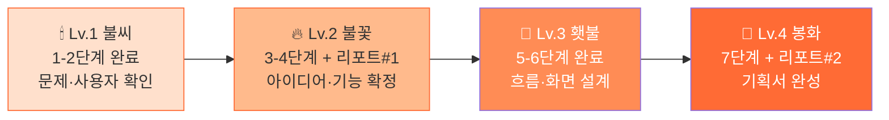

---

## 5. 타겟 사용자

| 궤도 | 사용자 | 핵심 니즈 | 고통 |
| --- | --- | --- | --- |
| 1 | 중학생 서연 (14세) | 안내받으며 기획서 완성 | "코드 짜줘" 후 설명 못 함 |
| 2 | 고등학생 도윤 (17세) | 심사위원에게 보여 줄 문서 | 기능만 많고 핵심 없음 |
| 3 | 초등 5학년 하린 (11세) | 짧고 쉬운 단계 | 긴 문서 못 씀 → 간편 모드 |
| 4 | 교사 김 선생님 | 학생별 진행·평가 근거 | 한 명씩 검문할 시간 없음 |

| 항목 | 내용 |
| --- | --- |
| 기기 | 크롬북·태블릿(주), 스마트폰(보조) |
| 수업 | 45분 1차시에 1–2단계 |
| 완성 | 4–6차시 또는 2–3시간 |
| 가입 | MVP 가입 없이 기기 저장, 교사 클래스 v2 |

---

## 6. 유저 시나리오

### 시나리오 A · 학생 서연의 전체 여정

```mermaid
flowchart TD
  START["서연: '급식 앱 만들어줘'"]
  
  subgraph S1["1단계 · 불씨 찾기"]
    Q1A["질문: '급식 앱 코드 짜줘'"]
    ANS1["스파크 답+코칭: 순서도 + 규칙 카드"]
    ASK1["되묻기: '어떤 학생이, 언제, 왜?'"]
    WB1["화이트보드: '불편한 순간 그려 봐'"]
    OUT1["✅ 문제 한 문장 완성"]
  end

  subgraph S2["2단계 · 누구를 위해"]
    ANS2["답+코칭: 사용자 분석"]
    ASK2["역질문: '전교생 중 딱 한 명은?'"]
    WB2["화이트보드: '그 사람의 하루는?'"]
    OUT2["✅ 사용자 카드: 민지(중2, 알레르기)"]
  end

  LV1(("🕯 불씨"))

  subgraph S34["3-4단계 · 아이디어+기능"]
    ANS3["답+코칭: 경쟁 분석"]
    ASK3["되묻기: '민지에게만 필요한 건?'"]
    WB3["화이트보드: '차별점 하나는?'"]
    ASK4["역질문: '없으면 곤란한 기능은?'"]
    OUT4["✅ 한 줄 정의 + 기능 3개"]
  end

  RPT1["📊 10문 리포트 #1<br/>O1→O3 성장"]
  LV2(("🔥 불꽃"))

  subgraph S56["5-6단계 · 흐름+화면"]
    ANS5["답+코칭: 흐름도"]
    ASK5["되묻기: '알레르기는 언제 등록?'"]
    WB5["화이트보드: '순서도 그려 봐'"]
    ASK6["역질문: '화면 몇 개야?'"]
    OUT6["✅ 흐름도 + 화면 3개"]
  end

  LV3(("🔦 횃불"))

  subgraph S7["7단계 · 발사 준비"]
    ANS7["답+코칭: 데이터 설계"]
    ASK7["되묻기: '기기에 뭘 기억해야 해?'"]
    WB7["화이트보드: '규칙 정리'"]
    OUT7["✅ 규칙·데이터·순서"]
  end

  RPT2["📊 10문 리포트 #2"]
  LV4(("🚀 봉화"))

  FIN["📄 스파크노트 완성<br/>📄 유저 시나리오.md<br/>💻 코딩 프롬프트 복사<br/>→ 바이브코딩 시작"]

  START --> S1 --> S2 --> LV1
  LV1 --> S34 --> RPT1 --> LV2
  LV2 --> S56 --> LV3
  LV3 --> S7 --> RPT2 --> LV4 --> FIN

  style LV1 fill:#FFE0CC,stroke:#FF6B35
  style LV2 fill:#FFBA8C,stroke:#FF6B35
  style LV3 fill:#FF8C55,color:#fff
  style LV4 fill:#FF6B35,color:#fff
  style RPT1 fill:#111119,color:#FF6B35
  style RPT2 fill:#111119,color:#FF6B35
  style FIN fill:#111119,color:#FF6B35
```

### 시나리오 B · 막힌 순간 대응

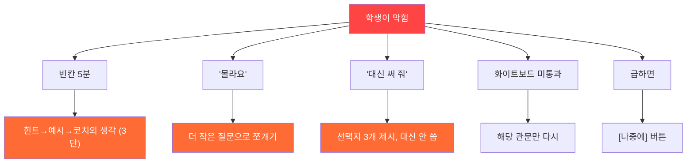

### 시나리오 C · 교사 김 선생님

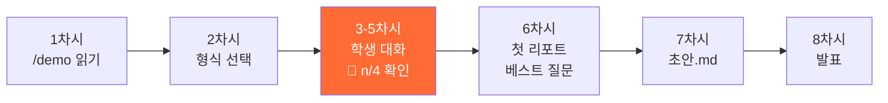

---

## 7. 기능 명세

### 기능 구조도

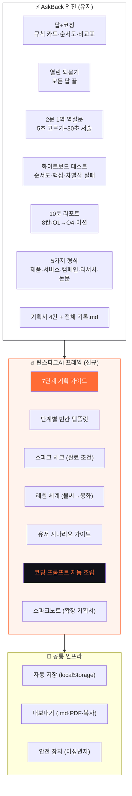

### MVP vs v2

| ID | 기능 | 범위 |
| --- | --- | --- |
| E1–E7 | AskBack 엔진 전체 | MVP |
| F1 | 7단계 기획 가이드 | MVP |
| F2 | 빈칸 템플릿 | MVP |
| F3 | 스파크 체크 | MVP |
| F4 | 레벨 체계 | MVP |
| F5 | 유저 시나리오 가이드 | MVP |
| F6 | 코딩 프롬프트 조립 | MVP |
| F7 | 스파크노트 | MVP |
| I1 | 자동 저장 | MVP |
| I2 | 내보내기 | MVP |
| I3 | 안전 장치 | MVP |
| — | 손그림 업로드 | v2 |
| — | 클래스·교사 대시보드 | v2 |
| — | 계정·클라우드 저장 | v2 |

---

## 8. 화면 설계

### 화면 흐름 (AskBack 화면 + 틴스파크 확장)

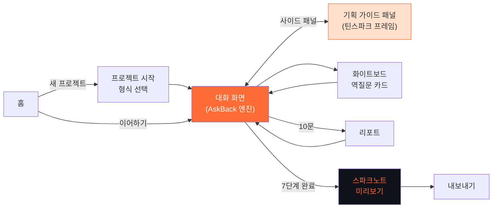

### 정보 구조

```
틴스파크AI
├── 홈
│   ├── 새 프로젝트 시작 (+ 형식 선택)
│   └── 이어하기 (저장된 프로젝트)
├── 대화 화면 (AskBack 엔진)
│   ├── 헤더: 진행 바 · 레벨 · 🧩 n/4
│   ├── 대화 영역 (답+코칭·되묻기)
│   ├── 화이트보드 카드 (2문 1역)
│   └── 사이드: 기획 가이드 패널
│       ├── 현재 단계 안내
│       ├── 빈칸 템플릿
│       ├── 스파크 체크
│       └── 기획서 채움 현황
├── 리포트 (10문마다)
├── 스파크노트 미리보기
└── 내보내기
    ├── 기획서.md / 유저시나리오.md
    ├── 전체 기록.md
    ├── PDF
    └── 코딩 프롬프트 복사
```

---

## 9. 산출물 — 남는 것 4가지

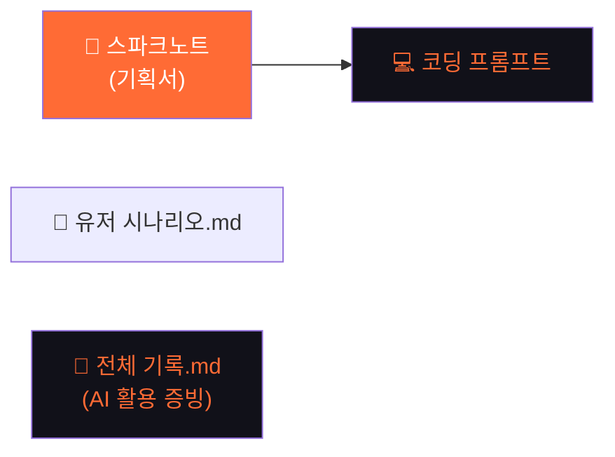

| 산출물 | 내용 | 용도 |
| --- | --- | --- |
| 스파크노트 (기획서) | 7단계 답을 한 장으로 조립 | 발표, 수행평가, 코딩 입력 |
| 유저 시나리오.md | 사용자 흐름·화면·실패 상황 정리 | 팀원 공유, 개발 가이드 |
| 코딩 프롬프트 | 기획서를 코딩 도구용 프롬프트로 변환 | Cursor·Claude Code에 붙여넣기 |
| 전체 기록.md | 질문·되묻기 응답·화이트보드 전체 로그 | AI 활용 표기 증빙, 과정 평가 |

---

## 10. 기술 스택과 개발 착수

### 기술 스택

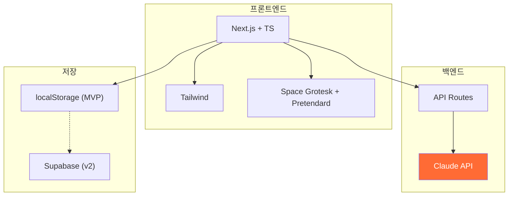

### 개발 로드맵

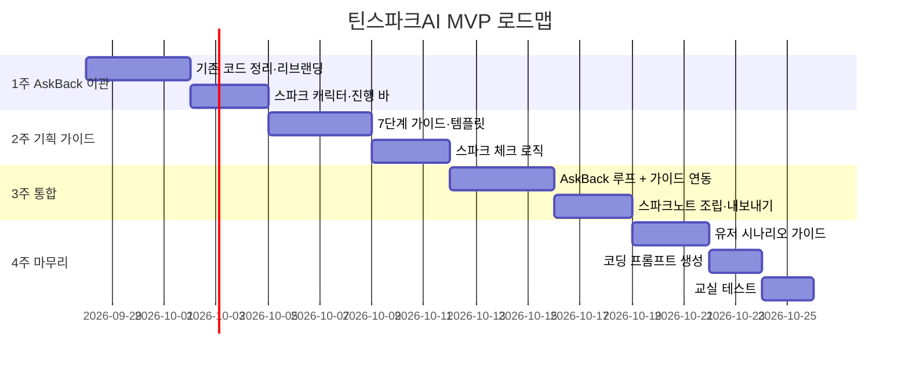

### 코딩 착수 체크리스트

- [ ] AskBack 기존 코드 상태 점검 (엔진 재사용 범위)
- [ ] 7단계 가이드 문구·템플릿·완료 조건 확정
- [ ] 스파크 캐릭터 이미지 3종
- [ ] Claude API 키 + Vercel 환경변수
- [ ] 저장소 + 도메인 결정
- [ ] 안전 장치 필터 목록
- [ ] 교실 테스트 일정 + 학생 확보

---

> 틴스파크AI · AskBack 엔진 + 기획 가이드 프레임  
> 답은 끝까지 주되, 코칭하며, 기획서까지 완성한다  
> Design before code · 2026-09-25
