# 틴스파크AI 기획문서

> 답은 끝까지 주되, **질문을 넓혀** 아이템을 단단하게 만든다
> 2026-09-26 개정(v2) · @종필 · 이전판 2026-09-25

---

## 0. 개정 요약 — 무엇을 버렸고, 무엇으로 바꿨나

### 버린 것 · 7단계 기획 가이드 + 불씨→봉화 레벨 체계

이전판의 뼈대였던 **「1단계 불씨 찾기 → … → 7단계 발사 준비」** 와 **「Lv.1 불씨 → Lv.4 봉화」** 를 폐기한다.

| 왜 버리나 | 설명 |
| --- | --- |
| **제품의 핵심과 어긋난다** | 이 서비스가 파는 것은 *열린 질문* 과 *확장된 질문* 이다. 1번부터 7번까지 정해진 순서는 그 자체로 닫힌 체크리스트라, 파는 것과 만드는 방식이 정반대가 된다. |
| **차별점이 없다** | 문제 정의 → 사용자 → 아이디어 → 기능 → 흐름 → 화면 → 정리는 어느 기획 수업 교안에나 있다. 일반론 위에 브랜드만 얹은 꼴이다. |
| **실제 대화와 맞지 않는다** | 학생은 5단계를 하다 2단계로 돌아가고, 7단계 재료를 3단계에서 먼저 꺼낸다. 순서를 강제하면 코치가 대화를 막는다. |
| **이미 더 나은 모델이 구현돼 있었다** | `data/roles.json` 의 `openness`(O1~O5) · `six`(여섯 축) · `stageMix`(국면별 배합)가 이미 앱에서 돌고 있었는데, 문서만 그걸 쓰지 않았다. |

### 바꾼 것 · 이미 돌아가는 두 모델을 정면에 세운다

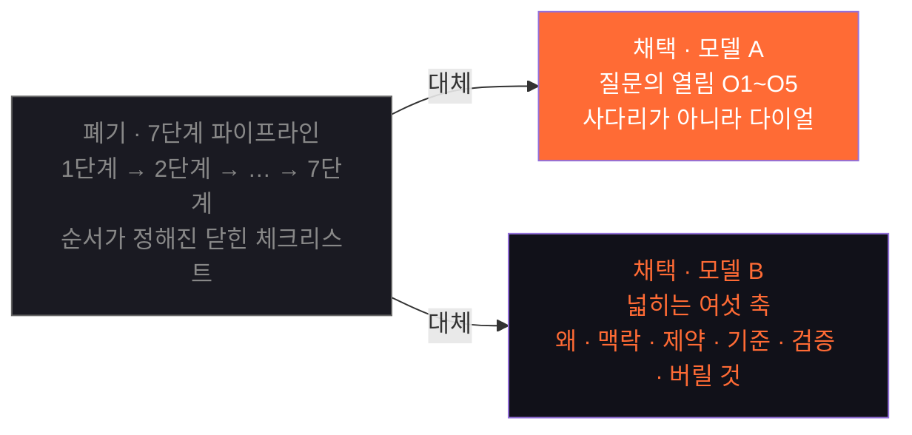

| 항목 | 이전판 | 개정판 |
| --- | --- | --- |
| 진행 모델 | 7단계 고정 순서 | **국면(탐색·설계·구현·검증)별 질문 배합** |
| 성장 표현 | Lv.1 불씨 → Lv.4 봉화 | **O1~O5 열림 다이얼 + 여섯 축 사용 기록** |
| 코칭 대상 | "다음 단계로 가라" | **"이 질문에 한 축만 붙여라"** |
| 브랜드 아이콘 | 기하학적 번개 | **불꽃**(불씨 = 아이디어) |
| 리포트 | 8칸 | 8칸 + **질문 전문·방향성·프롬프트 전량 수록** |

### 그대로 가는 것 · AskBack 엔진

답+코칭, 열린 되묻기, 2문 1역 역질문, 화이트보드 테스트, 10문 리포트, 다섯 형식 — 엔진은 손대지 않는다. 바뀐 것은 **엔진 위에 무엇을 얹느냐** 다.

---

## 1. 프로젝트 개요

| 항목 | 내용 |
| --- | --- |
| 서비스명 | 틴스파크AI (TeenSparkAI) |
| 이전 명칭 | AskBack |
| 한 줄 정의 | 답은 끝까지 주면서, 되묻기로 질문을 넓혀 학생이 직접 **설계도와 기획서**를 완성하게 하는 AI 코치 |
| 핵심 문장 | 열린 질문 하나가, 내가 설명할 수 있는 설계도로 |
| 현재 URL | askback-omega.vercel.app |
| 문서 예시 | 동네 빵집 남는 빵 문제 (앱 내장 예시 프로젝트는 🌱 스마트 화분) |

### 만드는 것 — 설계도와 기획서

코드·문장·영상은 AI가 금방 만든다. 이 서비스가 다루는 것은 **그 앞의 설계** 다. 학생이 정해야 할 것은 셋이다.

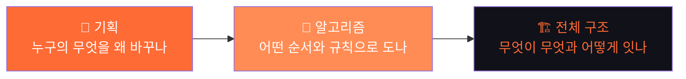

### 초점 둘 — 왜 질문을 넓히게 하나

| 초점 | 뜻 | 왜 중요한가 |
| --- | --- | --- |
| **① 내가 아는 것이 드러난다** | 축을 하나 붙이려면 내가 아는 것을 꺼내야 한다. 못 꺼내는 칸이 곧 아직 모르는 자리다. | 평가·발표에서 "이건 네가 한 거니?"에 답할 근거가 된다 |
| **② 아이템이 단단해진다** | 목적·제약·기준이 붙은 아이템은 질문받아도 흔들리지 않는다. | 설계도와 기획서의 품질이 곧 질문의 넓이다 |

이 둘이 이 제품의 존재 이유다. 진도가 아니라 **이 두 가지가 늘었는지**로 성공을 잰다.

### 하지 않는 것

- 학생 대신 기획서를 써 주지 않는다 (선택지는 주되 고르지 않는다)
- 가르치려고 답을 일부러 덜 주지 않는다
- 단계를 강제해 대화를 막지 않는다
- 코드 생산을 목표로 삼지 않는다 (코드는 다른 도구가 뽑는다)

---

## 2. 핵심 모델 A — 질문의 열림 O1~O5

> 원본 데이터: `frontend/src/data/roles.json` → `openness`, `roles`

같은 것을 물어도 **얼마나 열어서 묻느냐**에 따라 AI가 하는 일이 달라진다. 이건 위로 올라가는 사다리가 아니라, **가운데가 최적인 다이얼**이다.

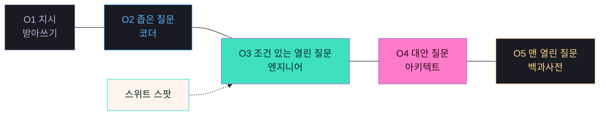

| 열림 | 어떻게 묻는가 | 얻는 것 | 잃는 것 | AI가 되는 것 |
| --- | --- | --- | --- | --- |
| **O1 지시** | 무엇을 어떻게 바꿀지 다 정해서 시킨다 | 속도 | AI의 판단 전부 | ⌨️ 받아쓰기 |
| **O2 좁은 질문** | 설계는 내가 끝냈고 구현만 묻는다 | 정확한 구현 | 내 설계가 틀려도 그대로 만든다 | 👨‍💻 코더 |
| **O3 조건 있는 열린 질문** | 목표·제약·기준을 주고 방법을 묻는다 | 맞춤형 설계 + 이유 | — (스위트 스팟) | 🛠 엔지니어 |
| **O4 대안 질문** | 다른 길과 그 대가를 묻는다 | 선택지와 판단 근거 | 시간 (구현 중엔 과하다) | 🏛 아키텍트 |
| **O5 맨 열린 질문** | 맥락 없이 크게 묻는다 | 개요 | 나에게 맞는 답 | 📚 백과사전 |

### 같은 빵집, 다섯 가지 물음

| 열림 | 실제 문장 | 돌아오는 것 |
| --- | --- | --- |
| O1 | "빵 남으면 30분 전에 알림 보내는 코드 짜줘" | 시킨 그대로 코드 한 덩어리 — *왜 30분인지는 아무도 묻지 않는다* |
| O2 | "알림 보내는 함수는 어떻게 짜?" | 함수 하나, 정확하게 — *설계가 틀려 있어도 그대로 만들어진다* |
| **O3** | "마감 전에 빵을 덜 버리게 하고 싶어. 사장님 혼자 쓰고 서버는 없어. 어떤 방법이 좋을까?" | 방법 두셋 + 고른 이유 + 🙋 되묻기 — *"그 '덜'은 몇 개에서 몇 개로예요?"* |
| O4 | "그 방법 말고 둘만 더. 각각 뭘 잃어?" | 선택지와 각각의 대가 — *고를 근거가 내 손에 남는다* |
| O5 | "빵집 앱 어떻게 만들어?" | 누구에게나 똑같은 개요 — *내 빵집 이야기는 한 줄도 없다* |

> **설계 원칙:** 더 열수록 좋은 게 아니다. 너무 닫으면 내 판단만 남고, 너무 열면 나와 상관없는 답이 온다. 코치는 "더 열어라"가 아니라 **"지금 국면에 맞게 열어라"** 라고 말한다.

### 7단계를 대신하는 것 — 국면별 질문 배합

> 원본 데이터: `roles.json` → `stageMix`

진행은 단계를 밟는 게 아니라, **국면이 바뀌면 좋은 질문의 배합이 바뀌는 것**이다. 같은 O2가 탐색에선 10%지만 구현에선 60%다.

| 국면 | O1 지시 | O2 좁은 | O3 열린 | O4 대안 | O5 맨 열린 | 이 국면의 일 |
| --- | ---: | ---: | ---: | ---: | ---: | --- |
| **탐색** | 0% | 10% | **50%** | 30% | 10% | 무엇을 풀지 고른다 |
| **설계** | 0% | 20% | **40%** | **40%** | 0% | 어떻게 돌지 정한다 |
| **구현** | 10% | **60%** | 25% | 5% | 0% | 정한 대로 만든다 |
| **검증** | 0% | 30% | 30% | **40%** | 0% | 맞았는지 확인한다 |

- 국면은 학생이 고르지 않는다. 코치가 대화에서 추정하고, 리포트에서 **"지금 배합 vs 이 국면의 목표 배합"** 을 보여 준다.
- 되돌아가도 벌점이 없다. 구현하다 설계로 돌아오면 배합 목표도 같이 돌아온다.
- 이것이 이전판 7단계가 하려던 일(진행감·다음 할 일 제시)을 **강제 없이** 대신한다.

---

## 3. 핵심 모델 B — 질문을 넓히는 여섯 축

> 원본 데이터: `roles.json` → `six`

**순서 없음 · 아무 때나 · 하나만.** 지금 질문에 이 여섯 중 하나만 붙이면 돌아오는 답이 달라진다.

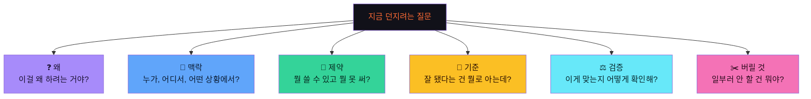

| 축 | 좁게 물으면 | 한 축을 붙이면 | 그래서 답이 이렇게 달라진다 |
| --- | --- | --- | --- |
| **왜** (목적) | "남은 빵 알림 기능 만들어줘" | "마감 전에 빵을 덜 버리게 하고 싶어. 알림이 맞는 방법일까?" | 수단이 아니라 목적을 물으면, 알림 말고 '예약 픽업' 같은 답도 올라온다 |
| **맥락** | "알림 보내줘" | "사장님 혼자 쓰고, 마감 30분 전이 하루 중 제일 바쁜 시간이야" | 상황이 들어가면, 화면을 눌러야 하는 방법은 답에서 빠진다 |
| **제약** | "제일 좋은 방법으로 해줘" | "서버 없이, 사장님 폰 하나로, 다음 주 시연까지" | 못 쓰는 방법이 빠지면, 남은 답이 전부 실제로 해볼 수 있는 것이 된다 |
| **기준** | "좋은 알림으로 만들어줘" | "버리는 빵이 하루 10개에서 3개로 줄면 성공이야" | '좋은'이 숫자가 되면, 만든 뒤에 맞았는지 확인할 수 있다 |
| **검증** | "이렇게 하면 되지?" | "일주일 동안 버린 빵 수를 세서 지난주와 비교할래" | 확인하는 방법을 먼저 물으면, 틀렸을 때 알아차릴 길이 같이 생긴다 |
| **버릴 것** | "필요한 기능 다 넣어줘" | "손님용 화면은 이번엔 안 만들 거야" | 안 만들 것을 정하면, 만들 것 하나가 또렷해진다 |

### 축마다 코치가 붙이는 되묻기

| 축 | 되묻기 |
| --- | --- |
| 왜 | "알림을 받고 나면, 사장님이 무엇을 다르게 하나요?" |
| 맥락 | "두 손이 바쁠 때도 쓸 수 있어야 하나요?" |
| 제약 | "이 셋 중 하나를 못 지키게 되면, 어느 걸 먼저 놓을 거예요?" |
| 기준 | "그 3개는 어디서 온 숫자예요?" |
| 검증 | "지난주와 이번 주, 손님 수는 같았나요?" |
| 버릴 것 | "그걸 빼면 누가 아쉬워하죠? 그래도 괜찮아요?" |

### 여섯 축 ↔ 12요소 대응

> 원본 데이터: `frontend/src/data/elements.json`

여섯 축은 **학생이 쓰는 말**, 12요소는 **코치가 역질문을 고를 때 쓰는 내부 격자**다.

| 축 | 대응 요소 |
| --- | --- |
| 왜 | E3 이유 · E9 대상과 문제 |
| 맥락 | E9 대상과 문제 · E11 구성과 연결 |
| 제약 | E10 범위 · E12 경계와 의존 |
| 기준 | E6 기준 · E2 핵심 요소 |
| 검증 | E7 검증 · E5 실패 조건 |
| 버릴 것 | E10 범위 · E4 대안 |
| (전 구간) | E1 흐름 · E8 개선 |

> 프로젝트가 자라면 요소 팩이 추가로 열린다 — 🔧 메이커 · 📣 공유·서버 · 🤝 협력 · 🤖 AI.

---

## 4. 엔진 — 한 번의 질문이 지나가는 다섯 칸

엔진은 이전판과 동일하다. 다섯 칸 중 **②③이 틴스파크AI만 하는 일**이다.

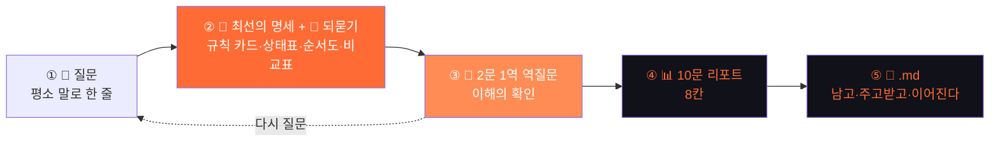

### 되묻기 두 겹

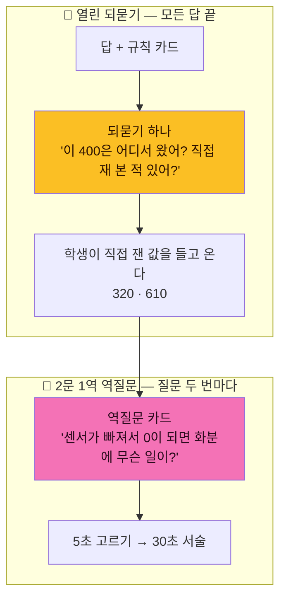

| 겹 | 어디서 | 효과 |
| --- | --- | --- |
| 🙋 열린 되묻기 | 모든 답의 끝 | 학생이 현실의 데이터를 직접 재서 다음 질문으로 가져온다 |
| 🧭 2문 1역 역질문 | 질문 두 번마다, 별도 카드로 | 순서도와 실패 조건을 아는지 확인한다. 5초(고르기)~30초(서술) |

**막힘 대응:** 💡 힌트 → 📎 예시 → 🤖 코치의 생각 (3단) · 🤷 "모르겠어"도 탓하지 않는다 · ⏭ 급하면 [나중에] · 🚫 물을 게 없으면 억지로 묻지 않는다.

### 화이트보드 테스트 — 4관문

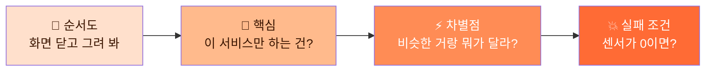

### 코치가 지키는 세 가지 선

| 선 | 뜻 |
| --- | --- |
| **정보는 끝까지, 판단은 네 몫** | 가르치려고 일부러 덜 주지 않는다. 대신 목표·기준·선택·직접 잴 숫자는 AI가 정하지 않는다 |
| **코드 대신 명세** | 답의 기본은 규칙 카드·상태표·순서도·비교표. 코드는 요청이 분명할 때만, 20줄 이내 |
| **억지로 묻지 않는다** | 답을 인질로 잡지 않는다. 먼저 다 주고, 끝에서 묻는다 |

---

## 5. 남는 것 — 질문·방향성·프롬프트가 전부 리포트에

> 넓힌 질문은 사라지지 않는다. **따로 정리하지 않는다 — 넓힌 질문이 곧 문서다.**

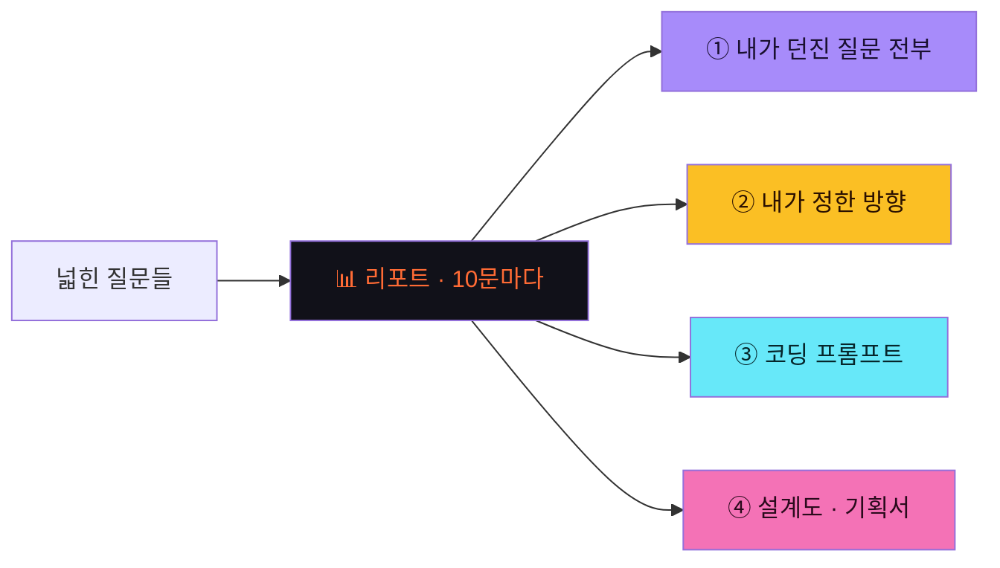

| 무엇이 | 무엇이 담기나 |
| --- | --- |
| **① 내가 던진 질문 전부** | 언제 무엇을 어떻게 물었는지, 순서 그대로. 열림(O1~O5)과 붙인 축이 태그로 |
| **② 내가 정한 방향** | 고른 것 · 그 이유 · **일부러 버린 것**. 🫵 내가 정한 것 / 📌 AI가 가정한 것 분리 |
| **③ 코딩 프롬프트** | 여섯 축이 붙은 채로 조립되어, Cursor·Claude Code·Replit에 그대로 |
| **④ 설계도 · 기획서** | 순서도(알고리즘) · 구조도 · 기획서 .md 한 장 |

### 10문 리포트 8칸

| # | 칸 | 개정 내용 |
| ---: | --- | --- |
| 1 | 한눈에 | 그대로 |
| 2 | 질문 유형 | O1~O5 분포 + **이 국면의 목표 배합과 비교** |
| 3 | 질문 길이 | 그대로 |
| 4 | 실은 것 | **여섯 축 중 무엇을 몇 번 붙였나** |
| 5 | 되묻기 | 되묻기에 값을 들고 온 비율 |
| 6 | 걸린 곳 | 그대로 |
| 7 | 베스트 질문 | 축이 가장 많이 붙은 질문 |
| 8 | 🚩 다음 미션 | **안 써 본 축 하나를 붙여 보기** |

### 네 가지 산출물

| 산출물 | 내용 | 용도 |
| --- | --- | --- |
| 기획서 .md (설계도) | 기획·알고리즘·구조 세 축을 내 말로 채운 한 장 | 발표, 수행평가, 코딩 입력 |
| 유저 시나리오 .md | 사용자 흐름·화면·실패 상황 | 팀원 공유, 개발 가이드 |
| 코딩 프롬프트 | 기획서를 코딩 도구용으로 조립 | Cursor·Claude Code에 붙여넣기 |
| 전체 기록 .md | 질문·되묻기 응답·역질문 전체 로그 | AI 활용 표기 증빙, 과정 평가 |

---

## 6. 다섯 형식

> 원본 데이터: `frontend/src/data/formats.json`

무엇을 만들든 열림과 여섯 축은 같다. 바뀌는 것은 **칸에 들어가는 말**뿐이다.

| 형식 | 이 형식에서 "설계"란 | 채울 칸 4개 |
| --- | --- | --- |
| 🤖 제품 (하드웨어) | 부품·센서·동작 규칙 | 동작 시나리오 · 부품 · 구조 · 순서 |
| 💻 서비스 (웹·앱) | 화면·흐름·사용자 | 사용자 · 핵심 기능 · 흐름 · 화면 |
| 🎬 캠페인 (AI 영상) | 메시지·타겟·매체 | 핵심 메시지 · 타겟 · 매체 · 효과 측정 |
| 🔬 리서치 | 질문·방법·분석 | 연구 질문 · 수집 방법 · 분석 · 목차 |
| 📄 논문 | 주장·근거·반론 | 연구 질문 · 확인 방법 · 자료 · 목차 |

---

## 7. 타겟 사용자

| 궤도 | 사용자 | 핵심 니즈 | 고통 |
| ---: | --- | --- | --- |
| 1 | 중학생 서연 (14세) | 안내받으며 기획서 완성 | "코드 짜줘" 후 설명 못 함 |
| 2 | 고등학생 도윤 (17세) | 심사위원에게 보여 줄 문서 | 기능만 많고 핵심 없음 |
| 3 | 초등 5학년 하린 (11세) | 짧고 쉬운 되묻기 | 긴 문서 못 씀 → 간편 모드 |
| 4 | 교사 김 선생님 | 학생별 진행·평가 근거 | 한 명씩 검문할 시간 없음 |

| 항목 | 내용 |
| --- | --- |
| 기기 | 크롬북·태블릿(주), 스마트폰(보조) |
| 수업 | 45분 1차시에 질문 8~12회 · 리포트 1회 |
| 완성 | 4–6차시 또는 2–3시간 |
| 가입 | MVP 가입 없이 기기 저장, 교사 클래스는 v2 |

---

## 8. 유저 시나리오

### A · 학생 서연 — 질문이 넓어지는 한 판

단계를 밟는 그림이 아니다. **같은 아이템을 두고 질문이 어떻게 열리고 넓어지는지**의 그림이다.

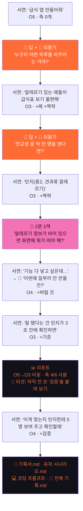

| 국면 | 서연의 질문 | 열림 | 붙은 축 |
| --- | --- | --- | --- |
| 탐색 | "급식 앱 만들어줘" | O5 | — |
| 탐색 | "알레르기 있는 애들이 급식표 보기 불편해" | O3 | 왜 · 맥락 |
| 설계 | "전교생 중 민지 한 명에게 맞추면" | O3 | 맥락 |
| 설계 | "이번엔 급식 신청 기능은 안 만들래" | O4 | 버릴 것 |
| 설계 | "민지가 3초 안에 확인하면 성공" | O3 | 기준 |
| 검증 | "5명한테 보여 주고 확인할래" | O4 | 검증 |

### B · 막힌 순간 대응

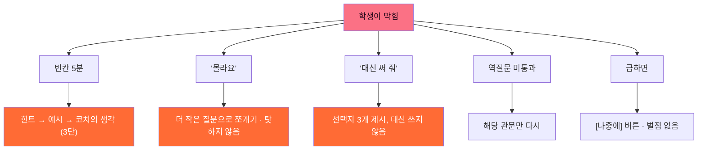

### C · 교사 김 선생님 — 8차시

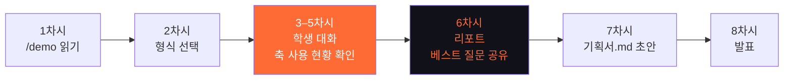

교사가 보는 것은 진도가 아니라 **질문의 넓이**다 — 학생별 O1~O5 분포, 여섯 축 중 몇 개를 써 봤는지, 되묻기에 직접 잰 값을 들고 온 비율.

---

## 9. 기능 명세

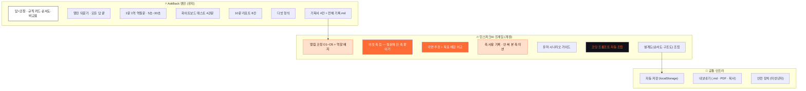

| ID | 기능 | 범위 | 이전판 대비 |
| --- | --- | --- | --- |
| E1–E7 | AskBack 엔진 전체 | MVP | 유지 |
| F1 | 열림 코칭 O1~O5 + 역할 배지 | MVP | 신규(모델 A) |
| F2 | 여섯 축 칩 — 질문에 한 축 붙이기 | MVP | 신규(모델 B) |
| F3 | 국면 추정 + 목표 배합 비교 | MVP | **7단계 가이드 대체** |
| F4 | 축 사용 기록 + 안 써 본 축 미션 | MVP | **레벨 체계 대체** |
| F5 | 유저 시나리오 가이드 | MVP | 유지 |
| F6 | 코딩 프롬프트 조립 | MVP | 유지 |
| F7 | 설계도 조립 (순서도·구조도) | MVP | 확장 |
| I1–I3 | 자동 저장·내보내기·안전 장치 | MVP | 유지 |
| — | 단계별 빈칸 템플릿 | **폐기** | 7단계와 함께 제거 |
| — | 스파크 체크(완료 조건) | **폐기** | 순서 강제라 제거 |
| — | 손그림 업로드 | v2 | |
| — | 클래스·교사 대시보드 | v2 | |
| — | 계정·클라우드 저장 | v2 | |

---

## 10. 화면 설계

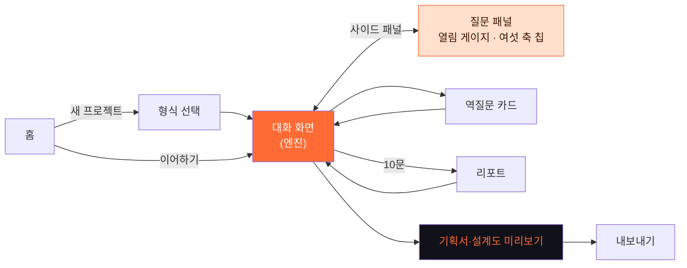

```
틴스파크AI
├── 홈
│   ├── 새 프로젝트 시작 (+ 형식 선택)
│   └── 이어하기 (저장된 프로젝트)
├── 대화 화면
│   ├── 헤더: 열림 게이지 O1~O5 · AI 역할 배지 · 🧩 n/4
│   ├── 대화 영역 (답 + 명세 + 🙋 되묻기)
│   ├── 역질문 카드 (2문 1역)
│   └── 사이드: 질문 패널
│       ├── 여섯 축 칩 — 누르면 지금 질문에 그 축이 붙는다
│       ├── 축 사용 현황 (6개 중 n개)
│       ├── 국면 추정 + 목표 배합 비교
│       └── 기획서 채움 현황
├── 리포트 (10문마다 · 8칸)
├── 기획서·설계도 미리보기
└── 내보내기
    ├── 기획서.md / 유저시나리오.md
    ├── 전체 기록.md (질문 전문 + 방향 + 프롬프트)
    ├── PDF
    └── 코딩 프롬프트 복사
```

> **핵심 UI 결정:** 여섯 축 칩은 "다음 단계로" 버튼이 아니라 **"지금 질문에 한 겹 더"** 버튼이다. 누르면 입력창의 내 문장에 그 축의 빈칸이 덧붙는다. 예: `🧱 제약` → `"… 내가 쓸 수 있는 건 ___ 뿐이야."`

---

## 11. 브랜드 가이드

| 항목 | 규정 | 변경 |
| --- | --- | --- |
| 아이콘 | 다크 라운드 사각(rx16) 안 **불꽃** + 궤도 점 | 번개 → 불꽃 |
| 워드마크 | 소문자 `teensparkai` — teen(밝음) + spark(오렌지) + ai(30%) | 유지 |
| Accent | `#FF6B35` · 그라데이션 `#FF4D00 → #FF6B35 → #FFA35C` | 방향 조정 |
| Dark Navy | `#111119` | 유지 |
| 서체 | Space Grotesk(영문) + Pretendard(한글) | 유지 |
| 메인 문장 | 열린 질문 하나가, 내가 설명할 수 있는 설계도로 | 변경 |
| 보조 문장 | 답은 끝까지 받고, 질문하는 법은 코칭받는다 | 유지 |
| 태그라인 | 답은 끝까지, 질문은 넓게 | 변경 |
| 영문 | Design before code | 유지 |
| 학생용 | AI한테 시키기 전에, 한 겹만 더 물어보기 | 변경 |
| 교사용 | 과정이 남는 AI 기획 코치 | 유지 |

> **불씨 은유는 브랜드 마크로만 남긴다.** spark = 아이디어의 불씨. 불씨→불꽃→횃불→봉화의 **4단 진행은 쓰지 않는다** (그 자체가 사다리라서).

---

## 12. 기술 스택 · 로드맵

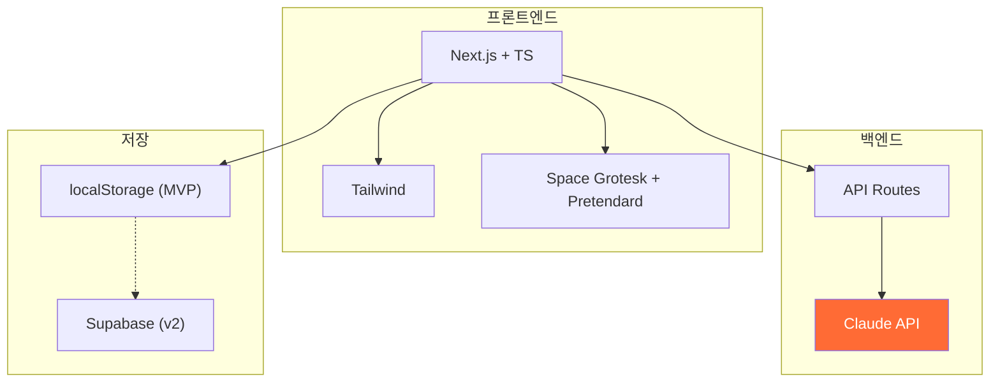

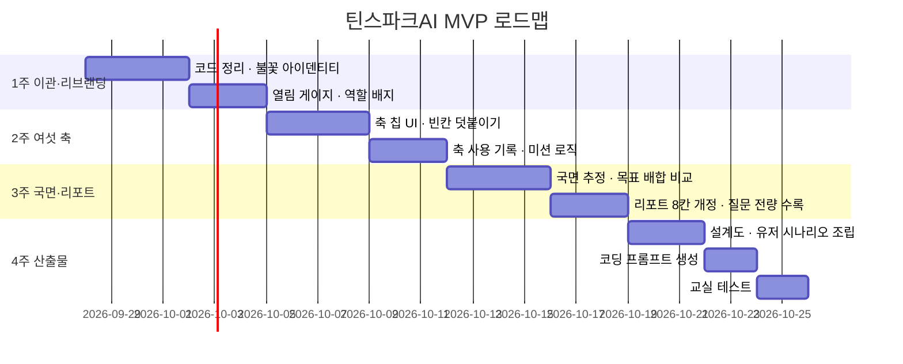

### 착수 체크리스트

- [ ] 7단계 관련 코드·데이터 제거 범위 확정 (가이드 패널, 레벨, 스파크 체크)
- [ ] 여섯 축 칩의 빈칸 문구 6종 확정 (`formats.json` 의 `common` 칩과 통합할지 결정)
- [ ] 국면 추정 규칙 — 대화에서 탐색/설계/구현/검증을 무엇으로 판별할 것인가
- [ ] 리포트에 질문 전문을 담을 때의 분량·개인정보 처리 기준
- [ ] Claude API 키 + Vercel 환경변수
- [ ] 안전 장치 필터 목록
- [ ] 교실 테스트 일정 + 학생 확보

### 열린 결정 사항

| # | 결정할 것 | 선택지 |
| ---: | --- | --- |
| 1 | 국면을 학생에게 **보여 줄지** | (a) 숨기고 리포트에만 / (b) 헤더에 표시 — *(a) 권장: 또 다른 진도표가 되기 쉬움* |
| 2 | 여섯 축 칩을 **몇 개씩 노출** | (a) 6개 상시 / (b) 지금 질문에 안 붙은 것만 / (c) 코치가 2개 추천 |
| 3 | O1(지시)을 **말릴지** | 구현 국면에선 O2가 60%가 정상 — 막지 말고 국면과 함께 설명 |
| 4 | 기존 `stageMix` 수치를 **그대로 쓸지** | 교실 테스트 후 재조정 |

---

> 틴스파크AI · AskBack 엔진 + 열림·넓이 프레임
> 답은 끝까지 주되, 질문을 넓혀 아이템을 단단하게 한다
> Design before code · 2026-09-26 개정
