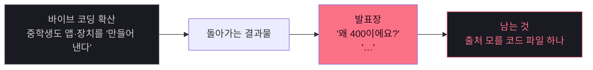
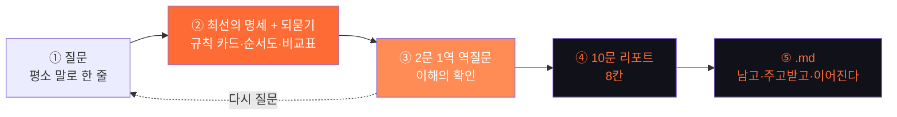
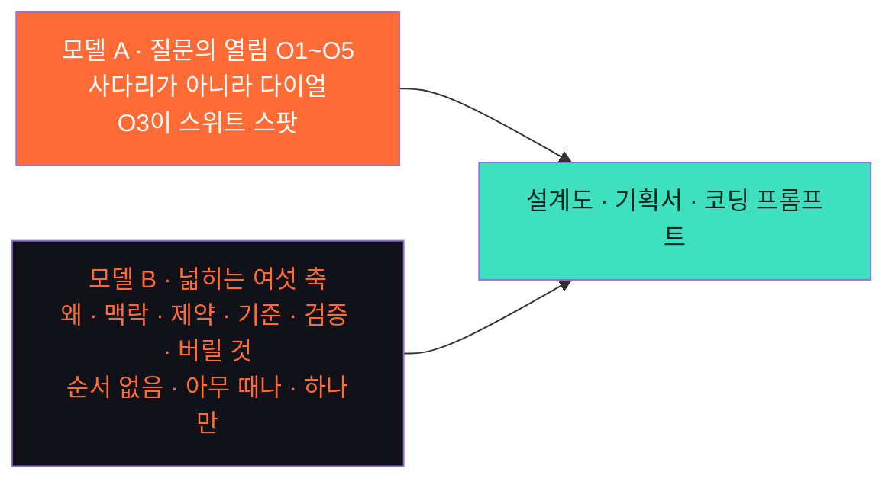
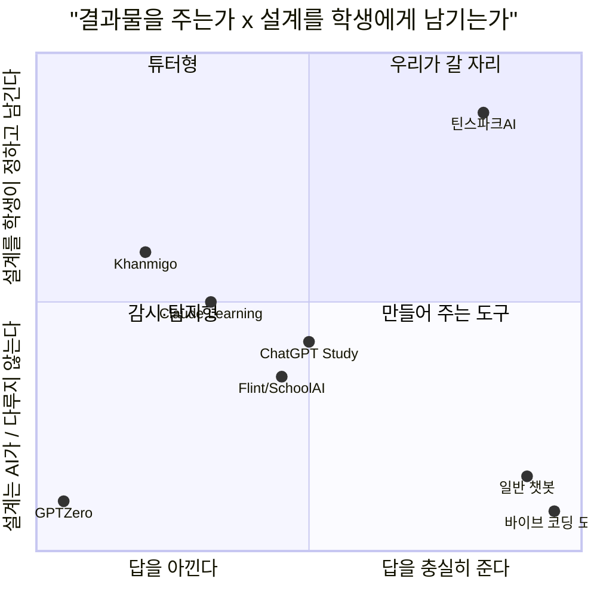
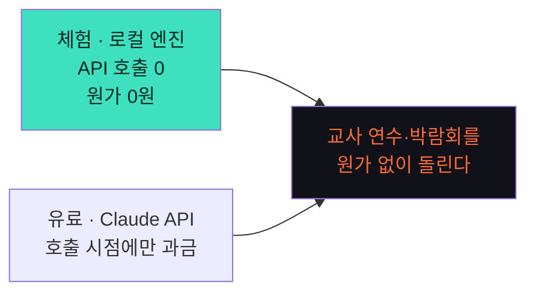
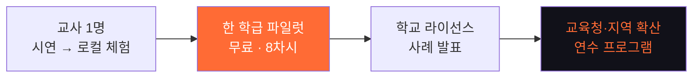
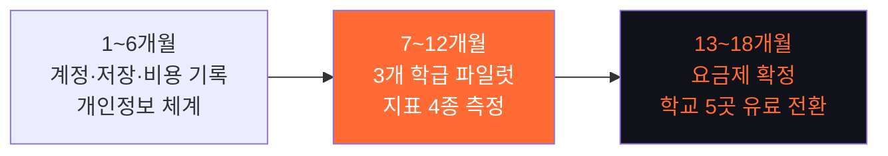

# 틴스파크AI 투자 제안서

> **답은 끝까지 주되, 질문을 넓혀 학생이 직접 설계하게 한다**
> 청소년 AI 기획 코치 · Pre-Seed / Seed · 2026-09-26 · @종필

---

## 0. 한 장 요약

| 항목 | 내용 |
| --- | --- |
| **문제** | 중·고생 3명 중 2명이 생성형 AI를 쓴다. 바이브 코딩으로 중학생도 앱과 장치를 "만들어 낸다." 그런데 **왜 그렇게 만들었는지 말하지 못한다.** 만드는 속도만 빨라졌고 설계하는 힘은 그대로다 |
| **기회** | ① **2026년부터 수행평가에 AI를 쓰면 도구·프롬프트·프롬프트 개발 과정을 표기해야 한다** — 과정 기록이 제도적으로 필요해졌다 ② 코딩 도구는 넘치는데, **그 도구에 넣을 설계를 같이 만들어 주는 청소년용 도구는 없다** |
| **해결책** | 답은 끝까지 주고, 그 답 끝에 **열린 되묻기**를 붙인다. 학생은 **여섯 축(왜·맥락·제약·기준·검증·버릴 것)** 중 하나를 붙여 질문을 넓히고, 그 과정이 그대로 **설계도·기획서·코딩 프롬프트**가 된다 |
| **차별점** | 챗봇은 답을 주고, 튜터는 답을 아끼고, 교실 플랫폼은 감시하고, 코딩 도구는 만들어 준다. **답을 다 주면서 · 판단은 학생에게 남기고 · 그 설계를 문서로 쌓는** 도구는 없다 |
| **시장** | TAM 약 3,090억/년 · SAM 약 2,100억/년 · SOM(3년차) 약 37억/년 — **전부 추정. 파일럿 후 아래에서부터 다시 쌓는다** |
| **현재 단계** | **작동하는 웹 프로토타입** + 예시 프로젝트 6개 + 로컬 엔진 + Claude API 연결. **아직 파일럿·매출·유료 사용자 없음** |
| **투자 요청** | **5억 원 (18개월)** — 제품 3.0억 · 콘텐츠·현장 0.9억 · 인프라 0.4억 · 운영 0.3억 · 예비 0.4억 *(§11 산정 근거, 조정 가능)* |
| **이 돈으로 증명할 것** | 3개 학급 파일럿에서 **① 초안 완성률 ② 되묻기 이어받기율 ③ O3+O4 질문 비율 ④ 교사 재사용 의향** 4개 지표 |

> **정직한 고지:** 이 문서의 가격·시장 규모·3개년 목표는 **전부 가정**이다. 검증 전 숫자와 검증된 사실을 §부록에서 분리해 표시했다.

---

## 1. 문제 — 만드는 건 쉬워졌고, 설계는 그대로다

- **속도와 이해의 격차** — 결과물은 3주에서 3시간으로 줄었는데, 그 결과물을 설명하는 능력은 그대로다.
- **교사의 딜레마** — 금지하면 몰래 쓰고, 허용하면 평가할 근거가 없다. 한 명씩 붙잡고 검문할 시간은 없다.
- **학생의 손해** — 포트폴리오에 "내가 한 것"을 증명할 재료가 남지 않는다.

> 문제는 "AI를 쓴다"가 아니다. **그 앞의 빈칸** — 무엇을, 누구를 위해, 왜 이 방식으로 만드는지를 아무도 묻지 않는다는 것이다.

---

## 2. 왜 지금인가

| 흐름 | 내용 | 우리에게 주는 것 |
| --- | --- | --- |
| **제도** | 2026 수행평가 AI 활용 관리 방안 — **도구·프롬프트·프롬프트 개발 과정 표기 의무** | 과정 기록이 "있으면 좋은 것"에서 **"내야 하는 것"** 으로 바뀐다 |
| **기술** | 바이브 코딩으로 구현 장벽 붕괴 | 경쟁이 구현 쪽으로 몰린 사이 **설계 앞자리**가 비었다 |
| **교육과정** | 자유학기·주제선택·동아리에서 프로젝트 수업 확대 | 형식 다섯 개로 정보 교과 **밖까지** 쓰인다 |
| **지불 의사** | 사교육비 27.5조 · 1인당 월 60.4만 원 · 에듀테크 약 11조(2026 전망) | 가격 저항보다 **효과 증명**이 관건이다 |

> **창이 열려 있는 기간은 길지 않다.** 코딩 도구가 "계획 모드"를 청소년용으로 내놓는 순간 가장 가까운 위협이 된다(§7).

---

## 3. 해결책 — 답은 끝까지, 질문은 넓게

### 3.1 엔진 — 한 번의 질문이 지나가는 다섯 칸

**②③이 우리만 하는 일이다.** ①④⑤는 다른 도구도 흉내 낼 수 있다.

### 3.2 코칭의 두 모델

**모델 A · 열림(O1~O5)** — 같은 것을 물어도 얼마나 열어서 묻느냐에 따라 AI가 받아쓰기도 되고 기획 파트너도 된다.

| 열림 | 얻는 것 | 잃는 것 | AI가 되는 것 |
| --- | --- | --- | --- |
| O1 지시 | 속도 | AI의 판단 전부 | 받아쓰기 |
| O2 좁은 질문 | 정확한 구현 | 내 설계가 틀려도 그대로 | 코더 |
| **O3 조건 있는 열린 질문** | 맞춤형 설계 + 이유 | — (스위트 스팟) | 엔지니어 |
| O4 대안 질문 | 선택지와 판단 근거 | 시간 | 아키텍트 |
| O5 맨 열린 질문 | 개요 | 나에게 맞는 답 | 백과사전 |

**모델 B · 여섯 축** — 지금 질문에 한 축만 붙이면 돌아오는 답이 달라진다.

| 축 | 좁게 물으면 | 한 축을 붙이면 |
| --- | --- | --- |
| 기준 | "좋은 알림으로 만들어줘" | "버리는 빵이 하루 10개에서 3개로 줄면 성공이야" |
| 제약 | "제일 좋은 방법으로 해줘" | "서버 없이, 사장님 폰 하나로, 다음 주까지" |
| 버릴 것 | "필요한 기능 다 넣어줘" | "손님용 화면은 이번엔 안 만들 거야" |

> **사업적 의미:** 이 둘은 "기능"이 아니라 **측정 가능한 학습 지표**다. 학생의 O3+O4 비율과 축 사용 개수가 오르는 것 — 그게 우리가 파는 효과이고, 학교가 예산을 쓰는 근거다.

### 3.3 남는 것 — 이것이 제품이다

| 산출물 | 용도 | 누가 값을 치르나 |
| --- | --- | --- |
| **기획서·설계도 .md** | 발표·수행평가 제출 | 학생·학부모 |
| **유저 시나리오 .md** | 팀 공유·개발 가이드 | 학생 |
| **코딩 프롬프트** | Cursor·Claude Code에 그대로 | 학생 |
| **전체 기록 .md** | **AI 활용 표기 증빙 · 과정 평가 근거** | **교사·학교** |

> 네 번째가 제도 변화와 정확히 맞물리는 **구매 이유**다.

---

## 4. 현재 자산 — 무엇이 있고, 무엇이 없는가

### 있는 것

| 자산 | 내용 | 사업적 의미 |
| --- | --- | --- |
| **웹 프로토타입** | 온보딩 → 형식 → 대화 → 역질문 → 리포트 → .md 내보내기 한 바퀴 | 설명이 아니라 **시연**으로 교사를 만난다 |
| **예시 프로젝트 6개** | 스마트 화분·거북목 웹캠·분리배출·반려동물 일지·급식 잔반·위험 등굣길 (각 질문 16개) | 교사 연수 자료 · **질문 은행의 씨앗** |
| **시나리오 규칙 + 검사기** | 품질 규칙을 스크립트가 검사 | 외부 필자가 늘려도 품질 유지 |
| **로컬 엔진** | 서버·API 없이 같은 모양으로 작동 | **비용 0원 체험** — 연수·박람회·예산 없는 교실 |
| **Claude API 연결** | 역할 4개 구조화 출력·사진 입력 | 파일럿에 바로 투입 가능 |
| **`/demo` 시연 허브** | 폰 목업 + 코칭 해설 | 영업·투자 설명용 |

### 없는 것 — 이번 라운드로 만들 것

| 없는 것 | 왜 중요한가 |
| --- | --- |
| **파일럿 데이터** | 효과 주장의 유일한 근거. 지금은 가설뿐이다 |
| **계정·서버 저장·비용 기록** | 과금과 학교 도입의 전제 |
| **유료 사용자·매출** | 가격 가정이 전부 미검증이다 |
| **논문·리서치·캠페인 예시 시나리오** | 정보 교과 밖으로 나가려면 필요 |
| **개인정보·보안 체계** | 미성년자 데이터. 학교 도입의 관문 |

> **트랙션이 없다는 사실을 숨기지 않는다.** 이 라운드는 성장 자금이 아니라 **검증 자금**이다.

---

## 5. 시장

**전제** — 2025년 초·중·고 501.5만 명, 중·고생 약 260만 명(추정). 개인 구독 연 11.9만 원, 학교 라이선스 학생당 연 2.4만 원 **가정**.

| 구분 | 정의 | 산식 | 규모 |
| --- | --- | --- | --- |
| **TAM** | 국내 중·고생 전체 | 260만 × 11.9만 | 약 **3,090억**/년 |
| **SAM** | 이미 생성형 AI를 쓰는 중·고생 | 260만 × 67.9% ≈ 177만 × 11.9만 | 약 **2,100억**/년 |
| **SOM (3년차)** | 라이선스 8만 + 개인 유료 1.5만 | 8만 × 2.4만 + 1.5만 × 11.9만 | 약 **37억**/년 |

> **이 숫자의 한계를 분명히 한다.** 위는 전체 중·고생을 분모로 한 하향식 추정이다.
> 우리의 실제 초점은 그 안의 **"프로젝트를 하는 중학생"** — 메이커·발명·탐구·사회참여 동아리, 자유학기 주제선택, 교내외 대회 준비 집단이다.
> **이 집단의 인원은 아직 세지 않았다.** 파일럿 전 교육통계와 동아리·대회 참가 규모로 **상향식 SOM을 다시 쌓는 것**이 §14의 첫 과제다.

### 확장 축

| 순서 | 시장 | 진입 근거 |
| ---: | --- | --- |
| 1 | 프로젝트 하는 중학생 + 지도교사 | 가장 절실 · 시연이 통한다 |
| 2 | 특성화고·일반고 수행평가 | 제도 표기 의무가 직접 작동 |
| 3 | 학부모 B2C · 메이커스페이스 · 코딩 학원 | 포트폴리오 수요 |
| 4 | 해외 (영어권 프로젝트 기반 학습) | 형식 체계는 언어 독립적 |

---

## 6. 경쟁과 포지셔닝

| 부류 | 대표 | 하는 일 | 빈자리 |
| --- | --- | --- | --- |
| 범용 챗봇 | ChatGPT·Claude | 답을 준다 | 생각이 답에서 멈춘다 |
| 튜터형 | Khanmigo | 답을 아끼고 유도 | 막히면 진도가 안 나간다 |
| 교실 플랫폼 | Flint·SchoolAI | 교사가 관리·열람 | 감시 구조 · 학생 것이 아니다 |
| 탐지형 | GPTZero | AI 사용 적발 | 쓰지 말라는 신호 |
| 코딩 도구 | Cursor·Replit | 만들어 준다 | 설계를 묻지 않는다 |
| **틴스파크AI** | — | **다 주되, 판단을 남기고 문서로 쌓는다** | — |

---

## 7. 해자 — 그리고 정직한 취약점

| 축 | 내용 | 따라오기 어려운 이유 |
| --- | --- | --- |
| **시나리오·질문 은행** | 예시 프로젝트 + 형식별 역질문·힌트 3단, 검사기로 품질 유지 | 청소년 프로젝트 맥락의 **검수된 코칭 대본**은 현장과 시간이 있어야 쌓인다 |
| **종단 데이터** | 한 학생·한 프로젝트의 리포트 궤적(열림 믹스·축 사용·미션) | 범용 챗봇은 대화를 학습 자료로 구조화하지 않는다 |
| **형식 체계** | 형식 × (체크 칸·질문 초안·코칭 지침·전용 역질문) | 기능이 아니라 **수업 운영 방식**이 같이 팔린다 |
| **제도 적합성** | 국내 수행평가 지침 단위까지 맞춘 기록 | 글로벌 제품은 여기까지 내려오지 않는다 |
| **신뢰 구조** | 학생 소유 · 교사는 요약만 | 교사 열람 기반 플랫폼은 구조를 뒤집기 어렵다 |

> **정직한 평가:** 기능 하나하나는 빅테크도 몇 달이면 만든다. 특히 **코딩 도구가 "계획 모드"를 청소년용으로 내놓는 것**이 가장 가까운 위협이다.
> 방어력은 기능이 아니라 **쌓인 시나리오·데이터와 학교에 뿌리내린 운영 방식**에서 나온다. 그래서 초기 전략은 넓게가 아니라 **한 학급에서 깊게**다.

---

## 8. 비즈니스 모델

| 채널 | 고객 | 가격 *(전부 가정)* | 포함 |
| --- | --- | --- | --- |
| 체험 | 누구나 | 0원 | **로컬 엔진** — 서버 비용 0 |
| 무료 | 학생 | 0원 | 일 한도 답 · 역할 배지 · 리포트 1장 |
| 라이트 | 학생·학부모 | 월 9,900원 | 월 한도 내 전 기능 · 내보내기 |
| 프로 | 학생·학부모 | 월 19,900원 | 무제한 · 월간 리포트 · 심화 · 포트폴리오 PDF |
| **학교·기관 라이선스** | 학교·교육청·영재원 | **학생당 연 2.4만 원~** (한 학급 무료 체험) | 프로 + 교실 모드 + 교사 요약 |
| 교사 | 교사 개인 | 무료 | 교사 요약 · 수업안 |
| B2B2C | 메이커스페이스·학원 | 좌석당 월 과금 | 라이선스 + 브랜딩 |

### 단가 구조의 강점

- **로컬 엔진이 CAC를 낮춘다** — 교사 연수·박람회·시연에 API 비용이 들지 않는다.
- **변동비가 사용량에 붙는다** — 무료 사용자의 원가가 0에 수렴한다.
- **실측 필요** — Phase A LLM 단가는 파일럿에서 실측한 뒤 요금제를 확정한다. 현재 추정은 **연 400만~1,100만 원 이하**로 본다.

---

## 9. 시장 진입 전략 — 한 학급에서 깊게

| 단계 | 핵심 행동 | 전환 근거 |
| --- | --- | --- |
| 교사 1명 | `/demo` 시연 + 로컬 엔진 체험 | **설명이 아니라 눈으로 본다** |
| 한 학급 | 8차시 무료 파일럿, 우리가 같이 들어간다 | 교사를 **공동 설계자**로 (자문료 지급) |
| 학교 | 파일럿 결과 + 학생 산출물로 예산 신청 | AI 활용 표기 의무가 명분 |
| 교육청 | 연수 프로그램 · 사례 공동 발표 | 교사 네트워크가 채널이 된다 |

> **채널의 핵심은 교사다.** 학생은 쓰고, 학부모는 결제하고, **교사가 도입을 결정한다.** 그래서 교사용 기능은 전부 무료다.

---

## 10. 3개년 목표와 KPI

| 지표 | 1년차 | 2년차 | 3년차 |
| --- | --- | --- | --- |
| 단계 | 파일럿 → 초기 도입 | 요금제 확정 · 확산 | 확장 |
| 도입 학교·기관 | 5곳 | 60곳 | 250곳 |
| 라이선스 학생 | 1,000명 | 2만 명 | 8만 명 |
| 개인 유료 구독 | 300명 | 4,000명 | 1.5만 명 |
| **연 매출 (추정)** | 약 0.6억 | 약 9.6억 | 약 37억 |

### 제품 KPI — 매출보다 먼저 봐야 할 것

| 지표 | 정의 | 1년차 목표 |
| --- | --- | --- |
| **초안 완성률** | 기획서 4칸을 자기 말로 채운 학생 비율 | 60% |
| **되묻기 이어받기율** | 되묻기에 **직접 잰 값**을 들고 온 비율 | 40% |
| **O3+O4 비율** | 전체 질문 중 열린·대안 질문 비율 | 시작 대비 **+15%p** |
| **축 사용 폭** | 여섯 축 중 써 본 개수(학생 평균) | 3.5개 |
| **교사 재사용 의향** | "다음 학기에도 쓰겠다" | 70% |

> **매출 지표보다 위 다섯 개가 먼저다.** 이게 안 움직이면 가격을 올려도 의미가 없고, 이게 움직이면 학교는 예산을 만든다.

---

## 11. 투자 요청

### 요청 금액 — **5억 원 / 18개월**

| 항목 | 금액 | 내역 |
| --- | ---: | --- |
| **제품 인력** | 3.0억 | 풀스택 2 · AI/프롬프트 엔지니어 1 · 디자이너 0.5 (4대보험 포함) |
| **콘텐츠·현장** | 0.9억 | 교육 설계 1(현직·전직 정보 교사) · 파일럿 교사 3~5명 자문료 |
| **인프라·LLM** | 0.4억 | Claude API · 서버 · 계정/저장 구축 |
| **운영·법무** | 0.3억 | 개인정보·보안 자문 · 연수/박람회 · 법무 |
| **예비비** | 0.4억 | 약 10% |
| **합계** | **5.0억** | |

> **이 금액은 사업계획서 §13 「필요 자원(초기 12개월)」에서 18개월로 환산해 산정했다.**
> 실제 라운드 규모·밸류에이션은 확정되지 않았다 — **투자자와 협의해 조정한다.**

### 이 돈으로 증명하는 것

| 마일스톤 | 시점 | 달성 기준 |
| --- | --- | --- |
| **M1 · 운영 가능 제품** | 6개월 | 계정·서버 저장·비용 기록·개인정보 체계 완비 |
| **M2 · 효과 증명** | 12개월 | 3개 학급 파일럿에서 KPI 5종 측정, 초안 완성률 60% 달성 |
| **M3 · 유료 전환** | 18개월 | 학교 5곳 유료 라이선스 · LLM 단가 실측 · 요금제 확정 |
| **다음 라운드 조건** | 18개월 | M2 지표 + 학교 5곳 갱신 의향으로 Series A |

---

## 12. 리스크와 대응

| 리스크 | 가능성 | 영향 | 대응 |
| --- | --- | --- | --- |
| **코딩 도구가 청소년용 계획 모드를 낸다** | 중 | 높음 | 제도 적합성(수행평가 표기)과 시나리오 은행으로 방어. 기능이 아니라 **운영 방식**을 판다 |
| **LLM 단가가 예상보다 높다** | 중 | 중 | 로컬 엔진으로 무료·체험 구간을 덮고, 유료 구간만 API. 파일럿에서 실측 후 요금제 확정 |
| **학교 예산 집행이 느리다** | 높음 | 중 | 교사 무료 + 한 학급 무료 체험으로 도입 장벽 제거. B2C 개인 구독을 병행 |
| **미성년자 개인정보 사고** | 낮음 | 치명적 | 학생 소유 구조 · 교사는 요약만 · 초기 로컬 저장 · 보안 자문 선집행 |
| **효과가 지표로 안 나온다** | 중 | 높음 | §14 가설 검증을 **돈 쓰기 전에** 수행. 안 나오면 제품 가설을 수정한다 |
| **교사 한 명 의존(채널 집중)** | 중 | 중 | 연수 프로그램·사례 발표로 교사 네트워크 다변화 |

---

## 13. 팀

> **이 절은 비어 있다. 제출 전 반드시 채워야 한다.**
> 투자자가 pre-traction 단계에서 가장 크게 보는 항목이므로, 아래 형식으로 작성할 것을 권한다.

| 채울 항목 | 왜 묻는가 |
| --- | --- |
| 대표 — 이력 · 이 문제를 아는 이유 | "왜 당신이 이걸 하는가"에 대한 답 |
| 기술 — 프로토타입을 만든 사람 | 이미 만든 것이 있으므로 실행력의 증거 |
| 교육 — 현직/전직 교사 합류 여부 | 교실 접근성과 콘텐츠 신뢰도 |
| 자문 — 교사·교육 연구자·법률 | 제도 적합성 확보 경로 |
| 지금까지 투입한 것 | 자기 자본 · 기간 · 산출물 |

---

## 14. 검증 계획 — 돈을 쓰기 전에 확인할 가설

| # | 가설 | 확인 방법 | 실패 시 |
| ---: | --- | --- | --- |
| 1 | **프로젝트 하는 중학생 집단이 충분히 크다** | 교육통계 + 동아리·대회 참가 규모로 **상향식 SOM 재산정** | 특성화고·고교 수행평가로 1차 시장 이동 |
| 2 | 학생이 되묻기에 **직접 잰 값**을 들고 온다 | 파일럿 1개 학급, 이어받기율 측정 | 되묻기 난이도·힌트 구조 재설계 |
| 3 | 교사가 **다음 학기에도 쓴다** | 파일럿 후 재사용 의향 + 실제 재사용 | 교사 부담 요인 분해 후 운영 방식 수정 |
| 4 | 학교가 **학생당 연 2.4만 원**을 집행한다 | 파일럿 학교 예산 담당자 인터뷰 | B2C 우선 · 라이선스는 후순위 |
| 5 | LLM 단가가 **요금제 안에 들어온다** | 파일럿 실사용 토큰 실측 | 로컬 엔진 비중 확대 · 한도 조정 |

> **순서가 중요하다.** 1번(시장 크기)과 5번(단가)은 **파일럿 전에** 확인할 수 있다. 큰돈을 쓰기 전에 이 둘부터 닫는다.

---

## 부록 — 검증된 사실과 가정의 분리

### 확인된 사실

- 2026년부터 수행평가 AI 활용 시 도구·프롬프트·프롬프트 개발 과정 표기 (교육부 관리 방안)
- 2025년 초·중·고 학생 501.5만 명 (교육통계)
- 중·고생 생성형 AI 이용률 67.9% (2차 인용 · 원출처 확인 필요)
- 2025 사교육비 27.5조 원 · 참여 학생 1인당 월 60.4만 원 (통계청)
- 작동하는 웹 프로토타입과 예시 프로젝트 6개가 존재한다

### 전부 가정 — 검증 전

- 모든 가격 (월 9,900원 / 19,900원 / 학생당 연 2.4만 원)
- TAM·SAM·SOM 전액
- 3개년 도입 학교·학생·매출 목표
- LLM 단가 추정치
- 투자 요청액 5억 (사업계획서 §13에서 환산 · 미확정)

### 아직 세지 않은 것

- "프로젝트 하는 중학생"의 실제 인원 (= 우리의 진짜 SOM 분모)
- 학교 예산 집행 주기와 의사결정자
- 경쟁 도구의 청소년 시장 진입 시점

---

> 틴스파크AI · 답은 끝까지 주되, 질문을 넓혀 아이템을 단단하게 한다
> Pre-Seed / Seed · 2026-09-26
> 상세 사업계획은 `docs/AI_역질문_코치_사업계획서_v4.md`, 제품 설계는 `틴스파크AI_기획문서.md` 참조
